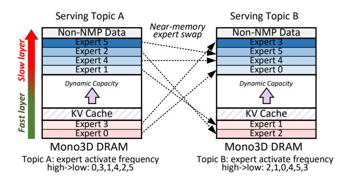
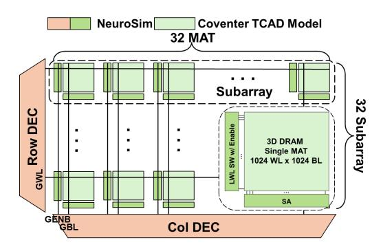
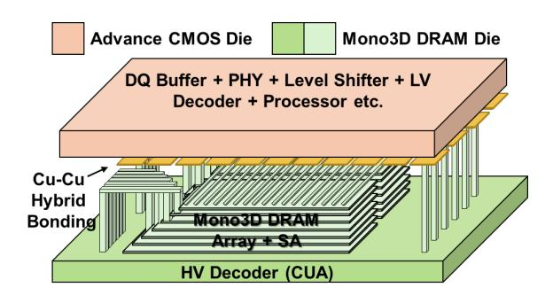

# <span id="page-7-0"></span>5 Stratum Algorithm-System Co-Optimizations5.1 Expert Usage Prediction

As discussed in §2.2, pre-trained MoE models often exhibit domainspecific expert specialization at inference time [87], as shown in Figure 4. Given that one of the main challenges in MoE inference is handling the large total parameter size across all experts, this specialization presents a valuable opportunity for efficient inference and serving. When expert specialization aligns with specific query topics, it becomes possible to optimize the placement of MoE experts. For a given topic, experts with higher usage probabilities (hit rates) can be mapped to faster Mono3D DRAM tiers, reducing the latency for the data transfer from DRAM to the base logic dies.

To enable MoE expert mapping, a key component of Stratum is a topic classifier that tags incoming queries. This allows the Stratum scheduler to estimate the topic distribution of each query. Combined with a per-topic expert usage table (as shown in Figure 6), the scheduler assigns experts' weight matrices to the appropriate expert tiers. Our implementation trains a DistillBERT-based [28, 72] topic classifier with 67M parameters on 6 topics as part of our online serving system built on Stratum. To account for distribution shifts from

<span id="page-8-0"></span>

Figure 11: Example expert placement optimization for Mono3D DRAM-NMP system with tiered memory.

#### <span id="page-8-1"></span>Algorithm 1 Expert Weight Placement

**Require:** #Layers L; #experts per layer K; #active experts k; usage frequencies  $\mathcal{F} = \{f_p^l \mid p \in [1,K], l \in [1,L]\}$ ; one expert weight size  $S_E$  (bytes); DRAM banks  $N_{\mathrm{bank}}$ ; DRAM row-buffer size  $S_{\mathrm{rb}}$  (bytes); #rows DRAM reserved for NMP data  $\Phi$ .

**Ensure:** DRAM row address intervals for all expert weights  $\{[a_p^l,b_p^l]\mid p\in [1,K],\ l\in [1,L]\}.$ 

```
1: \Delta \leftarrow \left\lceil \frac{S_E}{N_{\text{bank}} S_{\text{rb}}} \right\rceil / \#\text{rows} occupied by one expert

2: \tau \leftarrow kL / \text{threshold} of \#\text{specified} fast experts

3: Sort \mathcal{F} in descending order to obtain \langle f_{p_1}^{l_1}, \ldots, f_{p_{KL}}^{l_{KL}} \rangle

4: for i = 1 to KL do

5: if i \leq \tau then

6: a_{p_i}^{l_i} \leftarrow (i-1)\Delta

7: else

8: a_{p_i}^{l_i} \leftarrow \Phi - (KL - i + 1)\Delta

9: end if

10: b_{p_i}^{l_i} \leftarrow a_{p_i}^{l_i} + \Delta - 1

11: end for

12: return \{[a_p^l, b_p^l] \mid p \in [1, K], l \in [1, L]\}
```

standard NLP datasets to the diverse prompting styles observed in real serving queries, we employ a data synthesis pipeline that uses GPT-40-based rewriting to augment the training data. Due to their compact size, our topic classifiers introduce less than 2% latency overhead per decoding step at moderate request rates (fewer than four queries per second) on our experimental setup, while achieving 85.0% and 81.0% classification accuracy on real-world serving datasets (Chatbot Arena conversations [3]) for the 6-topic model, respectively. Further details on data augmentation, training, and evaluation are provided in §6.3.1.

#### <span id="page-8-3"></span>5.2 Data Placement Strategy

Stratum categorizes the data within the MoE model into four types: hot expert weights, cold expert weights, KV cache, and non-NMP data. Hot experts include shared experts and other experts exhibiting high routing-hit probabilities for a given topic. Non-NMP data primarily consists of miscellaneous parameters such as positional embedding parameters, layer norm shift and scale parameters, and others. These are generally used for computation in the external processor rather than the NMP. By leveraging heterogeneous

<span id="page-8-2"></span>

Figure 12: Mono3D DRAM bank configuration. The performance is simulated from NeuroSim [56] and Coventor process simulator [23].

access latencies across different memory tiers, a data placement strategy can be optimized to enhance the serving performance.

As shown in Figure 11, Stratum assigns non-NMP data, which is processed by the xPU, to the slowest memory tier, as accessing it requires traversing the interposer bottleneck, which is an order of magnitude slower than the internal DRAM bandwidth of the slowest tier. This helps preserve the faster memory tiers exclusively for NMP-related workloads. Stratum classifies experts into hot and cold categories based on offline profiling of topic-specific requests, assigning hot experts to faster memory tiers and cold experts to slower ones. This placement ensures that hot experts benefit from low-latency access provided by faster Mono3D DRAM memory tiers. The expert weight placement is detailed in Algorithm 1. Each expert weight is partitioned into shards and distributed across Mono3D DRAM banks according to the tensor parallelism strategy (see §4.1). The mapping from physical row addresses obtained from Algorithm 1 to logical memory tiers functions as a quantization process, configurable via the tiering table (see §3.2). In our evaluation, we adopt a uniform mapping strategy that assigns an equal number of rows to each memory tier (see §6.2.1). KV cache data, whose capacity dynamically changes as request generation progresses, is stored in intermediate-speed memory. Upon completing the processing of one topic (e.g., topic A), the Stratum scheduler transitions to a new topic (e.g., topic B) and initiates expert swapping based on the expert activation frequencies of the new topic. To avoid costly host-processor transfers, this swapping is executed using near-memory operations, as detailed in §3.2. Specifically, the local memory controller performs the swap between two DRAM rows by temporarily buffering them in a dedicated row-swap buffer (see Figure 7(c)) before writing them back to their new row addresses.

#### 6 Evaluation

#### 6.1 Experimental Setup

6.1.1 Monolithic 3D-Stackable DRAM Configuration. For Mono3D DRAM technology, we adopt the vertical bitline connections for 3D stackable horizontal 1T1C. We design the Mono3D DRAM scaled to 1024 layers and define the bank structure as in Figure 12, where 1024 BLs × 1024 WLs form a MAT and 1024 MATs form a bank. To illustrate the impact of heterogeneous integration, Figure 13 presents a 3D view of the proposed Mono3D DRAM bank. The

<span id="page-9-1"></span>

Figure 13: Mono3D DRAM array with heterogeneous integration, hybrid-bonding and CMOS-under-array (CUA).

Table 1: Monolithic 3D-Stackable DRAM Parameters

<span id="page-9-2"></span>

| Mono3D DRAM Device Parameters |                                                        |                       |           |  |  |
|-------------------------------|--------------------------------------------------------|-----------------------|-----------|--|--|
| #layers                       | 1024                                                   | Feature Size<br>35 nm |           |  |  |
| BL/WL Pitch                   | 70 nm/1 um                                             | Staircase Pitch       | 500 nm    |  |  |
| MAT Size                      | 1k×1k                                                  | #MATs/Bank            | 32×32     |  |  |
| Bank Capacity                 | 1 Gb                                                   | Bank Area             | 0.439 mm2 |  |  |
| Row Buffer                    | 32 Kb                                                  | Energy/bit            | 0.429 pJ  |  |  |
| Chip Area                     | 121 mm2                                                | Chip Capacity         | 32GB      |  |  |
| Mono3D DRAM System Parameters |                                                        |                       |           |  |  |
| Tier Design                   | 8 tiers; 4GB capacity per tier.                        |                       |           |  |  |
| Organization                  | 16 channels per chip (64b data I/O per channel);       |                       |           |  |  |
|                               | 16 banks per channel.                                  |                       |           |  |  |
| DRAM Timing                   | tRCD=[2.29,3.92,5.99,8.50,11.44,14.82,18.63,22.88] ns; |                       |           |  |  |
|                               | tRP=4.77ns; tRAS=tRCD+27.50ns; tRC=tRP+tRAS.           |                       |           |  |  |
| xPU-DRAM I/F                  | 1024b data I/Os; 6.4 Gbps per pin (same as HBM3)       |                       |           |  |  |

high-voltage circuits are implemented beneath the memory array using a mature CMOS-under-array process, while the low-voltage circuits are fabricated on an advanced CMOS die and later hybridbonded to the memory tiers through Cu–Cu bonding pads. In this work, we leverage the 32 nm technology node for the CUA process and the 7 nm technology node for the bonded CMOS tier. To obtain the bank-level results, we utilize the Coventor process model [\[23\]](#page-13-15) for RC parameter extraction of the 3D DRAM array, and combine it with the peripheral circuit results extracted from NeuroSim [\[56\]](#page-15-15) merging with the timing of DDR5 Standards [\[2\]](#page-13-16), as shown in Figure [12.](#page-8-2) The 1T1C model of Mono3D DRAM is built by the Coventor SEMulator3D process simulator [\[23\]](#page-13-15) based on a 3D DRAM structure specification in [\[36\]](#page-14-3). The detailed parameters are listed in Table [1.](#page-9-2) The overall Mono3D DRAM achieves a memory density of 2.156 Gb/mm<sup>2</sup> , which is 5.2× higher than that of the latest 32Gb DDR5 die (0.417 Gb/mm<sup>2</sup> [\[14\]](#page-13-17)). It provides an internal bandwidth ranging from 19.01 TB/s to 30.34 TB/s, depending on the memory tier.

6.1.2 Logic Die Processor Modeling. The components of the Stratum logic die processor are implemented using SystemVerilog and synthesized using Cadence Genus [\[7\]](#page-13-18) with the 7nm predictive process design kit ASAP7 [\[19\]](#page-13-19). The hardware employs the IEEE754 FP-16 arithmetic data format [\[1\]](#page-13-20), widely adopted for LLM inference serving. The local psum memory and shared memory on the logic die are implemented with SRAMs modeled by FinCACTI [\[73\]](#page-16-19), calibrated with publicly available SRAM specifications [\[8,](#page-13-21) [47\]](#page-15-16). The area measurements for the Stratum NMP processor components

Table 2: Evaluation Workload Setup

<span id="page-9-3"></span>

| Model             | Size | Experts                   | GPU Baseline | Stratum    |
|-------------------|------|---------------------------|--------------|------------|
| OLMoE-1B-7B [60]  | 7B   | 64 choose 8               | RTX A6000    | Stratum-S  |
| Mixtral 8×7B [51] | 47B  | 8 choose 2                | 2×H100       | Stratum-L  |
| Qwen2.5-32B [86]  | 32B  | Non-MoE                   | 2×H100       | Stratum-L  |
| Llama-4-Scout [4] | 109B | 1 shared<br>+ 16 choose 1 | 4×H100       | Stratum-XL |

are obtained from synthesis reports. Energy consumption is determined through the simulations with post-synthesis netlists, which include annotated switching activity derived from random stimulus inputs. Execution cycles, on-chip communication cycles, and associated energy metrics are derived from an in-house simulator. The simulator takes as input tensor size information, parameter tier assignments (e.g., expert parameters or KV cache), attention head mappings, and routed expert IDs, along with the delay and energy parameters for each component. It outputs the overall execution time as well as detailed energy breakdowns at the component level.

6.1.3 System modeling. We evaluate with models (both MoE and regular LLMs) and system configurations shown in Table [2.](#page-9-3) Each GPU baseline and Stratum configuration is chosen to support the maximum evaluated context length without degrading performance. The GPU baselines are evaluated using vLLM 0.8.1 [\[55\]](#page-15-17) under benchmark throughput mode using NVIDIA RTX A6000 or H100 SXM5 HBM3 GPUs for different Stratum configurations. The GPU energy is derived from the NVIDIA-SMI tool.

The system-level simulator contains a Request Generator, SLO-Aware Scheduler, Memory and Computation Mapper, and interfaces to Stratum NMP simulator, in accordance with Figure [6.](#page-4-1) The Request Generator models a Poisson process in which the incoming queries of certain topics arrive at defined rates. Taking into consideration serving SLO, the scheduler dynamically batches input queries to the Stratum processor for inference and prioritizes dispatching input queries of the same topic to maximize hot expert hits. Using the prior knowledge of the expert usage table, the memory mapper aggregates the topics in the batch and calculates expert placements for Mono3D DRAM that maximize hot expert hit, as shown in Algorithm [1.](#page-8-1) A memory reconfiguration is executed between dispatches to relocate experts. Energy and latency consumed by xPU and NMP are accumulated during simulated serving.

