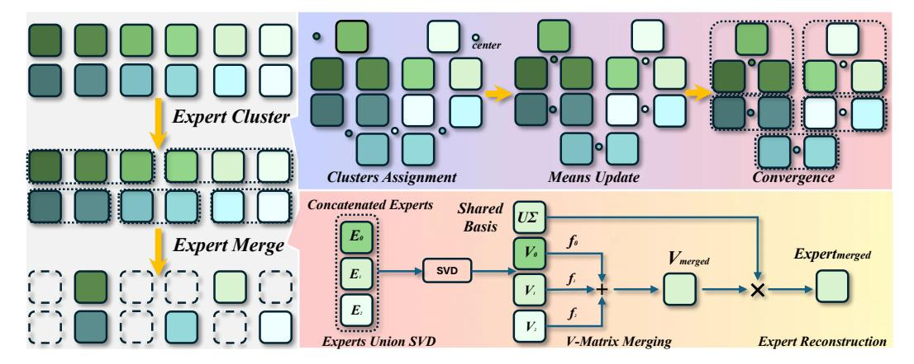

## Sub-MoE: Efficient Mixture-of-Expert LLMs Compression via Subspace Expert Merging

**Lujun Li**1†, **Qiyuan Zhu**1†, **Jiacheng Wang**2, **Wei Li**3, **Hao Gu**1, **Sirui Han**1\*, **Yike Guo**1\*

1Hong Kong University of Science and Technology, 2Xi'an Jiaotong University,

3University of Birmingham

{lliee,qzhuat,siruihan,yikeguo}@ust.hk \*

#### **Abstract**

Mixture of Experts (MoE) LLMs face significant obstacles due to their massive parameter scale, which imposes memory, storage, and deployment challenges. Although recent expert merging methods promise greater efficiency by consolidating multiple experts, they are fundamentally hindered by parameter conflicts arising from expert specialization. In this paper, we present Sub-MoE, a novel MoE compression framework via Subspace Expert Merging. Our key insight is to perform joint Singular Value Decomposition (SVD) on concatenated expert weights, reducing conflicting parameters by extracting shared U-matrices while enabling effective merging of the expert-specific V components. Specifically, Sub-MoE consists of two innovative phases: (1) Adaptive Expert Clustering, which groups functionally coherent experts via K-means clustering based on cosine similarity of expert outputs; and (2) Subspace Expert Merging, which first enforces Experts Union Decomposition to derive the shared U-matrix across experts in the same group, then pursues frequency-based merging for individual V-matrices, and finalizes expert reconstruction using the merged V-matrix. In this way, we align and fuse experts in a shared subspace, and can be extended with intra-expert compression for further inference optimization. Extensive experiments on Mixtral, DeepSeek, and Qwen-1.5|3 MoE LLMs demonstrate that our Sub-MoE significantly outperforms existing expert pruning and merging methods. Notably, our Sub-MoE maintains 96%186%of original performance with 25%|50% expert reduction on Mixtral-8×7B in zeroshot benchmarks. Code will be released at https://github.com/lliai/MoERazor.

## 1 Introduction

The Mixture of Experts (MoE) architecture has emerged as a pivotal advancement in Large Language Models (LLMs) [31], demonstrated by recent models like DeepSeek-R1 [7] and Qwen3-MoE [45]. At its core, MoE consists of expert networks and a gating mechanism that dynamically routes each input to the most relevant experts. MoE sparsely activates only a small subset of experts, significantly reducing computational costs while scaling model size. However, MoE LLMs also introduce challenges from their large parameter count, including substantial memory/storage requirements and inference latency that complicate deployment on resource-constrained devices [36, 21, 25]. Additionally, distributed implementations face communication [19] bottlenecks when synchronizing experts across multiple nodes, impacting real-time performance [34, 8].

To overcome these issues, researchers are developing fundamental yet important expert reduction approaches that can be broadly categorized into two primary approaches: expert pruning and expert merging. Expert pruning methods remove underperforming experts through regularization (e.g.,

\*\*Corresponding authors, † equal contribution.

Figure 1: Overview of our Sub-MoE framework. The process consists of two main stages: (1) Adaptive Expert Clustering, which groups similar experts via K-means clustering with steps: Clusters Assignment, Means Update, and Convergence; and (2) Subspace Expert Merging, which aligns and combines experts via Experts Union SVD, V-Matrix Merging. and Expert Reconstruction.

SEER-MoE [30]) or search-based techniques (e.g., NAEE [28], MoE-I2 [46]). While these approaches effectively reduce parameter counts, they fundamentally discard portions of the model's learned knowledge, resulting in performance degradation that necessitates resource-intensive finetuning to recover. Expert merging techniques (e.g., MC-SMoE [23], HC-SMoE [3], and EEP [27]) propose a promising alternative by preserving knowledge through the consolidation of multiple experts. However, current merging approaches encounter a critical limitation that undermines their effectiveness: the parameter conflict problem. This fundamental challenge arises from the core design principle of MoE architectures, where routing mechanisms deliberately create specialized experts with divergent parameter spaces by training them on distinct input distributions. The recent study [11] shows that Mixtral-8×7B demonstrates this divergence, showing inter-expert similarities typically ranging between 0.1~0.3. When conventional merging operations are applied to such dissimilar experts, catastrophic parameter conflicts emerge that compromise the specialized capabilities of the original experts and significantly degrade overall model performance. Existing merging approaches employ simplistic aggregation functions that cannot effectively reconcile these divergent parameter spaces and often require computationally expensive post-merging operations (e.g.,  $\bar{D}^2$ -MoE [11]), undermining the efficiency gains. This motivates our core research question:

