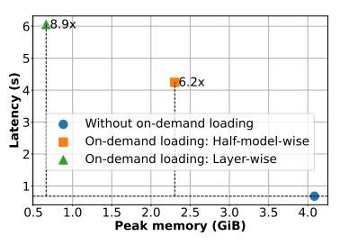
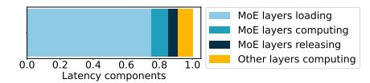
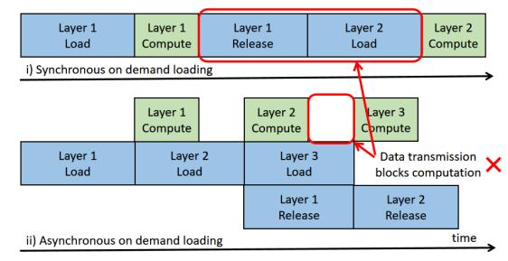
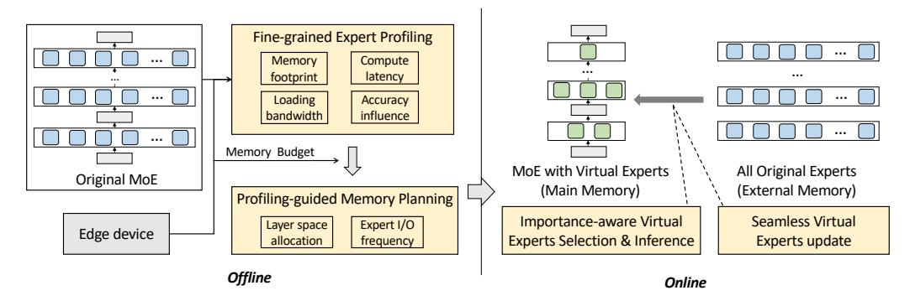
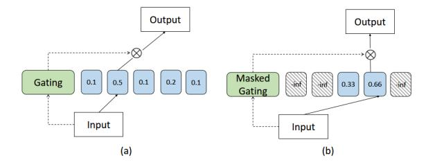
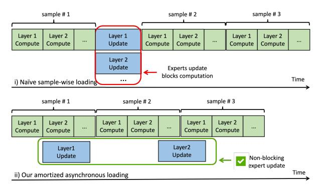
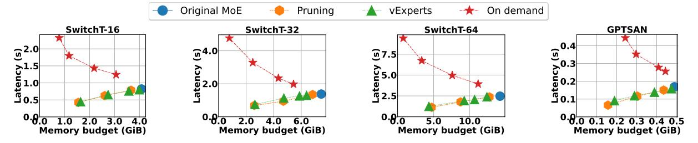
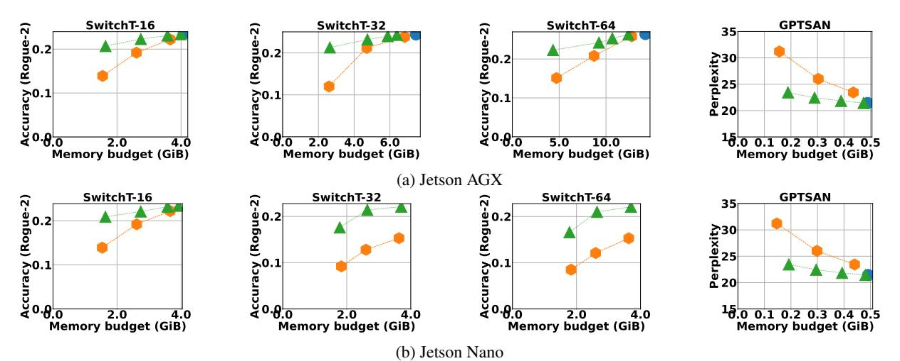
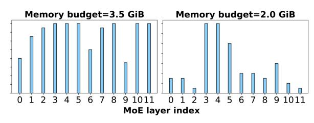
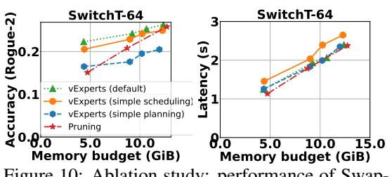

# SwapMoE: Serving Off-the-shelf MoE-based Large Language Models with Tunable Memory Budget

Rui Kong1,2\* Yuanchun Li2,3† Qingtian Feng2,4\* Weijun Wang2 Xiaozhou Ye5 Ye Ouyang5 Linghe Kong1† Yunxin Liu2,3 1Shanghai Jiao Tong University 2 Institute for AI Industry Research (AIR), Tsinghua University 3Shanghai Artificial Intelligence Laboratory 4National University of Singapore 5AsiaInfo Technologies (China), Inc.

## Abstract

Mixture of experts (MoE) is a popular technique to improve capacity of Large Language Models (LLMs) with conditionally-activated parallel experts. However, serving MoE models on memory-constrained devices is challenging due to the large parameter size. Typical solutions such as memory swapping or expert pruning may lead to significantly higher latency or severe accuracy loss. In this paper, we introduce SwapMoE, a framework for efficient serving of MoE-based large language models with tunable memory budgets. The main idea of SwapMoE is to keep a small dynamic set of important experts, namely Virtual Experts, in the main memory for inference, while seamlessly maintaining how the Virtual Experts map to the actual experts. Experiments have shown that SwapMoE can reduce the memory footprint while maintaining reasonable accuracy. For example, on text summarization tasks with Switch Transformer, SwapMoE can reduce the memory consumption from 14.2 GiB to 4.7 GiB, together with 50% latency reduction and a slight Rouge-2 score drop of 0.041.

## 1 Introduction

Recently, the world has witnessed the great advancement of pre-trained large language models [\(Li](#page-9-0) [et al.,](#page-9-0) [2024\)](#page-9-0). Such an advancement is driven by the phenomenon that the larger model capacity generally leads to higher intelligence [\(Kaplan et al.,](#page-8-0) [2020\)](#page-8-0). Among various attempts to scale up neural networks, Mixture of Experts (MoE) [\(Shazeer et al.,](#page-9-1) [2017\)](#page-9-1) is a promising technique that can avoid linearly increasing computation based on conditional sparse computation. However, memory-costrainted devices is often a major concern in edge AI training and serving [\(Huang et al.,](#page-8-1) [2023b;](#page-8-1) [Gim and Ko,](#page-8-2) [2022;](#page-8-2) [Wang et al.,](#page-9-2) [2022;](#page-9-2) [Ma et al.,](#page-9-3) [2023;](#page-9-3) [Kong](#page-9-4)

[et al.,](#page-9-4) [2023\)](#page-9-4). The constraint is even more challenging for large MoE models. For example, a Switch Transformer [\(Fedus et al.,](#page-8-3) [2022\)](#page-8-3) with 64 experts per layer requires 14 GiB of memory for inference, which is impossible to fit in consumer devices that typically have only 8 GiB, 4 GiB, or lower memory size. What's more, many consumer devices need to serve multiple applications, and the systemallocated memory budget for each application is even more limited.

Researchers have proposed various methods to reduce the memory footprint of MoE model inference. The most straightforward approach is to use memory swapping, *i*.*e*. dynamically loading/unloading the parameters from/to the external memory. For example, [Huang et al.](#page-8-4) [\(2023a\)](#page-8-4) propose to load experts into the memory on demand to reduce memory footprint but introduce additional latency overhead, EdgeMoE [\(Yi et al.,](#page-9-5) [2023\)](#page-9-5) focuses on memory swapping in the decoding phase of MoE-based language models and reduces the swapping overhead using quantization. However, it only considers the scenario of single token inference, which does not align with realworld use cases. Other algorithm-perspective approaches [\(Chen et al.,](#page-8-5) [2022;](#page-8-5) [Kim et al.,](#page-8-6) [2021\)](#page-8-6) propose to prune the experts to reduce model size. However, swapping-based approaches either have to trade latency for a reduced memory footprint, while pruning-based methods would lead to accuracy loss and require model training. How to efficiently serve an off-the-shelf MoE model under memory constraints remains challenging.

Fortunately, there is a unique property in many MoE workloads that can be exploited for performance optimization - activation locality. For example, in generative language models, the output tokens are produced one by one, and they mostly belong to the same semantic context. The successive queries of a user are also semantically related. Such locality can potentially lead to consistent ac-

\* [Work was done while the author was interning at Institute](#page-9-4) [for AI Industry Research \(AIR\), Tsinghua University.](#page-9-4)

† [Corresponding authors: Yuanchun Li, Linghe Kong.](#page-9-4)

tivation patterns of MoE experts, therefore create room for more intelligent expert management.

Our work. We introduce SwapMoE to enable efficient continuous MoE serving under memory constraints. The key idea is to maintain a dynamically-updated compact set of Virtual Experts in the main memory for MoE inference, instead of the redundant set of all experts in the original model. The weights of Virtual Experts are seamlessly updated according to the data distribution locality and profiled hardware capabilities. As such, the memory footprint and latency of each individual inference process in SwapMoE are the same as running a smaller MoE model, while the advantage of large-capability MoE remains since each expert still has the chance to participate in the computation.

We implement SwapMoE with Huggingface Transformers (Wolf et al., 2019) library. To evaluate the effectiveness of SwapMoE, we conduct experiments with Switch Transformer (Fedus et al., 2022) (SwitchT for short), and GPTSAN (gpt, 2023) models on natural language processing tasks, compared with the normal model inference scheme and strong baselines. For example, on text summarization tasks with Switch Transformer, Swap-MoE can reduce the memory consumption from 14.2 GiB to 4.7 GiB (67% less), together with 50% latency reduction and a slight Rouge-2 score drop of 0.041, which shows that SwapMoE enables the serving of large MoE models on resourceconstrained consumer devices with limited memory budgets.

We summarize our key technical contributions as follows:

- We propose a novel MoE inference framework that supports efficient serving of large MoE models under memory constraints. Our method enables deployment of off-the-shelf MoE models to consumer devices with tunable memory budgets.
- We investigate several properties of MoE models, including the expert activation locality, persample expert importance, and layer-wise tolerance to absent experts, which can potentially benefit other works on MoE optimization.
- We implement SwapMoE with popular inference frameworks and conduct extensive experiments with large MoE models on consumer devices. The results have demonstrated the effectiveness of our approach on natural language

Figure 1: SwitchT-16: Naive on-demand expert loading reduces memory, but also results in huge inference overhead.

Figure 2: SwitchT-16: Latency breakdown of MoE model inference with layer-wise memory swapping. The transmission of model weights consumes the majority of the time.

processing tasks.

### 2 Background and Motivation

The sparse MoE (Shazeer et al., 2017) is the most commonly used, in which only one or few (represented as k) experts are activated for each input. Specifically, in a sparse MoE with k=1, only the i-th expert with max  $G(x)_i$  is activated for input x, and the output  $y=G(x)_iE_i(x)$ .

The MoE structure is often accompanied by the Transformer architecture (Liang et al., 2022; Zhang et al., 2022), in which the input of each MoE layer is a sequence of tokens and each token may choose different experts in one MoE layer.

### 2.1 Limitations of Conventional Solutions

Existing methods for reducing the resource overhead of MoE model inference include on-demand

Figure 3: Weight loading may block computation when running MoE with layer-wise memory swapping. Due to the large size of MoE layers and sparse computation, loading the weights of a layer is always slower than computing the layer, which slows down the inference even if the weights are loaded asynchronously.

Figure 4: The workflow of SwapMoE. Given an off-the-shelf MoE model and a memory-constrained consumer device, we satisfy the constraint by executing the model with a smaller set of experts (Virtual Experts). The Virtual Experts are selected, used and updated seamlessly at runtime, and the memory allocation for the experts is determined at offline.

loading (Lane et al., 2016) (*i.e.* loading the parameters of MoE layers when they are needed and release afterwards) and MoE model pruning (Chen et al., 2022; Kudugunta et al., 2021) (*i.e.* cutting the less important experts permanently).

While the on demand loading method can reduce the GPU memory usage during MoE model inference without affecting model accuracy, it introduces significant latency overhead with each MoE layer parameter transmission via PCIe. In Figure 1, running MoE models with on-demand loading introduces 6.2x-8.9x higher latency. Meanwhile, the transmission of a large amount of parameter data can significantly impede the computation process. As shown in Figure 2 and Figure 3, model parameters transmission takes up most inference time and significantly obstructs the model's computational process and may deplete IO resources.

The pruning-based method directly reduces the model's parameter and computational load, thereby lowering the GPU memory usage and inference latency during MoE model inference. However, it greatly compromises the model's performance due to compromised the models' capacity. For example, when utilizing expert pruning to reduce memory usage by 30% on SwitchT-32, the model's accuracy decreased by 14%. SwapMoE combines the advantages of both methods - we try to reduce the latency overhead of memory saving while striving to maintain the model accuracy at the same time.

#### 2.2 Activation Locality in MoE Models

Data distribution locality is an important characteristic in many AI applications, which refers to the phenomenon that successive input samples are distributionally similar or correlated. Firstly, each inference process of the model produces a token,

Figure 5: (a) Original gating of MoE: all experts may by used for inference; (b) Ours Masked Gating: only Virtual Experts will be used.

and the successive tokens belong to the same sentence. Secondly, AI models are usually deployed in a fixed environment and used for serving an individual user or organization, the successive input samples (*e.g.* conversations) are semantically close to each other.

Since each expert in a MoE model is trained to handle certain data distribution, there exists an opportunity to cache the most relevant experts in the main memory at each time step, therefore reducing the memory consumption. The data distribution locality in AL applications further produces the change to reuse the cached experts for successive input samples, which can reduce the overhead of parameter loading.

### 3 Our Design: SwapMoE

SwapMoE utilizes a two-phase holistic design, as shown in Figure 4. In the online phase, the job of SwapMoE is to efficiently identify, update, and use a subset of experts (Virtual Experts) for memory-constrained MoE inference. The job of the offline phase is to obtain an optimal memory plan for the online phase to facilitate efficient and accurate MoE inference.

Figure 6: Different loading strategy of Virtual Experts. i) synchronously updating all experts after single sample inference; ii) amortized asynchronous expert loading across different samples.

## 3.1 Importantance-aware Virtual Experts Selection & Inference

Firstly, we must wisely select the most important experts and update them according to the data distribution to maintain accuracy with Virtual Expertsbased MoE inference. To address this problem, we introduce the concept of the expert importance score, which can be written as

$$importance(E_i, X) = \sum_{x}^{\mathcal{X}_i} ||x|| * ||G(x)_i|| * ||E_i||,$$

$$\tag{1}$$

where Xi is the set of tokens passed to expert Ei during the inference process of X. This score only involves simple magnitude computation thus can be calculated efficiently.

As shown in Figure [5,](#page-2-1) we use Masked Gating to redirect all inference requests to Virtual Experts.

## 3.2 Seamless Virtual Experts Update

Once we have the importance scores for all experts, we can update Virtual Experts accordingly at runtime by loading the important experts into the main memory and the unimportant experts out. We introduce two techniques to reduce overhead, including amortized expert loading and asynchronous expert loading, as shown in Figure [6](#page-3-0) (ii).

## 3.3 Fine-grained Expert Profiling

To facilitate efficient and accurate model inference, it is necessary to know the performance of Virtual Experts given a specific hardware and configuration and determine what kind of configuration will lead to better perfromance. We conduct fine-grained expert profiling in advance, gather information related to hardware memory usage, inference latency, accuracy, and IO bandwidth, and establish the relationship between Virtual Experts configurations and performance, Specifically, configurations are:

$$\begin{aligned} & config = \{frequency, num\_experts\} \\ & num\_experts = \{\#experts_1, ..., \#experts_L\}, \end{aligned} \tag{2}$$

where frequency represents the update frequency of the experts in the core, indicated as the number of inputs between each pair of updates. #expertsi denotes the number of experts to be retained in the core for the i-th layer.

Problem Formulation. The primary objective of offline planning is to identify the optimal configuration config ˆ that meets memory constraints while maximizing the model's accuracy and minimizing inference latency. Formally, the process can be described as follows:

$$\begin{split} maximize \ E_{\text{accuracy}}(\text{config}), \\ minimize \ E_{\text{latency}}(\text{config}), \\ \text{s.t.} \quad E_{\text{memory}}(\text{config}) \leq LIMIT_{\text{memory}}, \end{split}$$

where Eaccuracy, Ememory, and Elatency are used to estimate the accuracy, memory footprint, and inference latency of a model under a specific configuration. LIMIT memory represent the constraints on main memory.

### 3.4 Profiling-guided Memory Planning

Section [3.1](#page-3-1) and Section [3.2](#page-3-2) have shown how the Virtual Experts are selected and used for inference at runtime. However, many questions remain unanswered. For example, how to distribute Virtual Experts across different layers, how to allocate limited memory size to different layers, and how to make the best use of limited memory bandwidth and enabling frequent updates of experts without blocking computations, etc. These questions are crucial to satisfy the memory constraint and minimize accuracy loss. They are addressed through a profiling-guided memory planning, which using profiling information obtained from Section [3.3.](#page-3-3)

### 3.4.1 Expert I/O Frequency

The update frequency affects the usage of IO bandwidth, and if too much data need to be transferred through IO, it will cost a long time and block the computation. In other words, when the experts in Virtual Experts are no longer important for the current sample, we need to promptly replace them

with the latest important experts. A higher update frequency is naturally preferable, but increased frequency can escalate hardware IO resource consumption, potentially even obstructing inference computation and leading to increased latency. At the same time, because a higher frequency is more beneficial for dynamically maintaining the most important experts, it is important to increase the frequency as much as possible without blocking the computation. Our strategy involves testing from a low update frequency to a high update frequency until we identify the inflection point at which the update frequency affects the inference latency, allowing us to select the optimal update frequency.

### 3.4.2 Layer Space Allocation

To allocate the limited memory budget to different layers, allow layers with more memory to utilize more Virtual Experts, find the optimal configuration (config ˆ ) that maximizes the model accuracy while satisfying given memory constraints, we utilize memory planner to obtain the optimal memory allocation scheme based on the previously obtained performance model obtained from Eaccuracy, Ememory, and Elatency in Section [3.3.](#page-3-3)

A naive method to find the optimal configuration is to iterate over all possible configurations and keep track of the best-performing one. However, we found that this approach does not fully leverage the modeled functions to find the optimal configuration due to the enormous search space. For instance, the search space in a 12-layer SwitchT-16 would be 1216 .

Consequently, we employ the genetic algorithm [\(Holland,](#page-8-8) [1992\)](#page-8-8) for the search process. Specifically, we initialize a set of configurations randomly, and iteratively update them based on their performance metrics estimated with Eaccuracy, Ememory and Elatency. In each iteration, we randomly change one parameter in each configuration and create new configurations by exchanging or averaging existing configurations. The configurations that violate resource constraints or yield suboptimal performance are removed. We observed that certain layers in the model may have a more significant impact on model performance. The genetic algorithm can perceive this characteristic and preserve experts that have a greater influence on performance. In Section [4,](#page-4-0) we will illustrate some configurations found by the algorithm.

## 4 Evaluation

### 4.1 Experimental Setup

Platforms. We use two devices: a Jetson Nano and a Jetson AGX ORIN. The batch sizes are all set to 1 as in common edge-side continuous serving scenarios. We use different latency and memory budgets to simulate different resource constraints.

Tasks, datasets and models. We evaluate the performance of SwapMoE on two common DL tasks:

Summarization aims to summarize long texts into short texts. We select the most popular summarization model, Switch Transformer [\(Fedus et al.,](#page-8-3) [2022\)](#page-8-3) (16, 32, and 64 experts per layer, denoted as SwitchT-16, SwitchT-32 and SwitchT-64) and use the samsum dataset [\(Russakovsky et al.,](#page-9-11) [2015\)](#page-9-11) and report Rogue-2 accuracy, where higher Rogue-2 accuracy means better.

Language modeling aims to predict the next word given the previous words. We use GPT-SAN [\(Artetxe et al.,](#page-8-9) [2022\)](#page-8-9) as the base model and use the Wikipedia-japanese [\(wik,](#page-8-10) [2023\)](#page-8-10) dataset for evaluation. The performance of the language model is measured by perplexity, where lower perplexity means better.

The pre-trained weights of the Switch Transformers and GPTSAN are obtained from the official Huggingface Transformer repository. All datasets can be downloaded from public websites.

Baselines. The basic baseline is original MoE model. To show the superiority of SwapMoE, we also compare it with the following baselines: 'Pruning' (keeping a certain portion of experts with the largest magnitude ||Ei || in each layer, no switching in/out), 'On demand' [\(Huang et al.,](#page-8-4) [2023a\)](#page-8-4) (keep a certain portion of experts in main memory, load the requested expert from memory on demand). 'Pruning' is akin to a simplified version of pruning-based methods without training, while 'On demand' is a simplified version of swapping-based approaches.

## 4.2 Overall Runtime Performance

Our approach offers good memory-latency tradeoffs. As shown in Figure [7,](#page-5-0) in terms of latency, our approach and the 'Pruning' method exhibit very similar memory-latency trade-offs. This indicates that our approach, while ensuring minimal model accuracy degradation, enables the model to occupy less memory and achieve reduced inference latency. Although the 'On demand' method can

Figure 7: End-to-end latency achieved by SwapMoE and baselines under different memory budgets on Jetson AGX. SwapMoE achieves similar latency with the pruned compact models while with much more parameters in use.

significantly reduce memory usage, its cost comes in the form of high latency overhead.

Our approach also offers good memory-accuracy tradeoffs. As shown in Figure 8a and Figure 8b, SwapMoE creates a trade-off space that accommodates various resource usages. Higher resource utilization leads to better model performance and vice versa; and, even if resource consumption reduces, SwapMoE still maintains the model's performance. For example, in summarization task, SwapMoE reduces memory usage and latency by 37% and 18% with only 0.012 Rouge-2 degradation on Jetson AGX.

It is worth noting that SwitchT-64 cannot be directly deployed on Jetson Nano, as its hardware has a maximum memory support of 4GB, while the inference demand of SwitchT-16 exceeds 4GB. Nevertheless, in Figure 8b, our approach significantly outperforms the 'Pruning' baseline. For instance, on Jetson Nano, when reducing the memory footprint of SwitchT-64 from 14GiB to 2.6GB, Swap-MoE achieves an accuracy that is 175% higher than the baseline.

SwapMoE also outperforms the baselines, demonstrating its effectiveness. Under the same memory budget, it achieves better performance than the baselines. For example, in SwitchT-32, when the memory usage is 4.7GB, the Rugue score of SwapMoE is 0.232, which is 8.76% higher than the 'Pruning' baseline. This is because we select the most important experts based on the characteristics of input samples, rather than simply pruning the MoE model into a smaller but static model. However, we cannot surpass the on-demand approach because it does not alter the model's output. However, its high latency makes it unsuitable for edge scenarios where both latency and memory are constrained.

#### 4.3 Offline Planning Performance

SwapMoE can find optimal configurations that satisfy given constraints while maximizing model per-

| Method       | Constraints         | Achieved performance |             |         |
|--------------|---------------------|----------------------|-------------|---------|
|              | Memory budget (GiB) | Memory (GiB)         | Latency (s) | Rogue-2 |
| Original MoE | /                   | 4.08                 | 0.82        | 0.2     |
| vExperts     | 2.0                 | 1.64                 | 0.45        | 0.21    |
|              | 3.0                 | 2.74                 | 0.65        | 0.22    |
|              | 3.5                 | 3.58                 | 0.76        | 0.23    |
|              | 4.0                 | 3.99                 | 0.80        | 0.23    |

Table 1: Performance of SwapMoE with SwitchT-16 under different memory constraints .

formance, as shown in Table 1. For example, when given a memory budget of 2.0 GiB, the configuration found by SwapMoE allows the model to achieve an actual 1.64 GiB peak GPU memory usage and 0.82 s inference latency, satisfying the constraints while experiencing a 0.01 Rogue-2 score increase compared to the original MoE model.

Furthermore, it is observed that as the constraints become looser, SwapMoE can achieve higher accuracy, and conversely, tighter constraints result in lower accuracy. It found optimal configurations under various constraints, respectively, to maximize the utilization of resources. For example, in the summarization task, when the memory budget changed from 3.5 GiB to 4 GiB, the actual peak GPU memory and inference latency of the model during runtime changed from 3.58 GiB and 0.76 s to 3.99 GiB and 0.80 s, respectively. The accuracy also changed from 0.23 to 0.2. However, our method is not always able to satisfy the budget. For example, in the summarization task with SwitchT-16, when the memory budget is set to 3.5 GiB, the actual peak memory usage and inference latency achieved by the model are 3.58 GiB and 0.76 s, respectively. This situation arises because the inference performance of the model itself is difficult to predict accurately (Zhang et al., 2021), leading to inaccurate performance modeling.

Additionally, we find that the distribution of Virtual Experts across different layers differs in different tasks. In the language modeling task, Swap-MoE tends to maintain more experts in the middle layers, as shown in Figure 9 (a). This suggests that for language models, the intermediate MoE layer has a greater impact on model inference, as the in-

Figure 8: The accuracy achieved by SwapMoE and the pruning baseline under different memory budgets on (a) Jetson AGX and (b) Jetson Nano. SwapMoE achieves significantly higher accuracy than the baseline in almost all cases.

Figure 9: Distribution of allocated memory across layers under different memory budgets with SwitchT-16.

Figure 10: Ablation study: performance of Swap-MoE with different components replaced.

termediate layers have a more significant influence on logical processing.

### 4.4 Robustness Analysis

In this experiment, we analyze the robustness of SwapMoE across different usage scenarios.

Different number of Experts. SwapMoE can be used for MoE models with different numbers of experts. As shown in Figure 8a, SwapMoE finds good performance-resource tradeoffs between Switch Transformers (16, 32, and 64) with different resource usage. And SwapMoE can reduce the resource consumption of SwitchT-64 to a level similar to that of SwitchT-32, while maintaining comparable accuracy. This demonstrates that our method can effectively prune large MoE models into well-performing smaller models based on re-

source constraints, eliminating the need to store multiple model sizes.

### 4.5 Ablation study

In Figure 10, we show the performance of Swap-MoE when replacing one component from the system. The experimental results indicate that the absence of any component in SwapMoE leads to performance degradation. In other words, all components contribute to the performance of Swap-MoE.

- (1) 'Simple scheduling': change the scheduling in SwapMoE component, remove amortized updating component, and calculate expert importance score where experts with more tokens to inference have higher scores. The perplexity of SwapMoE is better than 'simple scheduling' because the importance score obtained by our method is more accurate via approximating the outputs of experts, instead of simplely counting the number of tokens dispatched to each expert.
- (2) 'Simple planning': change the planning in SwapMoE component to 'simple planning' and adopt an even Virtual Experts distribution, meaning that each MoE layer has an equal number of Virtual Experts, and then selects the best from these search spaces, where search space is very limited and does not encompass the optimal solution. The perplexity of SwapMoE is superior to 'simple planning' because the memory planner utilizes genetic search to find the optimal configuration for SwapMoE from a large configuration space. In contrast, 'simple planning' cannot find a worse configuration than SwapMoE due to the suboptimal search process.

| Memory           | External Memory | IO Overhead (MiB/s) |      |
|------------------|-----------------|---------------------|------|
| Constraint (GiB) | Consumed (GiB)  | Peak                | Mean |
| 1.2              | 1.02            | 40                  | 20   |
| 1.5              | 1.02            | 36                  | 27   |
| 1.8              | 1.02            | 13                  | 11   |

Table 2: The runtime overhead of SwapMoE.

#### 4.6 Overhead

We report the overhead of SwapMoE in the object detection task with the Swin-MoE model.

Offline planning overhead. The offline planning phase includes performance modeling and optimal configuration generation. Performance modeling only needs to be done once for a MoE model, which takes about 20 minutes. Optimal configuration generation needs to be done with each different resource constraint, which takes about 5 seconds.

Runtime overhead. The runtime overhead includes calculating expert importance score, expert swapping, and different expert request handling strategies. As shown in Table 2, the peak IO overhead of SwapMoE is about 20 MiB/s, which is negligible compared to the IO bandwidth between the main memory and the external memory (e.g., 10-30 GiB/s for GPU-CPU over PCIe and 300-600 MiB/s for CPU-SSD). This is because the design of SwapMoE enables us to swap only a small number of experts. The "External Memory Consumed" means the space needed in the external memory (CPU memory or storage) to store the weights of experts. We store the original MoE model parameters in external memory to reduce the usage in main memory.

#### 5 Related Work

Systems optimization for MoE model serving. Common techniques for optimizing MoE model serving include offloading and swapping memory. Huang et al. (Huang et al., 2023a) propose to swap the experts from GPU memory to CPU memory to reduce the memory consumption of MoE models, incurring high latency overhead. SE-MoE (Shen et al., 2022) utilizes Ring Memory offloading to reduce GPU memory consumption of MoE models. However, these methods are not suitable for resource-constrained devices with dynamic latency and memory constraints.

Optimization for dynamic DL model serving. MoE is a type of dynamic neural networks. Many approaches are introduced to enable or enhance such dynamic DL model serving in general. Nimble (Shen et al., 2021) is a system that optimizes, compiles, and executes dynamic neural networks

on multiple platforms by using a dynamic type system and a lightweight virtual machine runtime. Model scaling approaches (Fang et al., 2018; Han et al., 2021; Wen et al., 2023) propose to adjust the model size/architecture on edge devices to meet different resource constraints. Remix (Jiang et al., 2021) proposes to use multiple models and dynamically switch between them during the inference process. Besides serving dynamic models, researchers have also attempted to slice the static model to dynamic components to achieve different resourceperformance tradeoffs (Hou et al., 2022; Zhang et al., 2020). As compared with these approaches, our design is fundamentally different because it is based on the unique structure and characteristics of MoE.

Efficient design of MoE models. Many existing approaches study the efficiency problem of MoE models from the model design perspective. GShard (Lepikhin et al., 2020) scales up Transformer with MoE and improves the quality and efficiency of multilingual machine translation. Task-MoE (Kudugunta et al., 2021) extract subnet from a large MoE model by a task-level routing strategy. Chen et al. (Chen et al., 2022) propose to prune non-professional experts according to the downstream task for efficient MoE deployment. MPoE (Gao et al., 2022) proposes to build a parameterefficient MoE architecture by enforcing parameter sharing between the experts. AutoMoE (Jawahar et al., 2022) utilizes neural architecture search to automatically design more efficient MoE models. These methods need to modify and retrain the MoE model to reduce resource consumption. They are orthogonal to our approach and can use our method to further reduce resource consumption.

#### 6 Conclusion

This paper addresses the challenges of deploying MoE models to resource-constrained edge devices. We propose a framework called SwapMoE that adaptively reduces the inference costs of MoE models based on the memory constraints while preserving the model accuracy. Experimental results have demonstrated that our method can significantly reduce the inference costs of MoE models with reasonable accuracy degradation. SwapMoE creates a nice space of resource-accuracy trade-off of SoTA large MoE models. Our work does not have obvious ethical impacts, as we focusing on model inference acceleration.

## 7 Limitations

The tasks considered in this paper are relatively limited, and the proposed method has not been evaluated across a wide range of tasks. Subsequently, we will continue to expand our evaluation to other NLP tasks. The paper did not test larger MoE models (e.g., those exceeding 70B parameters) due to computational resource constraints. Instead, experiments were conducted only on smaller Switch Transformers models, demonstrating the effectiveness of the proposed method.

## Acknowledgement

This work is supported by the National Natural Science Foundation of China (Grant No.62272261), and is partly supported by Shuimu Tsinghua Scholar Program (Grant 2023SM201).

## References

- 2023. [General-purpose swich transformer based](https://huggingface.co/Tanrei/GPTSAN-japanese) [japanese language model.](https://huggingface.co/Tanrei/GPTSAN-japanese)
- 2023. [wikipedia-japanese datasets at hugging face.](https://huggingface.co/datasets/inarikami/wikipedia-japanese)
- Mikel Artetxe, Shruti Bhosale, Naman Goyal, Todor Mihaylov, Myle Ott, Sam Shleifer, Xi Victoria Lin, Jingfei Du, Srinivasan Iyer, Ramakanth Pasunuru, Giridharan Anantharaman, Xian Li, Shuohui Chen, Halil Akin, Mandeep Baines, Louis Martin, Xing Zhou, Punit Singh Koura, Brian O'Horo, Jeffrey Wang, Luke Zettlemoyer, Mona Diab, Zornitsa Kozareva, and Veselin Stoyanov. 2022. [Efficient](https://aclanthology.org/2022.emnlp-main.804) [large scale language modeling with mixtures of ex](https://aclanthology.org/2022.emnlp-main.804)[perts.](https://aclanthology.org/2022.emnlp-main.804) In *Proceedings of the 2022 Conference on Empirical Methods in Natural Language Processing*, pages 11699–11732, Abu Dhabi, United Arab Emirates. Association for Computational Linguistics.
- Tianyu Chen, Shaohan Huang, Yuan Xie, Binxing Jiao, Daxin Jiang, Haoyi Zhou, Jianxin Li, and Furu Wei. 2022. [Task-specific expert pruning for sparse](http://arxiv.org/abs/2206.00277) [mixture-of-experts.](http://arxiv.org/abs/2206.00277)
- Biyi Fang, Xiao Zeng, and Mi Zhang. 2018. [Nestdnn:](https://doi.org/10.1145/3241539.3241559) [Resource-aware multi-tenant on-device deep learn](https://doi.org/10.1145/3241539.3241559)[ing for continuous mobile vision.](https://doi.org/10.1145/3241539.3241559) In *Proceedings of the 24th Annual International Conference on Mobile Computing and Networking*, MobiCom '18, page 115–127, New York, NY, USA. Association for Computing Machinery.
- William Fedus, Barret Zoph, and Noam Shazeer. 2022. [Switch transformers: Scaling to trillion parameter](http://jmlr.org/papers/v23/21-0998.html) [models with simple and efficient sparsity.](http://jmlr.org/papers/v23/21-0998.html) *Journal of Machine Learning Research*, 23(120):1–39.
- Ze-Feng Gao, Peiyu Liu, Wayne Xin Zhao, Zhong-Yi Lu, and Ji-Rong Wen. 2022. [Parameter-efficient](http://arxiv.org/abs/2203.01104)

- [mixture-of-experts architecture for pre-trained lan](http://arxiv.org/abs/2203.01104)[guage models.](http://arxiv.org/abs/2203.01104)
- In Gim and JeongGil Ko. 2022. [Memory-efficient dnn](https://doi.org/10.1145/3498361.3539765) [training on mobile devices.](https://doi.org/10.1145/3498361.3539765) In *Proceedings of the 20th Annual International Conference on Mobile Systems, Applications and Services*, MobiSys '22, page 464–476, New York, NY, USA. Association for Computing Machinery.
- Rui Han, Qinglong Zhang, Chi Harold Liu, Guoren Wang, Jian Tang, and Lydia Y. Chen. 2021. [Legodnn:](https://doi.org/10.1145/3447993.3483249) [Block-grained scaling of deep neural networks for](https://doi.org/10.1145/3447993.3483249) [mobile vision.](https://doi.org/10.1145/3447993.3483249) In *Proceedings of the 27th Annual International Conference on Mobile Computing and Networking*, MobiCom '21, page 406–419, New York, NY, USA. Association for Computing Machinery.
- John H Holland. 1992. Genetic algorithms. *Scientific american*, 267(1):66–73.
- Xueyu Hou, Yongjie Guan, and Tao Han. 2022. [Neu](https://doi.org/10.1145/3495243.3560528)[lens: Spatial-based dynamic acceleration of convo](https://doi.org/10.1145/3495243.3560528)[lutional neural networks on edge.](https://doi.org/10.1145/3495243.3560528) In *Proceedings of the 28th Annual International Conference on Mobile Computing And Networking*, MobiCom '22, page 186–199, New York, NY, USA. Association for Computing Machinery.
- Haiyang Huang, Newsha Ardalani, Anna Sun, Liu Ke, Hsien-Hsin S. Lee, Anjali Sridhar, Shruti Bhosale, Carole-Jean Wu, and Benjamin Lee. 2023a. [To](http://arxiv.org/abs/2303.06182)[wards moe deployment: Mitigating inefficiencies in](http://arxiv.org/abs/2303.06182) [mixture-of-expert \(moe\) inference.](http://arxiv.org/abs/2303.06182)
- Kai Huang, Boyuan Yang, and Wei Gao. 2023b. Elastictrainer: Speeding up on-device training with runtime elastic tensor selection. In *Proceedings of the 21st Annual International Conference on Mobile Systems, Applications and Services*, pages 56–69.
- Ganesh Jawahar, Subhabrata Mukherjee, Xiaodong Liu, Young Jin Kim, Muhammad Abdul-Mageed, Laks V. S. Lakshmanan, Ahmed Hassan Awadallah, Sebastien Bubeck, and Jianfeng Gao. 2022. [Automoe:](http://arxiv.org/abs/2210.07535) [Neural architecture search for efficient sparsely acti](http://arxiv.org/abs/2210.07535)[vated transformers.](http://arxiv.org/abs/2210.07535)
- Shiqi Jiang, Zhiqi Lin, Yuanchun Li, Yuanchao Shu, and Yunxin Liu. 2021. Flexible high-resolution object detection on edge devices with tunable latency. In *Proceedings of the 27th Annual International Conference on Mobile Computing and Networking*, pages 559–572.
- Jared Kaplan, Sam McCandlish, Tom Henighan, Tom B. Brown, Benjamin Chess, Rewon Child, Scott Gray, Alec Radford, Jeffrey Wu, and Dario Amodei. 2020. [Scaling laws for neural language models.](http://arxiv.org/abs/2001.08361)
- Young Jin Kim, Ammar Ahmad Awan, Alexandre Muzio, Andres Felipe Cruz Salinas, Liyang Lu, Amr Hendy, Samyam Rajbhandari, Yuxiong He, and Hany Hassan Awadalla. 2021. Scalable and efficient moe training for multitask multilingual models. *arXiv preprint arXiv:2109.10465*.

- Rui Kong, Yuanchun Li, Yizhen Yuan, and Linghe Kong. 2023. [Convrelu++: Reference-based lossless accel](https://doi.org/10.1145/3581791.3596831)[eration of conv-relu operations on mobile cpu.](https://doi.org/10.1145/3581791.3596831) In *Proceedings of the 21st Annual International Conference on Mobile Systems, Applications and Services*, MobiSys '23, page 503–515, New York, NY, USA. Association for Computing Machinery.
- Sneha Kudugunta, Yanping Huang, Ankur Bapna, Maxim Krikun, Dmitry Lepikhin, Minh-Thang Luong, and Orhan Firat. 2021. [Beyond distillation:](http://arxiv.org/abs/2110.03742) [Task-level mixture-of-experts for efficient inference.](http://arxiv.org/abs/2110.03742)
- Nicholas D Lane, Sourav Bhattacharya, Petko Georgiev, Claudio Forlivesi, Lei Jiao, Lorena Qendro, and Fahim Kawsar. 2016. Deepx: A software accelerator for low-power deep learning inference on mobile devices. In *2016 15th ACM/IEEE International Conference on Information Processing in Sensor Networks (IPSN)*, pages 1–12. IEEE.
- Dmitry Lepikhin, HyoukJoong Lee, Yuanzhong Xu, Dehao Chen, Orhan Firat, Yanping Huang, Maxim Krikun, Noam Shazeer, and Zhifeng Chen. 2020. Gshard: Scaling giant models with conditional computation and automatic sharding. *arXiv preprint arXiv:2006.16668*.
- Yuanchun Li, Hao Wen, Weijun Wang, Xiangyu Li, Yizhen Yuan, Guohong Liu, Jiacheng Liu, Wenxing Xu, Xiang Wang, Yi Sun, Rui Kong, Yile Wang, Hanfei Geng, Jian Luan, Xuefeng Jin, Zilong Ye, Guanjing Xiong, Fan Zhang, Xiang Li, Mengwei Xu, Zhijun Li, Peng Li, Yang Liu, Ya-Qin Zhang, and Yunxin Liu. 2024. [Personal llm agents: Insights and](http://arxiv.org/abs/2401.05459) [survey about the capability, efficiency and security.](http://arxiv.org/abs/2401.05459)
- Hanxue Liang, Zhiwen Fan, Rishov Sarkar, Ziyu Jiang, Tianlong Chen, Kai Zou, Yu Cheng, Cong Hao, and Zhangyang Wang. 2022. M3[vit: Mixture-of-experts](http://arxiv.org/abs/2210.14793) [vision transformer for efficient multi-task learning](http://arxiv.org/abs/2210.14793) [with model-accelerator co-design.](http://arxiv.org/abs/2210.14793)
- Xinyue Ma, Suyeon Jeong, Minjia Zhang, Di Wang, Jonghyun Choi, and Myeongjae Jeon. 2023. *[Cost-](https://doi.org/10.1145/3570361.3613297)[Effective On-Device Continual Learning over Mem](https://doi.org/10.1145/3570361.3613297)[ory Hierarchy with Miro](https://doi.org/10.1145/3570361.3613297)*. Association for Computing Machinery, New York, NY, USA.
- Olga Russakovsky, Jia Deng, Hao Su, Jonathan Krause, Sanjeev Satheesh, Sean Ma, Zhiheng Huang, Andrej Karpathy, Aditya Khosla, Michael Bernstein, Alexander C. Berg, and Li Fei-Fei. 2015. [Imagenet](https://doi.org/10.1007/s11263-015-0816-y) [large scale visual recognition challenge.](https://doi.org/10.1007/s11263-015-0816-y) *International Journal of Computer Vision*, 115(3):211–252.
- Noam Shazeer, \*Azalia Mirhoseini, \*Krzysztof Maziarz, Andy Davis, Quoc Le, Geoffrey Hinton, and Jeff Dean. 2017. [Outrageously large neural net](https://openreview.net/forum?id=B1ckMDqlg)[works: The sparsely-gated mixture-of-experts layer.](https://openreview.net/forum?id=B1ckMDqlg) In *International Conference on Learning Representations*.
- Haichen Shen, Jared Roesch, Zhi Chen, Wei Chen, Yong Wu, Mu Li, Vin Sharma, Zachary Tatlock, and Yida Wang. 2021. Nimble: Efficiently compiling dynamic

- neural networks for model inference. *Proceedings of Machine Learning and Systems*, 3:208–222.
- Liang Shen, Zhihua Wu, Weibao Gong, Hongxiang Hao, Yangfan Bai, HuaChao Wu, Xinxuan Wu, Haoyi Xiong, Dianhai Yu, and Yanjun Ma. 2022. Semoe: A scalable and efficient mixture-of-experts distributed training and inference system. *ArXiv*, abs/2205.10034.
- Qipeng Wang, Mengwei Xu, Chao Jin, Xinran Dong, Jinliang Yuan, Xin Jin, Gang Huang, Yunxin Liu, and Xuanzhe Liu. 2022. [Melon: Breaking the memory](https://doi.org/10.1145/3498361.3538928) [wall for resource-efficient on-device machine learn](https://doi.org/10.1145/3498361.3538928)[ing.](https://doi.org/10.1145/3498361.3538928) In *Proceedings of the 20th Annual International Conference on Mobile Systems, Applications and Services*, MobiSys '22, page 450–463, New York, NY, USA. Association for Computing Machinery.
- Hao Wen, Yuanchun Li, Zunshuai Zhang, Shiqi Jiang, Xiaozhou Ye, Ye Ouyang, Ya-Qin Zhang, and Yunxin Liu. 2023. [Adaptivenet: Post-deployment neural ar](http://arxiv.org/abs/2303.07129)[chitecture adaptation for diverse edge environments.](http://arxiv.org/abs/2303.07129)
- Thomas Wolf, Lysandre Debut, Victor Sanh, Julien Chaumond, Clement Delangue, Anthony Moi, Pierric Cistac, Tim Rault, Rémi Louf, Morgan Funtowicz, et al. 2019. Huggingface's transformers: State-ofthe-art natural language processing. *arXiv preprint arXiv:1910.03771*.
- Rongjie Yi, Liwei Guo, Shiyun Wei, Ao Zhou, Shangguang Wang, and Mengwei Xu. 2023. Edgemoe: Fast on-device inference of moe-based large language models. *arXiv preprint arXiv:2308.14352*.
- Li Lyna Zhang, Shihao Han, Jianyu Wei, Ningxin Zheng, Ting Cao, Yuqing Yang, and Yunxin Liu. 2021. [Nn-meter: Towards accurate latency predic](https://doi.org/10.1145/3458864.3467882)[tion of deep-learning model inference on diverse edge](https://doi.org/10.1145/3458864.3467882) [devices.](https://doi.org/10.1145/3458864.3467882) In *Proceedings of the 19th Annual International Conference on Mobile Systems, Applications, and Services*, MobiSys '21, page 81–93, New York, NY, USA. Association for Computing Machinery.
- Zhengyan Zhang, Yankai Lin, Zhiyuan Liu, Peng Li, Maosong Sun, and Jie Zhou. 2022. [MoEfication:](https://doi.org/10.18653/v1/2022.findings-acl.71) [Transformer feed-forward layers are mixtures of](https://doi.org/10.18653/v1/2022.findings-acl.71) [experts.](https://doi.org/10.18653/v1/2022.findings-acl.71) In *Findings of the Association for Computational Linguistics: ACL 2022*, pages 877–890, Dublin, Ireland. Association for Computational Linguistics.
- Ziqi Zhang, Yuanchun Li, Yao Guo, Xiangqun Chen, and Yunxin Liu. 2020. Dynamic slicing for deep neural networks. In *Proceedings of the 28th ACM Joint Meeting on European Software Engineering Conference and Symposium on the Foundations of Software Engineering*, pages 838–850.

### A Details of Fine-grained Expert Profiling

## A.1 Memory Footprint and Latency Estimation

In order to estimate the MoE model's inference latency and memory, we need to conduct a more detailed profiling of the experts, encompassing the inference memory footprint, latency, and loading time. This is crucial as the overall cost is composed of numerous experts within the Virtual Experts.

Expert memory footprint: We conducted a detailed profiling of the memory footprint for the inference of each individual expert within the MoE layer. This includes the memory occupied by the parameters of each expert and the memory occupied by the activations generated during inference computation. Expert inference latency: The expert inference latency encompasses both data transmission and computation. We profiled the data transmission and computation time for each expert. Given that the parameters of each expert within a layer are identical, we only need to profile one expert per layer. Expert loading time: The loading time for each expert refers to the time taken for expert parameter transmission. As expert loading involves the transmission of data in I/O, we also need to profile the I/O resources to ensure that computation does not get blocked during expert loading.

With expert-level profiling data, we can obtain the whole model performance, where the computational load during model inference is mainly related to the number of experts in the configuration: the more experts there are, the larger the inference latency and memory footprint will be, and vice versa. While the expert's inference latency and memory differ across different hardware, we only need to model it once for a given hardware to obtain Ememory, and Elatency.

### A.2 Accuracy Influence Modeling

Different distributions of Virtual Experts across layers may lead to different influences to model accuracy. To obtain the optimal configuration of expert distribution, we must have the ability to efficiently obtain the accuracy of each configuration. Directly measuring this accuracy influences on the target device is time-consuming because it requires running the MoE model under different configurations for multiple times. Since the configuration space of expert distributions is large, measurement is impractical. Therefore, we decide to use machine learning to model the accuracy influence based on profiling data.

Specifically, to obtain Eaccuracy, we first need to collect a small amount of labeled profiling samples from the target device that can reflect the data distribution of the deployment scenario. The samples

are then used to measure the accuracy of SwapMoE under different configurations. Since the deployed models will be used in the target environment for a long time, it is feasible to collect such profiling data. The data labeling can be done manually or with an oracle model.

Next, we generate a set of random configurations of Virtual Experts. For each configuration, we use SwapMoE under the configuration to perform model inference with the profiling dataset. We collect the corresponding Eaccuracy. Note that when collecting Eaccuracy, SwapMoE is operated by the runtime scheduler, which can refer to Section [3.1](#page-3-1) and Section [3.2.](#page-3-2)

Finally, we learn the relation between Virtual Experts configurations and the model accuracy with a small DNN (containing two fully-connected layers with ReLU). The DNN is lightweight and sufficient. It minimizes the residual sum of squares between the actual accuracy and predicted Eaccuracy. The training of this DNN is exceptionally fast, with very low computational cost, typically converged in just a few minutes (on Jetson Nano) with the prediction error less than 1%.