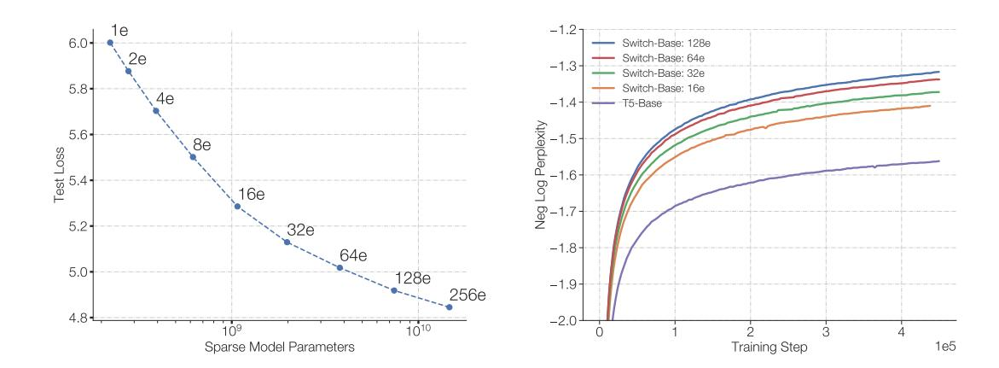

# Contents

| 1 | Introduction                                                                                                                                                                                                                                                                                                 | 3                                      |  |  |  |  |
|---|--------------------------------------------------------------------------------------------------------------------------------------------------------------------------------------------------------------------------------------------------------------------------------------------------------------|----------------------------------------|--|--|--|--|
| 2 | Switch Transformer 2.1 Simplifying Sparse Routing  2.2 Efficient Sparse Routing  2.3 Putting It All Together: The Switch Transformer  2.4 Improved Training and Fine-Tuning Techniques                                                                                   | 4 5 6 8 8                  |  |  |  |  |
| 3 | Scaling Properties 3.1 Scaling Results on a Step-Basis  3.2 Scaling Results on a Time-Basis  3.3 Scaling Versus a Larger Dense Model                                                                                                                                              | 11 12 13 13                   |  |  |  |  |
| 4 | Downstream Results 4.1 Fine-Tuning  4.2 Distillation  4.3 Multilingual Learning                                                                                                                                                                                                   | 14 14 16 17                   |  |  |  |  |
| 5 | Designing Models with Data, Model, and Expert-Parallelism 5.1 Data Parallelism  5.2 Model Parallelism  5.3 Model and Data Parallelism  5.4 Expert and Data Parallelism  5.5 Expert, Model and Data Parallelism  5.6 Towards Trillion Parameter Models  | 18 20 20 21 22 22 22 |  |  |  |  |
| 6 | Related Work                                                                                                                                                                                                                                                                                                 | 24                                     |  |  |  |  |
| 7 | Discussion                                                                                                                                                                                                                                                                                                   | 25                                     |  |  |  |  |
| 8 | Future Work                                                                                                                                                                                                                                                                                                  | 26                                     |  |  |  |  |
| 9 | Conclusion                                                                                                                                                                                                                                                                                                   | 27                                     |  |  |  |  |
| A | Switch for Attention                                                                                                                                                                                                                                                                                         | 27                                     |  |  |  |  |
| B | Preventing Token Dropping with No-Token-Left-Behind                                                                                                                                                                                                                                                       | 29                                     |  |  |  |  |
| C | Encouraging Exploration Across Experts                                                                                                                                                                                                                                                                       | 29                                     |  |  |  |  |
| D | Switch Transformers in Lower Compute Regimes 29                                                                                                                                                                                                                                                           |                                        |  |  |  |  |
| E | Relation of Upstream to Downstream Model Performance 32                                                                                                                                                                                                                                                   |                                        |  |  |  |  |
| F | Pseudo Code for Switch Transformers 33                                                                                                                                                                                                                                                                    |                                        |  |  |  |  |

### 1. Introduction

Large scale training has been an effective path towards flexible and powerful neural language models (Radford et al., 2018; Kaplan et al., 2020; Brown et al., 2020). Simple architectures—backed by a generous computational budget, data set size and parameter count—surpass more complicated algorithms (Sutton, 2019). An approach followed in Radford et al. (2018); Raffel et al. (2019); Brown et al. (2020) expands the model size of a densely-activated Transformer (Vaswani et al., 2017). While effective, it is also extremely computationally intensive (Strubell et al., 2019). Inspired by the success of model scale, but seeking greater computational efficiency, we instead propose a sparsely-activated expert model: the Switch Transformer. In our case the sparsity comes from activating a subset of the neural network weights for each incoming example.

Figure 1: Scaling and sample efficiency of Switch Transformers. Left Plot: Scaling properties for increasingly sparse (more experts) Switch Transformers. Right Plot: Negative log perplexity comparing Switch Transformers to T5 (Raffel et al., 2019) models using the same compute budget.

Sparse training is an active area of research and engineering (Gray et al., 2017; Gale et al., 2020), but as of today, machine learning libraries and hardware accelerators still cater to dense matrix multiplications. To have an efficient sparse algorithm, we start with the Mixture-of-Expert (MoE) paradigm (Jacobs et al., 1991; Jordan and Jacobs, 1994; Shazeer et al., 2017), and simplify it to yield training stability and computational benefits. MoE models have had notable successes in machine translation (Shazeer et al., 2017, 2018; Lepikhin et al., 2020), however, widespread adoption is hindered by complexity, communication costs, and training instabilities.

We address these issues, and then go beyond translation, to find that these class of algorithms are broadly valuable in natural language. We measure superior scaling on a diverse set of natural language tasks and across three regimes in NLP: pre-training, fine-tuning and multi-task training. While this work focuses on scale, we also show that the Switch Transformer architecture not only excels in the domain of supercomputers, but is

beneficial even with only a few computational cores. Further, our large sparse models can be distilled [\(Hinton et al.,](#page-36-3) [2015\)](#page-36-3) into small dense versions while preserving 30% of the sparse model quality gain. Our contributions are the following:

- The Switch Transformer architecture, which simplifies and improves over Mixture of Experts.
- Scaling properties and a benchmark against the strongly tuned T5 model [\(Raffel et al.,](#page-37-0) [2019\)](#page-37-0) where we measure 7x+ pre-training speedups while still using the same FLOPS per token. We further show the improvements hold even with limited computational resources, using as few as two experts.
- Successful distillation of sparse pre-trained and specialized fine-tuned models into small dense models. We reduce the model size by up to 99% while preserving 30% of the quality gains of the large sparse teacher.
- Improved pre-training and fine-tuning techniques: (1) selective precision training that enables training with lower bfloat16 precision (2) an initialization scheme that allows for scaling to a larger number of experts and (3) increased expert regularization that improves sparse model fine-tuning and multi-task training.
- A measurement of the pre-training benefits on multilingual data where we find a universal improvement across all 101 languages and with 91% of languages benefiting from 4x+ speedups over the mT5 baseline [\(Xue et al.,](#page-39-2) [2020\)](#page-39-2).
- An increase in the scale of neural language models achieved by efficiently combining data, model, and expert-parallelism to create models with up to a trillion parameters. These models improve the pre-training speed of a strongly tuned T5-XXL baseline by 4x.

