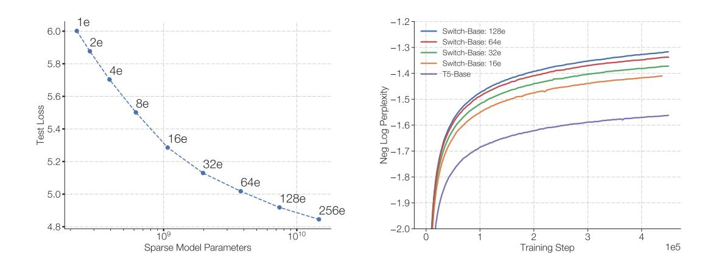
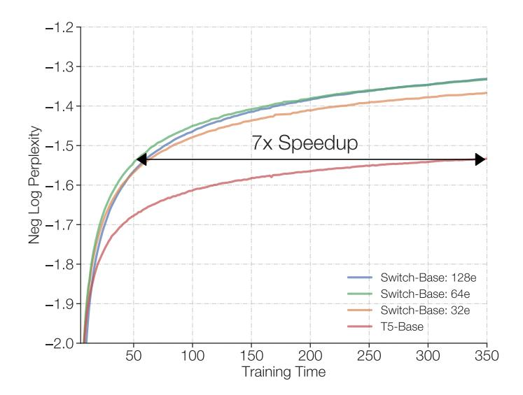
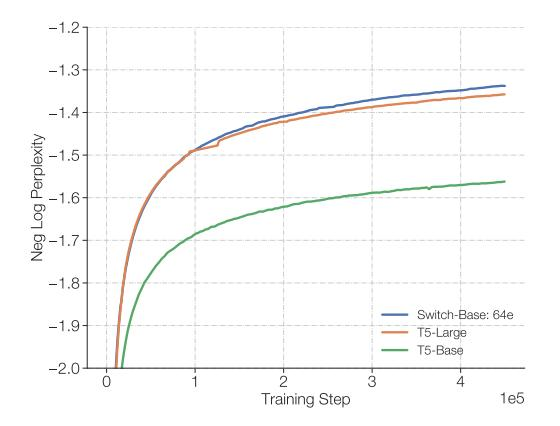
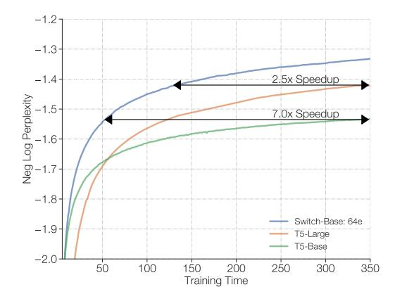

# 3. Scaling Properties

We present a study of the scaling properties of the Switch Transformer architecture during pre-training. Per [Kaplan et al.](#page-36-0) [\(2020\)](#page-36-0), we consider a regime where the model is not bottlenecked by either the computational budget or amount of data. To avoid the data bottleneck, we use the large C4 corpus with over 180B target tokens [\(Raffel et al.,](#page-37-0) [2019\)](#page-37-0) and we train until diminishing returns are observed.

The number of experts is the most efficient dimension for scaling our model. Increasing the experts keeps the computational cost approximately fixed since the model only selects one expert per token, regardless of the number of experts to choose from. The router must compute a probability distribution over more experts, however, this is a lightweight computation of cost O(dmodel × num experts) where dmodel is the embedding dimension of tokens passed between the layers. In this section, we consider the scaling properties on a step-basis and a time-basis with a fixed computational budget.

#### 3.1 Scaling Results on a Step-Basis

Figure 4 demonstrates consistent scaling benefits with the number of experts when training all models for a fixed number of steps. We observe a clear trend: when keeping the FLOPS per token fixed, having more parameters (experts) speeds up training. The left Figure demonstrates consistent scaling properties (with fixed FLOPS per token) between sparse model parameters and test loss. This reveals the advantage of scaling along this additional axis of sparse model parameters. Our right Figure measures sample efficiency of a dense model variant and four FLOP-matched sparse variants. We find that increasing the number of experts leads to more sample efficient models. Our Switch-Base 64 expert model achieves the same performance of the T5-Base model at step 60k at step 450k, which is a 7.5x speedup in terms of step time. In addition, consistent with the findings of Kaplan et al. (2020), we find that larger models are also more sample efficient—learning more quickly for a fixed number of observed tokens.

Figure 4: Scaling properties of the Switch Transformer. Left Plot: We measure the quality improvement, as measured by perplexity, as the parameters increase by scaling the number of experts. The top-left point corresponds to the T5-Base model with 223M parameters. Moving from top-left to bottom-right, we double the number of experts from 2, 4, 8 and so on until the bottom-right point of a 256 expert model with 14.7B parameters. Despite all models using an equal computational budget, we observe consistent improvements scaling the number of experts. Right Plot: Negative log perplexity per step sweeping over the number of experts. The dense baseline is shown with the purple line and we note improved sample efficiency of our Switch-Base models.

### 3.2 Scaling Results on a Time-Basis

Figure 4 demonstrates that on a step basis, as we increase the number of experts, the performance consistently improves. While our models have roughly the same amount of FLOPS per token as the baseline, our Switch Transformers incurs additional communication costs across devices as well as the extra computation of the routing mechanism. Therefore, the increased sample efficiency observed on a step-basis doesn't necessarily translate to a better model quality as measured by wall-clock. This raises the question:

For a fixed training duration and computational budget, should one train a dense or a sparse model?

Figure 5: Speed advantage of Switch Transformer. All models trained on 32 TPUv3 cores with equal FLOPs per example. For a fixed amount of computation and training time, Switch Transformers significantly outperform the dense Transformer baseline. Our 64 expert Switch-Base model achieves the same quality in *one-seventh* the time of the T5-Base and continues to improve.

Figures 5 and 6 address this question. Figure 5 measures the pre-training model quality as a function of time. For a fixed training duration and computational budget, Switch Transformers yield a substantial speed-up. In this setting, our Switch-Base 64 expert model trains in *one-seventh* the time that it would take the T5-Base to get similar perplexity.

#### 3.3 Scaling Versus a Larger Dense Model

The above analysis shows that a computationally-matched dense model is outpaced by its Switch counterpart. Figure 6 considers a different scenario: what if we instead had allocated our resources to a larger dense model? We do so now, measuring Switch-Base against the next strong baseline, *T5-Large*. But despite T5-Large applying 3.5x more FLOPs per token,

Switch-Base is still more sample efficient and yields a 2.5x speedup. Furthermore, more gains can be had simply by designing a new, larger sparse version, Switch-Large, which is FLOP-matched to T5-Large. We do this and demonstrate superior scaling and fine-tuning in the following section.

Figure 6: Scaling Transformer models with Switch layers or with standard dense model scaling. Left Plot: Switch-Base is more sample efficient than both the T5-Base, and T5-Large variant, which applies 3.5x more FLOPS per token. Right Plot: As before, on a wall-clock basis, we find that Switch-Base is still faster, and yields a 2.5x speedup over T5-Large.

#### 4. Downstream Results

Section 3 demonstrated the superior scaling properties while pre-training, but we now validate that these gains translate to improved language learning abilities on downstream tasks. We begin by fine-tuning on a diverse set of NLP tasks. Next we study reducing the memory footprint of our sparse models by over 90% by distilling into small—and easily deployed—dense baselines. Finally, we conclude this section measuring the improvements in a multi-task, multilingual setting, where we show that Switch Transformers are strong multi-task learners, improving over the multilingual T5-base model across all 101 languages.

#### 4.1 Fine-Tuning

Baseline and Switch models used for fine-tuning. Our baselines are the highly-tuned 223M parameter T5-Base model and the 739M parameter T5-Large model (Raffel et al., 2019). For both versions, we design a FLOP-matched Switch Transformer, with many more parameters, which is summarized in Table 9.7 Our baselines differ slightly from those in Raffel et al. (2019) because we pre-train on an improved C4 corpus which removes intra-example text duplication and thus increases the efficacy as a pre-training task Lee et al.

7. FLOPS are calculated for the forward pass as done in Kaplan et al. (2020).

[\(2021\)](#page-37-5). In our protocol we pre-train with 220 (1,048,576) tokens per batch for 550k steps amounting to 576B total tokens. We then fine-tune across a diverse set of tasks using a dropout rate of 0.1 for all layers except the Switch layers, which use a dropout rate of 0.4 (see Table [4\)](#page-10-1). We fine-tune using a batch-size of 1M for 16k steps and for each task, we evaluate model quality every 200-steps and report the peak performance as computed on the validation set.

Fine-tuning tasks and data sets. We select tasks probing language capabilities including question answering, summarization and knowledge about the world. The language benchmarks GLUE [\(Wang et al.,](#page-39-4) [2018\)](#page-39-4) and SuperGLUE [\(Wang et al.,](#page-39-5) [2019\)](#page-39-5) are handled as composite mixtures with all the tasks blended in proportion to the amount of tokens present in each. These benchmarks consist of tasks requiring sentiment analysis (SST-2), word sense disambiguation (WIC), sentence similarty (MRPC, STS-B, QQP), natural language inference (MNLI, QNLI, RTE, CB), question answering (MultiRC, RECORD, BoolQ), coreference resolution (WNLI, WSC) and sentence completion (COPA) and sentence acceptability (CoLA). The CNNDM [\(Hermann et al.,](#page-36-4) [2015\)](#page-36-4) and BBC XSum [\(Narayan](#page-37-6) [et al.,](#page-37-6) [2018\)](#page-37-6) data sets are used to measure the ability to summarize articles. Question answering is probed with the SQuAD data set [\(Rajpurkar et al.,](#page-37-7) [2016\)](#page-37-7) and the ARC Reasoning Challenge [\(Clark et al.,](#page-35-6) [2018\)](#page-35-6). And as in [Roberts et al.](#page-38-6) [\(2020\)](#page-38-6), we evaluate the knowledge of our models by fine-tuning on three closed-book question answering data sets: Natural Questions [\(Kwiatkowski et al.,](#page-36-5) [2019\)](#page-36-5), Web Questions [\(Berant et al.,](#page-35-7) [2013\)](#page-35-7) and Trivia QA [\(Joshi et al.,](#page-36-6) [2017\)](#page-36-6). Closed-book refers to questions posed with no supplemental reference or context material. To gauge the model's common sense reasoning we evaluate it on the Winogrande Schema Challenge [\(Sakaguchi et al.,](#page-38-7) [2020\)](#page-38-7). And finally, we test our model's natural language inference capabilities on the Adversarial NLI Benchmark [\(Nie et al.,](#page-37-8) [2019\)](#page-37-8).

Fine-tuning metrics. The following evaluation metrics are used throughout the paper: We report the average scores across all subtasks for GLUE and SuperGLUE. The Rouge-2 metric is used both the CNNDM and XSum. In SQuAD and the closed book tasks (Web, Natural, and Trivia Questions) we report the percentage of answers exactly matching the target (refer to [Roberts et al.](#page-38-6) [\(2020\)](#page-38-6) for further details and deficiency of this measure). Finally, in ARC Easy, ARC Challenge, ANLI, and Winogrande we report the accuracy of the generated responses.

Fine-tuning results. We observe significant downstream improvements across many natural language tasks. Notable improvements come from SuperGLUE, where we find FLOP-matched Switch variants improve by 4.4 and 2 percentage points over the T5-Base and T5-Large baselines, respectively as well as large improvements in Winogrande, closed book Trivia QA, and XSum.[8](#page-14-0) In our fine-tuning study, the only tasks where we do not observe gains are on the AI2 Reasoning Challenge (ARC) data sets where the T5-Base outperforms Switch-Base on the challenge data set and T5-Large outperforms Switch-Large on the easy data set. Taken as a whole, we observe significant improvements spanning both reasoning and knowledge-heavy tasks. This validates our architecture, not just as one that pre-trains well, but can translate quality improvements to downstream tasks via fine-tuning.

8. Our T5 and Switch models were pre-trained with 220 tokens per batch for 550k steps on a revised C4 data set for fair comparisons.

| Model        | GLUE | SQuAD | SuperGLUE | Winogrande (XL) |
|--------------|------|-------|-----------|-----------------|
| T5-Base      | 84.3 | 85.5  | 75.1      | 66.6            |
| Switch-Base  | 86.7 | 87.2  | 79.5      | 73.3            |
| T5-Large     | 87.8 | 88.1  | 82.7      | 79.1            |
| Switch-Large | 88.5 | 88.6  | 84.7      | 83.0            |

| Model        | XSum | ANLI (R3) | ARC Easy | ARC Chal. |
|--------------|------|-----------|----------|-----------|
| T5-Base      | 18.7 | 51.8      | 56.7     | 35.5      |
| Switch-Base  | 20.3 | 54.0      | 61.3     | 32.8      |
| T5-Large     | 20.9 | 56.6      | 68.8     | 35.5      |
| Switch-Large | 22.3 | 58.6      | 66.0     | 35.5      |

| Model        | CB Web QA | CB Natural QA | CB Trivia QA |  |
|--------------|-----------|---------------|--------------|--|
| T5-Base      | 26.6      | 25.8          | 24.5         |  |
| Switch-Base  | 27.4      | 26.8          | 30.7         |  |
| T5-Large     | 27.7      | 27.6          | 29.5         |  |
| Switch-Large | 31.3      | 29.5          | 36.9         |  |

Table 5: Fine-tuning results. Fine-tuning results of T5 baselines and Switch models across a diverse set of natural language tests (validation sets; higher numbers are better). We compare FLOP-matched Switch models to the T5-Base and T5-Large baselines. For most tasks considered, we find significant improvements of the Switchvariants. We observe gains across both model sizes and across both reasoning and knowledge-heavy language tasks.

