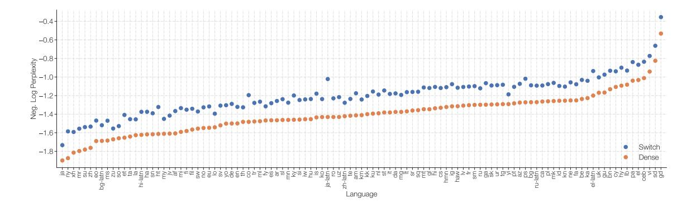
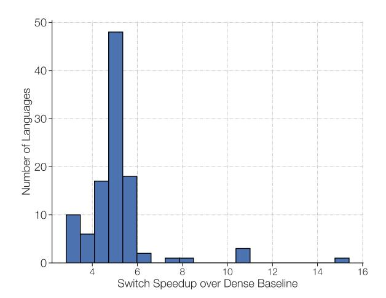

# 5. Designing Models with Data, Model, and Expert-Parallelism

Arbitrarily increasing the number of experts is subject to diminishing returns (Figure [4\)](#page-11-1). Here we describe complementary scaling strategies. The common way to scale a Transformer is to increase dimensions in tandem, like dmodel or df f . This increases both the parameters

9. The speedup on a step basis is computed as the ratio of the number of steps for the baseline divided by the number of steps required by our model to reach that same quality.

Figure 7: Multilingual pre-training on 101 languages. Improvements of Switch T5 Base model over dense baseline when multi-task training on 101 languages. We observe Switch Transformers to do quite well in the multi-task training setup and yield improvements on all 101 languages.

Figure 8: Multilingual pre-training on 101 languages. We histogram for each language, the step speedup of Switch Transformers over the FLOP matched T5 dense baseline to reach the same quality. Over all 101 languages, we achieve a mean step speedup over mT5-Base of 5x and, for 91% of languages, we record a 4x, or greater, speedup to reach the final perplexity of mT5-Base.

and computation performed and is ultimately limited by the memory per accelerator. Once it exceeds the size of the accelerator's memory, single program multiple data (SPMD) model-parallelism can be employed. This section studies the trade-offs of combining data, model, and expert-parallelism.

Reviewing the Feed-Forward Network (FFN) Layer. We use the FFN layer as an example of how data, model and expert-parallelism works in Mesh TensorFlow (Shazeer et al., 2018) and review it briefly here. We assume B tokens in the batch, each of dimension

dmodel. Both the input (x) and output (y) of the FFN are of size [B, dmodel] and the intermediate (h) is of size [B, df f ] where df f is typically several times larger than dmodel. In the FFN, the intermediate is h = xWin and then the output of the layer is y = ReLU(h)Wout. Thus Win and Wout are applied independently to each token and have sizes [dmodel, df f ] and [df f , dmodel].

We describe two aspects of partitioning: how the weights and batches of data divide over cores, depicted in Figure [9.](#page-20-1) We denote all cores available as N which Mesh Tensorflow may then remap into a logical multidimensional mesh of processors. Here we create a two-dimensional logical mesh, with one dimension representing the number of ways for data-parallel sharding (n) and the other, the model-parallel sharding (m). The total cores must equal the ways to shard across both data and model-parallelism, e.g. N = n × m. To shard the layer across cores, the tensors containing that batch of B tokens are sharded across n data-parallel cores, so each core contains B/n tokens. Tensors and variables with df f are then sharded across m model-parallel cores. For the variants with experts-layers, we consider E experts, each of which can process up to C tokens.

| Term | Description                                     |
|------|-------------------------------------------------|
| B    | Number of tokens in the batch.                  |
| N    | Number of total cores.                          |
| n    | Number of ways for data-parallelism sharding.   |
| m    | Number of ways for model-parallelism sharding.  |
| E    | Number of experts in Switch layers.             |
| C    | Expert capacity, the batch size of each expert. |

### 5.1 Data Parallelism

When training data parallel models, which is the standard for distributed training, then all cores are allocated to the data-parallel dimension or n = N, m = 1. This has the advantage that no communication is needed until the entire forward and backward pass is finished and the gradients need to be then aggregated across all cores. This corresponds to the left-most column of Figure [9.](#page-20-1)

### 5.2 Model Parallelism

We now consider a scenario where all cores are allocated exclusively to the model-parallel dimension and so n = 1, m = N. Now all cores must keep the full B tokens and each core will contain a unique slice of the weights. For each forward and backward pass, a communication cost is now incurred. Each core sends a tensor of [B, dmodel] to compute the second matrix multiplication ReLU(h)Wout because the df f dimension is partitioned and must be summed over. As a general rule, whenever a dimension that is partitioned across cores must be summed, then an all-reduce operation is added for both the forward and backward pass. This contrasts with pure data parallelism where an all-reduce only occurs at the end of the entire forward and backward pass.

#### **Expert and Data Parallelism Model Parallelism Expert, Model and Data Parallelism How the** *model weights* **are split over cores How the** *data* **is split over cores Model and Data Parallelism Data Parallelism Expert and Data Parallelism Model Parallelism Expert, Model and Data Parallelism Model and Data Parallelism Data Parallelism**

Figure 9: Data and weight partitioning strategies. Each 4×4 dotted-line grid represents 16 cores and the shaded squares are the data contained on that core (either model weights or batch of tokens). We illustrate both how the model weights and the data tensors are split for each strategy. First Row: illustration of how model weights are split across the cores. Shapes of different sizes in this row represent larger weight matrices in the Feed Forward Network (FFN) layers (e.g larger df f sizes). Each color of the shaded squares identifies a unique weight matrix. The number of parameters per core is fixed, but larger weight matrices will apply more computation to each token. Second Row: illustration of how the data batch is split across cores. Each core holds the same number of tokens which maintains a fixed memory usage across all strategies. The partitioning strategies have different properties of allowing each core to either have the same tokens or different tokens across cores, which is what the different colors symbolize.

### 5.3 Model and Data Parallelism

It is common to mix both model and data parallelism for large scale models, which was done in the largest T5 models [\(Raffel et al.,](#page-37-0) [2019;](#page-37-0) [Xue et al.,](#page-39-2) [2020\)](#page-39-2) and in GPT-3 [\(Brown et al.,](#page-35-0) [2020\)](#page-35-0). With a total of N = n × m cores, now each core will be responsible for B/n tokens and df f /m of both the weights and intermediate activation. In the forward and backward pass each core communicates a tensor of size [B/n, dmodel] in an all-reduce operation.

### 5.4 Expert and Data Parallelism

Next we describe the partitioning strategy for expert and data parallelism. Switch Transformers will allocate all of their cores to the data partitioning dimension n, which will also correspond to the number of experts in the model. For each token per core a router locally computes assignments to the experts. The output is a binary matrix of size [n, B/n, E, C] which is partitioned across the first dimension and determines expert assignment. This binary matrix is then used to do a gather via matrix multiplication with the input tensor of [n, B/n, dmodel].

$$einsum([n, B/n, d_{model}], [n, B/n, E, C], dimension = [B/n])$$
(7)

resulting in the final tensor of shape [n, E, C, dmodel], which is sharded across the first dimension. Because each core has its own expert, we do an all-to-all communication of size [E, C, dmodel] to now shard the E dimension instead of the n-dimension. There are additional communication costs of bfloat16 tensors of size E×C ×dmodel in the forward pass to analogusly receive the tokens from each expert located on different cores. See Appendix [F](#page-32-0) for a detailed analysis of the expert partitioning code.

### 5.5 Expert, Model and Data Parallelism

In the design of our best model, we seek to balance the FLOPS per token and the parameter count. When we scale the number of experts, we increase the number of parameters, but do not change the FLOPs per token. In order to increase FLOPs, we must also increase the df f dimension (which also increases parameters, but at a slower rate). This presents a trade-off: as we increase df f we will run out of memory per core, which then necessitates increasing m. But since we have a fixed number of cores N, and N = n × m, we must decrease n, which forces use of a smaller batch-size (in order to hold tokens per core constant).

When combining both model and expert-parallelism, we will have all-to-all communication costs from routing the tokens to the correct experts along with the internal all-reduce communications from the model parallelism. Balancing the FLOPS, communication costs and memory per core becomes quite complex when combining all three methods where the best mapping is empirically determined. See our further analysis in section [5.6](#page-21-2) for how the number of experts effects the downstream performance as well.

### 5.6 Towards Trillion Parameter Models

Combining expert, model and data parallelism, we design two large Switch Transformer models, one with 395 billion and 1.6 trillion parameters, respectively. We study how these models perform on both up-stream pre-training as language models and their downstream fine-tuning performance. The parameters, FLOPs per sequence and hyper-parameters of the two different models are listed below in Table [9.](#page-22-0) Standard hyper-parameters of the Transformer, including dmodel, df f , dkv, number of heads and number of layers are described, as well as a less common feature, F F NGEGLU , which refers to a variation of the FFN layer where the expansion matrix is substituted with two sets of weights which are non-linearly combined [\(Shazeer,](#page-38-9) [2020\)](#page-38-9).

The Switch-C model is designed using only expert-parallelism, and no model-parallelism, as described earlier in Section [5.4.](#page-21-0) As a result, the hyper-parameters controlling the width,

| Model        | Parameters   | FLOPs/seq   | $d_{model}$ | $FFN_{GEGLU}$        | $d_{ff}$              | $d_{kv}$ | Num. Heads |
|--------------|--------------|-------------|-------------|----------------------|-----------------------|----------|------------|
| T5-Base      | 0.2B         | 124B        | 768         | <b>√</b>             | 2048                  | 64       | 12         |
| T5-Large     | 0.7B         | 425B        | 1024        | $\checkmark$         | 2816                  | 64       | 16         |
| T5-XXL       | 11B          | 6.3T        | 4096        | $\checkmark$         | 10240                 | 64       | 64         |
| Switch-Base  | 7B           | 124B        | 768         | ✓                    | 2048                  | 64       | 12         |
| Switch-Large | 26B          | 425B        | 1024        | $\checkmark$         | 2816                  | 64       | 16         |
| Switch-XXL   | 395B         | 6.3T        | 4096        | ✓                    | 10240                 | 64       | 64         |
| Switch-C     | 1571B        | 890B        | 2080        |                      | 6144                  | 64       | 32         |
|              |              |             |             |                      |                       |          |            |
| Model        | Expert Freq. | Num. Layers | Num Experts | Neg. Log Perp. @250k | Neg. Log Perp. @ 500k |          |            |
| T5-Base      | _            | 12          | _           | -1.599               | -1.556                |          |            |
| T5-Large     | _            | 24          | _           | -1.402               | -1.350                |          |            |
| T5-XXL       | _            | 24          | _           | -1.147               | -1.095                |          |            |
| Switch-Base  | 1/2          | 12          | 128         | -1.370               | -1.306                |          |            |
| Switch-Large | 1/2          | 24          | 128         | -1.248               | -1.177                |          |            |
| Switch-XXL   | 1/2          | 24          | 64          | -1.086               | -1.008                |          |            |
| Switch-C     | 1            | 15          | 2048        | -1.096               | -1.043                |          |            |

Table 9: Switch model design and pre-training performance. We compare the hyper-parameters and pre-training performance of the T5 models to our Switch Transformer variants. The last two columns record the pre-training model quality on the C4 data set after 250k and 500k steps, respectively. We observe that the Switch-C Transformer variant is 4x faster to a fixed perplexity (with the same compute budget) than the T5-XXL model, with the gap increasing as training progresses.

depth, number of heads, and so on, are all much smaller than the T5-XXL model. In contrast, the Switch-XXL is FLOP-matched to the T5-XXL model, which allows for larger dimensions of the hyper-parameters, but at the expense of additional communication costs induced by model-parallelism (see Section 5.5 for more details).

Sample efficiency versus T5-XXL. In the final two columns of Table 9 we record the negative log perplexity on the C4 corpus after 250k and 500k steps, respectively. After 250k steps, we find both Switch Transformer variants to improve over the T5-XXL version's negative log perplexity by over 0.061. To contextualize the significance of a gap of 0.061, we note that the T5-XXL model had to train for an additional 250k steps to increase 0.052. The gap continues to increase with additional training, with the Switch-XXL model out-performing the T5-XXL by 0.087 by 500k steps.

Training instability. However, as described in the introduction, large sparse models can be unstable, and as we increase the scale, we encounter some sporadic issues. We find that the larger Switch-C model, with 1.6T parameters and 2048 experts, exhibits no training instability at all. Instead, the Switch XXL version, with nearly 10x larger FLOPs per sequence, is sometimes unstable. As a result, though this is our better model on a step-basis, we do not pre-train for a full 1M steps, in-line with the final reported results of T5 (Raffel et al., 2019).

10. This reported quality difference is a lower bound, and may actually be larger. The T5-XXL was pretrained on an easier C4 data set which included duplicated, and thus easily copied, snippets within examples.

Reasoning fine-tuning performance. As a preliminary assessment of the model quality, we use a Switch-XXL model partially pre-trained on 503B tokens, or approximately half the text used by the T5-XXL model. Using this checkpoint, we conduct multi-task training for efficiency, where all tasks are learned jointly, rather than individually fine-tuned. We find that SQuAD accuracy on the validation set increases to 89.7 versus state-of-the-art of 91.3. Next, the average SuperGLUE test score is recorded at 87.5 versus the T5 version obtaining a score of 89.3 compared to the state-of-the-art of 90.0 [\(Wang et al.,](#page-39-5) [2019\)](#page-39-5). On ANLI [\(Nie et al.,](#page-37-8) [2019\)](#page-37-8), Switch XXL improves over the prior state-of-the-art to get a 65.7 accuracy versus the prior best of 49.4 [\(Yang et al.,](#page-39-6) [2020\)](#page-39-6). We note that while the Switch-XXL has state-of-the-art Neg. Log Perp. on the upstream pre-training task, its gains have not yet fully translated to SOTA downstream performance. We study this issue more in Appendix [E.](#page-31-0)

Knowledge-based fine-tuning performance. Finally, we also conduct an early examination of the model's knowledge with three closed-book knowledge-based tasks: Natural Questions, WebQuestions and TriviaQA, without additional pre-training using Salient Span Masking [\(Guu et al.,](#page-36-7) [2020\)](#page-36-7). In all three cases, we observe improvements over the prior stateof-the-art T5-XXL model (without SSM). Natural Questions exact match increases to 34.4 versus the prior best of 32.8, Web Questions increases to 41.0 over 37.2, and TriviaQA increases to 47.5 versus 42.9.

Summing up, despite training on less than half the data of other models, we already find comparable, and sometimes state-of-the-art, model quality. Currently, the Switch Transformer translates substantial upstream gains better to knowledge-based tasks, than reasoning-tasks (see Appendix [E\)](#page-31-0). Extracting stronger fine-tuning performance from large expert models is an active research question, and the pre-training perplexity indicates future improvements should be possible.

