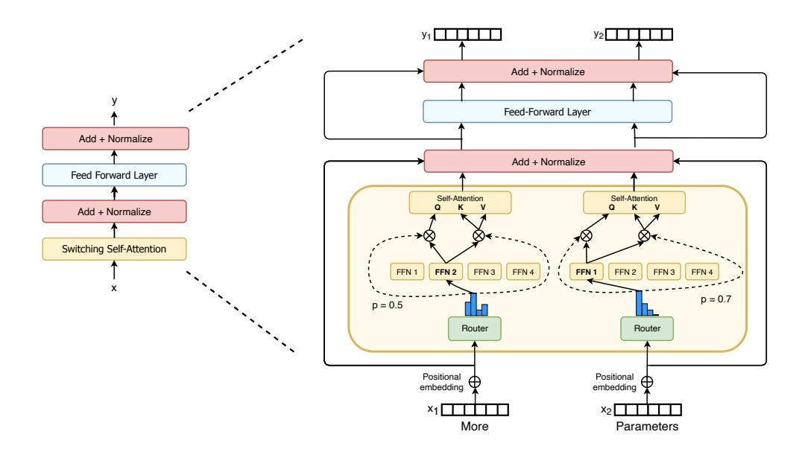

# A. Switch for Attention

[Shazeer et al.](#page-38-3) [\(2018\)](#page-38-3); [Lepikhin et al.](#page-37-2) [\(2020\)](#page-37-2) designed MoE Transformers [\(Shazeer et al.,](#page-38-2) [2017\)](#page-38-2) by adding MoE layers into the dense feedfoward network (FFN) computations of the Transformer. Similarly, our work also replaced the FFN layer in the Transformer, but we briefly explore here an alternate design. We add Switch layers into the Transformer Self-Attention layers. To do so, we replace the trainable weight matrices that produce the queries, keys and values with Switch layers as seen in Figure [10.](#page-27-0)

Table [10](#page-27-1) records the quality after a fixed number of steps as well as training time for several variants. Though we find improvements, we also found these layers to be more unstable when using bfloat16 precision and thus we did not include them in the final variant.

Figure 10: Switch layers in attention. We diagram how to incorporate the Switch layer into the Self-Attention transformer block. For each token (here we show two tokens, x1 = "More" and x2 = "Parameters"), one set of weights produces the query and the other set of unique weights produces the shared keys and values. We experimented with each expert being a linear operation, as well as a FFN, as was the case throughout this work. While we found quality improvements using this, we found this to be more unstable when used with low precision number formats, and thus leave it for future work.

However, when these layers do train stably, we believe the preliminary positive results suggests a future promising direction.

| Model                  | Precision | Quality         | Quality    | Speed        |
|------------------------|-----------|-----------------|------------|--------------|
|                        |           | @100k Steps (↑) | @16H (↑)   | (ex/sec) (↑) |
| Experts FF             | float32   | -1.548          | -1.614     | 1480         |
| Expert Attention       | float32   | -1.524          | -1.606     | 1330         |
| Expert Attention       | bfloat16  | [diverges]      | [diverges] | –            |
| Experts FF + Attention | float32   | -1.513          | -1.607     | 1240         |
| Expert FF + Attention  | bfloat16  | [diverges]      | [diverges] | –            |

Table 10: Switch attention layer results. All models have 32 experts and train with 524k tokens per batch. Experts FF is when experts replace the FFN in the Transformer, which is our standard setup throughout the paper. Experts FF + Attention is when experts are used to replace both the FFN and the Self-Attention layers. When training with bfloat16 precision the models that have experts attention diverge.

