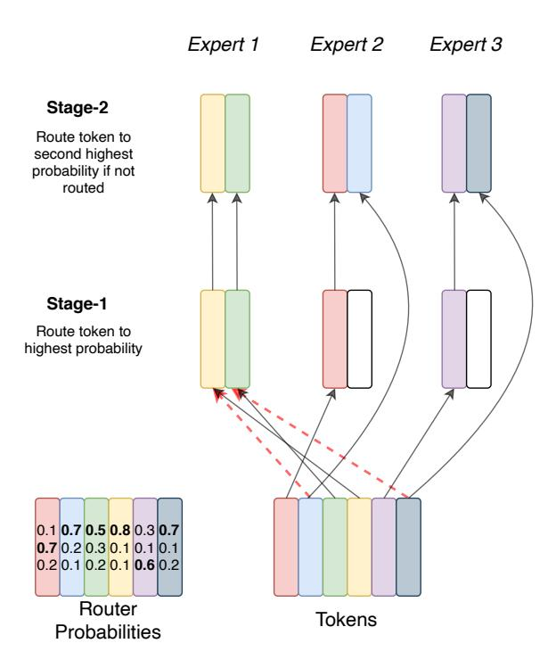
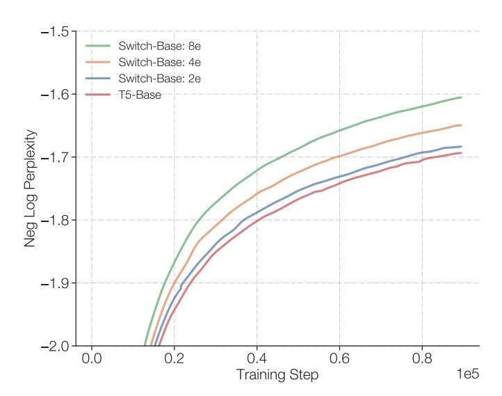
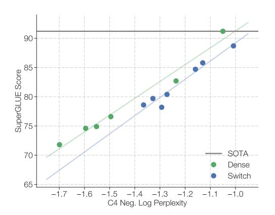
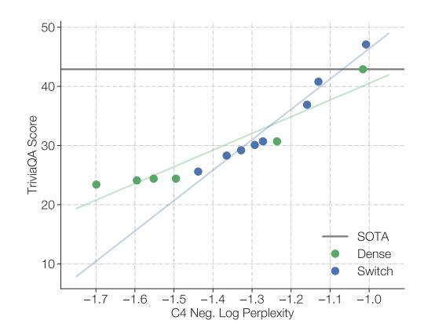

# D. Switch Transformers in Lower Compute Regimes

Switch Transformer is also an effective architecture at small scales as well as in regimes with thousands of cores and trillions of parameters. Many of our prior experiments were

Figure 11: Diagram of the No-Token-Left-Behind Routing. Stage 1 is equivalent to Switch routing where tokens are routed to the expert with the highest probability from the router. In Stage 2 we look at all tokens that have overflowed and route them to the expert with which has the second highest probability. Tokens can still be overflowed if their second highest expert has too many tokens, but this allows most of the tokens to be routed. This process can be iterated to guarantee virtually no tokens are dropped at all.

| Model          | Quality (Neg. Log Perp.) $(\uparrow)$ |  |  |
|----------------|---------------------------------------|--|--|
| Argmax         | -1.471                                |  |  |
| Sample softmax | -1.570                                |  |  |
| Input dropout  | -1.480                                |  |  |
| Input jitter   | -1.468                                |  |  |

Table 11: Router Exploration Strategies. Quality of the Switch Transformer, measured by the negative log perplexity, under different randomness-strategies for selecting the expert (lower is better). There is no material speed performance difference between the variants.

at the scale of 10B+ parameter models, but we show in Figure 12 as few as 2 experts produce compelling gains over a FLOP-matched counterpart. Even if a super computer is not readily available, training Switch Transformers with 2, 4, or 8 experts (as we typically recommend one expert per core) results in solid improvements over T5 dense baselines.

Figure 12: Switch Transformer with few experts. Switch Transformer improves over the baseline even with very few experts. Here we show scaling properties at very small scales, where we improve over the T5-Base model using 2, 4, and 8 experts.

### E. Relation of Upstream to Downstream Model Performance

There is no guarantee that a model's quality on a pre-training objective will translate to downstream task results. Figure 13 presents the correlation of the upstream model quality, for both dense and Switch models, on the C4 pre-training task with two downstream task measures: average SuperGLUE performance and TriviaQA score. We choose these two tasks as one probes the model's reasoning and the other factual knowledge.

Figure 13: Upstream pre-trained quality to downstream model quality. We correlate the upstream performance with downstream quality on both SuperGLUE and TriviaQA (SOTA recorded without SSM), reasoning and knowledge-heavy benchmarks, respectively (validation sets). We find that, as with the baseline, the Switch model scales with improvements in the upstream pre-training task. For SuperGLUE, we find a loosely linear relation between negative log perplexity and the average SuperGLUE score. However, the dense model often performs better for a fixed perplexity, particularly in the large-scale regime. Conversely, on the knowledge-heavy task, TriviaQA, we find that the Switch Transformer may follow an improved scaling relationship – for a given upstream perplexity, it does better than a dense counterpart. Further statistics (expensive to collect and left to future work) would be necessary to confirm these observations.

We find a consistent correlation, indicating that for both baseline and Switch models, improved pre-training leads to better downstream results. Additionally, for a fixed upstream perplexity we find that both Switch and dense models perform similarly in the small to medium model size regime. However, in the largest model regime (T5-11B/T5-XXL) our largest Switch models, as mentioned in Section 5.6, do not always translate their upstream perplexity well to downstream fine-tuning on the SuperGLUE task. This warrants future investigation and study to fully realize the potential of sparse models. Understanding the fine-tuning dynamics with expert-models is very complicated and is dependent on regularization, load-balancing, and fine-tuning hyper-parameters.

