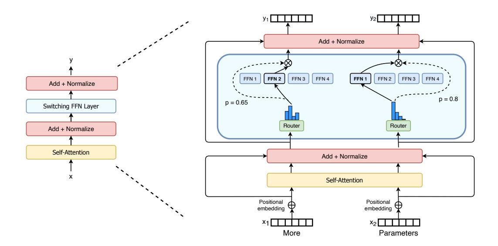

# 2. Switch Transformer

The guiding design principle for Switch Transformers is to maximize the parameter count of a Transformer model [\(Vaswani et al.,](#page-39-1) [2017\)](#page-39-1) in a simple and computationally efficient way. The benefit of scale was exhaustively studied in [Kaplan et al.](#page-36-0) [\(2020\)](#page-36-0) which uncovered powerlaw scaling with model size, data set size and computational budget. Importantly, this work advocates training large models on relatively small amounts of data as the computationally optimal approach.

Heeding these results, we investigate a fourth axis: increase the parameter count while keeping the floating point operations (FLOPs) per example constant. Our hypothesis is that the parameter count, independent of total computation performed, is a separately important axis on which to scale. We achieve this by designing a sparsely activated model that efficiently uses hardware designed for dense matrix multiplications such as GPUs and TPUs. Our work here focuses on TPU architectures, but these class of models may be similarly trained on GPU clusters. In our distributed training setup, our sparsely activated layers split unique weights on different devices. Therefore, the weights of the model increase with the number of devices, all while maintaining a manageable memory and computational footprint on each device.

Figure 2: Illustration of a Switch Transformer encoder block. We replace the dense feed forward network (FFN) layer present in the Transformer with a sparse Switch FFN layer (light blue). The layer operates independently on the tokens in the sequence. We diagram two tokens ( $x_1$  = "More" and  $x_2$  = "Parameters" below) being routed (solid lines) across four FFN experts, where the router independently routes each token. The switch FFN layer returns the output of the selected FFN multiplied by the router gate value (dotted-line).

