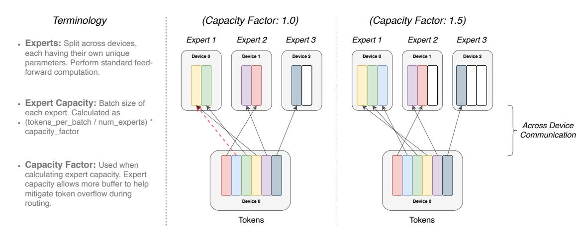

# 2.1 Simplifying Sparse Routing

Mixture of Expert Routing. Shazeer et al. (2017) proposed a natural language Mixture-of-Experts (MoE) layer which takes as an input a token representation x and then routes this to the best determined top-k experts, selected from a set  $\{E_i(x)\}_{i=1}^N$  of N experts. The router variable  $W_r$  produces logits  $h(x) = W_r \cdot x$  which are normalized via a softmax distribution over the available N experts at that layer. The gate-value for expert i is given by,

$$p_i(x) = \frac{e^{h(x)_i}}{\sum_{j=0}^{N} e^{h(x)_j}}.$$
 (1)

The top-k gate values are selected for routing the token x. If  $\mathcal{T}$  is the set of selected top-k indices then the output computation of the layer is the linearly weighted combination of each expert's computation on the token by the gate value,

$$y = \sum_{i \in \mathcal{T}} p_i(x) E_i(x). \tag{2}$$

Switch Routing: Rethinking Mixture-of-Experts. Shazeer et al. (2017) conjectured that routing to k > 1 experts was necessary in order to have non-trivial gradients to the routing functions. The authors intuited that learning to route would not work without the ability to compare at least two experts. Ramachandran and Le (2018) went further to

study the top-k decision and found that higher k-values in lower layers in the model were important for models with many routing layers. Contrary to these ideas, we instead use a simplified strategy where we route to only a single expert. We show this simplification preserves model quality, reduces routing computation and performs better. This k = 1 routing strategy is later referred to as a Switch layer. Note that for both MoE and Switch Routing, the gate value pi(x) in Equation [2](#page-4-1) permits differentiability of the router.

The benefits for the Switch layer are three-fold: (1) The router computation is reduced as we are only routing a token to a single expert. (2) The batch size (expert capacity) of each expert can be at least halved since each token is only being routed to a single expert.[3](#page-5-1) (3) The routing implementation is simplified and communication costs are reduced. Figure [3](#page-5-2) shows an example of routing with different expert capacity factors.

Figure 3: Illustration of token routing dynamics. Each expert processes a fixed batch-size of tokens modulated by the capacity factor. Each token is routed to the expert with the highest router probability, but each expert has a fixed batch size of (total tokens / num experts) × capacity factor. If the tokens are unevenly dispatched then certain experts will overflow (denoted by dotted red lines), resulting in these tokens not being processed by this layer. A larger capacity factor alleviates this overflow issue, but also increases computation and communication costs (depicted by padded white/empty slots).

### 2.2 Efficient Sparse Routing

We use Mesh-Tensorflow (MTF) [\(Shazeer et al.,](#page-38-3) [2018\)](#page-38-3) which is a library, with similar semantics and API to Tensorflow [\(Abadi et al.,](#page-35-3) [2016\)](#page-35-3) that facilitates efficient distributed data and model parallel architectures. It does so by abstracting the physical set of cores to a logical mesh of processors. Tensors and computations may then be sharded per named dimensions, facilitating easy partitioning of models across dimensions. We design our model with TPUs in mind, which require statically declared sizes. Below we describe our distributed Switch Transformer implementation.

3. See Section [2.2](#page-5-0) for a technical description.

Distributed Switch Implementation. All of our tensor shapes are statically determined at compilation time, but our computation is dynamic due to the routing decisions at training and inference. Because of this, one important technical consideration is how to set the expert capacity. The expert capacity—the number of tokens each expert computes—is set by evenly dividing the number of tokens in the batch across the number of experts, and then further expanding by a capacity factor,

expert capacity = 
$$\left(\frac{\text{tokens per batch}}{\text{number of experts}}\right) \times \text{capacity factor.}$$
 (3)

A capacity factor greater than 1.0 creates additional buffer to accommodate for when tokens are not perfectly balanced across experts. If too many tokens are routed to an expert (referred to later as dropped tokens), computation is skipped and the token representation is passed directly to the next layer through the residual connection. Increasing the expert capacity is not without drawbacks, however, since high values will result in wasted computation and memory. This trade-off is explained in Figure [3.](#page-5-2) Empirically we find ensuring lower rates of dropped tokens are important for the scaling of sparse expert-models. Throughout our experiments we didn't notice any dependency on the number of experts for the number of tokens dropped (typically < 1%). Using the auxiliary load balancing loss (next section) with a high enough coefficient ensured good load balancing. We study the impact that these design decisions have on model quality and speed in Table [1.](#page-8-0)

A Differentiable Load Balancing Loss. To encourage a balanced load across experts we add an auxiliary loss [\(Shazeer et al.,](#page-38-2) [2017,](#page-38-2) [2018;](#page-38-3) [Lepikhin et al.,](#page-37-2) [2020\)](#page-37-2). As in [Shazeer](#page-38-3) [et al.](#page-38-3) [\(2018\)](#page-38-3); [Lepikhin et al.](#page-37-2) [\(2020\)](#page-37-2), Switch Transformers simplifies the original design in [Shazeer et al.](#page-38-2) [\(2017\)](#page-38-2) which had separate load-balancing and importance-weighting losses. For each Switch layer, this auxiliary loss is added to the total model loss during training. Given N experts indexed by i = 1 to N and a batch B with T tokens, the auxiliary loss is computed as the scaled dot-product between vectors f and P,

$$loss = \alpha \cdot N \cdot \sum_{i=1}^{N} f_i \cdot P_i$$
 (4)

where fi is the fraction of tokens dispatched to expert i,

$$f_i = \frac{1}{T} \sum_{x \in \mathcal{B}} \mathbb{1}\{\operatorname{argmax} p(x) = i\}$$
 (5)

and Pi is the fraction of the router probability allocated for expert i, [2](#page-6-0)

$$P_i = \frac{1}{T} \sum_{x \in \mathcal{B}} p_i(x). \tag{6}$$

Since we seek uniform routing of the batch of tokens across the N experts, we desire both vectors to have values of 1/N. The auxiliary loss of Equation [4](#page-6-1) encourages uniform routing since it is minimized under a uniform distribution. The objective can also be differentiated as

2. A potential source of confusion: pi(x) is the probability of routing token x to expert i. Pi is the probability fraction to expert i across all tokens in the batch B.

the P-vector is differentiable, but the f-vector is not. The final loss is multiplied by expert count N to keep the loss constant as the number of experts varies since under uniform routing  $\sum_{i=1}^{N} (f_i \cdot P_i) = \sum_{i=1}^{N} (\frac{1}{N} \cdot \frac{1}{N}) = \frac{1}{N}$ . Finally, a hyper-parameter  $\alpha$  is a multiplicative coefficient for these auxiliary losses; throughout this work we use an  $\alpha = 10^{-2}$  which was sufficiently large to ensure load balancing while small enough to not to overwhelm the primary cross-entropy objective. We swept hyper-parameter ranges of  $\alpha$  from  $10^{-1}$  to  $10^{-5}$  in powers of 10 and found  $10^{-2}$  balanced load quickly without interfering with training loss.

#### 2.3 Putting It All Together: The Switch Transformer

Our first test of the Switch Transformer starts with pre-training on the "Colossal Clean Crawled Corpus" (C4), introduced in (Raffel et al., 2019). For our pre-training objective, we use a masked language modeling task (Taylor, 1953; Fedus et al., 2018; Devlin et al., 2018) where the model is trained to predict missing tokens. In our pre-training setting, as determined in Raffel et al. (2019) to be optimal, we drop out 15% of tokens and then replace the masked sequence with a single sentinel token. To compare our models, we record the negative log perplexity.⁴ Throughout all tables in the paper, ↑ indicates that a higher value for that metric is better and vice-versa for ↓. A comparison of all the models studied in this work are in Table 9.

A head-to-head comparison of the Switch Transformer and the MoE Transformer is presented in Table 1. Our Switch Transformer model is FLOP-matched to 'T5-Base' (Raffel et al., 2019) (same amount of computation per token is applied). The MoE Transformer, using top-2 routing, has two experts which each apply a separate FFN to each token and thus its FLOPS are larger. All models were trained for the same number of steps on identical hardware. Note that the MoE model going from capacity factor 2.0 to 1.25 actually slows down (840 to 790) in the above experiment setup, which is unexpected.5

We highlight three key findings from Table 1: (1) Switch Transformers outperform both carefully tuned dense models and MoE Transformers on a speed-quality basis. For a fixed amount of computation and wall-clock time, Switch Transformers achieve the best result. (2) The Switch Transformer has a smaller computational footprint than the MoE counterpart. If we increase its size to match the training speed of the MoE Transformer, we find this outperforms all MoE and Dense models on a per step basis as well. (3) Switch Transformers perform better at lower capacity factors (1.0, 1.25). Smaller expert capacities are indicative of the scenario in the large model regime where model memory is very scarce and the capacity factor will want to be made as small as possible.

#### 2.4 Improved Training and Fine-Tuning Techniques

Sparse expert models may introduce training difficulties over a vanilla Transformer. Instability can result because of the hard-switching (routing) decisions at each of these layers. Further, low precision formats like bfloat16 (Wang and Kanwar, 2019) can exacerbate issues

4. We use  $\log$  base-e for this metric so the units are nats.

5. Note that speed measurements are both a function of the algorithm and the implementation details. Switch Transformer reduces the necessary computation relative to MoE (algorithm), but the final speed differences are impacted by low-level optimizations (implementation).

| Model        | Capacity | Quality after Time to Quality |               | Speed (↑)      |
|--------------|----------|----------------------------------|---------------|----------------|
|              | Factor   | 100k steps (↑)                   | Threshold (↓) | (examples/sec) |
|              |          | (Neg. Log Perp.)                 | (hours)       |                |
| T5-Base      | —        | -1.731                           | Not achieved† | 1600           |
| T5-Large     | —        | -1.550                           | 131.1         | 470            |
| MoE-Base     | 2.0      | -1.547                           | 68.7          | 840            |
| Switch-Base  | 2.0      | -1.554                           | 72.8          | 860            |
| MoE-Base     | 1.25     | -1.559                           | 80.7          | 790            |
| Switch-Base  | 1.25     | -1.553                           | 65.0          | 910            |
| MoE-Base     | 1.0      | -1.572                           | 80.1          | 860            |
| Switch-Base  | 1.0      | -1.561                           | 62.8          | 1000           |
| Switch-Base+ | 1.0      | -1.534                           | 67.6          | 780            |

Table 1: Benchmarking Switch versus MoE. Head-to-head comparison measuring per step and per time benefits of the Switch Transformer over the MoE Transformer and T5 dense baselines. We measure quality by the negative log perplexity and the time to reach an arbitrary chosen quality threshold of Neg. Log Perp.=-1.50. All MoE and Switch Transformer models use 128 experts, with experts at every other feed-forward layer. For Switch-Base+, we increase the model size until it matches the speed of the MoE model by increasing the model hidden-size from 768 to 896 and the number of heads from 14 to 16. All models are trained with the same amount of computation (32 cores) and on the same hardware (TPUv3). Further note that all our models required pre-training beyond 100k steps to achieve our level threshold of -1.50. † T5-Base did not achieve this negative log perplexity in the 100k steps the models were trained.

in the softmax computation for our router. We describe training difficulties here and the methods we use to overcome them to achieve stable and scalable training.

Selective precision with large sparse models. Model instability hinders the ability to train using efficient bfloat16 precision, and as a result, [Lepikhin et al.](#page-37-2) [\(2020\)](#page-37-2) trains with float32 precision throughout their MoE Transformer. However, we show that by instead selectively casting to float32 precision within a localized part of the model, stability may be achieved, without incurring expensive communication cost of float32 tensors. This technique is inline with modern mixed precision training strategies where certain parts of the model and gradient updates are done in higher precision [Micikevicius et al.](#page-37-4) [\(2017\)](#page-37-4). Table [2](#page-9-0) shows that our approach permits nearly equal speed to bfloat16 training while conferring the training stability of float32.

To achieve this, we cast the router input to float32 precision. The router function takes the tokens as input and produces the dispatch and combine tensors used for the selection and recombination of expert computation (refer to Code Block [15](#page-33-0) in the Appendix for details). Importantly, the float32 precision is only used within the body of the router function—on computations local to that device. Because the resulting dispatch and combine tensors are recast to bfloat16 precision at the end of the function, no expensive float32 tensors

| Model                             | Quality              | Speed              |
|-----------------------------------|----------------------|--------------------|
| (precision)                       | (Neg. Log Perp.) (↑) | (Examples/sec) (↑) |
| Switch-Base (float32)             | -1.718               | 1160               |
| Switch-Base (bfloat16)            | -3.780 [diverged]    | 1390               |
| Switch-Base (Selective precision) | -1.716               | 1390               |

Table 2: Selective precision. We cast the local routing operations to float32 while preserving bfloat16 precision elsewhere to stabilize our model while achieving nearly equal speed to (unstable) bfloat16-precision training. We measure the quality of a 32 expert model after a fixed step count early in training its speed performance. For both Switch-Base in float32 and with Selective prevision we notice similar learning dynamics.

are broadcast through all-to-all communication operations, but we still benefit from the increased stability of float32.

Smaller parameter initialization for stability. Appropriate initialization is critical to successful training in deep learning and we especially observe this to be true for Switch Transformer. We initialize our weight matrices by drawing elements from a truncated normal distribution with mean µ = 0 and standard deviation σ = p s/n where s is a scale hyper-parameter and n is the number of input units in the weight tensor (e.g. fan-in).[6](#page-9-1)

As an additional remedy to the instability, we recommend reducing the default Transformer initialization scale s = 1.0 by a factor of 10. This both improves quality and reduces the likelihood of destabilized training in our experiments. Table [3](#page-9-2) measures the improvement of the model quality and reduction of the variance early in training. We find that

| Model (Initialization scale) | Average Quality (Neg. Log Perp.) | Std. Dev. of Quality (Neg. Log Perp.) |
|------------------------------|-------------------------------------|------------------------------------------|
| Switch-Base (0.1x-init)      | -2.72                               | 0.01                                     |
| Switch-Base (1.0x-init)      | -3.60                               | 0.68                                     |

Table 3: Reduced initialization scale improves stability. Reducing the initialization scale results in better model quality and more stable training of Switch Transformer. Here we record the average and standard deviation of model quality, measured by the negative log perplexity, of a 32 expert model after 3.5k steps (3 random seeds each).

the average model quality, as measured by the Neg. Log Perp., is dramatically improved and there is a far reduced variance across runs. Further, this same initialization scheme is broadly effective for models spanning several orders of magnitude. We use the same approach to stably train models as small as our 223M parameter baseline to enormous models in excess of one trillion parameters.

6. Values greater than two standard deviations from the mean are resampled.

Regularizing large sparse models. Our paper considers the common NLP approach of pre-training on a large corpus followed by fine-tuning on smaller downstream tasks such as summarization or question answering. One issue that naturally arises is overfitting since many fine-tuning tasks have very few examples. During fine-tuning of standard Transformers, [Raffel et al.](#page-37-0) [\(2019\)](#page-37-0) use dropout [\(Srivastava et al.,](#page-38-5) [2014\)](#page-38-5) at each layer to prevent overfitting. Our Switch Transformers have significantly more parameters than the FLOP matched dense baseline, which can lead to more severe overfitting on these smaller downstream tasks.

| Model (dropout)             | GLUE | CNNDM | SQuAD | SuperGLUE |
|-----------------------------|------|-------|-------|-----------|
| T5-Base (d=0.1)             | 82.9 | 19.6  | 83.5  | 72.4      |
| Switch-Base (d=0.1)         | 84.7 | 19.1  | 83.7  | 73.0      |
| Switch-Base (d=0.2)         | 84.4 | 19.2  | 83.9  | 73.2      |
| Switch-Base (d=0.3)         | 83.9 | 19.6  | 83.4  | 70.7      |
| Switch-Base (d=0.1, ed=0.4) | 85.2 | 19.6  | 83.7  | 73.0      |

Table 4: Fine-tuning regularization results. A sweep of dropout rates while fine-tuning Switch Transformer models pre-trained on 34B tokens of the C4 data set (higher numbers are better). We observe that using a lower standard dropout rate at all non-expert layer, with a much larger dropout rate on the expert feed-forward layers, to perform the best.

We thus propose a simple way to alleviate this issue during fine-tuning: increase the dropout inside the experts, which we name as expert dropout. During fine-tuning we simply increase the dropout rate by a significant amount only at the interim feed-forward computation at each expert layer. Table [4](#page-10-1) has the results for our expert dropout protocol. We observe that simply increasing the dropout across all layers leads to worse performance. However, setting a smaller dropout rate (0.1) at non-expert layers and a much larger dropout rate (0.4) at expert layers leads to performance improvements on four smaller downstream tasks.

