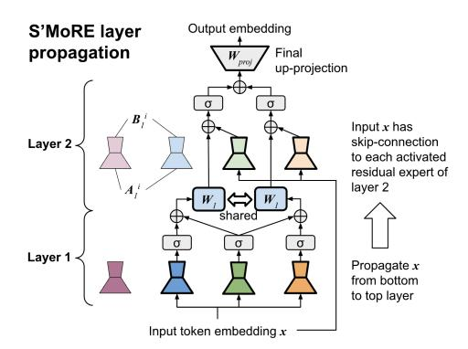

# 2 Background and Related Work

**Parameter efficient fine-tuning (PEFT).** Given a pre-trained model, PEFT trains a light-weight adapter whose number of trainable parameters is just a small fraction of the pre-trained weights. LoRA [Hu et al., 2021] and its variants [Liu et al., 2024b, Kopiczko et al., 2024] achieve good empirical performance by learning only a low-rank matrix as the adapter, where rank controls the efficiency-accuracy tradeoff. Despite the high parameter efficiency, their model capacities are limited.

**Mixture-of-Experts (MoE).** Mixture-of-Experts designs have been shown to boost LLM's model capacity [Dai et al., 2024, Fedus et al., 2022b, Puigcerver et al., 2024] due to their flexibility in

conditionally activating different sets of parameters for different input tokens. Recent works have tailored MoE for PEFT. MixLoRA [Li et al., 2024a] constructs the adapter as a set of LoRA experts where each token activates its own top-k experts. Similarly, MoLE [Wu et al., 2024b] considers a flat layer of LoRA experts and implements a flexible branch selection scheme. To enhance the mixing flexibility, SMoRA [Zhao et al., 2025] decomposes LoRA into single-rank fine-grained experts, and MoSLoRA [Wu et al., 2024a] integrates a subspace fusing matrix in the low-rank space. MoV [Zadouri et al., 2024] and MoLORA [Zadouri et al., 2024] proposes MoE variants that mix (IA)³ vectors [Liu et al., 2022] or LoRA weights for adapting attention modules. HydraLoRA [Tian et al., 2024] splits LoRA's up-projection matrix into multiple heads, and then performs weighted sum of each head's output by the gating weights. In the existing PEFT-MoE models, the expert-selection gates often follow classic designs, such as the noisy top-k [Shazeer et al., 2017] or the switch-transformer [Fedus et al., 2022b] gates. With more experts, it is more challenging to ensure all experts are well utilized [Fedus et al., 2022a]. Such limitation to model scale-up can be addressed by experts' structural composition in S'MoRE, as we dramatically improve the structural flexibility (see definition in §3.5) without adding more experts. See Appendix A for other MoE variants.

#### 2.1 Preliminaries

We consider one transformer layer and omit the layer index. Let  $x \in \mathbb{R}^d$  be the d-dimensional token embedding input to the adapter. The adapter's output x' is added back to the output generated by the pre-trained weights. All adapters here can be applied to weights of both FFN and attention modules.

**LoRA formulation.** The adapter consists of a down-projection matrix  $A \in \mathbb{R}^{d \times r}$  and an upprojection matrix  $B \in \mathbb{R}^{r \times d}$ , with rank  $r \ll d$  to achieve parameter efficiency. LoRA maps the input token embedding x to adapter's output x' as follows:  $x' = B \cdot A \cdot x$ .

**MoE formulation.** Let s be the number of experts. The router maps each input token to different experts, where ROUTE  $(x)^i \in \mathbb{R}$  gives expert i's score for token x. If the router performs top-k sparse gating, then only top-k values of ROUTE  $(x)^i$  are kept and the rest are cast to 0. Suppose each expert i performs linear transformation via matrix  $W^i$ . The MoE layer performs:

$$\boldsymbol{x}' = \sum_{i=1}^s \mathtt{ROUTE}\left(\boldsymbol{x}\right)^i \cdot \boldsymbol{W}^i \cdot \boldsymbol{x}$$

### 3 🚖 S'MoRE

#### 3.1 Low-Rank MoE Variants

Mixture of low-rank experts (MoLRE). To improve parameter efficiency of Eq. 1, we can approximate its  $W^i$  by some low rank  $B^i \cdot A^i$  as defined in §2.1 (e.g., we can perform SVD on  $W^i$  and derive  $B^i \cdot A^i$  corresponding to the largest singular values). We term such a model family as mixture of low-rank experts (MoLRE) [Wu et al., 2024b, Dou et al., 2024, Li et al., 2024a]. MoLRE's operation is derived by updating Eq. 1 as follows:  $x' = \sum_{i=1}^s \text{ROUTE}(x)^i \cdot B^i \cdot A^i \cdot x$ 

Mixture of multi-order residues (MoMOR). We can generalize MoLRE's low-rank approximation into this form  $W^i \approx \sum_{\ell=0}^{L-1} B^i_\ell \cdot A^i_\ell$ , where each  $B^i_\ell \cdot A^i_\ell$  has a low rank (so MoLRE corresponds to L=0). We call  $B^i_\ell \cdot A^i_\ell$  as the  $(\ell+1)^{\text{th}}$ -order residual term, and denote its rank as  $r_\ell$ . The sum  $\sum_{\ell=0}^{L-1} B^i_\ell \cdot A^i_\ell$  can have a rank up to  $\sum_{\ell=0}^{L-1} r_\ell$ , which is higher than the individual residuals.

We thus introduce mixture of multi-order residues (MoMOR), an extension to MoLRE. Let  $\mathcal{R}_{\ell} = \{B_{\ell}^1 \cdot A_{\ell}^1, B_{\ell}^2 \cdot A_{\ell}^2, \ldots\}$  be the set of order- $(\ell + 1)$  residues, MoMOR model performs the following:

$$\boldsymbol{x}' = \sum_{\ell=0}^{L-1} \sum_{i=1}^{s_{\ell}} \mathtt{ROUTE}_{\ell} \left( \boldsymbol{x} \right)^{i} \cdot \boldsymbol{B}_{\ell}^{i} \cdot \boldsymbol{A}_{\ell}^{i} \cdot \boldsymbol{x} \tag{2}$$

where the model dynamically selects and combines different orders of residuals via routing. MoMOR can adaptively distribute computation across different levels of approximation, improving efficiency and expressivity. Notably, when we set L=2 and ROUTE $_0(x)^i$  as a dense gate, the order-1 experts are activated for all tokens. MoMOR becomes a *shared-expert* MoE. This is a design adopted by DeepSeek-v3 [DeepSeek-AI, 2024] and many others [Rajbhandari et al., 2022, Li et al., 2024a].

(a) Propagation of residuals across multiple S'MORE layers (see Eq. 3). Here we consider 2 layers. Layer 1 has 3 activated residuals, where the dark green residual is selected by both the light green and the light orange parents in layer 2.

(b) Recursive routing of S'MoRE ( $\S 3.3$ ). The router first selects the layer 2 residuals for token x. Then it selects the layer 1 children conditioned on the activated layer 2 parent. We use a lightweight MLP to generate the query vector from the token embedding and the parent's key embedding.

Figure 1: Illustration of the layer propagation and routing process of S'MoRE.

#### 3.2 Structural Mixture

In the following, "layer" refers to a S'MoRE layer with a collection of residual experts, rather than a transformer layer. Based on MoMOR, we arrange all the residues  $\mathcal{R}_0, \ldots, \mathcal{R}_{L-1}$  into a L-layer structure. For each token x, we activate a sub-structure that interconnects correlated residues in adjacent layers. The token propagates along the sub-structure layer by layer. Each layer implements a lightweight function to aggregate previous-layer residues. Extending the standard MoE to multiple layers improves model capacity by drastically increasing the model's *structural flexibility* (§3.5).

**Parameters.** Let  $x \in \mathbb{R}^d$  be the d-dimensional token embedding. Layer  $\ell+1$  (for  $0 \le \ell \le L-1$ ) consists of  $s_\ell$  residual experts. Each expert i (with  $1 \le i \le s_\ell$ ) consists of a down-projection matrix  $A^i_\ell \in \mathbb{R}^{r_\ell \times d}$  and an up-projection matrix  $B^i_\ell \in \mathbb{R}^{d_{\ell+1} \times r_\ell}$ , where  $r_\ell$  is the experts' rank and  $d_{\ell+1}$  is the output dimension of layer  $\ell+1$ . Layer  $\ell+1$  also has a learnable  $W_\ell \in \mathbb{R}^{d_{\ell+1} \times d_\ell}$  that projects the layer- $\ell$  output to the  $d_{\ell+1}$ -dimensional subspace. Thus,  $\mathcal{R}_\ell$  consists of all  $A^i_\ell$  and  $B^i_\ell$  for  $1 \le i \le s_\ell$ .

**Propagation.** Token x propagates in the L-layer structure in two phases. In the <u>routing phase</u>, the router activates the best-matching experts top-down (from layer L to 1). At layer L, the router selects experts from  $\mathcal{R}_{L-1}$  using standard gates (e.g., Fedus et al. [2022b]). At an intermediate layer  $\ell < L$ , the router computes the score to activate an expert in  $\mathcal{R}_{\ell-1}$ , <u>conditioned</u> on the already activated ancestors in layers  $\ell' > \ell$ . This ensures the selected children are connected to their activated parents. Different from the traditional routers, the S'MoRE router customizes a depth-L "residual tree" for each token. See §3.3 for router architecture and §3.5 for structural flexibility of the tree-based routing.

In the <u>aggregation</u> phase, the token propagates along the activated residual tree <u>bottom-up</u> (from layer 1 to L). Layer  $\ell+1$  aggregates the information from the activated children experts in  $\mathcal{R}_{\ell}$ , and generates output embedding for the parent expert in  $\mathcal{R}_{\ell+1}$ . For each parent expert i, define  $\mathcal{N}_{\ell}^{i}$  as the set containing the indices of i's children experts1. Layer  $\ell+1$  operates as follows:

$$\boldsymbol{x}_{\ell+1}^{i} = \sum_{n \in \mathcal{N}_{\ell}^{i}} \alpha_{\ell}^{i,n} \cdot \sigma \left( \boldsymbol{B}_{\ell}^{n} \cdot \boldsymbol{A}_{\ell}^{n} \cdot \boldsymbol{x} + \boldsymbol{W}_{\ell} \cdot \boldsymbol{x}_{\ell}^{n} \right)$$
(3)

where  $\sigma\left(\cdot\right)$  is a non-linear function which can be just an activation (e.g., ReLU [Agarap, 2018]). The scalar  $\alpha_{\ell}^{i,n}$  is the router-generated score, elaborated in §3.3. Inputs to Eq. 3 consist of two parts: 1) Raw token embedding  $\boldsymbol{x}$ , which acts as skip connection to residuals  $\boldsymbol{B}_{\ell}^{n} \cdot \boldsymbol{A}_{\ell}^{n}$  of various orders; and 2)  $\boldsymbol{x}_{\ell}^{n}$  output from the previous layer, which enables deep interaction among multi-order residuals given non-linear  $\sigma\left(\cdot\right)$  (compared to the shallow aggregation in Eq. 2). For  $\ell=0$ , input  $\boldsymbol{x}_{0}^{n}$  does not exist. To simplify notation, we define  $d_{0}:=0$ , making  $\boldsymbol{x}_{0}^{i}\in\mathbb{R}^{0}$  and  $\boldsymbol{W}_{0}\in\mathbb{R}^{d_{1}\times0}$  as an empty vector /

&lt;sup>1We abuse notation here for ease of description. The nuance is that the same expert can be activated multiple times by different parents / ancestors. So i should refer to the index of a node in the activated tree, rather than the index of just an expert. Similarly, superscript n of  $\boldsymbol{x}_{\ell}^{n}$  should be updated to  $i \to n$  as a unique identifier (otherwise it creates ambiguity when expert n is a child of multiple parents). See Eq. 32 in Appendix §3.4.

matrix. Then Eq. 3 applies to all layers  $0 \le \ell \le L - 1$ . The last layer L has a single output node (i.e.,  $s_L = 1$ ) generated by aggregating information from the entire residual tree. Define  $x_L := x_L^0$ .

**Dimensionality**  $d_{\ell}$ . We should set the output  $d_{\ell}$  to 1) avoid information loss in the aggregation process, and 2) keep the overall L-layer propagation efficient. A naïve choice following LoRA is  $d_{\ell+1} = d \gg r_{\ell}$  (e.g., d = 4096,  $r_{\ell} = 16$ ), which makes multiplication with  $W_{\ell}$  prohibitively expensive. To reduce cost, we should find the smallest  $d_{\ell+1}$  that preserves the same amount of information as the vanilla setting  $d_{\ell+1} = d$ . The problem is equivalent to finding the maximum dimension of the subspace that  $x_{\ell+1}^i$  (Eq. 3) can span for any  $\mathcal{N}_{\ell}^i$ ,  $B_{\ell}^n$ ,  $A_{\ell}^n$  and activated i. To simplify discussion, ignore activation  $\sigma(\cdot)$ : 1) For any x, output  $B_{\ell}^n \cdot A_{\ell}^n \cdot x$  maximally spans a d'-dimensional subspace of the original  $\mathbb{R}^d$ , where  $d' = \min\{d_{\ell+1}, r_{\ell}\}$ ; 2) There are  $s_{\ell}$  possible n, leading to  $s_{\ell}$  different d'-dimensional subspaces. When mutually orthogonal, they maximally span  $\min\{d_{\ell+1}, s_{\ell} \cdot r_{\ell}\}$  dimensions; 3)  $W_{\ell} \cdot x_{\ell}^n$  can span another subspace of dimension  $\min\{d_{\ell+1}, d_{\ell}\}$  defined by  $W_{\ell}$  (independent of n). So  $B_{\ell}^n \cdot A_{\ell}^n \cdot x + W_{\ell} \cdot x_{\ell}^n$  maximally spans  $d'' = \min\{d_{\ell+1}, d_{\ell} + s_{\ell} \cdot r_{\ell}\}$  dimensions; 4) Since a subspace is closed under linear combinations,  $\sum_{n \in \mathcal{N}_{\ell}^i} \alpha_{\ell}^{i,n} (B_{\ell}^n \cdot A_{\ell}^n \cdot x + W_{\ell} \cdot x_{\ell}^n)$  remains in the d''-dimensional subspace, regardless of  $\mathcal{N}_{\ell}^i$ . For the vanilla case  $d_{\ell+1} = d$  with large enough d, we have  $d'' = \min\{d_{\ell+1}, d_{\ell} + s_{\ell} \cdot r_{\ell}\} = d_{\ell} + s_{\ell} \cdot r_{\ell}$ . Thus, the minimum  $d_{\ell+1}$  is d'':

$$d_{\ell+1} = d_{\ell} + s_{\ell} \cdot r_{\ell}$$
  $\Rightarrow$   $d_{\ell} = \sum_{i=0}^{\ell-1} s_i \cdot r_i$ , where  $d_0 := 0$  and  $\ell \in [0, L-1]$  (4)

Final projection. After the last layer L, we map the  $d_L$ -dimensional output  $x_L$  to the final output dimension  $d_{\text{out}}$  (i.e.,  $d_{\text{out}}$  is the dimensionality of x' in Eq. 1 and Eq. 2). We thus have a projection matrix  $W_{\text{proj}} \in \mathbb{R}^{d_L \times d}$  that simply performs  $x' = W_{\text{proj}} \cdot x_L$ .

#### 3.3 Hierarchical Routing

Fig. 1b illustrates the top-down routing. We start from layer L. The router computes  $p(i_{L-1} \mid \boldsymbol{x})$ , the probability to activate an expert  $i_{L-1}$  in  $\mathcal{R}_{L-1}$  given token  $\boldsymbol{x}$ . The top- $f_{L-1}$  experts with the highest  $p(i_{L-1} \mid \boldsymbol{x})$  are selected. Next, for each selected expert  $i_{L-1}$ , we compute  $p(i_{L-2} \mid i_{L-1}, \boldsymbol{x})$ , which is the conditional probability to activate  $i_{L-2}$  in  $\mathcal{R}_{L-2}$  given its activated parent  $i_{L-1}$  and  $\boldsymbol{x}$ . Each activated  $i_{L-1}$  further activates  $f_{L-2}$  children with the highest  $p(i_{L-2} \mid i_{L-1}, \boldsymbol{x})$ . Generally, the router computes the conditional probability  $p(i_{\ell-1} \mid i_{L-1}, \ldots i_{\ell}, \boldsymbol{x})$ , with  $i_{L-1}, \ldots i_{\ell}$  being all the activated ancestors of the candidate  $i_{\ell-1}$ . All activated experts form a depth-L tree. Each depth- $\ell$  node fans out to  $f_{L-\ell-1}$  children experts (the activated layer-L experts are the depth-1 tree nodes).

Let  $f_\ell$  be the fanout factor of each parent expert,  $F_\ell$  be the total number of experts selected from  $\mathcal{R}_\ell$  (i.e.,  $F_\ell$  is the total number of depth- $(L-\ell)$  experts in the activated tree). The same expert can be selected multiple times by ancestors on different paths – It is possible that  $F_\ell > s_\ell$ . We derive  $F_\ell$  as:

$$F_{\ell} = \prod_{i=\ell}^{L-1} f_i \tag{5}$$

**Router architecture.** For each expert i in  $\mathcal{R}_\ell$ , we instantiate a learnable m-dimensional key vector  $\mathbf{k}^i_\ell \in \mathbb{R}^m$ . For the whole candidate pool  $\mathcal{R}_\ell$ , we instantiate a neural network,  $\text{MLP}_\ell$  (·), to generate an m-dimensional query vector based on  $\mathbf{x}$  and the ancestors. The routing probability over  $\mathcal{R}_\ell$  is computed by the normalized key-query dot product. For a path of activated ancestors, "expert i' in  $\mathcal{R}_{\ell+1}$ , …, expert  $i'^{\cdots}$  in  $\mathcal{R}_{L-1}$ ", the router generates the query vector  $\mathbf{q}$  and the router score  $\alpha^i_\ell$  as follows, where concat (·) performs vector concatenation and softmax (·) normalizes over  $\mathcal{R}_\ell$ .

$$q = \mathtt{MLP}_{\ell}\left(\mathtt{concat}\left(\boldsymbol{x}, \boldsymbol{k}_{\ell+1}^{i'}, \cdots, \boldsymbol{k}_{L-1}^{i'\cdots \prime}\right)\right) \tag{6}$$

$$\alpha_{\ell}^{i} = \operatorname{softmax}\left(\langle \boldsymbol{k}_{\ell}^{i}, \boldsymbol{q} \rangle\right)$$
 (7)

**Computation optimization.** Eq. 6 can be computationally expensive when all  $\text{MLP}_{\ell}$  (·) need to process the high-dimensional  $\boldsymbol{x}$ . To reduce computation, we first project the d-dimensional  $\boldsymbol{x}$  to a  $d_{\text{down}}$ -dimensional  $\boldsymbol{x}_{\text{down}}$  (e.g., d=4096,  $d_{\text{down}}=24$ ), and then replace  $\boldsymbol{x}$  with  $\boldsymbol{x}_{\text{down}}$  in Eq. 6. The dimension of the input to  $\text{MLP}_{\ell}$  (·) then becomes  $d_{\text{down}}+(L-\ell-1)\cdot m$ .

Gating types. Our router and layer designs are compatible with various types of gates. In our experiments (§4), we have evaluated: 1. *Dense* gate [Tian et al., 2024], which activates all children

experts  $(f_{\ell} = s_{\ell})$ ; 2. Sparse noisy top-k gate [Shazeer et al., 2017]; 3. Sparse switch gate [Fedus et al., 2022b]. The two sparse gates only activate a subset of the children experts ( $f_{\ell} < s_{\ell}$ ) by the top routing scores  $\alpha$ . To avoid expert under-utilization and ensure all experts see sufficient amount of tokens during training, we implement an auxiliary load-balance loss according to the original papers [Shazeer et al., 2017, Fedus et al., 2022b]. See Appendix B.1 for more algorithmic details.

### 3.4 Parameter & Computation Efficiency

Although S'MoRE introduces structural learning modules, our design ensures similar efficiency to the vanilla LoRA (w.r.t. both computation and trainable parameters) under the same total rank.

**Parameter efficiency.** Each S'MoRE layer  $\ell+1$  consists of the following trainable parameters:  $B_{\ell}^{n}$ ,  $A_{\ell}^{n}$  and  $W_{\ell}$ . The total trainable parameters equals:

$$P_{\ell+1} = s_{\ell} \cdot (d \cdot r_{\ell} + r_{\ell} \cdot d_{\ell+1}) + d_{\ell} \cdot d_{\ell+1} = s_{\ell} \cdot d \cdot r_{\ell} + d_{\ell+1} \cdot (s_{\ell} \cdot r_{\ell} + d_{\ell}) \stackrel{\text{(a)}}{=} s_{\ell} \cdot d \cdot r_{\ell} + d_{\ell+1}^2$$
(8)

where the last step "(a)" is according to Eq. 4. The final projection matrix (end of §3.2) requires  $P_{\text{proj}} = d \cdot d_L$  parameters. So the total number of parameters for all S'MoRE layers equals:

$$P_{\text{proj}} + \sum_{\ell=1}^{L} P_{\ell} = d \cdot d_{L} + d \cdot \left(\sum_{\ell=0}^{L-1} s_{\ell} \cdot r_{\ell}\right) + \Delta \stackrel{\text{(b)}}{=} 2 \cdot d \cdot d_{L} + \Delta \stackrel{\text{(c)}}{\approx} 2 \cdot d \cdot d_{L}$$
(9)

where  $\Delta = \sum_{\ell=1}^L d_\ell^2$ . Step "(b)" is by Eq. 4;  $\Delta$  is the overhead due to multi-layer propagation. Since  $d_1 < \ldots < d_L \ll d$  (e.g.,  $d_L = 64$ , d = 4096), we have  $\Delta \ll 2 \cdot d \cdot d_L$ . This justifies step "(c)". In Table 1, we empirically validated the small overhead  $\Delta$ . With  $f_{\ell} = 2$ ,  $s_{\ell} = 4$ , and  $r_{\ell} = 8$  or 16 for all layers  $\ell$  (consistent with the §4 experiments),  $\Delta$  is no more than 2% for 2-layer S'MoRE.

The router's trainable parameters come from: 1) down- Table 1: Overhead  $\Delta$  compared with projection for  $x_{\text{down}}$ , which requires  $d \cdot d_{\text{down}}$  parameters, the main computation cost  $2 \cdot d \cdot d_L$ 2) per-layer "query" MLP. By §3.3, the MLP's input dimension is  $d_{\text{down}} + (L - \ell) \cdot m$ , where  $m \ll d$  is the dimension of the "key" vectors. In practice, we set the MLP hidden dimension as m. Since m and  $d_{\text{down}}$  are both very small, the router's parameter count is practically negligible.

| $r_{\ell}$ | L | $d_L$ | $2 \cdot d \cdot d_L$ | Δ      | Overhead ratio |
|------------|---|-------|-----------------------|--------|----------------|
|            | 2 | 64    | 0.5M                  | 0.005M | 1.0%           |
| 8          | 3 | 96    | 0.8M                  | 0.014M | 1.8%           |
|            | 4 | 128   | 1.0M                  | 0.031M | 2.9%           |
|            | 2 | 128   | 1.0M                  | 0.020M | 2.0%           |
| 16         | 3 | 192   | 1.6M                  | 0.057M | 3.6%           |
|            | 4 | 256   | 2.1M                  | 0.123M | 5.9%           |

In total, S'MoRE approximately has  $2 \cdot d \cdot d_L$  parameters – the same as the parameter count for a vanilla LoRA with rank  $d_L$  (the 2 factor is due to LoRA's down- and up-project matrices A and B).

Computation cost. Following similar steps, we can derive the overhead in computation. The computation cost of the baseline LoRA is  $2 \cdot d \cdot d_L$ . The overhead introduced by S'MoRE is  $\Delta' \leq \sum_{\ell=0}^{L-1} F_{\ell} \cdot d_{\ell+1} \cdot (d_{\ell} + r_{\ell})$ , which is again *neglible* in practice. See Appendix C.1 for details.

