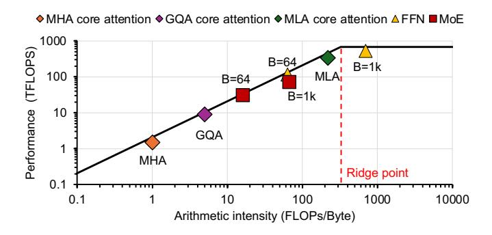
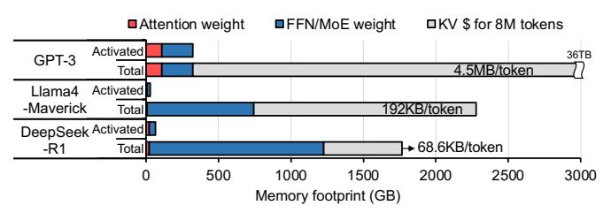
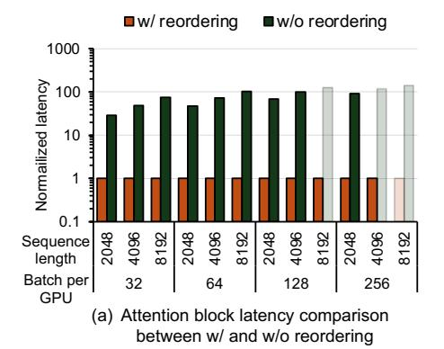
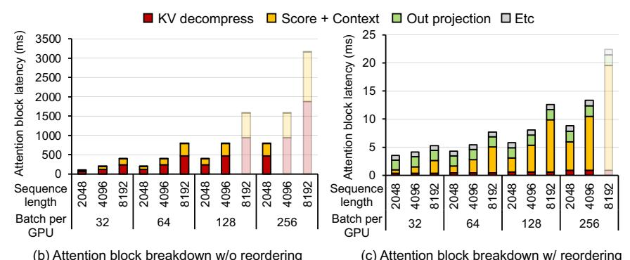
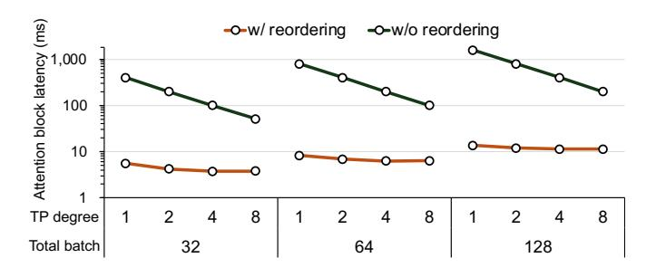

# III. EMERGING LLM OPTIMIZATIONS: IMPACT ON PERFORMANCE AND MEMORY CAPACITY DEMAND

For efficient LLM serving, a myriad of optimizations have been proposed, spanning both algorithmic strategies and hardware-aware techniques, in response to ever-growing demand for LLM services. Contrary to conventional LLMs, DeepSeek-R1 [10] leverages **Multi-head Latent Attention** (**MLA**) and **Mixture of Experts** (**MoE**). Figure 2 shows that DeepSeek-R1 delivers up to 41× and 2× higher perdevice throughput, and 30% and 34% lower time per output token (TPOT) than GPT-3 and Llama4-Maverick, respectively, even with 3.8× and 1.7× larger model capacity (number of parameters). We provide a high-level explanation of two key **R**easons why DeepSeek-R1 offers higher throughput and lower latency compared to conventional LLMs.

(R1) Reduced core-attention layer latency in MLA: Figure 3 shows that the core-attention layer of GPT-3, based on MHA, presents an ArI of approximately 1 even with batching, making it the primary bottleneck preventing throughput and latency improvements during the decode stages. Unlike FC layers, which amortize the cost of accessing their weights by reusing them across multiple batched requests, the coreattention layer operates on KV\$ and attention score values, which are unique to each request. Thus, these values cannot be shared across batched requests, limiting ArI to 1 regardless of B in MHA. Because of this extremely low ArI, performance is bounded by memory bandwidth, leading to severe underutilization of compute resources. GQA reduces the number of memory accesses by sharing KV\$ across multiple queries, thereby slightly improving the ArI; in Llama4-Maverick, each KV\$ is shared among five queries. Still, the operations remain largely bounded by memory bandwidth.

By contrast, the core-attention layer of DeepSeek-R1, based on MLA, significantly reduces the number of memory accesses

|                           |        |        |        | V100 SXM2 [35] A100 SXM4 [36] H200 SXM5 [39] B200 SXM6 [41] TPU V5P [57] TPU V7 [56] MI325X [3] |      |        |        |
|---------------------------|--------|--------|--------|-------------------------------------------------------------------------------------------------|------|--------|--------|
| BF16 throughput (TFLOPS)  | 125    | 312    | 989.5  | 2250                                                                                            | 459  | 2307   | 1307.4 |
| Memory bandwidth (GB/s)   | 900    | 2039   | 4800   | 8000                                                                                            | 2765 | 7400   | 6000   |
| HBM capacity per GPU (GB) | 32     | 80     | 141    | 192                                                                                             | 95   | 192    | 256    |
| Ridge point (BF16)        | 138.89 | 153.02 | 206.15 | 281.25                                                                                          | 166  | 320.42 | 217.9  |

Fig. 3. Roofline plot of layers in decoder block at sequence length L = 4096, obtained from real-machine measurements on an NVIDIA H100 GPU.

and brings the ArI close to the ridge point of modern accelerators (RPacc) through layer reordering (detailed in [§IV\)](#page-3-1) as shown in Figure [3.](#page-3-0) This not only reduces the core-attention layer latency but also increases compute utilization during the decode stages.

(R2) Larger *B* and less computation for MoE: Larger batch size (B) improves the ArI of memory-bound FC layers, enhancing compute utilization of accelerators and maximizing throughput with negligible latency increase. However, B is limited by the KV\$ size, which grows with sequence length. In GPT-3, the KV\$ size of a request reaches 9 GB for a sequence length of 2048 (detailed in [§VII\)](#page-9-1). The large KV\$ size limits B, leaving FC layers memory-bound, reducing throughput and underutilizing compute resources [\[23\]](#page-13-9), [\[62\]](#page-14-18).

In contrast, DeepSeek-R1 requires more memory to store all model parameters, but it uses 67× smaller KV\$ per token compared to GPT-3, as shown in Figure [4.](#page-3-2) This reduction enables larger B and higher throughput under the same memory budget. Also, while GPT-3 performs computations with all 175B parameters for every token, DeepSeek-R1, leveraging MoE, activates only 8 out of 256 experts per token. As a result, it utilizes just 37B out of 671B total parameters. This sparsity significantly reduces the per-token computation cost, making DeepSeek-R1 more suitable for large-batch inference.

Llama4-Maverick uses 2.84× larger KV\$ per token than Deepseek-R1. Given that the hidden dimension of Llama4- Maverick is 5120, whereas that of DeepSeek-R1 is 7168, we observe that MLA effectively reduces the KV\$ size compared to GQA—by approximately 4× for the same hidden dimension. Consequently, for a sequence length of 8192, Llama4- Maverick cannot support a batch size of 128 per GPU, whereas DeepSeek-R1 can, despite its larger model size (see Fig. [2\)](#page-2-0).

Fig. 4. Comparison of GPT-3, Llama4-Maverick, and DeepSeek-R1 for 8M tokens with BF16 precision: the amount of parameters accessed and computed per token (Activated) and the total memory capacity required for storing attention weights, FFN/MoE weights, and KV\$ (Total).

TABLE II SYMBOLS USED THROUGHOUT THIS PAPER, THEIR DESCRIPTIONS, AND THE EXEMPLAR PARAMETERS USED IN DEEPSEEK-R1 [\[10\]](#page-12-0)

| Term  | Description                                    | DeepSeek-R1 |
|-------|------------------------------------------------|-------------|
| demb  | Embedding dimension                            | 7168        |
| nhd   | Number of heads                                | 128         |
| dhd   | Head dimension                                 | 128         |
| ddec  | Decompressed Q/K/V dimensions, nhd · dhd 16384 |             |
|       | dQco, dKVco Compressed Q, KV dimensions        | 1536, 512   |
| dRoPE | Rotary Positional Embedding dimension          | 64          |
| dFFN  | FFN intermediate dimension                     | 18432       |
| dMoE  | MoE intermediate dimension                     | 2048        |
| ne    | Number of routed experts                       | 256         |
| nk    | Number of routed experts per token             | 8           |

Lastly, further increasing B drives the ArI beyond the RPacc and makes the FC layers compute-bound, hence increasing latency without a corresponding throughput improvement. Thus, any changes to an algorithm and/or its operating parameters, such as B, must consider the RPacc of the target serving system. The latest B200 GPU, for instance, provides approximately 18× higher arithmetic throughput than a V100 GPU, representing the most significant improvement among the accelerators listed in Table [I.](#page-3-3) Nevertheless, since both arithmetic throughput and memory bandwidth have scaled with the technology, the B200's RPacc increases by only a modest factor of 2 compared to the V100's; contemporary accelerators exhibit RPaccs within a narrow range of 200–400 Op/B.

## IV. INSIGHTS ON MULTI-HEAD LATENT ATTENTION

We analyze the computational characteristics of an MLA block, which comprises multiple FC layers and a core-attention layer, using the symbolic definitions in Table [II.](#page-3-4)

#### *A. Introducing a latent space to attention*

MLA employs a low-rank joint compression for the attention block, primarily reducing KV\$ capacity requirements while also lowering projection weight size and the associated

Fig. 5. Computation flow of multi-head latent attention (MLA) with/without layer reordering. ⓐ to ⓑ refer to the layers of MLA (e.g., ⓐ: QKV compression, ⓑ: Q RoPE, ⓒ: Q decompression, ⓓ: K decompression, ⓔ: V decompression, ⓓ: Score, ②: K RoPE, ⓑ: Context).

FC layer computations. It first compresses a hidden state matrix, mapping it to a lower-dimensional latent space (a) in Figure 5) to form a compressed Q ( $\mathbf{C}_{\mathrm{Q}}$ ) and a compressed KV ( $\mathbf{C}_{\mathrm{KV}}$ ) through projection using  $\mathbf{W}_{\mathrm{CQ}}$  and  $\mathbf{W}_{\mathrm{CKV}}$  (Eq. 4). The resulting  $\mathbf{C}_{\mathrm{Q}}$  and  $\mathbf{C}_{\mathrm{KV}}$  are then decompressed (©, d), and (e) through projections using the corresponding decompression weights  $\mathbf{W}_{\mathrm{DX}_i}$ , where  $\mathbf{X} \in \{\mathbf{Q}, \mathbf{K}, \mathbf{V}\}$ , to reconstruct the higher-dimensional full  $\mathbf{Q}_i$ ,  $\mathbf{K}_i$ , and  $\mathbf{V}_i$ . These are then used to perform the same core-attention layer as in a standard MHA block (Eq. 5 and Eq. 6).

$$\underbrace{\mathbf{C}_{\mathbf{Q}}}_{\mathbb{R}^{\ell \times d_{\mathbf{Qco}}}} = \mathbf{H}_{\ell} \cdot \underbrace{\mathbf{W}_{\mathbf{CQ}}}_{\mathbb{R}^{d_{\mathbf{emb}} \times d_{\mathbf{Qco}}}}, \underbrace{\mathbf{C}_{\mathbf{KV}}}_{\mathbb{R}^{L \times d_{\mathbf{KVco}}}} = \mathbf{H}_{L} \cdot \underbrace{\mathbf{W}_{\mathbf{CKV}}}_{\mathbb{R}^{d_{\mathbf{emb}} \times d_{\mathbf{KVco}}}}$$
(4

$$\mathbf{S}_{i} = \mathbf{Q}_{i} \cdot (\mathbf{K}_{i})^{\mathrm{T}} = (\mathbf{C}_{\mathrm{Q}} \cdot \underbrace{\mathbf{W}_{\mathrm{DQ}_{i}}}_{\mathbb{R}^{d_{\mathrm{Qco}} \times \frac{d_{\mathrm{dec}}}{n_{\mathrm{hd}}}}} \cdot (\mathbf{C}_{\mathrm{KV}} \cdot \underbrace{\mathbf{W}_{\mathrm{DK}_{i}}}_{\mathbb{R}^{d_{\mathrm{KVco}} \times \frac{d_{\mathrm{dec}}}{n_{\mathrm{hd}}}}})^{\mathrm{T}}$$
(5

$$\mathbf{O}_{i} = \operatorname{Softmax}(\frac{\mathbf{S}_{i}}{\sqrt{d_{\operatorname{dec}}/n_{\operatorname{hd}}}}) \cdot (\mathbf{C}_{\operatorname{KV}} \cdot \underbrace{\mathbf{W}_{\operatorname{DV}_{i}}}_{\mathbb{R}^{d_{\operatorname{KVco}} \times \frac{d_{\operatorname{dec}}}{n_{\operatorname{hd}}}}})$$

The attention block's parameter footprint shrinks substantially both in absolute size and as a fraction of total model parameters. Employing the low-rank joint compression reduces the weight used to generate **K** and **V** from  $d_{\rm emb} \times d_{\rm dec} = 7K \times 16K = 112M$  to  $d_{\rm emb} \times d_{\rm KVco} + d_{\rm KVco} \times d_{\rm dec} = 7k \times 0.5K + 0.5K \times 16K = 11.5M$  (see Table II for notations). With this reduced weight burden, replicating its FC layer parameters across devices is far more tractable, making DP for the attention block a compelling choice.

For conventional LLMs, a key limiting factor of the batch size is KV\$ size. MLA introduces a latent space on attention, drastically reducing the KV\$ ( $C_{\rm KV}$ ) storage (Figure 4). For conventional LLMs,  $d_{\rm dec}(=d_{\rm emb})$ -dimensioned K and V are cached per layer. In DeepSeek-R1, K and V share the same compressed cache with a dimension of  $d_{\rm KVco}+d_{\rm RoPE}$ , which is usually an order of magnitude smaller than both  $d_{\rm emb}$  and  $d_{\rm dec}$ . In GPT-3, KV\$ consumes 4.5MB (=  $d_{\rm dec} \times n_{\rm decoder} \times$  (K & V)×FP16 = 12288×96×2×2B) per token, whereas  $C_{\rm KV}$  in DeepSeek-R1 requires only 68.6KB (=  $(d_{\rm KVco}+d_{\rm RoPE}) \times n_{\rm decoder} \times$  BF16 = 576×61×2B) per token.

TABLE III COMPARISON OF MLA WITH AND WITHOUT THE REORDERING IN TERMS OF FLOPS, MEMORY ACCESS, AND ARI FOR PREFILL AND DECODE STAGES ASSUMING  $B,L\gg n_{\rm hd},d_{\rm hd}$ .

| Layer    | Phase        | Reordering | FLOPs                                 | Asymptotic Memory Access                              | ArI                                                  | ArI in DeepSeek-R1 |
|----------|--------------|------------|---------------------------------------|-------------------------------------------------------|------------------------------------------------------|--------------------|
| Prefill  | K decompress | without    | $B2Ld_{\rm KVco}n_{\rm hd}d_{\rm hd}$ | $2BLn_{\rm hd}d_{\rm hd}$                             | $\approx d_{\rm KVco}$                               | $\approx 512$      |
|          |              | with       | $B2Ld_{\rm KVco}n_{\rm hd}d_{\rm hd}$ | $2B(Ln_{\rm hd}d_{\rm hd} + Ln_{\rm hd}d_{\rm KVco})$ | $\approx (d_{\rm hd}^{-1} + d_{\rm KVco}^{-1})^{-1}$ | ≈ 100              |
| 1 ICIIII | Score        | without    | $B2n_{\mathrm{hd}}L^2d_{\mathrm{hd}}$ | $2Bn_{\rm hd}L^2$                                     | $\approx d_{\rm hd}$                                 | ≈ 128              |
|          |              | with       | $B2n_{\rm hd}L^2d_{\rm KVco}$         | $2Bn_{\rm hd}L^2$                                     | $\approx d_{\rm KVco}$                               | $\approx 512$      |
| Decode   | K decompress | without    | $B2d_{\rm KVco}Ln_{\rm hd}d_{\rm hd}$ | $2BLd_{\rm dec}$                                      | $\approx d_{\rm KVco}$                               | $\approx 512$      |
|          |              | with       | $B2d_{\rm KVco}n_{\rm hd}d_{\rm hd}$  | $2Bd_{\rm KVco}n_{\rm hd}$                            | $\approx d_{\rm hd}$                                 | ≈ 128              |
|          | Score        | without    | $B2n_{\rm hd}Ld_{\rm hd}$             | $2Bn_{\rm hd}d_{\rm hd}L$                             | $\approx 1$                                          | ≈ 1                |
|          | Score        | with       | $B2n_{\rm hd}Ld_{\rm KVco}$           | $2B(d_{\mathrm{KVco}}L + n_{\mathrm{hd}}L)$           | $\approx (n_{\rm hd}^{-1} + d_{\rm KVco}^{-1})^{-1}$ | ≈ 100              |

Smaller KV\$ size allows larger batch sizes for FC layers, which improve compute utilization. However, MLA shares the same core-attention layer structure as conventional MHA, suffering from extremely low ArI ( $\approx$  1). Also,  $C_{\rm KV}$  decompression needs to be computed on demand during runtime.

Nevertheless, MLA enables *layer reordering* (or simply *reordering*) [32] to improve data reuse by rearranging the layers in the attention block. One of MLA's key features is decoupled RoPE: Instead of applying RoPE directly to Q and K, RoPE is computed separately, the result of which is added element-wise in the score layer. By removing the nonlinearity between the QKV generation layer and the coreattention layer, Eq. 5 can be algebraically rewritten:

$$\mathbf{S}_{i} = \mathbf{Q}_{i} \cdot (\mathbf{C}_{KV} \cdot \mathbf{W}_{DK_{i}})^{T}$$

$$= \mathbf{Q}_{i} \cdot (\mathbf{W}_{DK_{i}}^{T} \cdot \mathbf{C}_{KV}^{T})$$

$$= (\mathbf{Q}_{i} \cdot \mathbf{W}_{DK_{i}}^{T}) \cdot \mathbf{C}_{KV}^{T}$$

$$\mathbf{S} = \begin{bmatrix} \mathbf{Q}_{1} \cdot \mathbf{W}_{DK_{1}}^{T} \\ \mathbf{Q}_{2} \cdot \mathbf{W}_{DK_{2}}^{T} \\ \vdots \\ \mathbf{Q}_{n_{hd}} \cdot \mathbf{W}_{DK_{n_{hd}}}^{T} \end{bmatrix} \cdot \mathbf{C}_{KV}^{T}$$
(7)

A similar reordering can also be applied to the context layer:

$$\begin{aligned} \mathbf{O}_{i} &= \operatorname{Softmax}(\frac{\mathbf{S}_{i}}{\sqrt{d_{\operatorname{dec}}/n_{\operatorname{hd}}}}) \cdot (\mathbf{C}_{\operatorname{KV}} \cdot \mathbf{W}_{\operatorname{DV}_{i}}) \\ &= (\operatorname{Softmax}(\frac{\mathbf{S}_{i}}{\sqrt{d_{\operatorname{dec}}/n_{\operatorname{hd}}}}) \cdot \mathbf{C}_{\operatorname{KV}}) \cdot \mathbf{W}_{\operatorname{DV}_{i}} \end{aligned} \tag{8}$$

#### B. Impact of reordering MLA

The *reordering*1 optimization improves hardware utilization and drastically reduces the latency of attention during the decode stage. However, it rather increases the latency during the prefill stage. This is because reordering in MLA significantly changes the computational characteristics, such as FLOPs, the number of memory accesses, and ArI.

Table III compares the FLOPs and memory requirements in K decompression and score layers across both prefill and decode stages when a single accelerator is used, with and without reordering. V decompression and context layers exhibit similar trends regardless of reordering because  $\mathbf{K}$  and  $\mathbf{W}_{\mathrm{DK}}$  share the same structure with V and  $\mathbf{W}_{\mathrm{DV}}$ , respectively. This analysis leads to a number of notable observations.

Without reordering, the core-attention layer in MLA preserves the same computational flow as MHA, except for the runtime compression and decompression layers, which generate Q, K, and V. The required amounts of computations (FLOPs) and memory accesses for the K decompression and score layers are proportional to B and L during the decode stage (Table III), whereas those of the other FC layers do not scale with L. As a result, KV decompression and coreattention layers dominate the execution time of an attention block as L increases (Figure 6(b)). At B = 128 and L = 4096, KV decompression and core-attention layers account for 59% and 40% of the attention block latency, respectively.

*Observation-1:* In the decode stages of MLA without reordering, KV decompression and core-attention layers dominate the runtime of MLA's attention blocks.

After applying layer reordering, MLA multiplies  $\mathbf{W}_{\mathrm{DK}}$  with  $\mathbf{Q}$ . Because the size of  $\mathbf{Q}$  is independent of L in the decode stage, layer reordering eliminates the need to decompress the entire  $\mathbf{C}_{\mathrm{KV}}$ , reducing the cost of  $\mathbf{K}$  decompression by a factor of L (Table III). The portion of  $\mathbf{K}$  decompression—previously the dominant component—has been significantly reduced due to reordering (see Figure 6(c)). By contrast, this benefit disappears in the prefill stage as the size of  $\mathbf{Q}$  is proportional to  $L = L_{\mathrm{in}}$ , leaving the computational cost of  $\mathbf{K}$  decompression unchanged.

Layer reordering increases computations required for the score layer, which is a part of the core-attention layer, by  $d_{\rm KV^{co}}/d_{\rm hd}$  (4 for DeepSeek-R1) times in both prefill and decode stages. The original score layer is replaced by a multiplication between  $\mathbf{Q}_i \cdot \mathbf{W}_{\rm DK_i}^{\rm T}$  and  $\mathbf{C}_{\rm KV}^{\rm T}$  (Eq. 7), where one of the matrix dimensions becomes  $d_{\rm KVco}$  instead of  $d_{\rm hd}$ .

&lt;sup>1Although the DeepSeek papers [11], [32] refer to this technique as "absorption," we use this term to distinguish it from weight fusion, which merges multiple weight matrix multiplications into a single computational step.

Fig. 6. (a) Normalized latency of the attention block in the decode stage without reordering compared to a reordered attention block. (b) and (c) show the execution time ratio of each layer in the attention block in the decode stage with and without reordering, across varying sequence length and batch size. All experiments assumed a 32 B200 GPU system. See §VI for our experimental setup in detail.

**Observation-2:** While layer reordering maintains or reduces the FLOPs of KV decompression, it increases the FLOPs of core-attention layers in both prefill and decode stages.

With layer reordering in the decode stage, the core-attention layer reads  $C_{\rm KV}$  instead of decompressed KV\$, reducing memory access by  $d_{\rm dec}/d_{\rm KVco}$ . Because  $C_{\rm KV}$  can be shared among the heads, the ArI of both score and context layers reaches approximately  $n_{\rm hd}d_{\rm KVco}/(n_{\rm hd}+d_{\rm KVco})$  ( $\approx 100$  for DeepSeek-R1) in the decode stages.

FlashMLA [27], a GPU-optimized implementation, further doubles this Op/B by reusing  $C_{\rm KV}$  loaded during the score layer in the subsequent context layer. The resulting doubled ArI (e.g.,  $\approx$  200 Op/B in DeepSeek-R1) closely approaches the ridge point RP $_{\rm acc}$  of modern accelerators, exhibiting a balance between computation and memory bandwidth for modern accelerators.

Despite using a latent space, explicitly generating decompressed  $\mathbf{K}$  and  $\mathbf{V}$  requires a significant amount of memory for activation, limiting B as shown in Figure 6. For DeepSeek-R1, decompressing the  $\mathbf{K}$  tensor with a per-accelerator batch size of 256 and L=4096 inflates the activation footprint to  $\approx 50 \mathrm{GB}$ . As layer reordering shrinks the size of this on-the-fly activation, the maximum feasible B increases. The increased B delivers proportionally higher throughput on FC layers.

**Observation-3:** Layer reordering improves hardware utilization by increasing the ArI of the core-attention layer to approach  $\mathrm{RP}_{\mathrm{acc}}$  of modern accelerators in the decode stage and by enabling sufficient batching for FC layers.

As the ArI of the core-attention layer, which dominates the runtime of attention blocks, approaches  $RP_{\rm acc}$ , the time spent on computations remains approximately equal to the time spent on accessing  $C_{\rm KV}$ . Thus, the latency of the core-attention layer is reduced approximately by  $2d_{\rm dec}/d_{\rm KVco}$  (=64 for DeepSeek-R1) after layer reordering.

In contrast, reordering increases the latency of attention blocks during the prefill stage. Layer reordering expands the

Fig. 7. Computation flow of an MLA attention block with  $deg_{\mathrm{TP}}=2$  and  $n_{\mathrm{hd}}=4$  on our experimental setup.

activation's dimension per head from  $d_{\rm hd}$  to  $d_{\rm KVco}$ . For the KV decompression layer, while the FLOPs remains unchanged, the number of memory accesses increases, leading to longer execution times. Also, the FLOPs increases for the coreattention layer (Obs.2).

Putting it all together, layer reordering significantly reduces the latency of attention blocks in the decode stage by up to  $103.12\times$  (see Figure 6). By contract, the attention block latency in the prefill stage slows down by up to  $2.21\times$  with layer reordering. Hereafter, the prefill stage uses MLA without reordering and the decode stage uses MLA with reordering.

**Observation-4:** Layer reordering substantially reduces attention block latency by reducing memory access and drastically mitigating the impact of KV decompression overhead.

#### C. Parallelism on MLA

TP offers little latency benefit once layer reordering is applied to the attention block. Although reordering drastically lowers the core-attention layer latency, the latency still scales

Fig. 8. Latency of the attention block with and without reordering as batch sizes and degTP vary when L= 4096.

with B and L in the decode stage and becomes dominant at large B and L values (Figure [6\(](#page-6-0)c)). When heads are independent, as in MHA, head-wise TP can distribute the KV\$ across multiple accelerators, reducing latency. Also, the ArI is preserved within a head as it is not affected by TP.

In the reordered MLA, however, all heads share the same CKV; thus, all accelerators need to store and read the whole CKV, nullifying the performance and capacity gains from scaling out to degTP accelerators. Also, TP reduces the number of heads per accelerator, thereby reducing the ArI by degTP. As depicted in Figure [7,](#page-6-1) TP reduces the number of heads batched on each accelerator, thereby reducing the ArI by degTP.

Figure [8](#page-7-0) compares the latency impact of TP on reordered and non-reordered MLA attention blocks. Although the FC layers in an attention block benefit from TP, the core-attention layer dominates the runtime and limits improvements in the non-reordered case. Thus, using DP alone is preferable to combining TP and DP in the attention block.

*Observation-5:* In the decode stage with reordering, tensor parallelism fails to provide a meaningful latency reduction.

