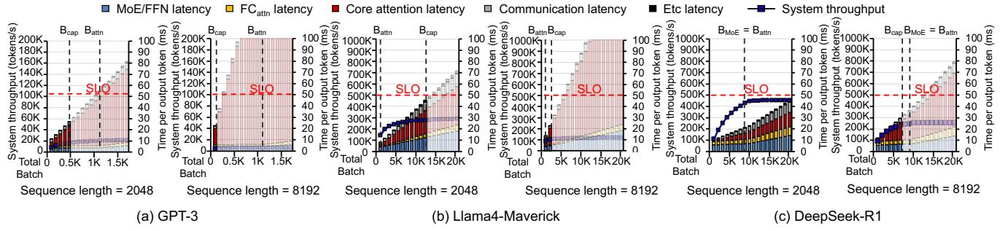
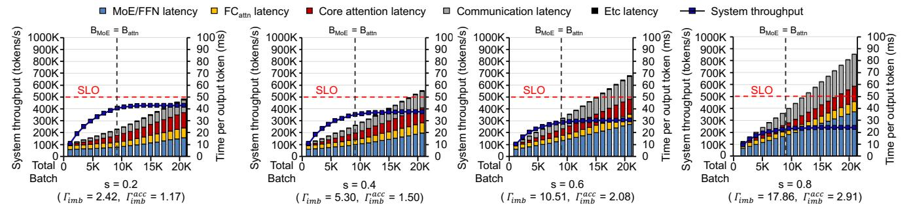
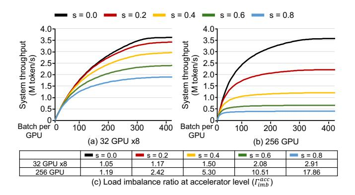
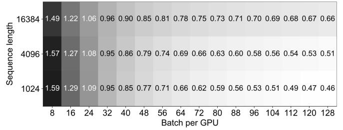

# V. INSIGHTS ON MIXTURE OF EXPERTS

#### *A. Mixture of Experts (MoE)*

Although it is a common belief that larger models with more parameters produce higher-quality responses [\[28\]](#page-13-11), the substantial computational overhead associated with scaling LLMs hinders further growth. MoE [\[15\]](#page-13-1) addresses this issue by employing sparse activation in FFN blocks; MoE introduces a pool of *experts* and activates only a small subset of experts for each input. Recent LLMs [\[10\]](#page-12-0), [\[11\]](#page-12-8), [\[33\]](#page-13-3) adopt a hybrid architecture consisting of two types of experts: a *shared expert* and *routed experts*. The former is activated for every token during inference, whereas the latter are selectively activated based on a routing mechanism that dynamically assigns nk experts out of ne experts to each token. The computational procedure of an MoE block can be described as

$$\mathsf{MoE}(\mathbf{u}) = \left(\sum_{e \in \{1, \dots, n_e\}} \mathsf{Expert}_e(\mathbf{u})\right) + \mathsf{Expert}_{\mathsf{shared}}(\mathbf{u}) \quad (9)$$

By utilizing only nk experts (nk < ne), along with one shared expert per token at runtime, MoE effectively scales the model with low computational overhead. nk and ne vary across models: DeepSeek-R1 [\[10\]](#page-12-0) employs eight routed experts selected from a pool of 256 while Llama4-Maverick [\[33\]](#page-13-3) uses a single routed expert selected from a pool of 128.

The execution time of an MoE block is dominated by expert computations and by the communication required to dispatch/combine tokens to/from the selected experts [\[24\]](#page-13-4), [\[63\]](#page-14-19). A common strategy to scale MoE inference is exploiting expert parallelism (EP), which distributes experts across accelerators. Under EP, tokens are transferred to the devices holding their routed experts; after the computation, the results are combined with additional communication overhead. As different types of parallelism can be selectively applied at the block level, we use degEP to denote the degrees of EP.

Moreover, Using EP for MoE in a multi-accelerator system introduces complications regarding batching, where we need to maximize the usage of each accelerator's arithmetic throughput while also satisfying the memory capacity limitations and SLO constraints. Meanwhile, communication overhead between the accelerators in a serving system is highly dependent on the system-wide interconnect (*e.g.*, NVLink [\[17\]](#page-13-12), [\[41\]](#page-14-16), InfiniBand [\[20\]](#page-13-13), [\[43\]](#page-14-20), and optical links [\[49\]](#page-14-21)) specification. In this section, we analyze the impact of both factors on the performance of MoE blocks.

#### *B. Maximize compute utilization in MoE blocks*

In a multi-accelerator system, an efficient expert computation requires careful design to make the best use of each accelerator's arithmetic throughput by batching tokens for each expert. Although attention and MoE blocks both contain FC layers, their effective B's differ due to the MoE sparsity and distinct parallelization strategies. For attention, requests are split across degDP DP groups and each group processes B/degDP requests using TP; the ArI of the FC layers in an attention block scales with B/degDP.

In contrast, as we utilize EP for MoE, each expert handles B · nk/ne tokens on average. Because tokens are dynamically routed to experts at runtime, the number of tokens assigned to each expert can vary across experts. Hereafter, we denote by Γimb *the load imbalance ratio*, defined as the ratio between the actual number of tokens processed by an expert and the number for an ideal uniform distribution. Considering the load imbalance, the ArI of each expert would be Γimb · B · nk/ne.

For analytical simplicity, we conduct the following analysis based on the average behavior of all experts. The effects of load imbalance will be deeply discussed in [§VII-C.](#page-10-0) To reach the ridge point RPacc for FC layers in each block, the batch size B must satisfy:

$$B \ge B_{\text{attn}} = RP_{\text{acc}} \cdot \deg_{\text{DP}}$$

$$B \ge B_{\text{MoE}} = RP_{\text{acc}} \cdot \frac{n_e}{n_k}$$
(10)

Battn and BMoE are the batch sizes that reaches RPacc for the FC layers of an attention and an MoE block, respectively. We denote the minimum B that satisfies Eq. 10 as  $B_{RP} = \max(B_{attn}, B_{MoE})$ .

While  $B_{\rm attn}$  is influenced by  $\deg_{\rm DP}$ ,  $B_{\rm MoE}$  only depends on the model and the target accelerator and is independent of the number of accelerators. Since  $n_e$  and  $n_k$  are model parameters, the ArI of the FC layers in an MoE block is determined once  $RP_{\rm acc}$  and the model are fixed.

**Observation-6:**  $B_{\mathrm{MoE}}$  is determined once the model and the target accelerator are fixed.

#### C. Two primary factors limiting batch size

While batching  $B_{\rm RP}$  requests is desirable, the feasible batch size is limited by two factors: memory capacity and SLO.

**Memory capacity**: To fully utilize the accelerator's computational resources, data must be served at high bandwidth. To achieve that, the entire working set should reside in the main memory (e.g., HBM). This working set includes the weights for attention and MoE blocks, as well as KV\$. As the weight size is predetermined, serving systems typically use the remaining memory for activation and KV\$, whose sizes are proportional to B. Thus, the memory space requirements for model weights determine the maximum feasible batch size ( $B_{\text{cap}}$ ) as follows:

$$B_{\text{cap}} = \frac{M_{\text{cap}} \cdot n_{\text{acc}} - n_{decoder} \cdot (M_{\text{attn}} \cdot \deg_{\text{DP}} + M_{\text{MoE}})}{n_{decoder} \cdot M_{\text{KV}} \cdot L + M_{\text{act}}(L)}$$
(11)

where  ${\rm M_{cap}} \cdot n_{\rm acc}$  denotes the memory capacity of a system composed of  $n_{acc}$  accelerators, each having a  ${\rm M_{cap}}$  capacity.  ${\rm M_{attn}}$  and  ${\rm M_{MoE}}$  represent the model weight sizes of a single decoder block's attention and MoE, respectively. We denote the KV\$ size per token for each decoder block as  ${\rm M_{KV}}$ . The activation memory space required by a decoder block per token on each accelerator,  ${\rm M_{act}}$ , depends on the sequence length L. As this memory space is reused across multiple decoder blocks, the  ${\rm M_{act}}(L)$  term in Eq. 11 does not scale with  $n_{\rm decoder}$ . To batch  ${\rm B_{RP}}$  requests (from the previous section),  ${\rm B_{cap}}$  should be greater than  $B_{\rm RP}$ .

**SLO**: As excessive batching would incur latency overheads, SLO becomes another limiting factor for feasible batch sizes. In a disaggregated system, the time per output token (TPOT), a key latency metric in LLM serving, is determined by the latency of each decode stage and expressed as follows:

$$\text{TPOT(B, L)} = n_{\text{decoder}} \cdot \left( \underbrace{\frac{\mathbf{M}_{\text{attn}} \cdot \text{deg}_{\text{DP}} + \mathbf{M}_{\text{MoE}}}{n_{\text{acc}} \cdot \mathbf{BW}_{\text{Mem}}}}_{\text{model load lat.}} + \underbrace{\delta(\mathbf{B, L})}_{\text{additional lat.}} \right)$$

where both the first and the second terms in the parentheses represent latencies for each decoder block: the first accounts for the latency to read model weights and the second,  $\delta(B,L)$ , includes additional latency such as memory access time for the KV\$ and activations, communication overhead, and any remaining computation time. The additional latency term is a function of B and L.

TABLE IV

MODEL CONFIGURATION USED IN EVALUATION. BOTH
LLAMA4-MAVERICK AND DEEPSEEK-R1 HAVE 1 SHARED EXPERT.

| Model       | # of par. | $d_{\mathrm{emb}}$ | $deg_{\mathrm{grp}}$ | $ d_{\mathrm{FFN}} $ | $d_{\rm MoE}$ | $n_{\rm e}$ | $n_{\mathrm{k}}$ | $deg_{\mathrm{TP}}$ | $deg_{\mathrm{DP}}$ | $deg_{\mathrm{EP}}$ |
|-------------|-----------|--------------------|----------------------|----------------------|---------------|-------------|------------------|---------------------|---------------------|---------------------|
| GPT-3       | 175B      | 12K                | 1                    | 48K                  | -             | -           | -                | 8                   | 4                   | -                   |
| Llama4      | 400B      | 5K                 | 5                    | 16K                  | 8K            | 1           | 128              | 8                   | 4                   | 32                  |
| DeepSeek-R1 | 671B      | 7K                 | 1                    | 18K                  | 2K            | 8           | 256              | 1                   | 32                  | 32                  |

As the memory access time for the KV\$ and activations, along with communication time, is unavoidable when processing each decoder block, the minimum bound of this additional latency,  $\delta_{\min}(B,L)$ , is given by

$$\delta_{\min}(\mathbf{B}, \mathbf{L}) \ge \mathbf{B} \cdot \left(\frac{\mathbf{M}_{\mathrm{KV}} \cdot \mathbf{L} + \mathbf{M}_{\mathrm{act}}(L)}{n_{\mathrm{acc}} \cdot \mathbf{BW}_{\mathrm{mem}}}\right) + \mathrm{Comm}(\mathbf{B}, \mathbf{L})$$
 (12)

where  $\operatorname{Comm}(B,L)$  denotes the communication overhead between the accelerators. Increasing B leads to larger KV\$ and activation sizes, thus increasing the minimum bound of TPOT. The theoretical maximum batch size,  $B_{SLO}$ , that satisfies the SLO time limit (TPOT $_{SLO}$ ) can be achieved under the minimum latency. A batch size B greater than  $B_{SLO}$  can never satisfy the TPOT $_{SLO}$  time limit, establishing an upper bound on the feasible batch size.

*Observation-7:* While MoE tightens the batch size limit due to weight overheads, MLA complements this through its small KV\$ size.

MoE weights  $(M_{\rm MoE})$  are typically larger than the FFN weights in standard LLMs, increasing memory requirements for the model weights. Then,  $B_{\rm cap}$  decreases as less memory space remains for KV\$ (see Eq. 11). It also increases the model load latency, which shortens the time available for  $\delta_{\rm min}(B_{\rm SLO},L)$ , thereby reducing  $B_{\rm SLO}$ . In contrast, the reduction of  $M_{\rm KV}$  and  $M_{\rm attn}$  by MLA enables storing the KV\$ for more requests in the main memory, thereby increasing  $B_{\rm cap}$ . It also reduces the load time for  $M_{\rm KV}$  and  $M_{\rm attn}$ , allowing higher  $B_{\rm SLO}$  (see Eq. 12). Thus, as for the batch size limits, MLA and MoE impose complementary effects.

#### D. Communication cost

To reduce MoE execution time, both interconnect bandwidth and expert-distribution skew must be addressed. Besides expert computations, communication is a dominant contributor to the overall MoE execution time [24]. As experts are distributed across multiple accelerators using EP, the system must dispatch tokens to, and combine tokens from, the selected experts. As tokens are transferred over the interconnect between the accelerators, communication time is determined by the size of the transferred tokens and the available interconnect bandwidth. In the MoE blocks, the communication time varies across the accelerators because each accelerator sends or receives a different amount of data due to the imbalance in expert distributions.

$$Comm_{MoE}(B) = 2 \cdot \max_{a \in Acc.} (\Gamma_{imb}^{acc}(a)) \cdot \frac{M_{token} \cdot n_k \cdot B}{BW_{Int} \cdot n_{acc}} + \alpha$$
 (13)

Fig. 9. Throughput-latency graph for the decode stages of GPT-3, Llama4-Maverick, and DeepSeek-R1. We assume a 32 B200 GPU system.

Eq.  $13^2$  provides a simplified model of the MoE communication time.  $\Gamma^{acc}_{imb}$  denotes the load imbalance ratio at the accelerator level, computed from the total number of tokens processed by all the experts assigned to an accelerator. When the batch size increases, the interconnect bandwidth and  $\Gamma^{acc}_{imb}$  become the most critical factors. While a larger batch size can improve throughput by increasing compute utilization, it also incurs significant communication overheads. Thus, a high-bandwidth interconnect is required to fully exploit the benefits of batching in LLM inference [65]. Moreover, as the expert distribution becomes more skewed (larger  $\Gamma^{acc}_{imb}$ ), tokens concentrate on a small subset of accelerators, leading to longer communication times.

In summary, reducing the communication cost in MoE requires both high-bandwidth interconnects and an effective mitigation of load imbalance. The gating operation computes expert scores through a lightweight FC layer, and its computational cost is negligible compared to the expert computation.

*Observation-8:* The interconnect bandwidth and expert load imbalance are the dominant factors that determine the communication time of MoE blocks at large batch sizes.

#### VI. EXPERIMENTAL SETUP

To evaluate LLM serving performance in various configurations, we conducted real-system experiments on DGX H100 [42] and developed an in-house simulator based on LLMSimulator [50], [62]. In our simulator, we modeled modern kernel- and system-level optimizations (e.g., FlashAttention [9], FlashMLA [27], fused kernels, and optimized communication) to ensure fair and realistic execution-time estimation. We verified the computational characteristics at the node level using a real system. For inter-node communication time (e.g., dispatch and combine communication in the MoE block), we validated our simulation results against the timing data reported in DeepEP [66].

We configured the accelerator as a modern NVIDIA B200 GPU, whose key parameters are listed in Table I. By default, we assumed all GPUs in a group are fully connected via

 $^2We$  assume a fully connected, switch-based interconnect topology that offers uniform bidirectional bandwidth (BW $_{\rm Int}$ ) among all accelerators.  $M_{\rm token}$  represents the size of token by a single decoder.  $\alpha$  denotes the additional latency in the network.

NVLink fifth generation, providing 1.8TB/s of bidirectional bandwidth following the NVL72 system topology [38]. For each experiment, we specify the number of GPUs per group and note when InfiniBand XDR (100 GB/s) is used for inter-group communication. We used DeepSeek-R1, Llama4-Maverick, and GPT-3 (key parameters specified in Table II and Table IV); all experiments were performed with BF16 precision for all parameters, KV\$, and activations. We used BF16 as the baseline, but our observations also hold for lower precisions (*e.g.*, FP8), as further discussed in \$VIII.

To accurately model real-world serving scenarios, we assumed a Zipfian distribution for token routing [29]. We varied the degree of skewness (s) to thoroughly study its impact on system performance. For better interpretability, we annotated each distribution with the corresponding load imbalance metrics (e.g,  $\Gamma_{imb}$ ) defined in §V.

Following common practices [16], [40], [46], [68], we assume a *disaggregated* system where the prefill and decode stages are executed on separate machines. We focus on the decode phase as the prefill phase is generally compute-bound and already achieves high utilization without batching [1], [13], [68]. Moreover, the insights gained from analyzing the communication time of MoE blocks also apply to the prefill phase as large-batch decode scenarios exhibit similar interconnect traffic patterns to prefill. For model deployment for the decode system, we set  $deg_{TP}$  to 8 for both GPT-3 and Llama 4-Maverick, chosen to maximize performance of the model, while aligning with the typical 8-GPU topology of NVIDIA DGX systems [37]. For DeepSeek-R1, we set the  $deg_{TP}$  to 1, in accordance with our observation (Obs. 5).

#### VII. END-TO-END MODEL EXECUTION ANALYSIS

#### A. The Synergistic impact of MLA and MoE

LLMs adopting MLA and MoE achieve significantly higher throughput than conventional models. This is because MLA and MoE have a powerful synergistic relationship. MLA's highly-compressed KV\$ dramatically increases the memory capacity available for batching (Bcap). This, in turn, allows the system to form the large batches required to fully utilize the compute resources of the sparsely activated experts in MoE blocks, which would otherwise be constrained by memory.

Figure 9 illustrates this by comparing DeepSeek-R1 with Llama4-Maverick and GPT-3. For a sequence length of 8192,

Fig. 10. System throughput and execution time ratio of the decode stage of DeepSeek-R1 when using InfiniBand XDR (100GB/s) among a group of GPUs (DGX), varying sequence lengths and batch sizes. We assume 32 B200 GPU system.

DeepSeek-R1's  $B_{\rm cap}$  (7360) is nearly  $60\times$  larger than GPT-3's (124) and  $2.21\times$  larger than Llama4-Maverick's (3328), which has an even larger model size. Consequently, DeepSeek-R1 can be configured with a batch size large enough to approach its ridge point  $B_{\rm RP}(=B_{\rm attn})$ , whereas Llama4-Maverick and GPT-3 become memory-capacity-limited long before their compute resources can be saturated.

#### B. The critical role of interconnect

The performance of a scaled-out MoE-based system is highly sensitive to interconnect bandwidth [8]. The all-to-all communication pattern, required to dispatch every token to its designated experts and then combine the results, creates dense network traffic that can easily become a bottleneck. As shown in Figure 10, moving from a high-bandwidth fabric, such as NVLink, to a lower-bandwidth one, such as InfiniBand, dramatically increases this communication overhead. For a per-accelerator batch size of 128, our measurements show that a single all-to-all communication task (e.g., dispatch/combine) takes 151.8 µs on a lower-bandwidth fabric, compared with 17.65 µs on the high-bandwidth fabric. Higher communication latency consumes a larger portion of the per-token time budget, which directly reduces the achievable batch size under a given SLO (BSLO) and leads to underutilization. Thus, for efficient system deployment, it is critical to have interconnects with high bisection bandwidth.

This sensitivity forces a critical deployment decision: using multiple small, tightly-coupled instances (e.g., 32 GPU×8) versus one large, monolithic instance (e.g., 256 GPU). Since it is difficult to scale the number of accelerators while maintaining high bisection bandwidth, we vary the interconnect bandwidth of the 256 GPU configuration to 900 GB/s, 300 GB/s, and 100 GB/s, which are equal to or lower than that of each 32 GPU instance.

As Figure 11 shows, the optimal choice depends on the workload. For shorter sequences, multiple small instances are more cost-effective because communication is contained within high-bandwidth domains, and the memory overhead of replicating MoE weights is manageable. When L=2048 (Figure 11(a)), at a batch size of  $B_{\rm RP}$  to maximize throughput,

Fig. 11. Throughput comparison of **256 GPU** and **32 GPU** $\times$ **8** systems of the decode stage of DeepSeek-R1 when L=2048 and L=16384. 900 GB/s denotes NVLink, while 100 GB/s corresponds to InfiniBand.

**32 GPU**×**8** achieves equivalent throughput as **256 GPU** with 900 GB/s interconnect bandwidth. At this point, in **256 GPU**, each GPU is responsible for executing only one expert, but each expert processes 8 times more tokens than in **32 GPU**×**8**. As the Op/B of experts in **256 GPU** belongs to the compute-bound region, it results in higher latency. Thus, the latency of MoE blocks becomes similar across the systems.

For very long sequences (e.g., L = 16384 in Figure 11(b)), however, a single large instance is superior. The memory savings from storing the massive MoE weights only once by **256 GPU** frees up system-wide capacity for a larger  $B_{\rm cap}$ , which is essential for handling the large KV\$, over **32 GPU** $\times$ **8**. This leads to higher overall throughput, even if the large-scale interconnect has higher latency. For example, even with a reduced interconnect bandwidth of 300 GB/s, **256 GPU** delivers better throughput by reducing MoE execution latency.

#### C. Skewed expert distribution

Mitigating skewness in expert distribution is essential for achieving high-throughput and low-latency MoE execution. Figure 12 presents the throughput-latency trade-off for the decode stages of DeepSeek-R1 under varying degrees of expert routing skewness (s). As s increases (from 0.2 to 0.8), the overall system throughput gradually decreases due to the load imbalance among the accelerators. Also, the latency increases as more tokens are concentrated on a smaller subset of experts. As the distribution get more skewed, the rate of increase in both communication latency and MoE latency with respect to the batch size also grows, indicating more severe performance degradation under skewed conditions. These results indicate that skewed expert routing reduces the effectiveness of batching, as increasing skewness leads to higher latency and diminishing throughput gains.

Our observations remain valid even with a skewed distribution of experts; however, the preferred deployment configurations will be affected by this skewness. Under a uniform random distribution, the batch size that saturates the throughput is close to  $B_{\rm MoE}$ . However, with skewness, hot experts become saturated before the total batch size reaches  $B_{\rm MoE}$ , while cold experts process fewer tokens, resulting in lower ArI and reduced throughput. When the total batch size increases

Fig. 12. Throughput-latency graph for the decode stages of DeepSeek-R1 with skewed expert routing and 2048 sequence length in 32 GPU system.

Fig. 13. Throughput and load imbalance ratio comparison between **256 GPU** and **32 GPU** $\times$ **8** systems for the decode stage of DeepSeek-R1 under varying skewness of expert distribution when L=2048. Both systems use a 900 GB/s interconnect among GPUs.

beyond  $B_{\mathrm{MoE}}$ , the ArI of cold experts can eventually reach  $RP_{\mathrm{acc}}$ , leading to a larger batch size required for throughput saturation. Nevertheless, saturating all experts increases latency, as the hot experts have already reached their maximum throughput and only contribute additional latency without improving overall throughput. Therefore, service providers must select an appropriate batch size that balances the tradeoff between throughput and latency, considering the skewness.

Smaller deployment units such as 32 GPU×8 can more effectively mitigate the load imbalance compared to a monolithic 256 GPU. Figure 13 compares the system throughput when serving DeepSeek-R1 with different deployment granularities, either using a single deployment of 256 GPU or eight deployments of 32 GPU×8 each, under varying levels of expert routing skewness. When there is no skew (s = 0.0), the 256 GPU configuration achieves higher throughput due to larger aggregate compute and communication bandwidth. However, as skewness increases, throughput degrades more severely in 256 GPU, while 32 GPU×8 maintains higher throughput. When the skewness is 0.8,  $\Gamma_{imb}^{acc}$  of **256 GPU** is  $6.13 \times$  higher than that of 32 GPU $\times$ 8. In 256 GPU, each GPU handles only one expert; thus, the token imbalance among the experts directly translates to a load imbalance across GPUs. In contrast, in 32 GPU×8, each GPU handles 8 experts, which naturally balances the token distribution and mitigates the load imbalance. Both systems assume a 900 GB/s interconnect;

Fig. 14. Normalized throughput of Duplex [62], which PIM devices process only MoE execution, compared to the baseline GPU system. We used PIM devices with  $RP_{\rm acc}$ =8, utilizing 4 times of HBM memory bandwidth of GPU.

considering the significantly higher networking cost required to fully connect **256 GPU**, **32 GPU**×**8** offers a more balanced and cost-efficient deployment unit for large-scale MoE serving.

#### D. Effectiveness of Processing-In-Memory architectures

At low-batch inference scenarios, where latency-sensitive workloads or on-device inference are required, executing MoE layers on Processing-in-Memory (PIM) architectures [22], [23], [44], [45], [62] provides better efficiency by exploiting higher memory bandwidth compared to GPUs. We modeled Duplex [62], a state-of-the-art HBM-based PIM architecture designed to accelerate MoE layers, and compared its throughput with that of GPUs. Figure 14 shows normalized throughput improvements when using PIM for MoE execution.

When the batch size per GPU is smaller than 32, PIM devices can effectively reduce latency and increase throughput by processing expert computations faster through their high memory bandwidth. However, as the batch size increases, PIM devices struggle to sustain performance because the ArI of the experts increases, making computation rather than memory bandwidth the dominant bottleneck. We conclude that, when MLA and MoE are employed, PIM devices are more suitable for low-batch, low-sequence-length inference scenarios and, in particular, decode stages in such scenarios.

#### VIII. DISCUSSION

Low weight precision: Recent LLMs support low-precision weights such as FP8 to alleviate memory capacity constraints, while accepting a modest loss in accuracy [10]–[12], [18], [30], [31], [47], [61], [64], [67]. The peak FLOPS of accelerators increase when low-precision weights are used. For

example, latest GPUs can achieve up to two times higher peak FLOPS when executing FP8 operations compared to FP16 or BF16. Thus, RPacc doubles; however, BRP remains unchanged because memory access also decreases by half, due to the reduced data size. In contrast, Bcap increases because low-precision weights reduce the memory footprint of the model, thereby expanding the available memory capacity for KV\$. In Figure [9\(](#page-9-3)b), when L = 8192, the system is unable to reach BRP due to the Bcap constraint. By adopting FP8 for model weights, Bcap increases sufficiently to match BRP, enabling the system to maximize throughput.

#### IX. CONCLUSION

Advances in large language models (LLMs) have reshaped the computational landscape of inference. Multi-head Latent Attention (MLA) and Mixture-of-Experts (MoE) move the performance bottleneck away from memory bandwidth. With layer reordering, MLA becomes mostly compute-bound, which is well-suited for contemporary accelerators, diminishing the need for dedicated hardware. MoE achieves scalability through sparse expert activation but demands large batches to sustain utilization; MLA complements this by reducing the KV\$, enabling large-batch inference efficiently even for long sequences. Finally, we highlight that interconnect bandwidth and expert skewness become the primary factors determining end-to-end performance. Future serving systems must emphasize high-bandwidth interconnects and balanced workloads to achieve scalable, low-latency LLM serving.

