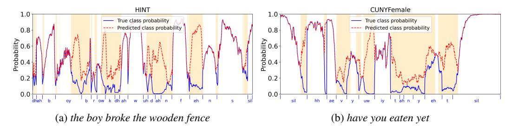

# 4.3 Performance Evaluation

CI vocoded speech was generated by acoustic signal resynthesis from CI electrodograms (CI electrical stimuli patterns) with a sine wave vocoder and used to predict speech intelligibility in CI users.

Figure 2: Framewise probabilities of true and predicted phoneme classes of reverberant speech utterances from (a) HINT and (b) CUNY-Female datasets using the GRU+A classifier. True class labels are annotated on the x-axis. Shaded regions indicate incorrect predictions.

Objective Intelligibility Metrics. Intelligibility of CI vocoded speech was predicted using objective metrics that have been shown to be predictive of speech intelligibility in CI listening studies [\[59\]](#page-13-10): the speech-to-reverberation modulation energy ratio for CI users (SRMR-CI) [\[60,](#page-13-11) [61\]](#page-13-12); and the short-time objective intelligibility (STOI) metric [\[62\]](#page-13-13) with the direct path signal used as the reference signal [\[63\]](#page-13-14). The STOI metric was developed for evaluating speech intelligibility in noise and excludes frames with silent gaps in clean speech. Since reverberation occurs in silent speech gaps, the removal of reverberant reflections in the same silent speech gap will not be captured by the STOI metric. The SRMR metric was originally developed for evaluating speech intelligibility in reverberation for normal hearing listeners [\[60\]](#page-13-11), and later adapted for CI users (SRMR-CI) by using the CI filterbanks [\[61\]](#page-13-12). Thus, the SRMR-CI metric provides a more reliable speech intelligibility predictor for CIs in reverberation. We include STOI for completeness and to facilitate comparison with prior literature.

Benchmarks. Chu et al. [\[33\]](#page-11-10) showed improvements in SRMR-CI and STOI scores, as well as intelligibility of CI vocoded speech in normal hearing listeners, with a phoneme-based MoE model relative to a (conventional) phoneme independent mask estimation model. The objective here is to demonstrate that the OE model achieves at a minimum similar performance as the MoE model with much reduced complexity. Oracle conditions include mask estimation with ideal phoneme knowledge (i.e., perfect phoneme classification), the IRM and the direct path signal.

Statistical Analysis. Statistical tests were performed in R. A two-way repeated measures ANOVA was performed with within-utterance fixed factors of room and mask type, interaction between mask type and room, and a random factor of speech utterance. Mauchly's test [\[64\]](#page-13-15) was used to assess the sphericity assumption; degrees of freedom were adjusted using the Greenhouse-Geisser correction where necessary. For statistically significant main effects or interactions, post-hoc pairwise comparisons were performed using estimated marginal means with Tukey's multiple comparisons correction. All tests were conducted at a significance level of 0.05.

