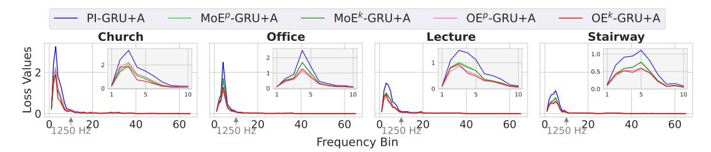
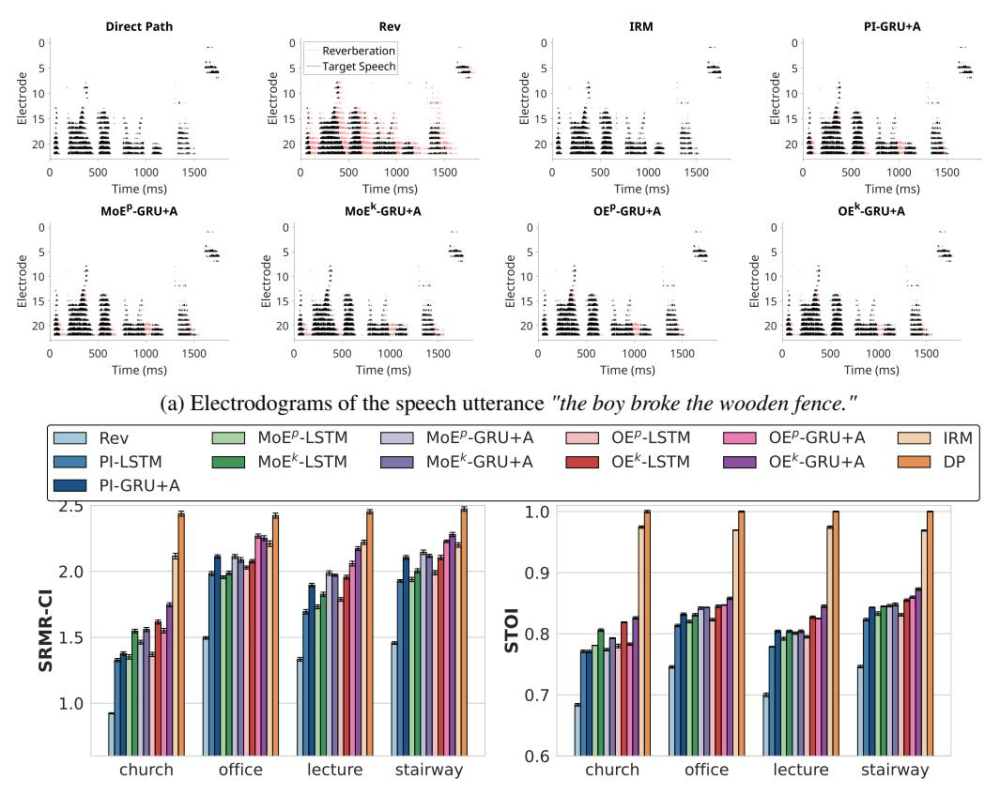
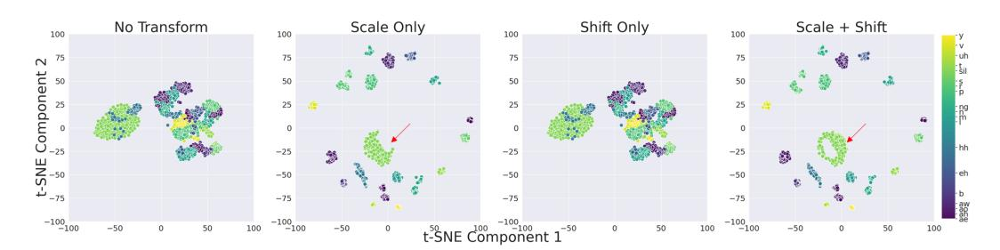

# 5 Results

## 5.1 Phoneme Classification

[Figure 2](#page-5-0) show frame-wise phoneme classifier predictions using the GRU+A classifier applied to sample reverberant speech utterances. Frame-wise class balanced phoneme classification accuracies are summarized in [Table 1.](#page-5-1) The phoneme distributions, classification confusion matrices and additional framewise classification results are provided in Appendix [A.5.](#page-27-0)

Table 1: Class-Balanced Phoneme Classification Accuracies (%) Across Test Datasets

| Dataset     |        |        | Long Short-term Memory |          | Gated Recurrent Unit + Attention |        |         |          |
|-------------|--------|--------|------------------------|----------|----------------------------------|--------|---------|----------|
|             | Church | Office | Lecture                | Stairway | Church                           | Office | Lecture | Stairway |
| CUNY-Female | 20.98  | 26.26  | 25.41                  | 27.65    | 24.30                            | 35.29  | 32.89   | 35.91    |
| CUNY-Male   | 20.11  | 26.63  | 23.41                  | 25.36    | 27.61                            | 39.52  | 34.11   | 36.85    |
| HINT        | 22.44  | 31.39  | 28.38                  | 31.2     | 33.02                            | 47.82  | 43.39   | 46.78    |

Figure 3: Average signal loss across frequency bins with phoneme independent mask estimation and mask estimation with mixture-of-experts (MoE) and Omni-expert (OE) models with predicted (p) and ideal (k) phoneme knowledge using gated recurrent unit + attention (GRU+A) models.

#### 5.2 Mask Estimation

Figure 3 shows the mean signal loss across frequency bins to visualize the frequency-dependent impact of mask estimation. In general, signal loss is highest in lower frequency regions (< 1250 Hz), reflecting the difficulty in mitigating low frequency reverberation. Phonemes typically range from 70-200 ms [65, 66], making phoneme classification based on an 8 ms frame a hard task. Even at low accuracies (Table 1), predicted phoneme knowledge is still beneficial to mask estimation, with a progressive increase in performance from phoneme independent to MoE to OE models. Phonemes with similar time-frequency characteristics are likely to be confused with each other (Appendix A.5). The weighting of phoneme-specific masks reduces the impact of phoneme misclassifications. With known phonemes, the OE provides a higher performance upperbound than the MoE. This indicates that encoding subtask-specific cues via feature transformations is more effective for specialization vs. specialized experts with subtask partitioning of the original feature space.

#### 5.3 Objective Speech Intelligibility

Sample electrodograms are shown in Figure 4a with annotations of target speech and (late) reverberant reflections; corresponding spectrograms are shown in Appendix A.3. Room-specific statistical results of SRMR-CI and STOI scores are shown in Figure 4b; summary statistics are provided in Appendix A.6. Aggregate statistical results are summarized in Table 2. Performance trends of objective speech intelligibility measures are generally consistent with those of mask estimation. The higher performance bound with the OE provides more robustness to the impact of phoneme prediction errors.

Table 2: Objective intelligibility scores (estimated marginal mean  $\pm$  95% confidence interval) for the reverberant signal (Rev), direct path signal (DP), and across different mask estimation methods: ideal ratio mask (IRM), phoneme independent model (PI), phoneme-based mask predicted by mixture-of-experts/Omni-Expert with ideal phoneme knowledge (MoEk/OEk), and using phoneme classifier probabilities (MoEp/OEp). Bold indicates the highest performance among the non-oracle models.

|             | Long Short-Term Memory (LSTM) |                   |                   |                   |                      |                   |                   |                   |  |
|-------------|-------------------------------|-------------------|-------------------|-------------------|----------------------|-------------------|-------------------|-------------------|--|
| Metric      | Rev                           | PI                | $\mathbf{MoE}^p$  | $\mathbf{MoE}^k$  | $\mathbf{OE}^p$      | $\mathbf{OE}^k$   | IRM               | DP                |  |
| SRMR        | 1.302                         | 1.733             | 1.744             | 1.841             | 1.794                | 1.938             | 2.187             | 2.447             |  |
| -CI         | $\pm 0.007$                   | $\pm 0.009$       | $\pm 0.009$       | $\pm 0.009$       | $\pm 0.010$          | $\pm 0.009$       | $\pm 0.008$       | $\pm 0.009$       |  |
| CTOI        | 0.719                         | 0.797             | 0.807             | 0.822             | 0.807                | 0.836             | 0.972             | 1.000             |  |
| STOI        | $\pm 0.001$                   | $\pm 0.001$       | $\pm 0.001$       | $\pm 0.001$       | $\pm 0.001$          | $\pm 0.001$       | $\pm 0.000$       | $\pm 0.000$       |  |
|             |                               | Gated             | Recurren          | t Unit+Att        | ention (Gl           | RU+A)             |                   |                   |  |
| Metric      | Rev                           | PI                | $\mathbf{MoE}^p$  | $\mathbf{MoE}^k$  | $\mathbf{OE}^p$      | $\mathbf{OE}^k$   | IRM               | DP                |  |
|             |                               |                   |                   |                   |                      |                   |                   |                   |  |
| SRMR        | 1.302                         | 1.873             | 1.948             | 1.945             | 2.014                | 2.113             | 2.187             | 2.447             |  |
| SRMR -CI | $1.302 \pm 0.007$             | $1.873 \pm 0.011$ | $1.948 \pm 0.010$ | $1.945 \pm 0.009$ | $2.014 \\ \pm 0.011$ | $2.113 \pm 0.010$ | $2.187 \pm 0.008$ | $2.447 \pm 0.009$ |  |
|             |                               |                   |                   |                   |                      |                   |                   |                   |  |

(b) Room-specific estimated marginal means and 95% confidence intervals of speech-to-reverberation modulation energy ratio for cochlear implant users (SRMR-CI) and short-time objective intelligibility (STOI) scores.

Figure 4: (a) Example electrodograms of a speech utterance and (b) room-specific statistical results of objective speech intelligibility measures of cochlear implant vocoded speech generated for direct path (DP), reverberant speech (Rev), enhanced reverberant speech after applying the ideal ratio mask (IRM) and estimated masks with the phoneme independent (PI) model, mixture-of-experts model with predicted and known phonemes (MoE $^{p/k}$ ) and Omni-Expert model with predicted and known phonemes (OE $^{p/k}$ ) for long short-term memory (LSTM) and gated recurrent unit + attention (GRU+A) networks.

Figure 5: Visualization of phoneme-specific features from a subset of randomly selected phoneme frames (N = 1000) of reverberant speech from the CUNY Female speech dataset in the stairway room. Column panels represent features: before applying transformations; with scale-only; shift-only; and scale + shift transformations. Arrows indicate an example of a visually discernible impact of a shift transformation on a phoneme cluster. t-distributed stochastic neighbor embedding (t-SNE) was used.

#### 5.4 Ablation Analysis

The rest of the paper presents aggregate results. Room-specific results are provided in the Appendix.

Feature Transformation Type. The contribution of each feature transformation was assessed with isolated (i.e., shift only or scale only) and combined (i.e., shift and scale) transformations. [Figure 5](#page-7-1) shows visualizations of features with respective transformations. The scale transformation enhances the separability of phoneme-specific feature clusters, while the shift transformations adjusts the feature offsets for better alignment. Aggregate statistical results are summarized in [Table 3.](#page-8-0) Overall, applying scaling or shifting has a significant impact on the objective speech intelligibility metrics to a similar extent relative the non-transformed features. However, the combined transformation yields the highest improvements in SRMR-CI and STOI scores, [Table 3.](#page-8-0)

Table 3: Objective intelligibility scores (estimated marginal mean ± 95% confidence interval) with the Omni-Expert model with predicted phonemes (OEp ) across different types of feature transformations, scale (Sc) only, shift (Sh) only, scale + shift (default) and no transformation. Bold indicates the highest performance. LSTM, long short-term memory; GRU+A, gated recurrent unit + attention.

| Metric | OEp -LSTM    |                 |                 |                 | OEp -GRU+A   |                 |                 |                 |
|--------|-----------------|-----------------|-----------------|-----------------|-----------------|-----------------|-----------------|-----------------|
|        | None            | Sh Only         | Sc Only         | Sc + Sh         | None            | Sh Only         | Sc Only         | Sc + Sh         |
| SRMR   | 1.683           | 1.711           | 1.706           | 1.794           | 1.923           | 1.987           | 2.000           | 2.014           |
| -CI    | ±0.009          | ±0.010          | ±0.009          | ±0.010          | ±0.011          | ±0.011          | ±0.011          | ±0.011          |
| STOI   | 0.793 ±0.001 | 0.792 ±0.001 | 0.793 ±0.001 | 0.807 ±0.001 | 0.819 ±0.001 | 0.826 ±0.001 | 0.829 ±0.001 | 0.829 ±0.001 |

Feature Transformation Position. We also investigated the impact of applying the feature transformation at different layer positions during mask estimation: prior to the input of the model (default), after the hidden layer, and both the input and hidden layers. Aggregate results are summarized in [Table 4.](#page-8-1) Overall, applying feature transformation at least at the input layer is more effective than applying the transformation only at the hidden layer.

Table 4: Objective intelligibility scores (estimated marginal mean ±95% confidence interval) with the Omni-Expert model with predicted and known phonemes (OEp/k) across different feature transformation positions: after the hidden layer (H), prior to the input to the model (I) (default) and both the input and hidden layers (I + H). Bold indicates the highest performance among the non-oracle models. LSTM, long short-term memory; GRU+A, gated recurrent unit + attention.

| Metric  |        | OEp -LSTM |        | OEk -LSTM |        |        |
|---------|--------|--------------|--------|--------------|--------|--------|
|         | H      | I            | I + H  | H            | I      | I + H  |
| SRMR-CI | 1.764  | 1.794        | 1.805  | 1.863        | 1.938  | 1.947  |
|         | ±0.009 | ±0.010       | ±0.010 | ±0.009       | ±0.009 | ±0.009 |
| STOI    | 0.803  | 0.807        | 0.805  | 0.824        | 0.836  | 0.835  |
|         | ±0.001 | ±0.001       | ±0.001 | ±0.001       | ±0.001 | ±0.001 |

| Metric  |        | OEp -GRU+A |        |        | OEk -GRU+A |         |  |
|---------|--------|---------------|--------|--------|---------------|---------|--|
|         | H      | I             | I + H  | H      | I             | I + H   |  |
| SRMR-CI | 1.367  | 2.014         | 2.004  | 1.387  | 2.113         | 2.073   |  |
|         | ±0.008 | ±0.011        | ±0.010 | ±0.006 | ±0.010        | ± 0.010 |  |
| STOI    | 0.693  | 0.829         | 0.822  | 0.621  | 0.850         | 0.842   |  |
|         | ±0.001 | ±0.001        | ±0.001 | ±0.002 | ±0.001        | ±0.001  |  |

## 5.5 Model Complexity

Model size and training times are shown in [Figure 6;](#page-9-0) detailed values are provided in Appendix [A.4.](#page-27-1) The number of parameters and the computation load are obtained using the opensource *ptflops* package [\[67\]](#page-14-2). The OE model achieves comparable to superior performance with a much smaller model size and faster training time relative to the MoE model. Each expert in the MoE model is trained only on phoneme-specific data and the reduced amount of

training data per expert model results in a longer training time. In contrast, the OE model uses the full training dataset while still benefiting from sub-task specialization via the feature transformations. Note that the models for shift and scale factor estimation are only used during OE training; in this case, the mapping from phoneme label to feature transformation is deterministic, so only the subtask-specific transformation factors are needed during inference.

