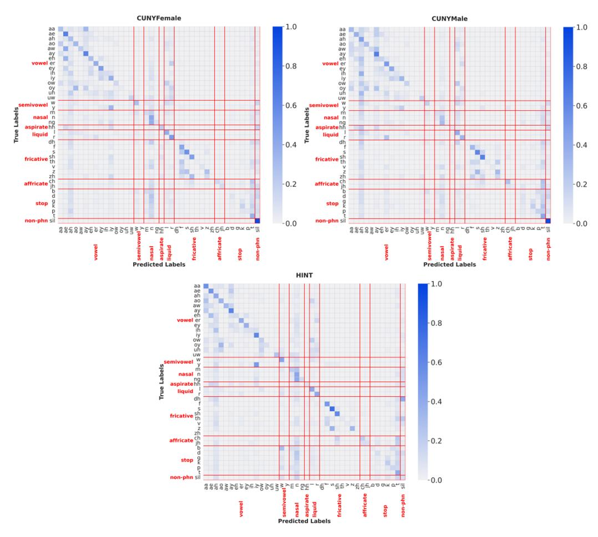
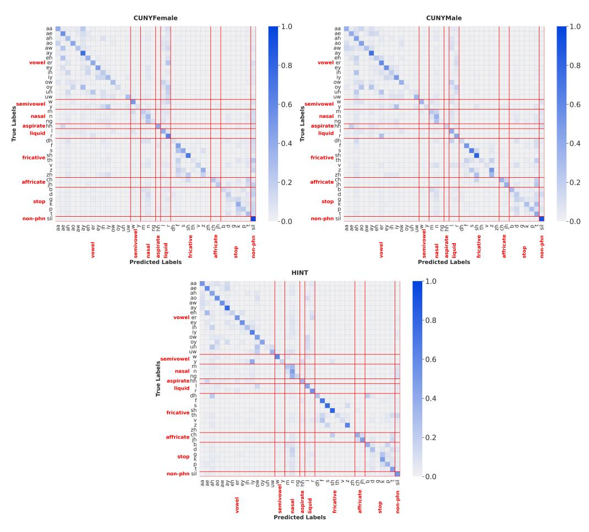

# A.5.1 Phoneme Distribution

Figure A5.1: Distribution of phoneme classes in the training and test speech datasets sorted by the frequency of phonemes in the training dataset. The silence class (sil) has been divided into two categories: silences occurring at the beginning and end of an utterance, denoted by sil\_edge; and silences occurring in the middle of an utterance, denoted by sil\_mid. N is the number of speech files in each dataset.

## A.5.2 Phoneme Classifier - LSTM

Figure A5.2.1: Framewise probabilities of true and predicted phoneme classes of reverberant speech utterances from (a) HINT and (b) CUNYFemale datasets using the long short-term memory (LSTM) classifier. True class labels are annotated on the x-axis. Shaded regions indicate incorrect predictions.

Figure A5.2.2: Confusion matrices of phoneme predictions in test datasets using long short-term memory (LSTM) classifier. Phonemes are annotated by manner of articulation [\[71\]](#page-14-6).

## A.5.3 Phoneme Classifier - GRU+A

Figure A5.3.1: Confusion matrices of phoneme predictions with GRU+A phoneme classifier in test datasets across room conditions. Phonemes are annotated by manner of articulation [71].

## A.6 Room-specific Mask Estimation Results

