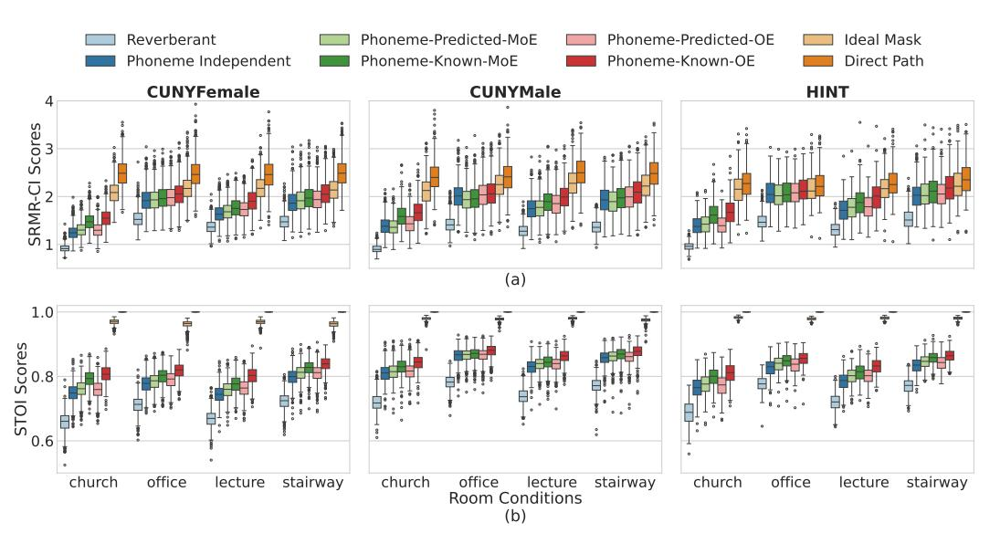

# A.6.1 Signal Loss

Figure A6.1.1: Average signal loss values across frequency bins with phoneme independent mask estimation and mask estimation with mixture-of-experts (MoE) and Omni-Expert (OE) models with predicted and ideal phoneme knowledge using long short-term memory (LSTM) models.

#### A.6.2 Mask Estimation-LSTM models

Table A6.2.1: Long short-term memory (LSTM) models. Mean  $\pm$  95% confidence interval of objective speech intelligibility scores for the reverberant signal (Rev), direct path signal (DP), and across different mask estimation methods: ideal ratio mask (IRM), phoneme independent model (PI), phoneme-based mask predicted by mixture-of-experts/Omni-Expert with ideal phoneme knowledge (MoEk/OEk), and using predicted phoneme classifier probabilities (MoEp/OEp). Bold indicates the highest performance among the non-oracle models.

|                 |             | SRMR-C      | CI          |             |
|-----------------|-------------|-------------|-------------|-------------|
|                 | Church      | Office      | Lecture     | Stairway    |
| Rev             | 0.923       | 1.495       | 1.333       | 1.456       |
| Rev             | $\pm 0.005$ | $\pm 0.010$ | $\pm 0.008$ | $\pm 0.010$ |
| ΡΙ              | 1.327       | 1.984       | 1.694       | 1.928       |
| гі              | $\pm 0.010$ | $\pm 0.015$ | $\pm 0.012$ | $\pm 0.015$ |
| $MoE^p$         | 1.351       | 1.956       | 1.731       | 1.939       |
| MOL             | $\pm 0.010$ | $\pm 0.014$ | $\pm 0.012$ | $\pm 0.015$ |
| $MoE^k$         | 1.547       | 1.988       | 1.826       | 2.004       |
| MOE             | $\pm 0.012$ | $\pm 0.014$ | $\pm 0.014$ | $\pm 0.016$ |
| $\mathbf{OE}^p$ | 1.370       | 2.029       | 1.787       | 1.990       |
| OE x | $\pm 0.010$ | $\pm 0.015$ | $\pm 0.013$ | $\pm 0.016$ |
| $OE^k$          | 1.616       | 2.077       | 1.956       | 2.105       |
| OE              | $\pm 0.013$ | $\pm 0.015$ | $\pm 0.015$ | $\pm 0.017$ |
| IRM             | 2.115       | 2.210       | 2.220       | 2.200       |
| IKIVI           | $\pm 0.014$ | $\pm 0.016$ | $\pm 0.016$ | $\pm 0.016$ |
| DP              | 2.438       | 2.423       | 2.452       | 2.473       |
|                 | $\pm 0.017$ | $\pm 0.018$ | $\pm 0.018$ | $\pm 0.017$ |

|                 |             | STOI        |             |             |
|-----------------|-------------|-------------|-------------|-------------|
|                 | Church      | Office      | Lecture     | Stairway    |
| Rev             | 0.684       | 0.746       | 0.700       | 0.746       |
| Rev             | $\pm 0.002$ | $\pm 0.002$ | $\pm 0.002$ | $\pm 0.002$ |
| ΡΙ              | 0.771       | 0.814       | 0.779       | 0.823       |
| гі              | $\pm 0.002$ | $\pm 0.002$ | $\pm 0.002$ | $\pm 0.002$ |
| $MoE^p$         | 0.781       | 0.820       | 0.792       | 0.833       |
| MOE             | $\pm 0.002$ | $\pm 0.002$ | $\pm 0.002$ | $\pm 0.002$ |
| $MoE^k$         | 0.806       | 0.831       | 0.804       | 0.845       |
| MOE             | $\pm 0.002$ | $\pm 0.002$ | $\pm 0.002$ | $\pm 0.002$ |
| $\mathbf{OE}^p$ | 0.780       | 0.823       | 0.795       | 0.831       |
| OE              | $\pm 0.002$ | $\pm 0.002$ | $\pm 0.002$ | $\pm 0.002$ |
| $OE^k$          | 0.819       | 0.845       | 0.827       | 0.855       |
| OE              | $\pm 0.002$ | $\pm 0.002$ | $\pm 0.002$ | $\pm 0.001$ |
| IRM             | 0.975       | 0.970       | 0.974       | 0.969       |
| IIXIVI          | $\pm 0.000$ | $\pm 0.001$ | $\pm 0.000$ | $\pm 0.001$ |
| DΡ              | 1.000       | 1.000       | 1.000       | 1.000       |
| DP              | $\pm 0.000$ | $\pm 0.000$ | $\pm 0.000$ | $\pm 0.000$ |

#### A.6.3 Mask Estimation-GRU+A models

Figure A6.2.1: Objective intelligibility scores of speech from HINT, CUNYFemale, and CUNYMale datasets in church, office, lecture, and stairway rooms. Results are shown for enhanced reverberant speech after applying estimated masks with the phoneme independent model, mixture of experts (MoE) model with predicted and known phonemes, the ideal ratio mask, and the direct path signal. SRMR-CI, Speech-to-reverberation modulation energy ratio for CI users; STOI, short-time objective intelligibility.

