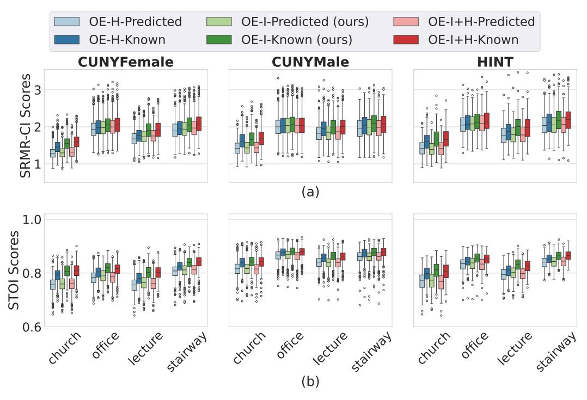

# A.7.2 Position

Figure A7.2.1: Boxplots of (a) SRMR-CI and (b) STOI scores evaluated for three test datasets in all four room conditions using ratio masks for an LSTM network of 1 layer. Results are shown for the Omni-Expert model with predicted phonemes.

Table A7.2: Performance across different feature transformation locations, Estimated Marginal Mean (± 95% Confidence interval). Bold indicates the highest performance among the feature transformation locations.

|                              |                                                    | SRMR-CI                                                     |                                                             |                                                             |                                                             |
|------------------------------|----------------------------------------------------|-------------------------------------------------------------|-------------------------------------------------------------|-------------------------------------------------------------|-------------------------------------------------------------|
|                              | InsertionPoint                                     | Church                                                      | Office                                                      | Lecture                                                     | Stairway                                                    |
| Phoneme -Predicted -OE | Hidden Layer (H) Input Layer (I) I + H | 1.364 (±0.010) 1.370 (±0.010) 1.385 (±0.010) | 1.988 (±0.014) 2.029 (±0.015) 2.039 (±0.015) | 1.750 (±0.013) 1.787 (±0.013) 1.801 (±0.013) | 1.952 (±0.015) 1.990 (±0.016) 1.996 (±0.015) |
| Phoneme -Known            | H                                                  | 1.544 (±0.013) 1.616                                  | 2.030 (±0.015) 2.077                                  | 1.849 (±0.014) 1.956                                  | 2.028 (±0.016) 2.105                                  |
| -OE                          | I I + H                                         | (±0.013) 1.643 (±0.013)                               | (±0.015) 2.076 (±0.015)                               | (±0.015) 1.960 (±0.015)                               | (±0.017) 2.109 (±0.017)                               |

|                   |                 | STOI              |                   |                   |                   |
|-------------------|-----------------|-------------------|-------------------|-------------------|-------------------|
|                   | Insertion Point | Church            | Office            | Lecture           | Stairway          |
| Phoneme           | H               | 0.778 (±0.002) | 0.818 (±0.002) | 0.789 (±0.002) | 0.829 (±0.002) |
| -Predicted -OE | I               | 0.780 (±0.002) | 0.823 (±0.002) | 0.795 (±0.002) | 0.831 (±0.002) |
|                   | I + H           | 0.778 (±0.002) | 0.818 (±0.002) | 0.793 (±0.002) | 0.833 (±0.002) |
| Phoneme           | H               | 0.808 (±0.002) | 0.833 (±0.002) | 0.810 (±0.002) | 0.845 (±0.002) |
| -Known -OE     | I               | 0.819 (±0.002) | 0.845 (±0.002) | 0.827 (±0.002) | 0.855 (±0.001) |
|                   | I + H           | 0.819 (±0.002) | 0.841 (±0.002) | 0.825 (±0.002) | 0.857 (±0.001) |

