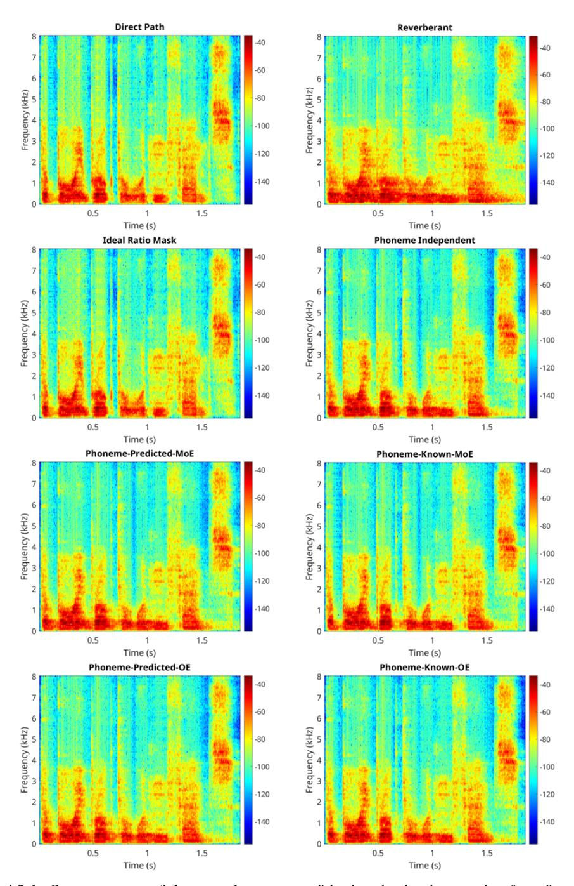
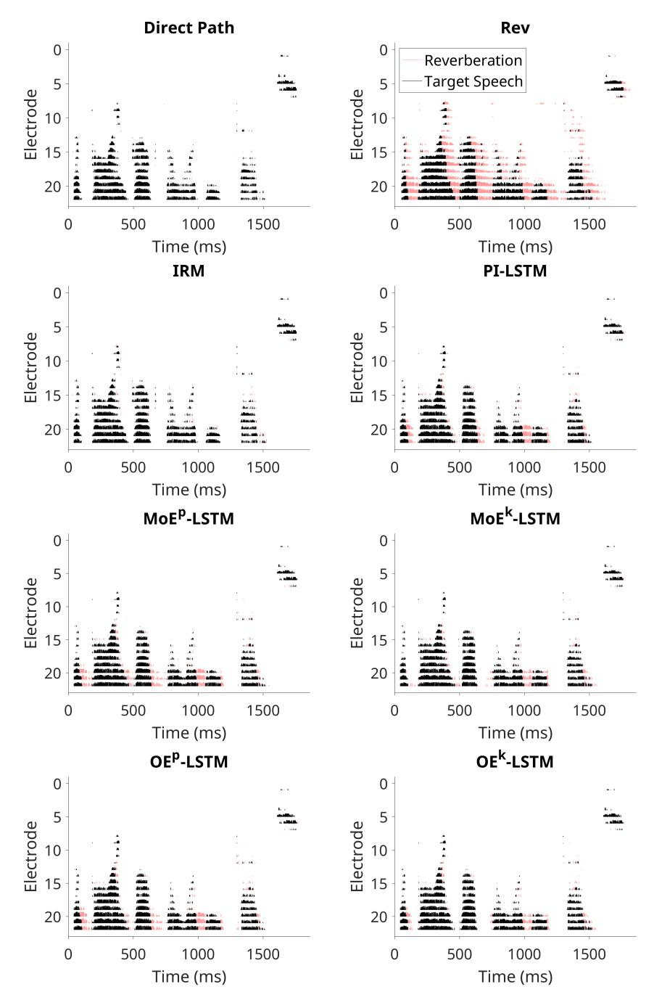

# A Technical Appendices

#### A.1 Reverberation Model and Room Impulse Response (RIR) Characteristics

The reverberant signal xrev(t) is modeled as the convolution of the clean, anechoic speech signal, s(t), with the room impulse response (RIR), h(t):

$$x_{\text{rev}}(t) = s(t) * h(t) \tag{7}$$

To isolate the direct-path component, the RIR is decomposed into two parts:

$$x_{\text{rev}}(t) = s(t) * h_{\text{direct}}(t) + s(t) * h_{\text{reverb}}(t)$$

$$= x_{\text{direct}}(t) + s(t) * h_{\text{reverb}}(t)$$

$$l(t) = x_{\text{rev}}(t) - x_{\text{direct}}(t)$$
(8)

where hdirect(t) represents the RIR function for direct path (and early reflections); hreverb(t) is the RIR of the remaining late reverberation; xdirect(t) represents the direct path signal; and l(t) represents the late reverberant reflections, i.e., the difference between the reverberant and direct path signals.

[Table A1](#page-23-2) lists characteristics of recorded RIRs of four rooms in the Aachen Impulse Response database [\[49\]](#page-13-0) used for testing. RIRs were selected from an office, a lecture, a stairway, and a church. For the stairway and the church, RIRs were selected at an azimuth of 90 degrees, where the source and receiver are directly facing each other. RIRs were filtered using an anti-aliasing filter and then downsampled from 48 to 16 kHz before convolution with anechoic speech stimuli. Reverberation times (RT60s) were calculated using the Schroeder method [\[68\]](#page-14-3) using the code provided by [\[69\]](#page-14-4). The direct-to-reverberant ratios (DRRs) of the recorded RIRs were calculated using [\[70\]](#page-14-5).

Table A1: Room impulse response characteristics of test room conditions. RT60(s), reverberation time; DRR; Direct-to-reverberant ratio.

| Dataset        | Room     | Dimensions (L x W x H) (m) | Source Receiver Distance (m) | RT60(s) | DRR (dB) |
|----------------|----------|-------------------------------|------------------------------------|---------|----------|
|                | Office   | 5.0 x 6.4 x 2.9               | 3.0                                | 0.6     | 0.4      |
| Aachen Impulse | Lecture  | 10.8 x 10.9 x 3.15            | 5.56                               | 0.9     | -0.1     |
| Response (AIR) | Stairway | 7.0 x 5.2                     | 3.0                                | 0.9     | 1.6      |
|                | Church   | 19.0 x 30.0                   | 5.0                                | 6.5     | -0.6     |

## A.2 Frame-wise Phoneme Labels

Figure A2.1: Example annotations of phoneme labels aligned to cochlear implant time bins.

#### A.3 Example Spectrograms and Electrodograms - LSTM models

Figure A3.1: Spectrograms of the speech utterance *"the boy broke the wooden fence"* generated for direct path speech, reverberant speech, enhanced reverberant speech after applying the ideal ratio mask and estimated masks with the phoneme independent model, mixture-of-experts (MoE) model with predicted and known phonemes, and Omni-Expert (OE) model with predicted and known phonemes.

Figure A3.2: Electrodograms of the speech utterance *"the boy broke the wooden fence"* generated for direct path speech, reverberant speech (Rev), enhanced reverberant speech after applying the ideal ratio mask (IRM) and estimated masks with the phoneme independent model (PI), mixture-of-experts model with predicted and known phonemes (MoEp/k), and Omni-Expert model with predicted and known phonemes (OEp/k).

#### A.4 Complexity Analysis

Table A4.1: Summary of complexity of long short-term memory (LSTM) models used for speech dereverberation in cochlear implants.

| Model                    | Parameters      | Training Time‡ | MACs (M)    | Size (MB)  |
|--------------------------|-----------------|----------------|-------------|------------|
| Phoneme Independent      | 108,225         | 2 hrs 58 mins  | 109.44      | 0.43       |
| Phoneme Classifier (PC)  | 98440           | 3 hrs          | 99.63       | 0.39       |
| Mixture of Experts (MoE) | 40*108,225 + PC | 5 hrs 22 mins  | 4377.6 + PC | 16.51 + PC |
| Omni-Expert (OE)         | 113555 + PC     | 1 hr 57 mins   | 109.45 + PC | 0.45 + PC  |
| Expert                   | 108,225         |                |             | 0.43       |
| Shift + Scale Factors†   | 2,665 + 2,665   |                |             | 0.1 + 0.1  |

† Shift and scale multilayer perceptrons are not deployed during inference; ‡NVIDIA Titan V GPU

Table A4.2: Summary of complexity of gated recurrent unit + attention (GRU+A) models used for speech dereverberation in cochlear implants.

| Model                    | Parameters     | Training Time‡ | MACs (M)     | Size (MB)  |
|--------------------------|----------------|----------------|--------------|------------|
| Phoneme Independent (PI) | 127946         | 3 hrs 43 mins  | 127.76       | 0.51       |
| Phoneme Classifier (PC)  | 124996         | 3 hrs 15 mins  | 124.84       | 0.5        |
| Mixture of Experts (MoE) | 40*127946 + PC | 10 hrs 47 mins | 5110.58 + PC | 19.52 + PC |
| Omni-Expert (OE)         | 133276 + PC    | 1 hr 21 mins   | 127.77 + PC  | 0.53 + PC  |
| -Expert                  | 127946         |                |              | 0.51       |
| -Shift + Scale Factors†  | 2,665 + 2,665  |                |              | 0.1 + 0.1  |

† Shift and scale multilayer perceptrons are not deployed during inference; ‡NVIDIA Titan V GPU

#### A.5 Phoneme Analysis

