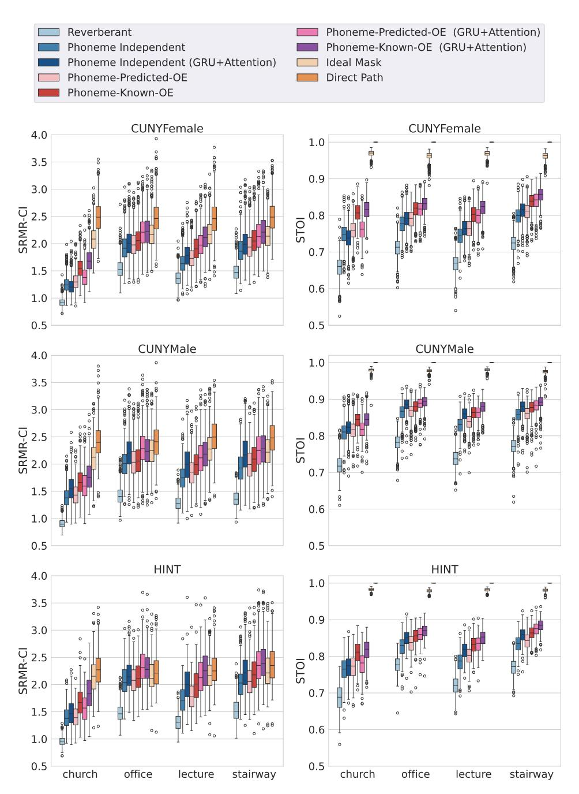
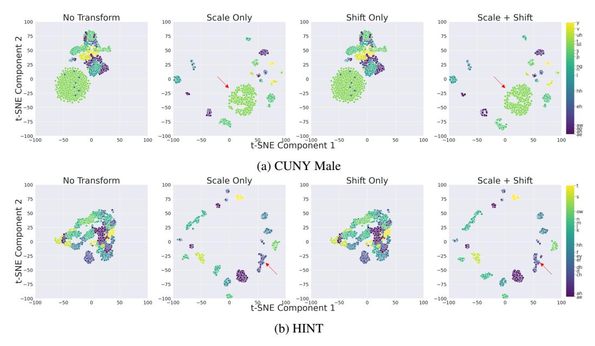
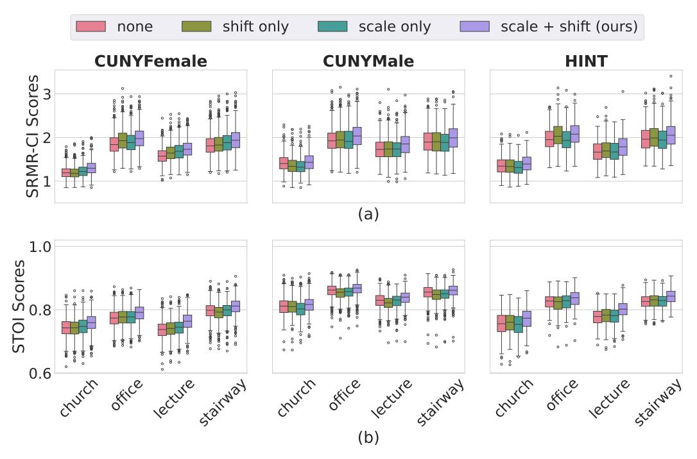

# A.7 Additional Ablation Analysis-LSTM models

## **A.7.1** Transformation Type

Table A6.3.1: Mean ( $\pm$  95% confidence interval) of objective speech intelligibility scores across different mask estimation methods: phoneme independent model (PI), phoneme-based mask predicted by mixture-of-experts/Omni-Expert with ideal phoneme knowledge (MoE $^k$ /OE $^k$ ), and using phoneme classifier probabilities (MoE $^p$ /OE $^p$ ). Results are shown for the GRU+Attention (GRU+A) model architecture aggregated across three test datasets in four room conditions. Bold indicates the highest performance among the non-oracle models.

|                   |                   | SRMR-CI           |                   |                   |
|-------------------|-------------------|-------------------|-------------------|-------------------|
|                   | Church            | Office            | Lecture           | Stairway          |
| PI - GRU+A        | $1.377 \pm 0.014$ | $2.113 \pm 0.016$ | $1.895 \pm 0.016$ | $2.016 \pm 0.018$ |
| $MoE^p$ - $GRU+A$ | $1.436 \pm 0.015$ | $2.133 \pm 0.016$ | $1.987 \pm 0.016$ | $2.145 \pm 0.021$ |
| $OE^p$ - $GRU+A$  | $1.500 \pm 0.013$ | $2.268 \pm 0.017$ | $2.059 \pm 0.017$ | $2.228 \pm 0.019$ |
| $MoE^k$ - $GRU+A$ | $1.559 \pm 0.017$ | $2.087 \pm 0.016$ | $1.971 \pm 0.015$ | $2.117 \pm 0.021$ |
| $OE^k$ - $GRU+A$  | $1.747 \pm 0.014$ | $2.252 \pm 0.017$ | $2.173 \pm 0.017$ | $2.280 \pm 0.019$ |

|                   |                   | STOI              |                   |                   |
|-------------------|-------------------|-------------------|-------------------|-------------------|
|                   | Church            | Office            | Lecture           | Stairway          |
| PI - GRU+A        | $0.771 \pm 0.003$ | $0.832 \pm 0.003$ | $0.804 \pm 0.003$ | $0.843 \pm 0.002$ |
| $MoE^p$ - $GRU+A$ | $0.774 \pm 0.002$ | $0.842 \pm 0.002$ | $0.801 \pm 0.002$ | $0.846 \pm 0.002$ |
| $OE^p$ - $GRU+A$  | $0.783 \pm 0.002$ | $0.847 \pm 0.002$ | $0.825 \pm 0.002$ | $0.860 \pm 0.002$ |
| $MoE^k$ - $GRU+A$ | $0.793 \pm 0.000$ | $0.843 \pm 0.001$ | $0.804 \pm 0.000$ | $0.848 \pm 0.000$ |
| $OE^k$ - $GRU+A$  | $0.826 \pm 0.002$ | $0.858 \pm 0.002$ | $0.845 \pm 0.002$ | $0.873 \pm 0.001$ |

Table A7.1: Room-specific Objective intelligibility scores (estimated marginal mean ( $\pm$  95% confidence interval)) with the Omni-Expert model with predicted phonemes across different types of feature transformations. Bold indicates the highest performance.

| Speech-to-reverberation modulation energy ratio for CI users (SRMR-CI) |                     |                     |                      |                     |  |  |  |  |
|------------------------------------------------------------------------|---------------------|---------------------|----------------------|---------------------|--|--|--|--|
|                                                                        | Church              | Office              | Lecture              | Stairway            |  |  |  |  |
| None                                                                   | $1.302\ (\pm0.010)$ | 1.903 (±0.014)      | 1.647 (±0.012)       | $1.881 (\pm 0.014)$ |  |  |  |  |
| Shift Only                                                             | $1.278 (\pm 0.010)$ | $1.968 (\pm 0.015)$ | $1.695 (\pm 0.012)$  | $1.903 (\pm 0.015)$ |  |  |  |  |
| Scale Only                                                             | $1.288 (\pm 0.009)$ | $1.925 (\pm 0.014)$ | $1.706 (\pm 0.012)$  | $1.906 (\pm 0.015)$ |  |  |  |  |
| Scale + Shift                                                          | $1.370\ (\pm0.010)$ | $2.029~(\pm 0.015)$ | 1.787 ( $\pm$ 0.013) | 1.990 (±0.016)      |  |  |  |  |

| Short-time objective intelligibility (STOI) |                     |                       |                     |                     |  |  |  |  |
|---------------------------------------------|---------------------|-----------------------|---------------------|---------------------|--|--|--|--|
| Church Office Lecture Stairway              |                     |                       |                     |                     |  |  |  |  |
| None                                        | $0.767 (\pm 0.002)$ | $0.811\ (\pm0.002)$   | $0.774 (\pm 0.003)$ | $0.821 (\pm 0.002)$ |  |  |  |  |
| Shift Only                                  | $0.767 (\pm 0.002)$ | $0.809 (\pm 0.002)$   | $0.774 (\pm 0.002)$ | $0.815 (\pm 0.002)$ |  |  |  |  |
| Scale Only                                  | $0.766 (\pm 0.002)$ | $0.810 \ (\pm 0.002)$ | $0.778 (\pm 0.002)$ | $0.819 (\pm 0.002)$ |  |  |  |  |
| Scale + Shift                               | $0.780~(\pm 0.002)$ | $0.823~(\pm 0.002)$   | $0.795\ (\pm0.002)$ | $0.831\ (\pm0.002)$ |  |  |  |  |

Figure A6.3.1: Boxplots of objective speech intelligibility scores of cochlear implant vocoded speech evaluated for three test datasets in all four room conditions using ratio masks with baseline LSTM and a GRU+Attention networks. Objective speech intellibility measures include speech-to-reverberation modulation energy ratio for CI users (SRMR-CI) and short-time objective intelligibility (STOI). Results are shown for direct path, reverberant speech, enhanced reverberant speech after applying the ideal ratio mask and estimated masks with the Phoneme Independent model and Omni-Expert model (OE) with predicted and known phonemes.

Figure A7.1.1: Visualization of phoneme-specific features from a subset of randomly selected phoneme frames (N = 1000) of reverberant speech from the CUNY Male and HINT speech datasets in the stairway room. Column panels represent features: before applying transformations; with scale-only; shift-only; and scale + shift transformations. Arrows indicate an example of visually discernable impact of a shift transformation on a phoneme cluster. t-distributed stochastic neighbor embedding (t-SNE) was used.

Figure A7.1.2: Boxplots of (a) SRMR-CI and (b) STOI scores evaluated for three test datasets in all four room conditions without any feature modulation and using three different feature modulation techniques: shift only, scale only, and scale+shift (default). Results are shown for the Omni-Expert model with predicted phonemes.

