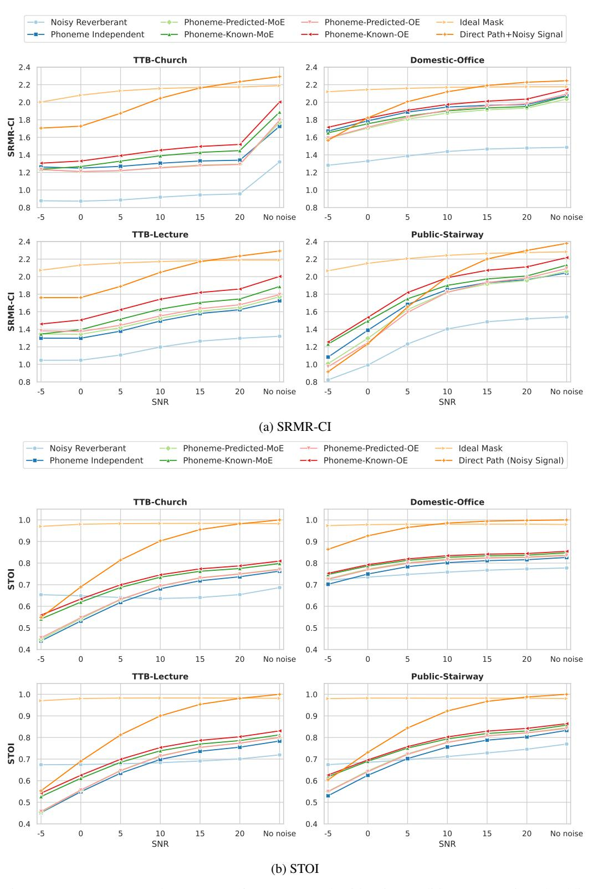

# A.8 Robustness in Noise

Noisy-Reverberant Testing Conditions The test datasets were developed by adding noise from DEMAND [\[72\]](#page-14-7) and Cocktail Party [\[73\]](#page-14-8) noise datasets. Two different noise conditions were chosen from DEMAND - Domestic and Public. Domestic noises include kitchen, living room, and washing machine noise environments, and Public noises include the interiors of a cafeteria, restaurant, and a busy subway station. Two-talker Babble (TTB) was selected from Cocktail Party dataset. We used speech from the HINT dataset. Noise was added at signal-to-noise (SNR) levels: -5, 0, 5, 10, 15, 20, and noisy speech was convolved with room impulse responses (RIRs) from office, stairway, lecture, and church room conditions.

## A.8.1 Roomwise model performance - LSTM

Figure A8.1: SRMR-CI and STOI scores for HINT speech with noise conditions, Domestic and Public noises from DEMAND dataset [72] and Two-Talker Babble (TTB) from Cocktail Party dataset [73] convolved with office, stairway, lecture, and church room conditions (RIRs), respectively. Results are shown for unenhanced noisy reverberant speech, mask estimated using phoneme independent models, phoneme-specific mixture-of-expert model (MoE), phoneme-specific Omni-Expert model (OE), ideal ratio mask (IRM), and the direct path (DP) of the noisy reverberant signal. Noise was added at SNR levels: -5, 0, 5, 10, 15, 20. Additionally, results are shown for no noise (only RIR) condition.

Table A8.1: Performance across different mask estimation methods. Estimated Marginal Mean (± 95% Confidence interval) for unenhanced noisy reverberant (Noisy Rev) speech, mask estimated using phoneme independent (PI) model, phoneme-specific mixture-of-expert model (MoEp/k) and phoneme-specific Omni-Expert model (OEp/k) with predicted/known phonemes, ideal ratio mask (IRM), and the direct path of the noisy reverberant signal ( DPnoisy) across noise conditions (SNR in dB). Bold indicates the highest performance among the non-oracle models.

| SRMR-CI   |        |        |        |        |        |        |          |  |  |  |
|-----------|--------|--------|--------|--------|--------|--------|----------|--|--|--|
| Model     | -5     | 0      | 5      | 10     | 15     | 20     | No noise |  |  |  |
|           | 1.007  | 1.060  | 1.153  | 1.239  | 1.290  | 1.313  | 1.327    |  |  |  |
| Noisy Rev | ±0.015 | ±0.014 | ±0.015 | ±0.017 | ±0.018 | ±0.018 | ±0.018   |  |  |  |
|           | 1.329  | 1.431  | 1.555  | 1.649  | 1.702  | 1.725  | 1.812    |  |  |  |
| PI        | ±0.022 | ±0.022 | ±0.023 | ±0.024 | ±0.024 | ±0.024 | ±0.025   |  |  |  |
| MoEp      | 1.294  | 1.388  | 1.518  | 1.621  | 1.680  | 1.708  | 1.825    |  |  |  |
|           | ±0.021 | ±0.020 | ±0.021 | ±0.023 | ±0.024 | ±0.024 | ±0.024   |  |  |  |
| MoEk      | 1.367  | 1.478  | 1.608  | 1.706  | 1.760  | 1.788  | 1.930    |  |  |  |
|           | ±0.019 | ±0.020 | ±0.021 | ±0.023 | ±0.023 | ±0.024 | ±0.023   |  |  |  |
| OEp       | 1.295  | 1.387  | 1.522  | 1.634  | 1.701  | 1.734  | 1.848    |  |  |  |
|           | ±0.021 | ±0.020 | ±0.021 | ±0.023 | ±0.024 | ±0.025 | ±0.025   |  |  |  |
| OEk       | 1.434  | 1.547  | 1.686  | 1.790  | 1.850  | 1.881  | 2.011    |  |  |  |
|           | ±0.021 | ±0.021 | ±0.022 | ±0.023 | ±0.024 | ±0.024 | ±0.024   |  |  |  |
|           | 2.065  | 2.127  | 2.163  | 2.185  | 2.198  | 2.204  | 2.203    |  |  |  |
| IRM       | ±0.021 | ±0.021 | ±0.021 | ±0.021 | ±0.021 | ±0.021 | ±0.021   |  |  |  |
|           | 1.487  | 1.637  | 1.856  | 2.053  | 2.181  | 2.249  | 2.303    |  |  |  |
| DPnoisy   | ±0.031 | ±0.026 | ±0.023 | ±0.021 | ±0.021 | ±0.021 | ±0.022   |  |  |  |

| STOI      |        |        |        |        |        |        |          |  |  |  |
|-----------|--------|--------|--------|--------|--------|--------|----------|--|--|--|
| Model     | -5     | 0      | 5      | 10     | 15     | 20     | No noise |  |  |  |
| Noisy Rev | 0.681  | 0.686  | 0.691  | 0.697  | 0.707  | 0.718  | 0.738    |  |  |  |
|           | ±0.002 | ±0.003 | ±0.003 | ±0.003 | ±0.003 | ±0.003 | ±0.003   |  |  |  |
| PI        | 0.531  | 0.614  | 0.685  | 0.734  | 0.763  | 0.778  | 0.801    |  |  |  |
|           | ±0.009 | ±0.008 | ±0.006 | ±0.005 | ±0.004 | ±0.003 | ±0.003   |  |  |  |
| MoEp      | 0.545  | 0.629  | 0.701  | 0.752  | 0.780  | 0.794  | 0.814    |  |  |  |
|           | ±0.009 | ±0.008 | ±0.006 | ±0.005 | ±0.003 | ±0.003 | ±0.003   |  |  |  |
|           | 0.608  | 0.677  | 0.734  | 0.773  | 0.796  | 0.807  | 0.829    |  |  |  |
| MoEk      | ±0.007 | ±0.006 | ±0.005 | ±0.004 | ±0.003 | ±0.003 | ±0.002   |  |  |  |
|           | 0.546  | 0.629  | 0.700  | 0.750  | 0.779  | 0.793  | 0.812    |  |  |  |
| OEp       | ±0.009 | ±0.008 | ±0.006 | ±0.004 | ±0.003 | ±0.003 | ±0.003   |  |  |  |
|           | 0.620  | 0.687  | 0.744  | 0.784  | 0.808  | 0.819  | 0.840    |  |  |  |
| OEk       | ±0.007 | ±0.006 | ±0.005 | ±0.004 | ±0.003 | ±0.002 | ±0.002   |  |  |  |
|           | 0.973  | 0.980  | 0.982  | 0.982  | 0.982  | 0.982  | 0.981    |  |  |  |
| IRM       | ±0.001 | ±0.001 | ±0.000 | ±0.000 | ±0.000 | ±0.000 | ±0.000   |  |  |  |
|           | 0.642  | 0.759  | 0.859  | 0.928  | 0.968  | 0.987  | 1.000    |  |  |  |
| DPnoisy   | ±0.010 | ±0.008 | ±0.005 | ±0.003 | ±0.002 | ±0.001 | ±0.000   |  |  |  |

#### A.8.2 Roomwise model performance - GRU+A

Table A8.2: Objective speech intelligibility scores (estimated marginal mean (± 95% confidence interval) for mask estimated using phoneme independent (PI) model, and phoneme-specific Omni-Expert model with predicted/known phonemes (OEp/k) across varying noise types and signal-to-noise ratio (SNR in dB). Results are aggregated for HINT speech with domestic noise + office, public noise + stairway, two-talker babble (TTB) noise + lecture and TTB + church. Results are shown for the base LSTM model and the GRU+Attention (GRU+A) model. Bold indicates the highest performance among the non-oracle models.

| SRMR-CI    |        |         |        |        |        |        |          |  |  |
|------------|--------|---------|--------|--------|--------|--------|----------|--|--|
| Model      | -5     | 0       | 5      | 10     | 15     | 20     | No noise |  |  |
| PI - LSTM  | 1.329  | 1.431   | 1.555  | 1.649  | 1.702  | 1.725  | 1.812    |  |  |
|            | ±0.022 | ±0.022  | ±0.023 | ±0.024 | ±0.024 | ±0.024 | ±0.025   |  |  |
| PI - GRU+A | 1.353  | 1.486   | 1.656  | 1.784  | 1.849  | 1.878  | 1.986    |  |  |
|            | ±0.024 | ± 0.022 | ±0.023 | ±0.025 | ±0.026 | ±0.026 | ±0.028   |  |  |
| OEp        | 1.295  | 1.387   | 1.522  | 1.634  | 1.701  | 1.734  | 1.848    |  |  |
| - LSTM     | ±0.021 | ±0.020  | ±0.021 | ±0.023 | ±0.024 | ±0.025 | ±0.025   |  |  |
| OEp        | 1.368  | 1.499   | 1.685  | 1.826  | 1.902  | 1.936  | 2.119    |  |  |
| - GRU+A    | ±0.026 | ±0.024  | ±0.026 | ±0.027 | ±0.028 | ±0.029 | ±0.030   |  |  |
| OEk        | 1.434  | 1.547   | 1.686  | 1.790  | 1.850  | 1.881  | 2.011    |  |  |
| - LSTM     | ±0.021 | ±0.021  | ±0.022 | ±0.023 | ±0.024 | ±0.024 | ±0.024   |  |  |
| OEk        | 1.555  | 1.706   | 1.864  | 1.972  | 2.027  | 2.052  | 2.217    |  |  |
| - GRU+A    | ±0.023 | ±0.023  | ±0.025 | ±0.026 | ±0.027 | ±0.027 | ±0.027   |  |  |
|            |        |         |        |        |        |        |          |  |  |
|            |        |         | STOI   |        |        |        |          |  |  |
| Model      | -5     | 0       | 5      | 10     | 15     | 20     | No noise |  |  |
| PI - LSTM  | 0.531  | 0.614   | 0.685  | 0.734  | 0.763  | 0.778  | 0.801    |  |  |
|            | ±0.009 | ±0.008  | ±0.006 | ±0.005 | ±0.004 | ±0.003 | ±0.003   |  |  |
| PI- GRU+A  | 0.558  | 0.642   | 0.716  | 0.767  | 0.795  | 0.808  | 0.823    |  |  |
|            | ±0.009 | ±0.007  | ±0.006 | ±0.004 | ±0.003 | ±0.003 | ±0.003   |  |  |
| OEp        | 0.546  | 0.629   | 0.700  | 0.750  | 0.779  | 0.793  | 0.812    |  |  |
| - LSTM     | ±0.009 | ±0.008  | ±0.006 | ±0.004 | ±0.003 | ±0.003 | ±0.003   |  |  |
| OEp        | 0.559  | 0.645   | 0.720  | 0.773  | 0.804  | 0.818  | 0.836    |  |  |
| - GRU+A    | ±0.009 | ±0.008  | ±0.006 | ±0.005 | ±0.004 | ±0.003 | ±0.003   |  |  |
| OEk        | 0.620  | 0.687   | 0.744  | 0.784  | 0.808  | 0.819  | 0.840    |  |  |
| - LSTM     | ±0.007 | ±0.006  | ±0.005 | ±0.004 | ±0.003 | ±0.002 | ±0.002   |  |  |
| OEk        | 0.629  | 0.701   | 0.760  | 0.801  | 0.824  | 0.835  | 0.855    |  |  |
| - GRU+A    | ±0.007 | ±0.006  | ±0.005 | ±0.004 | ±0.003 | ±0.002 | ±0.002   |  |  |

Figure A8.2: SRMR-CI and STOI scores for HINT speech with noise conditions, Domestic and Public noises from DEMAND dataset and Two-Talker Babble (TTB) from Cocktail Party dataset convolved with office, stairway, lecture, and church room conditions (RIRs), respectively. Results are shown for unenhanced noisy reverberant speech, mask estimated using phoneme independent models, phoneme-specific Omni-Expert models (OE) - LSTM and GRU+A, ideal ratio mask (IRM), and the direct path (DP) of the noisy reverberant signal. Noise was added at signal-to-noise (SNR) levels: -5, 0, 5, 10, 15, 20. Additionally, results are shown for no noise (only RIR) condition.

## A.8.3 Room-specific Phoneme Classifier Performance in Noisy Reverberant Conditions

Table A8.3.1: Phoneme classification accuracies in noisy reverberant test conditions using long short-term memory (LSTM) model architecture (%). Models are trained in reverberant only conditions.

| Dataset              | -5   | 0     | 5     | 10    | 15    | 20    |
|----------------------|------|-------|-------|-------|-------|-------|
| HINT-Domestic-Office | 16.4 | 19.87 | 23.43 | 26.04 | 28.18 | 29.76 |
| HINT-Public-Stairway | 6.08 | 9.31  | 14.32 | 19.71 | 24.25 | 27.31 |
| HINT-TTB-Lecture     | 7.59 | 10.56 | 14.15 | 18.28 | 22.06 | 24.81 |
| HINT-TTB-Church      | 7.57 | 9.93  | 12.70 | 15.78 | 18.43 | 20.23 |

Table A8.3.2: Phoneme Classification Accuracies in noisy reverberant test conditions using gated recurrent unit + attention (GRU+A) model architecture (%). Models are trained in reverberant only conditions.

| Dataset              | -5    | 0     | 5     | 10    | 15    | 20    |
|----------------------|-------|-------|-------|-------|-------|-------|
| HINT-Domestic-Office | 24.04 | 29.46 | 34.97 | 40.03 | 43.26 | 45.14 |
| HINT-Public-Stairway | 6.50  | 11.65 | 19.75 | 28.16 | 35.36 | 40.25 |
| HINT-TTB-Lecture     | 7.91  | 12.13 | 18.20 | 25.15 | 32.18 | 37.34 |
| HINT-TTB-Church      | 7.96  | 11.50 | 16.36 | 21.73 | 26.67 | 29.89 |

Figure A8.3.1: Phoneme classifier (PC) performance in noisy reverberant room conditions using the long short-term memory (LSTM) model and the gated recurrent unit + attention (GRU+A) architecture. TTB, two-talker babble.