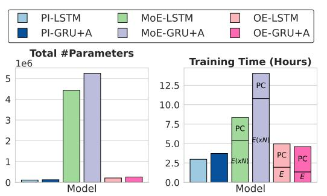

# 6 Conclusion

We introduced the Omni-Expert, a highperforming and compute-efficient alternative to achieving a mixture of expertise in the same model. By conditioning feature transformations on a subtask, the OE model learns to partition the input space into subtask-specific regions, effectively scaling the functionality of multiple experts without incurring the added computational costs. The current OE configuration assumes the subtasks are known to determine the number of experts, as is the case with phonemes. Alternative variants of the OE may be needed in other applications where the specialized subtasks are not as well-defined.

While this work focused on speech dereverberation in cochlear implants, real-world listening

Figure 6: Complexity of phoneme independent (PI), mixture-of-experts (MoE, N = 40 experts) and Omni-Expert (OE) models using long shortterm memory (LSTM) and gated recurrent unit + attention (GRU+A) networks for speech dereverberation in cochlear implants. MoE and OE model training times are marked by the phoneme classifier (PC, same for MoE and OE) and expert (E) networks. Training times based on a Titan V GPU.

scenarios will also include combinations of reverberation and ambient noise (e.g., multi-talker babble, equipment noise, etc). Results with the current mask estimation models trained *only* on reverberant speech and applied to speech in a variety of noisy reverberant settings are presented in Appendix [A.8.](#page-37-0) As expected, there is a significant drop in performance across all models as the signal-to-noise ratio increases. The OE with known phonemes still outperforms the counterpart MoE, indicating that the learned subtask feature transformations are more robust to training/test data mismatch.

Limitations and Future Work. Performance trends observed with objective speech intelligibility measures may not necessarily translate to speech understanding in real-world settings; the test datasets may not fully represent the variety in speech patterns and reverberant room conditions. Additional performance improvements can be obtained with alternative OE model architectures, more diverse datasets for training and advanced training techniques. A relatively lightweight OE model for speech enhancement is more practical for CI deployment and improvements in CI processor chip technology are expected over time. Further work is needed to evaluate real-time feasibility and real-world utility in clinical studies with CI users.

Societal Impact. The OE provides a promising solution for developing compact, high-performing speech enhancement models to increase speech understanding for CI users in challenging listening environments, which can improve the quality of life of CI users. Real-time speech enhancement is also relevant for individuals with hearing aids and automatic speech processing applications that require minimal latency, such as live transcription. More broadly, the computational efficiency and scalability of the OE technique have the potential to address the computational bottleneck associated with MoE in other applications. The core architectural design of substituting multi-expert inference with subtask-specific transformations applied to a single expert is in principle domain-agnostic. In other applications, there is often latent structure among tokens, tasks, or embeddings (e.g., syntactic roles, semantic types, or class labels) and MoE have been applied at the embedding, token/sequence or task level. These can be used to define subtask-specific transformations or input conditioning, which suggests that our Omni-Expert approach could be applicable.

