# Toward Cost-Efficient Serving of Mixture-of-Experts with Asynchrony

Shaoyu Wang1\* Guangrong He1\* Geon-Woo Kim<sup>2</sup> Yanqi Zhou<sup>3</sup> Seo Jin Park<sup>1</sup> <sup>1</sup>University of Southern California <sup>2</sup>University of Texas at Austin <sup>3</sup>Google

### Abstract

Mixture-of-Experts (MoE) architectures offer the promise of larger model capacity without the prohibitive costs of fully dense designs. However, in real-world inference serving, load skew across experts often leads to suboptimal device utilization and excessive synchronization overheads. This paper introduces Asynchronous Expert Parallelism (AEP), a new paradigm that decouples layer execution from barrier-style synchronization. By dynamically queuing tokens at each layer (referred to as *µ*-queuing) and adaptively re-batching them on demand, GPUs avoid waiting for straggling experts and instead continuously process whichever layer is ready. This asynchronous approach mitigates two major inefficiencies in traditional expert-parallel systems: (1) idle GPU time while waiting for the hottest expert, and (2) small-batch executions on colder experts that waste memory bandwidth.

We implement these ideas in a serving system called AMoE, which disaggregates attention from expert layers and uses a defragging scheduler to reduce batch fragmentation. Evaluations on prototype MoE models show that AMoE improves throughput by up to 2.7x compared to state-of-the-art baselines, incurring a manageable latency penalty and providing a cost-effective operating point. Furthermore, experiments demonstrate nearly linear scalability to multi-node settings, whereas the baseline system shows no throughput increase even when the number of GPUs is doubled.

### 1 Introduction

It is well known that the accuracy of a DNN (including LLM) is dependent on the model size [\[9\]](#page-12-0), so high-performance models [\[20,](#page-13-0) [34\]](#page-14-0) are rumored to use more than 1.5 trillion parameters. Unfortunately, such scaling of models increases the serving costs. For example, open AI charges \$150 for 1 million token generation with GPT-4.5 [\[3\]](#page-12-1), prohibitively expensive for everyday applications.

<span id="page-0-1"></span>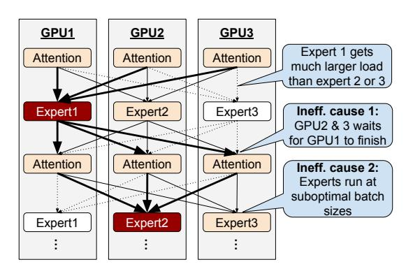

FIGURE 1: Expert load skews causes inefficient GPU executions.

To enable scaling of model sizes without increasing the amount of computation for serving, Mixture-of-Experts (MoE) models are receiving increasing attention [\[1,](#page-12-2) [2,](#page-12-3) [13,](#page-12-4) [15,](#page-13-1) [17,](#page-13-2)[19,](#page-13-3)[25,](#page-13-4)[40\]](#page-14-1). MoE models are composed of many specialized experts, only a few of which (e.g., 1-2) are activated for each token, greatly reducing the amount of computation required for each token. In theory, we can increase the model size for better accuracy without increasing the amount of computation, and it's proven to reduce training cost greatly [\[17\]](#page-13-2).

However, unlike training, today's cost of MoE serving is still suboptimal because of the load skews across experts [1](#page-0-0) . As shown in Fig. [1,](#page-0-1) the load skew causes two serving efficiency challenges: (1) accelerator stalling when experts are sharded across GPUs [\[31\]](#page-13-5) and (2) sub-optimal batch sizes for expert layer computations. Many MoE systems, such as SwitchTransformer [\[17\]](#page-13-2), DeepSpeed-MoE [\[7\]](#page-12-5), DeepSeek [\[13\]](#page-12-4) and GLaM [\[15\]](#page-13-1), shard experts across GPUs to fit large MoE models (expert parallelism). In such sharded deployment, GPUs in charge of cold experts will get lower loads and will be stalling while waiting for the slowest expert to finish. In addition to GPU stalls, expert load skew also hurts GPU efficiency by preventing layers' executions at optimal batch

<sup>\*</sup>Equal contribution

<span id="page-0-0"></span><sup>1</sup>During training, expert loads are self-balanced with a loss function tweak [\[40\]](#page-14-1). However, the workloads during serving are different from training, resulting in significant load skews across experts [\[31\]](#page-13-5)

<span id="page-1-0"></span>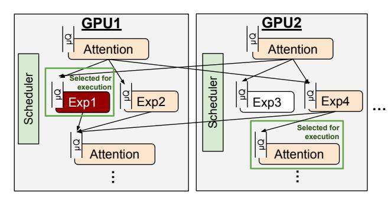

**FIGURE 2:** Asynchronous Expert Parallelism. Schedulers in each GPU freely selects layer to execute with accumulated tokens.

sizes; cold expert computations are heavily bottlenecked by the GPU's High Bandwidth Memory (HBM) bandwidth for loading parameters, while hot experts run at too large of a batch which hurts latency without any throughput benefits.

These inefficiencies arise because today's serving systems batch multiple requests and execute the fixed batch through all layers. With the rigid batching across all layers, all-to-all barrier-style communication before and after expert layers is inevitable and causes inefficiency when loads are not perfectly balanced. Strawman approaches like matching the skewed loads by provisioning more GPUs for hot experts won't work well enough since expert load skews are known to shift dynamically [11,21,23,31].

We propose to solve the efficiency challenges in MoE serving via **Asynchronous Expert Parallelism (AEP)**, where each device can execute and forward output independently in an asynchronous manner (Figure 2). The key technique is layer-wise scheduling: queuing tokens at the granularity of individual layers (which we call  $\mu$ -queuing) and adaptively re-batching and executing just in time with the tokens so far accumulated at the layer's own  $\mu$ -queue. Due to adaptive re-batching, GPUs do not need to wait for barrier-style all-to-all communication to finish. Instead, they stay busy as long as enough load is offered at any layer. By colocating more than one expert layer on a GPU, scheduler can multiplex layers to prioritize execution of hot experts with enough input tokens and let cold experts to accumulate more tokens before execution.

To demonstrate the efficacy of AEP, we built a prototype MoE serving, AMoE. With a small scale (8 experts, 8 GPUs) expert-compute-heavy workloads, our approach improved throughput up to 2.7x from the state of the art serving system with expert parallelism support (SGLang [49]), with a penalty on higher inter-token latency. On an extended scale (16 experts, 16 GPUs), AEP showed almost linear scaling of throughput while SGLang with standard EP showed no throughput increase when scaled from 8 GPU settings.

We make following contributions:

 We propose a new parallel serving method, asynchronous expert parallelism, which can avoid many of limitations

- of expert parallelism while retaining the its benefits of better scalability with low communication overheads.
- We design and implement a new MoE serving system, AMoE, which supports asynchronous expert parallelism (AEP). We address several challenges in realizing AEP:
   (1) token-level dependency tracking (2) queuing delay minimization (3) high performance asynchronous communication.
- We characterize workloads that can most benefit from AFP
- We open-source our serving system, AMoE, for public use.

### 2 Background and Motivation

### 2.1 Efficiency Challenge in MoE Serving

The Mixture-of-Experts (MoE) architecture enhances the efficiency and scalability of large language models by selectively activating only a subset of specialized sub-models, called experts, for each input. A routing layer determines which experts are most relevant, allowing for a significant reduction in computational overhead while enabling the training of models with billions of parameters. By integrating specialized expert layers into transformer architectures, MoE achieves higher performance without increasing computing costs than dense models.

Early MoE research focused on leveraging this sparsity for improved accuracy without increasing FLOPs per to-ken [15, 17, 51, 52]. For instance, the Switch Transformer [17] explored scaling to a large number of experts (up to 2048) while maintaining the same activated parameter size, demonstrating that this could yield higher model accuracy within the same training compute budget. To effectively manage and utilize such numerous experts, expert parallelism (EP) was introduced, distributing individual experts across different hardware devices (e.g., GPUs). This distribution strategy is crucial for enabling computationally feasible training and inference with large-scale MoE models.

However, a key practical challenge arises with expert parallelism: *expert load imbalance*. Tokens within a processing batch are often routed unevenly, causing some experts (and their corresponding devices) to receive significantly more tokens than others. During training, this imbalance was often considered manageable. Mitigation techniques such as auxiliary load balancing losses [30,39], strategies allowing experts to drop excess tokens [15], routing by expert's choice [51] and the use of very large batch sizes helped suppress the negative impacts of load skew.

Since the widespread deployment of large models beginning around 2023, the operational cost of serving inferences has gained critical importance, often outweighing training costs. In this serving context, expert load imbalance poses a serious impediment to efficiency when using EP. The load

<span id="page-2-0"></span>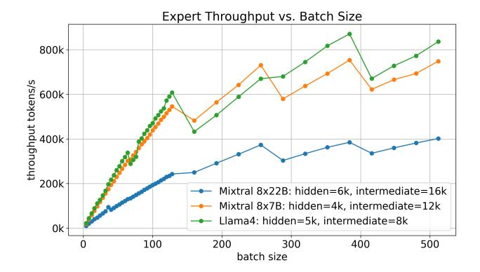

**FIGURE 3:** Execution throughput of a single expert layer with different batch sizes on A100 40GB.

<span id="page-2-1"></span>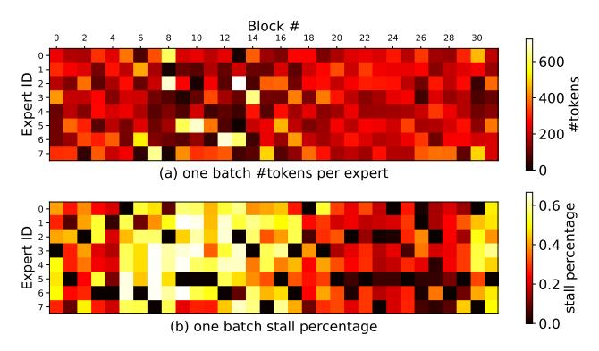

**FIGURE 4:** (a) expert load skew of a single iteration and (b) resulting GPU stall time fraction while serving Mixtral 8x7B with databricksdolly-15k dataset at 100 req/s input rate on DGX A100 40GB (8x A100 40G with NVSwitch) using SGLang with expert parallelism. Mixtral 8x7B has 32 decoding blocks and 8 experts per block.

distribution patterns observed during serving often differ significantly from those during training and can shift dynamically based on the input workload characteristics, nullifying training-time optimizations like auxiliary losses [31]. Typically, serving workloads exhibit both persistent load skew (some experts are consistently favored) and transient, request-dependent skew [11,21,23,31].

This expert load skew introduces two primary efficiency challenges during MoE serving with EP. First, it **prevents expert layer computations from running at optimal batch sizes on all devices.** Experts receiving few tokens ("cold experts") operate with small batch sizes. At these low batch sizes, GPU computation is often bottlenecked by the time taken to load expert weights from High Bandwidth Memory (HBM), leading to underutilization of the GPU's computational units. Figure 3 shows that increasing batch size increases throughput almost linearly until the batch size of 128, suggesting that any executions with smaller batches are wasteful.

Second, the group communication required by EP (all-toall or all-gather operations to exchange tokens before and results after the parallel expert layers) **introduces significant stalling when load skew is present.** Experts receiving many tokens ("hot experts") take considerably longer to complete their computation. This creates a "straggler" effect, where all other devices must wait idly for the device hosting the hottest expert. This waiting time directly translates to lost GPU utilization, sometimes accounting up to 70% of GPU time in skewed scenarios (see Figure 4). Crucially, simply increasing the overall batch size to improve the per-expert computational efficiency (addressing the first challenge) can exacerbate this straggler problem, as it increases the execution time variance between the hottest and coldest experts.

Faced with these efficiency challenges inherent to EP under load skew, developers of prominent recent MoE models such as Mixtral [25], Grok [2], and DBRX [1] have often employed Tensor Parallelism (TP) instead of EP for the expert layers. In TP, each expert's parameters are sharded across all participating GPUs. Since every GPU processes a piece of every expert, the computational load is perfectly balanced across devices, eliminating the straggler problem caused by uneven token distribution. However, TP introduces its own significant communication overheads, requiring frequent and high-volume data exchanges between GPUs for each expert computation. Furthermore, while TP balances load across GPUs, it may not fully resolve the computational inefficiency since cold experts still execute at small batch sizes. Primarily due to the high communication costs, TP-based MoE implementations struggle to scale efficiently beyond a single node (typically 8 GPUs connected via high-speed interconnects like NVLink). This limitation motivates the search for more scalable and efficient serving strategies for large MoE models.

#### 2.2 Disaggregating Prefill from Decoding

Disaggregating the prefill phase from decoding has become increasingly standard in large-scale LLM serving systems [22, 26, 32, 36, 43, 50]. The reason is that prefill typically faces tighter time-to-first-token (TTFT) requirements and is often compute-bound, so it can take advantage of more aggressive parallelization (e.g., intra-operator parallelism) to achieve low latency. By contrast, decoding-especially when it must generate multiple tokens per request—tends to be more HBM-bandwidth-bound and exhibits smaller, frequent computational steps. This mismatch between the phases causes significant interference when they are colocated on the same GPU, making it harder to meet both TTFT and time-peroutput-token (TPOT) targets simultaneously [4, 50]. Thus, by separating prefill onto its own GPUs, the system can tailor resource allocation and model parallelism strategies to precisely satisfy TTFT constraints, leaving the decoding side free to concurrently maximize throughput [50]. However, while prefill can be readily scaled up to utilize GPUs effectively, achieving good GPU efficiency for decoding is much more challenging, particularly in expert-parallel MoE architectures, where routing and load imbalance introduce extra complexity. Therefore, this paper concentrates on tackling the harder

problem of high-throughput decoding, with a specific focus on optimizing expert parallelism in MoE-based LLMs.

### <span id="page-3-1"></span>2.3 Trends of Efficient Attention Mechanism

The attention mechanism's high memory bandwidth and capacity demands have made it a primary bottleneck for extending context length in LLMs. Consequently, numerous efforts focus on reducing its resource consumption.

A major trend involves evolving from standard Multi-Head Attention (MHA) [\[42\]](#page-14-10) to variants like Grouped-Query Attention (GQA) [\[5\]](#page-12-8) and Multi-Query Attention (MQA) [\[38\]](#page-14-11). By sharing Key (K) and Value (V) projections across query heads (partially in GQA, fully in MQA), these methods substantially reduce the size of the memory-intensive KV cache. Other architectural ideas like Multi-Layer Attention (MLA) [\[13\]](#page-12-4) explore cross-layer information processing. Complementary to architectural changes, KV cache quantization reduces the precision of stored K/V tensors (e.g., to INT8 or lower) [\[18,](#page-13-11) [44,](#page-14-12) [47\]](#page-14-13), further decreasing memory footprint and bandwidth usage.

For extremely long contexts exceeding device memory, efficient KV cache management strategies have been suggested. Techniques like InfiniGen [\[29\]](#page-13-12) employ intelligent offloading and management to handle vast KV caches with bounded memory growth, mitigating the latency penalties of naive offloading to slower memory tiers. Furthermore, research explores specialized hardware, such as Processing-in-Memory (PIM) [\[27\]](#page-13-13), which performs computations closer to memory to alleviate the data movement bottleneck inherent in attention.

As these diverse optimizations make attention more efficient, we anticipate that the primary performance bottleneck, particularly in Mixture-of-Experts (MoE) models, will shift towards the execution of the large expert layers.

## 2.4 Our Approach: Asynchronous Expert-Parallel Decoding

To address the efficiency challenges in large-scale MoE serving, we propose asynchronous expert parallelism, where each device can execute and forward output independently in an asynchronous manner. The key technique is layer-wise scheduling: queuing tokens at the granularity of individual layers (which we call *µ*-queuing) and adaptively re-batching and executing just in time with the tokens so far accumulated at the layer's own *µ*-queue. Due to adaptive re-batching, GPUs do not need to wait for barrier-style all-to-all communication to finish. Instead, they stay busy as long as enough load is offered at any layer. By colocating more than one expert and layer on a GPU, scheduler can multiplex layers to prioritize execution of hot experts with enough input tokens and let cold experts to accumulate more tokens before execution.

Despite the advantages offered by the layer-wise scheduling, three key challenges must be addressed to achieve optimal performance.

1. Token-level dependencies need to be carefully handled to preserve the semantics of the Top-K gating function.

<span id="page-3-0"></span>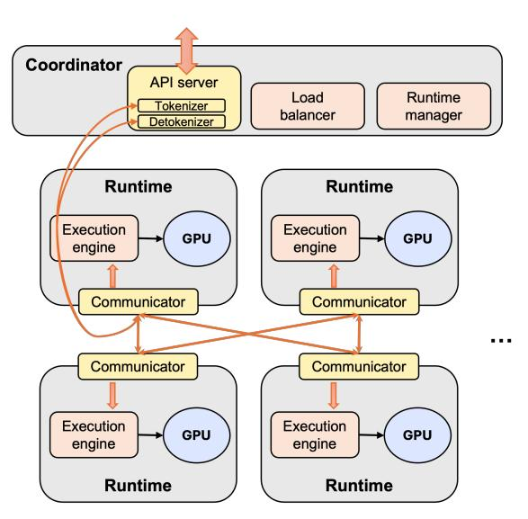

FIGURE 5: System architecture of AMoE.

This must be achieved while allowing tokens from different sequences to be processed independently, thereby maintaining efficiency.

- 2. Having many layers that can be executed asynchronously can increase the queuing delay as tokens wait for their turn for execution. The layer placement and scheduling algorithm should be able to minimize queuing delays to ensure low latency and high throughput.
- 3. An effective communication mechanism is required in replacement of all-to-all. This mechanism must facilitate the transfer of tokens between nodes without causing device stalls.

In the following section, we will discuss how we addressed these challenges.

### 3 Design

To demonstrate the benefits of asynchronous expert parallelism, we designed a prototype MoE inference serving system, AMoE.

### 3.1 Overview

AMoE is a Mixture-of-Experts (MoE) large language model (LLM) serving system compatible with vLLM [\[28\]](#page-13-14). AMoE splits MoE models into granular layers, allowing each layer to be individually scheduled asynchronously without being blocked by group communication across parallel GPUs. Specifically, we assume MoE architecture with multiple decoding blocks, each composed of an attention layer followed by a set of expert layers. We consider MoE's gating and top-K merge operators as part of the attention layer. Each decoding block is also often called one layer in some literature.

AMoE supports data parallelism (DP) for attention layers and expert parallelism (EP) for expert layers, which aligns with today's standard for MoE deployments [\[14,](#page-12-9)[15,](#page-13-1)[37\]](#page-14-14). However, AMoE does not use blocking group communication before or after these parallel-execution layers.

As shown in Figure [5,](#page-3-0) AMoE is composed of two types of services: coordinator and runtime. The coordinator is a CPU-run service, which may reside on the same host machine as GPUs (for small-scale deployments) or independently (for large-scale deployments). The coordinator consists of three components: API server, load balancer, and cluster manager. The API server handles incoming serving requests and maintains request states throughout the auto-regressive decoding process. It also includes a tokenizer and de-tokenizer. The load balancer monitors GPU memory usage across attention data-parallel (DP) ranks and assigns each new request to the rank with the most available memory. Once assigned, a request remains bound to the same DP rank for its entire autoregressive decoding process, ensuring that all attention-related computation can reuse the key-value cache on the same GPU. The cluster manager oversees runtimes for GPUs, including setting up communication channels during initialization and tracking GPU memory usage, which is then provided to the load balancer. Together, these components serve as a centralized controller in AMoE to manage requests and workers.

Another component of AMoE is the runtime. AMoE assigns a separate runtime instance to each GPU. Each runtime handles the execution of several layers assigned by the coordinator. The runtime receives tokens from another runtime or tokenizer in the API server (for new requests), executes the appropriate layer for each token, and forwards tokens to either another runtime or the API server (for completed requests). The runtime manages layer-wise token queuing with dependency tracking ([§3.2\)](#page-4-0), GPU task scheduling ([§3.4\)](#page-6-0), and efficient communication between runtimes ([§3.5\)](#page-6-1). To minimize overheads, each token's input/output tensor data are kept in GPU memory and transferred directly to another GPU. The runtime manages these tensor data with metadata on the CPU side.

### <span id="page-4-0"></span>3.2 Execution engine

The core of the runtime is the execution engine, which asynchronously accumulates tokens and executes layers with the correct input on its GPU. Unlike typical MoE serving systems that rely on group communication, AMoE allows flexible asynchronous executions, which may reorder tokens in a random fashion throughout an iteration. Therefore, AMoE directly manages incoming tokens by associating each token's tensor data with metadata. By referring to this metadata, the execution engine can select the optimal layer for execution and supply the correct input tensor data.

Execution engines retain input tensor data on GPUs to avoid CPU-GPU data transfer overheads and track these tensor data with metadata on the CPU. Table [1](#page-4-1) lists the information tracked for each token. RequestID accompanies each token throughout the auto-regressive decoding process, allowing us to associate the generated output token with the user

#### <span id="page-4-1"></span>Metadata for Tokens

- RequestID: used for tracking generated output token and attention DP rank
- LayerID: indicates the layer this token should be used as input for. It is composed of <block#> + <expert#> or <attn DP rank>
- Tensors[]: reference to input tensors on the GPU
- Prefill\_length: used for attention
- Topk\_weights: used for top-k token merging

TABLE 1: List of token metadata items

request. This is important since tokens may shuffle around due to asynchronous queuing and execution, making it impossible to infer each token's request ID based solely on its index in the global batch. Similarly, LayerID is set before forwarding a layer's output to the next layer, indicating the target layer for execution with this token. If the target layer is an expert layer, LayerID is composed of <block#> + <expert#>. If it is an attention layer, LayerID comprises <block#> + <attn DP rank>. LayerID is first used by the communicator to determine the next destination of the token and subsequently used by the receptor to queue the received token into the correct queue. This metadata structure retains references to input tensor data on the GPU (Tensors[]), which can be more than one if the target layer requires multiple input tensors. In addition to these three token management metadata items, a token may also carry additional metadata required for attention execution or MoE's top-K token merging.

Using the metadata, the execution engine processes input tokens in 4 stages as shown in Figure [6.](#page-5-0) First, receptor is the entry point for incoming token batches fetched from the communicator. Receptor segregates the received metadata of tokens by the LayerID and enqueue them to the corresponding layers' queues. Second, whenever GPU becomes idle, scheduler picks the layer whose queue should be drained for execution. Third, executor drains the selected queue, transfer necessary metadata to the GPU (e.g., prefill length for attention layers), and launch corresponding kernels for execution. Here, executor launches our custom CUDA kernel for preparing a contiguous input token batch from many individually arrived token batches. Lastly, when execution on GPU is finished, dispatcher re-labels the output tokens with next LayerIDs, which are then forwarded to the communicator.

Top-K support: Supporting top-K (*K* > 1) requires additional mechanisms beyond those described above. After routing (the last operator in the attention layer in AMoE), a token is duplicated *K* times and dispatched to *K* different experts for processing by the dispatcher. These duplicated tokens serve as input tensors for the attention of the next block (whose first operator is the top-K merge operator). Until all inputs are ready, we cannot execute the attention layer. To ensure the

<span id="page-5-0"></span>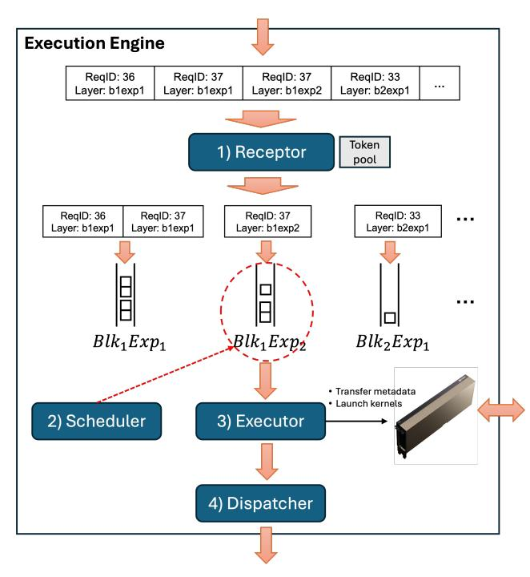

FIGURE 6: The data flow of a token batch within runtime involves four steps: (1) receptor puts incoming tokens into the corresponding layer-specific *µ*-queues, (2) scheduler picks the optimal layer for execution, (3) executor runs the selected layer's computation on GPU, and (4) dispatcher assigns next destination for tokens

scheduler and executor are dealing only with "ready" tokens whose inputs are already on the GPU, the receptor retains the incomplete tokens until all input tensors have arrived and are ready. When a new token batch arrives, the receptor inspects whether a token is ready by itself. If the token needs more than one input for the next layer execution, it holds the token in a *token pool*. At the token pool, previously duplicated tokens (identified by the tuple <RequestID, LayerID>) are merged into a single token. Once a token is merged and has all input tensors ready, the receptor moves the token to the corresponding *µ*-queue for scheduling.

Executor details: Executor directly controls the GPU. Once the layer to execute is selected by scheduler, it performs forward computation for the selected layer. KV cache management is also handled by executor. AMoE leverages paged attention [\[28\]](#page-13-14), and each executor manages its GPU's block table that maps requests to key-value (KV) cache blocks. Although layers operate independently, all attention layers on the same GPU share one page table as KV cache is are isolated for each layer. A new KV slot is allocated for a token only upon entering the first layer, allowing block table reuse across layers and reducing allocation overhead. While all layers follow the same execution model, the first attention layer requires additional processing to convert input tokens into embeddings.

Furthermore, the runtime with the first attention layer in-

cludes a sampler, which sample out previous iteration's output tokens from embeddings. We place a separate sampler on each GPU with the first attention layer to avoid extra communication overhead. The sampler is treated equivalently to other attention layers and must be scheduled before execution.

Dispatcher details: After each execution, the output tensors should be forwarded to the another runtime and GPU that are in charge of the next layer of the model. The dispatcher coordinates this output forwarding process. After attention layer execution (thus, next is an expert layer), dispatcher identifies each token's assigned expert and permutes tokens by expert ID to group them. The permuted tokens are then split into several smaller batches and sent to appropriate expert workers over the network based on expert placement. In expert workers, tokens are instead permuted by their assigned attention DP rank, as their context remains on the same attention worker. The dispatcher also increases the layer ID of each batch by one, reflecting their transition to the next layer's attention module.

### 3.3 Layer placement

AMoE's default placement strategy disaggregates attention layers from expert layers and colocates all layers of each type across all decoding blocks. For example, a GPU/runtime handling Expert 1 will host all Expert 1 layers across all decoding blocks.

We colocate each layer type across all decoding blocks for several reasons, as done by many other MoE systems [\[14,](#page-12-9) [15,](#page-13-1) [37\]](#page-14-14). An alternative placement strategy would be sharding models across decoding blocks, essentially forming pipeline parallelism (PP). We chose not to shard models into multiple pipeline stages because pipelining can cause load imbalance and result in high latency. Instead of PP, allocating GPUs for more data parallelism (DP) for attention or expert parallelism (EP) for experts can reduce iteration time. While PP may reduce queuing delay for the first token decoding, it introduces higher inter-token latency, which is more significant for auto-regressive decoding. However, when there are abundant GPUs, AMoE can utilize those GPUs to reduce collocation and form multiple pipeline stages.

One of the key concerns with colocating multiple layers onto a single GPU/runtime is queuing delay. By colocating across all blocks, we can optimize scheduling by exploiting the precedence and ordering of layers ([§3.4\)](#page-6-0). Since tokens proceed to higher block#, the scheduler can try to congregate most tokens to one or two consecutive blocks, minimizing queuing delay for the majority of tokens.

We chose to disaggregate attention from experts to enable further layer-type-specific optimizations. Disaggregated deployment allows us to use a different number of GPUs for attention and expert layers. We observed that for some longer context generation tasks, KV-cache space in the GPU memory limits the number of concurrent requests in the decoding process, leading to GPU under-utilization during expert layer

<span id="page-6-2"></span>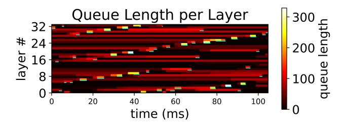

**FIGURE 7:**  $\mu$ -queue depth of an attention runtime with MTFS scheduling. Input rate is 200 requests for each second. Trace is collected from Figure 11 top-2 setting.

computation. By allocating more GPUs for attention, we can achieve higher throughput without needing additional GPUs for experts. Additionally, due to the memory capacity and bandwidth-intensive nature of attention layers, there are increasing efforts to adopt heterogeneous hardware for attention layers. AMoE can naturally adopt this improved hardware for attention. Finally, by disaggregating, we can better understand the benefits of Asynchronous Expert Parallelism in improving the efficiency of expert computation.

We considered developing a placement optimizer for a given cluster setting, but it is beyond our focus on validating the benefits of AEP. However, AMoE opens up opportunities for more flexible placement optimization, especially in heterogeneous clusters.

#### <span id="page-6-0"></span>3.4 Defragging Scheduler

Each runtime in AMoE hosts multiple layers. Whenever the GPU becomes available, the scheduler selects one of the layers for the next execution. We found that the selection strategy can significantly impact the latency and throughput of AMoE.

There are two strawman strategies that motivated AMoE's defragging scheduler. The first strawman is selecting the layer with the most tokens in the queue, which we call the "mosttoken-first-serve (MTFS)" strategy. At first glance, prioritizing the layer with the most tokens over layers with fewer tokens sounds reasonable, as it can reduce queuing delay for more tokens. However, this strategy causes an interesting problem: batch fragmentation. Figure 7 shows an example of the queue depth of each layer and their executions over time. In AMoE, a batch of tokens is distributed to many GPUs for attention DP. Then, some attention GPUs will return their attention output earlier than others. Conversely, the attention output batch is split and distributed to many expert GPUs. Because AMoE doesn't rely on blocking group communication, which merges all messages from all nodes, token batches naturally get fragmented unless they sit in the queue long enough to wait for more tokens. The *most-token-first-serve* strategy doesn't help here. It tends to leave out the last slice of tokens for a layer since the next layer may accumulate more tokens by then. Every layer in the execution pipeline will leave out these orphans, leading to disorganized and fragmented batches. This is not ideal, as it increases queuing delay and lowers execution

### <span id="page-6-3"></span>Algorithm 1 Defragging Scheduler

```
1: Input: N_B: NumBlocks, N_E: NumExperts, Q[l,g]: TokensIn-
     Queue, δ: WeightDecay
     Output: (b^*, e^*): Optimal (block, expert) to schedule
     Init Scores[N_B][N_E] \leftarrow 0
     for b \leftarrow 0 to N_B - 1 do
          LScore \leftarrow 0

 5:
          for k \leftarrow 1 to K do
 6:
 7:
               b' \leftarrow (b+k) \bmod N_B
               TotalTokens \leftarrow \sum_{e'=0}^{N_E-1} Q[b'][e']

LScore \leftarrow LScore + \left(\frac{TotalTokens}{N_e}\right) \times \delta^k
 8:
 9:
          end for
10:
          for e \leftarrow 0 to N_E - 1 do

    ▷ Add lookahead with #tokens

11:
               if Q[b][e] > 0 then
12:
13:
                     Scores[b][e] \leftarrow LScore + Q[b][e]
14.
               end if
          end for
15:
16: end for
17: (b^*, e^*) \leftarrow \arg\max_{b,e} Scores[b][e] \triangleright Pick layer with max score
18: return (b^*, e^*)
```

efficiency.

The opposite strawman is the *first-layer-first-serve* (FLFS) strategy, which prioritizes earlier layers (e.g., lower block#). By strictly prioritizing any earlier layer with some tokens, FLFS aggressively defragments execution batches and tries to maintain all tokens within one frontier layer. This extreme strategy performs reasonably well thanks to the autoregressive decoding; a well-merged wave of tokens will benefit the next iteration as well. However, it still has some drawbacks. Any newly introduced tokens (new requests) will take priority until they are merged into the main wave of tokens. With many short requests, the system may live lock and can hardly finish any requests. A better behavior would be for these tokens to wait until the main wave picks them up in the next iteration.

From these two strawman strategies, our scheduling algorithm aims to achieve a balance: promoting defragmentation like FLFS while considering queue occupancy like MTFS, thereby preventing both excessive fragmentation and interruption by new requests. Algorithm 1 presents a simplified version of our defragging scheduler algorithm. It calculates a score for each layer by combining the number of tokens currently waiting in that specific queue with a weighted lookahead score. The lookahead score estimates the density of tokens in subsequent layers down the pipeline, decaying the contribution of farther layers. By incorporating this lookahead, the scheduler favors executing layers that precede a dense wave of upcoming tokens, encouraging consolidation and forward progress. Unlike FLFS, it still can still leave out some fragments to limit inefficient small-batch executions.

<span id="page-6-1"></span>This combined approach allows the scheduler to dynamically adapt, processing larger, consolidated batches when possible while still efficiently managing the flow of tokens across all layers and mitigating excessive queuing delays.

#### 3.5 Communicator

Each runtime in AMoE includes a communicator module that manages point-to-point (P2P) communication across runtimes. To take advantage of the fast GPU interconnect and avoid PCIe bottlenecks, AMoE uses NCCL as the primary transport. However, there are two challenges in using NCCL: sender/receiver synchronization and variable tensor sizes.

<span id="page-7-0"></span>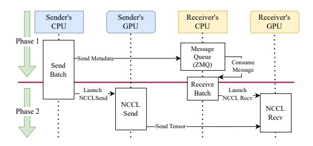

**FIGURE 8:** The communication in AMoE to transfer one batch between the sender and the receiver

With NCCL's P2P API, both the sender and receiver GPUs must invoke the NCCLSend and NCCLRecv kernels simultaneously to initiate data transmission. Additionally, the receiver must know the sender GPU rank and tensor size in advance. In AMoE, due to varying user requests and scheduling, a runtime may receive batches with a dynamic number of tokens from many other GPUs at any time. Therefore, a mechanism is needed to set up this transfer before initiating NCCL.

Figure 8 illustrates our solution: a two-phase communication process. Before initiating NCCL transmission (Phase 2), the sender sends metadata to the receiver through a message queue library, ZeroMQ [10], on the CPU (Phase 1). Each communicator maintains a message queue to iteratively consume metadata from any senders. Upon receiving new transmission metadata, it creates a NCCL buffer of the size specified in the metadata.

After exchanging metadata, NCCL transmission (phase 2) begins. The sender and receiver launch NCCLSend and NCCLRecv respectively, where the CPU side initiating the NCCL kernels on GPU streams. After launching the NCCL kernels, the CPU side proceeds to the next transmission task (such as checking the ZeroMQ queue) without waiting for the NCCL kernels to finish. Before releasing the received tensor to the scheduler, the communicator synchronizes with the GPU to ensure that the NCCL transmission is complete. The sender does not need to synchronize since the batch is no longer used after transferring. Consequently, a single-threaded communicator can send or receive multiple batches concurrently.

### 4 Implementation

We implement AMoE from scratch, comprising 6K lines of Python and 4.8K lines of C++ code. The runtime is primar-

ily written in Python to take advantage of the highly optimized model execution infrastructure provided by vLLM [28]. While the model executor resides in Python, the communicator, receptor, scheduler, and dispatcher of the execution engine are developed in C++ to reduce the overhead associated with layer-wise scheduling. These components expose interfaces to Python through pybind11. The scheduler and executor execute within the main Python thread, while the receptor and dispatcher run on dedicated POSIX backend threads to facilitate efficient communication-computation overlap. The usage of C++ helps to bypass python's Global Interpreter Lock (GIL) and make all component operate concurrently.

**CUDA Graphs.** We build CUDA Graphs with pytorch to reduce the launching overheads of multiple small CUDA kernels for small batch sizes in the attention engine. Conventionally, serving systems record G graphs for the entire model, each corresponding to a disjoint batch size range. In AMoE, however, scheduling and execution are performed at the layer level. We record G graphs for every layer, leading to  $L \times G$  layer-wise graphs, where L denotes the number of layers. It incurs huge memory footprints as each graph maintains static data buffers. We alleviate the memory pressure by sharing the input buffer across all graphs. Meanwhile, intermediate and output buffers are allocated in the runtime, we track these buffers to get the results of computation.

Although CUDA Graph can effectively accelerate the attention engine when batch size is small, they are less beneficial for expert computation in AMoE. Execution in the expert engine is dominated by heavy GEMM (General Matrix Multiplication) kernels, interleaved with a few lightweight kernels. The CPU is able to asynchronously launch kernels during the first GEMM kernel, thereby minimizing kernel launch latency. In AMoE, we observe this kernel launch latency smaller than the combined overhead copying data to CUDA graph input buffers.

**Batch Management in Attention Executor.** The attention executor imposes additional requirements on the input batch. Specifically, it allocates new key-value slots for incoming tokens and locates their corresponding key-value pages. Keyvalue metadata along with the current decoding lengths of the associated requests are then transferred from CPU to GPU memory, where they are later consumed by the paged attention kernels. After attention computation, the expert indices and weights for each token must be copied back from GPU to CPU to allow the dispatcher to correctly route the tokens. This execution workflow involves many small memory transfers between CPU and GPU. To optimize performance, we fuse these small copies into larger batched transfers, thereby reducing kernel launch overheads. Additionally, data transfers are offloaded to a dedicated CUDA stream, ensuring that communication does not block the main execution thread. We introduce and analyze the details in §5.4.

<span id="page-8-1"></span>

| GPU          | 8 × NVIDIA A100-SXM4-40GB               |
|--------------|-----------------------------------------|
| Interconnect | NVSwitch (600 GB/s for each GPU)        |
| Network      | 4 × 100 Gbps Elastic Fabric Adapter [6] |
| Driver       | CUDA 12.4, cuDNN: v9.1.0, NCCL 2.22.3   |
| CPU          | 2 × AMD EYPC 64 cores @ 1.5 GHz         |
| RAM          | 988 GB                                  |
| OS           | Ubuntu 22.04.1 (Linux 6.8.0-1021-aws)   |

TABLE 2: AWS P4 instance configuration.

| GPU          | 8 × NVIDIA A100-SXM4-80GB             |
|--------------|---------------------------------------|
| Interconnect | NVSwitch (600 GB/s for each GPU)      |
| Driver       | CUDA 12.8, NCCL 2.25.1                |
| CPU          | 2 × AMD EYPC 64 cores                 |
| RAM          | 1800 GB                               |
| OS           | Ubuntu 22.04 (Linux 6.8.0-52-generic) |

TABLE 3: Lambda instance configuration.

### 5 Evaluation

Our evaluation aims to answer the following questions:

- 1. Does AMoE provide better throughput and latency than the state-of-the-art expert-parallel serving system?
- 2. On what kinds of workloads does AEP have an advantage over EP?
- 3. Does AEP allow better scalability than TP or standard EP?
- 4. How much does defragging scheduler help on throughput and latency?
- 5. How much overheads does layer-wise scheduling incur?

To answer the questions above, we measured the performance of AMoE and state of the art serving system, SGLang [\[49\]](#page-14-2). We modified SGLang to bypass the prefilling stage by populating KV cache with dummy data and focus solely on decoding, which is consistent with AMoE's setup. For most evaluations ([§5.1,](#page-8-0) [§5.3\)](#page-10-2), we benchmarked the decoding performance of AMoE and SGLang with Mixtral 8x7B which has 8 experts on the hardware listed in Table [3.](#page-8-1) To mimic the realistic expert load skew, we profiled expert load distribution using Dolly dataset [\[12\]](#page-12-12) and fitted it to an exponential distribution. We replaced the routing layer in Mixtral 8x7B with our own routing which randomly selects experts based on the profiled exponential distribution.

For scalability benchmark ([§5.2\)](#page-9-0), we mimicked the Llama-V4 by increasing the number of experts of Mixtral 8x7B to 16 and using top 1 routing. This 16 experts model is deployed to 2 instances of AWS p4dn machines (Table [2\)](#page-8-1), totaling 16 GPUs over datacenter networking.[2](#page-8-2) We also replaced the routing layer with the exponential distribution modeled by profiling Mixtral 8x7B [\[25\]](#page-13-4) with Dolly dataset.

Adjusting attention-expert intensity: To emulate realistic, production-scale MoE serving workloads on our limited-scale

hardware, we rebalance the load on attention and expert layers in two ways.

First, we modify Mixtral's attention mechanism from Grouped-Query Attention (GQA) [\[5\]](#page-12-8) to Multi-Query Attention (MQA) [\[38\]](#page-14-11) to mitigate KV cache space limitations. With the original GQA, KV-cache capacity constraints both systems from processing many requests concurrently, resulting in roughly similar performance. As discussed in [§2.3,](#page-3-1) there is a plethora of research on improving KV cache efficiency in attention mechanisms. Notably, DeepSeek proposes Multi-head Latent Attention (MLA) [\[14\]](#page-12-9), which compresses KV cache usage by 10x without compromising model performance. Hence, we believe reducing KV cache contention via MQA is a reasonable approach to highlight AEP's advantage over standard EP for emerging MoE models.

Second, we maintain a balance between attention and expert computation intensity by using relatively short input and output token lengths. Based on DeepSeek and other production models, we believe expert computation is considerably more intensive than attention computation for large production-scale MoE models [\[14,](#page-12-9) [33\]](#page-14-15). Unfortunately, due to our benchmark hardware limitations, we use a smaller version of Mixtral, namely Mixtral 8x7B, whose expert computation is about 2x lighter than the larger Mixtral 8x22B (Figure [3\)](#page-2-0). With long-context workloads, we observe that attention computation dominates in Mixtral 8x7B. Therefore, we focus on shorter decoding workloads so that the expert computation bottleneck is not obscured by the small MoE model.

Workloads: We compare the performance of three different types of decoding workloads:

- *Short*: input [30, 70], output [70, 130]
- *Medium*: input [50, 150], output [50, 250]
- *Reasonable*: input [100, 300], output [100, 500]

For each workload, we generate new requests through a Poisson arrival process with a given rate, and each request picks its input length and output length with uniform random selection from the ranges listed above.

### <span id="page-8-0"></span>5.1 Performance over various workloads

We begin by comparing AMoE with our baseline serving system, SGLang, using Mixtral 8x7B with 8x A100 80GB GPUs on a single host. AMoE disaggregates attention layers to 4 GPUs with DP and uses the other 4 GPUs for expert layers with EP. SGLang uses DP for attention layers and EP for expert layers over all 8 GPUs.

Figure [9](#page-9-1) presents a high-level comparison of AMoE and our baseline SGLang under various routing (Top-1 and Top-2) and workload configurations. Each subplot in Figure [9](#page-9-1) plots the achievable token throughput on the x-axis against the corresponding average inter-token latency (ITL) on the y-axis. Across all scenarios in Figure 9, AMoE consistently achieves higher throughput than SGLang.

As depicted in Figures [9](#page-9-1) (a)–(c), AMoE consistently achieves higher throughput than SGLang when using Top-1

<span id="page-8-2"></span><sup>2</sup>Lambda cluster in Table [3](#page-8-1) was not designed for large scale inference and has very slow networking (∼10 Gbps).

<span id="page-9-1"></span>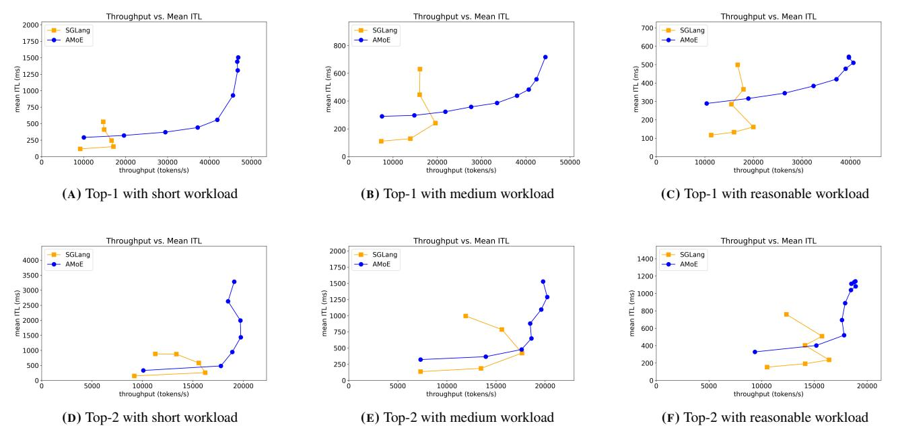

FIGURE 9: Overall performance comparison between AMoE and SGLang. Shows achievable throughput (x-axis) and corresponding observed inter-token latency (y-axis) under different routing and workload settings.

routing across all three request-length categories: 2.7x, 2.3x, and 2.0x for short, medium, and reasonable workloads correspondingly. We attribute this improvement to AMoE 's ability to dynamically re-batch tokens at each GPU and expert, thereby reducing GPU stalls even when the load distribution is skewed. However, under low loads, SGLang shows lower ITL than AMoE. This is because of layer-wise scheduling overheads and attention disaggregation.

A similar trend persists under Top-2 routing, shown in Figures [9](#page-9-1) (d)–(f). AMoE retains its throughput advantage over SGLang, although the level of throughput improvement is less significant than Top-1. We suspect two reasons on this. First, Top-2 routing's increased expert activation percentage (from 12.5% to 25%) partially tempers load skew by distributing tokens more evenly among the experts. Second, Top-2's token merge operation needs to wait for both outputs from experts, creating a partial synchronization point and reducing the benefit of asynchronous expert parallelism.

### <span id="page-9-0"></span>5.2 Scalability (multi-node)

We next examine how asynchronous expert parallelism performs when scaling to larger model sizes and higher parallelism, especially to a multi-node setting with datacenter networking. This benchmark is to help on predicting performance for production-scale models which has tens or hundreds of experts on many expert-parallel GPUs.

Figure [10](#page-9-2) plots the token throughput on the x-axis against the average inter-token latency (ITL) on the y-axis for a scaled-up configuration, where both the number of experts and the number of GPUs are increased (16 experts and 16 GPUs across two nodes). We use medium workload and Top-

<span id="page-9-2"></span>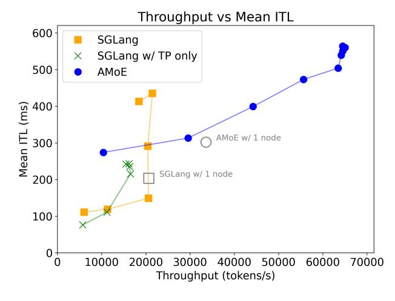

FIGURE 10: Performance comparison using medium workload and top-1, under a scaled setting (16 experts on 16 GPUs). The two greyhollow markers represent the best performance under the one-node setting using AWS.

.

1 setting following Figure [9b.](#page-9-1) Compared to the baseline 8 expert setup, this expanded deployment showcases notable scalability characteristics.

When compared to SGLang with EP, AMoE can achieve 3x throughput improvement with a comparable ITL. The throughput gap is larger than on the single node setting with 8 experts and 8 GPUs, suggesting better scalability of AMoE. With more experts, systems are more susceptible to load skew, thus SGLang's throughput didn't scale even with twice number of

<span id="page-10-0"></span>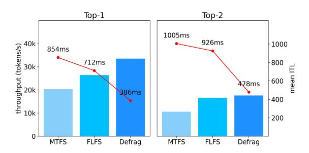

FIGURE 11: Compare different schedule policy at 80% throughput. Using MQA, medium length. across experts. Top-1: input rate 250. Top-2h: input rate 150.

<span id="page-10-3"></span>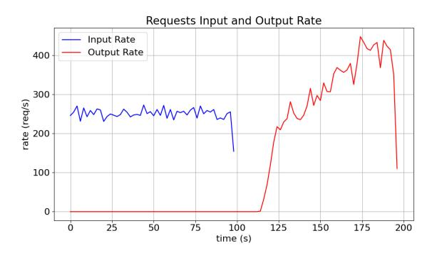

FIGURE 12: Request input and output rate for FLFS at input rate 250 under MQA, top-1.

GPUs. On the other hand, AMoE's throughput continues to increase, eventually achieving 1.92x improvement.

At low input rates, AMoE exhibits higher ITL compared to SGLang, primarily due to the overhead introduced by layerwise scheduling. However, as the input rate increases, the latency of AMoE remains relatively stable, demonstrating its ability to handle a larger volume of requests. We continue to raise the input rate until the throughput reaches saturation. Ultimately, the ITL stabilizes, indicating that the system's performance is bounded by the available KV cache capacity.

### <span id="page-10-2"></span>5.3 Efficacy of defragging scheduler

We now assess the impact of our proposed defragging scheduler on system throughput and latency under different routing strategies, focusing on how the scheduler balances batch fragmentation and forward progress.

Figure [11](#page-10-0) compares these scheduling policies when the system operates at approximately 80% of its maximum achievable throughput with defragging scheduler for two routing modes: Top-1 (left) and Top-2 (right). Defragging scheduler effectively minimizes batch fragmentation and shows both lower ITL and higher throughput than most-token-first-serve (MTFS) and first-layer-first-serve (FLFS) strategies.

Under FLFS, the scheduler always prioritizes lowernumbered blocks (i.e., those earlier in the decoding sequence) whenever there are tokens waiting in those queues. This approach effectively minimizes batch fragmentation but can

<span id="page-10-4"></span>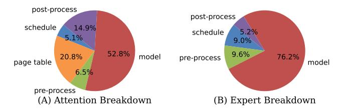

FIGURE 13: The attention execution takes 2.7 ms in total while the expert execution takes 0.8 ms.

severely interrupt higher-block progress, especially if new requests arrive continuously.

Figure [12](#page-10-3) illustrates how FLFS can struggle when new requests keep arriving for Top-1 routing. We plot both the request input rate and the system's request completion rate over time. Notice that once FLFS focuses on an early block for a batch of tokens, new arrivals preempt later blocks' tokens, creating persistent waiting at higher block layers. As a result, the output rate falls behind even though the input rate remains steady. By contrast, our defragging scheduler more evenly coordinates resource usage across blocks and prevents long stalls at higher block layers, increasing the output rate closer to the input rate.

### <span id="page-10-1"></span>5.4 Execution breakdown

We conduct an in-depth investigation of the overheads introduced by layer-wise scheduling and execution. In AMoE, each execution step comprises five primary stages:

- Schedule. The scheduler inspects the current queues and selects one layer for execution. It drains the queue and merges all tokens into one batch.
- Page Table. The table manager allocates new key-value slots for incoming tokens and retrieves existing KV cache pages for each token. This stage is absent in expert layers.
- Pre-processing. The executor prepares the necessary data for execution, including transferring data from CPU to GPU memory.
- Execution. The executor launches the appropriate kernels to process a batch of tokens.
- Post-processing. Selected outputs from execution are transferred from GPU to CPU memory to provide routing information for the dispatcher. Tokens are permuted according to either expert indices or attention data parallel indices to facilitate batch transmission.

We sample one attention execution step and one expert execution step from a benchmark with medium workloads in Figure [9b](#page-9-1) and analyze the cost of each stage. The attention step takes 2.7 milliseconds, while the expert step takes 0.8 milliseconds. Figure [13](#page-10-4) presents a detailed breakdown of an execution step for both attention and expert layers. In the attention worker, page table management incurs significant overhead, as each token must traverse the page table to retrieve its associated pages. Post-processing is also costly, as expert indices and corresponding weights must be transferred from GPU to CPU for dispatching following attention execution. However, as the length of each token's KV cache increases, the cost of page table operations and post-processing diminishes relative to attention execution, which eventually dominates the execution step.

In contrast, during expert layer execution, the majority of time is spent on kernel computation. This is because expert kernels operate independently of metadata, and no results need to be transferred back to the CPU for subsequent dispatching, resulting in minimal post-processing overhead.

Across both attention and expert layers, the scheduling stage accounts for only a small fraction of the total time. We attribute this efficiency to our highly optimized C++ and CUDA implementation, which manages batches and token hidden states with minimal overhead.

### 6 Related Works

### 6.1 MoE Serving Systems

Several systems have been proposed to optimize the serving performance of MoE models to realize their reduced per-token computational cost [\[14,](#page-12-9) [31,](#page-13-5) [37,](#page-14-14) [46\]](#page-14-16). DeepSpeed-MoE [\[37\]](#page-14-14) extends expert parallelism by introducing fine-grained expert sharding, where each expert can be further divided into smaller slices, and proposes hierarchical all-to-all communication to support this finer granularity. Although this approach improves scalability with a large number of accelerators, it remains vulnerable to load imbalance caused by expert skew.

To mitigate this issue, DeepSeek-MoE [\[14\]](#page-12-9), Lina [\[31\]](#page-13-5), and ExFlos [\[46\]](#page-14-16) leverage profiling of token routing patterns. DeepSeek-MoE and Lina duplicates frequently accessed (hot) experts based on the profiled token distribution, while ExFlos rearranges expert placement to maximize inter-layer token locality and reduce all-to-all communication volume. Despite these optimizations, existing systems continue to suffer from strict synchronization barriers imposed by all-to-all communications and the under-utilization of accelerators due to suboptimal batching in cold experts. In contrast, AMoE breaks this synchronization barrier and achieves higher GPU utilization through asynchronous expert parallelism.

Another line of work focuses on enabling efficient MoE serving under memory-constrained environments [\[8,](#page-12-13) [16,](#page-13-15) [24,](#page-13-16) [45\]](#page-14-17). To address the expanded memory footprint of MoE models, MoE-Offloading [\[16\]](#page-13-15) places experts in CPU memory and dynamically fetches the necessary experts to the GPU for execution. MoE-Infinity [\[45\]](#page-14-17) exploits the temporal locality of accessed experts by caching a frequently used subset on the GPU. Further advancements, such as Pregated-MoE [\[24\]](#page-13-16) and ReadME [\[8\]](#page-12-13), introduce new router designs that provide expert routing information for future layers ahead of time, thereby enhancing the efficiency of fetching and caching. While these works primarily target small-scale deployments where the

entire model cannot fit in GPU memory, their co-design principles present interesting future directions for improving the memory efficiency of AMoE.

### 6.2 LLM Serving Systems

Beyond MoE-specific solutions, general LLM serving frameworks such as Orca [\[48\]](#page-14-18), vLLM [\[28\]](#page-13-14), Sarathi-Serve [\[4\]](#page-12-7), and Llumnix [\[41\]](#page-14-19) focus on efficient request batching and scheduling to reduce serving latency. These approaches achieve high throughput via aggressive batch formation, but they rely on strict batching and incur overheads due to bulk collective communication, which can undermine latency benefits. Disaggregated serving designs like DistServe [\[50\]](#page-14-9) and Split-Wise [\[35\]](#page-14-20) instead decouple the prefill and decoding phases to handle their differing performance characteristics, concentrating mainly on optimizing decoding throughput and latency. However, while disaggregation mitigates prefill–decoding interference and boosts decode-phase efficiency, these systems do not consider the unique challenges of MoE models, such as expert load imbalance and inefficient token communications.

## 7 Conclusion

In conclusion, our proposed Asynchronous Expert Parallelism (AEP) effectively addresses the GPU underutilization and synchronization bottlenecks that commonly arise in expertparallel MoE serving. By introducing *µ*-queuing and a defragging scheduler, our system AMoE re-batches tokens adaptively, reducing idle time and improving throughput. Evaluations indicate that AMoE can achieve up to 3× higher throughput than state-of-the-art baselines, with minimal latency overhead, and scales much better to multi-node configurations. Taken together, these results affirm that AEP is a promising approach to efficiently handle large-scale MoE deployments.

## References

- <span id="page-12-2"></span>[1] DBRX. [https://www.databricks.com/blog/introducing-dbrx](https://www.databricks.com/blog/introducing-dbrx-new-state-art-open-llm)[new-state-art-open-llm.](https://www.databricks.com/blog/introducing-dbrx-new-state-art-open-llm)
- <span id="page-12-3"></span>[2] Grok. [https://x.ai/blog/grok-os.](https://x.ai/blog/grok-os)
- <span id="page-12-1"></span>[3] OpenAI Pricing. [https://openai.com/pricing.](https://openai.com/pricing)
- <span id="page-12-7"></span>[4] Amey Agrawal, Nitin Kedia, Ashish Panwar, Jayashree Mohan, Nipun Kwatra, Bhargav Gulavani, Alexey Tumanov, and Ramachandran Ramjee. Taming Throughput-Latency tradeoff in LLM inference with Sarathi-Serve. In *18th USENIX Symposium on Operating Systems Design and Implementation (OSDI 24)*, pages 117–134, Santa Clara, CA, July 2024. USENIX Association.
- <span id="page-12-8"></span>[5] Joshua Ainslie, James Lee-Thorp, Michiel de Jong, Yury Zemlyanskiy, Federico Lebrón, and Sumit Sanghai. Gqa: Training generalized multi-query transformer models from multihead checkpoints, 2023.
- <span id="page-12-11"></span>[6] Amazon Web Services. Elastic fabric adapter, 2024. Accessed: 2025-04-25.
- <span id="page-12-5"></span>[7] Reza Yazdani Aminabadi, Samyam Rajbhandari, Ammar Ahmad Awan, Cheng Li, Du Li, Elton Zheng, Olatunji Ruwase, Shaden Smith, Minjia Zhang, Jeff Rasley, and Yuxiong He. Deepspeed- inference: Enabling efficient inference of transformer models at unprecedented scale. In *SC22: International Conference for High Performance Computing, Networking, Storage and Analysis*, pages 1–15, 2022.
- <span id="page-12-13"></span>[8] Ruisi Cai, Yeonju Ro, Geon-Woo Kim, Peihao Wang, Babak Ehteshami Bejnordi, Aditya Akella, Zhangyang Wang, et al. Read-ME: Refactorizing llms as router-decoupled mixture of experts with system co-design. *Advances in Neural Information Processing Systems*, 37:116126–116148, 2024.
- <span id="page-12-0"></span>[9] Aakanksha Chowdhery, Sharan Narang, Jacob Devlin, Maarten Bosma, Gaurav Mishra, Adam Roberts, Paul Barham, Hyung Won Chung, Charles Sutton, Sebastian Gehrmann, Parker Schuh, Kensen Shi, Sasha Tsvyashchenko, Joshua Maynez, Abhishek Rao, Parker Barnes, Yi Tay, Noam Shazeer, Vinodkumar Prabhakaran, Emily Reif, Nan Du, Ben Hutchinson, Reiner Pope, James Bradbury, Jacob Austin, Michael Isard, Guy Gur-Ari, Pengcheng Yin, Toju Duke, Anselm Levskaya, Sanjay Ghemawat, Sunipa Dev, Henryk Michalewski, Xavier Garcia, Vedant Misra, Kevin Robinson, Liam Fedus, Denny Zhou, Daphne Ippolito, David Luan, Hyeontaek Lim, Barret Zoph, Alexander Spiridonov, Ryan Sepassi, David Dohan, Shivani Agrawal, Mark Omernick, Andrew M. Dai, Thanumalayan Sankaranarayana Pillai, Marie Pellat, Aitor Lewkowycz, Erica Moreira, Rewon Child, Oleksandr Polozov, Katherine Lee, Zongwei Zhou, Xuezhi Wang, Brennan Saeta, Mark Diaz, Orhan Firat, Michele Catasta, Jason Wei, Kathy Meier-Hellstern, Douglas Eck, Jeff Dean, Slav Petrov, and Noah Fiedel. Palm: Scaling language modeling with pathways, 2022.
- <span id="page-12-10"></span>[10] ZeroMQ Community. Zeromq: An open-source universal messaging library. [https://zeromq.org/,](https://zeromq.org/) 2025.
- <span id="page-12-6"></span>[11] Peizhuang Cong, Aomufei Yuan, Shimao Chen, Yuxuan Tian, Bowen Ye, and Tong Yang. Prediction is all moe needs: Expert load distribution goes from fluctuating to stabilizing, 2024.

- <span id="page-12-12"></span>[12] Mike Conover, Matt Hayes, Ankit Mathur, Jianwei Xie, Jun Wan, Sam Shah, Ali Ghodsi, Patrick Wendell, Matei Zaharia, and Reynold Xin. Free dolly: Introducing the world's first truly open instruction-tuned llm, 2023.
- <span id="page-12-4"></span>[13] DeepSeek-AI, Aixin Liu, Bei Feng, Bin Wang, Bingxuan Wang, Bo Liu, Chenggang Zhao, Chengqi Dengr, Chong Ruan, Damai Dai, Daya Guo, Dejian Yang, Deli Chen, Dongjie Ji, Erhang Li, Fangyun Lin, Fuli Luo, Guangbo Hao, Guanting Chen, Guowei Li, H. Zhang, Hanwei Xu, Hao Yang, Haowei Zhang, Honghui Ding, Huajian Xin, Huazuo Gao, Hui Li, Hui Qu, J. L. Cai, Jian Liang, Jianzhong Guo, Jiaqi Ni, Jiashi Li, Jin Chen, Jingyang Yuan, Junjie Qiu, Junxiao Song, Kai Dong, Kaige Gao, Kang Guan, Lean Wang, Lecong Zhang, Lei Xu, Leyi Xia, Liang Zhao, Liyue Zhang, Meng Li, Miaojun Wang, Mingchuan Zhang, Minghua Zhang, Minghui Tang, Mingming Li, Ning Tian, Panpan Huang, Peiyi Wang, Peng Zhang, Qihao Zhu, Qinyu Chen, Qiushi Du, R. J. Chen, R. L. Jin, Ruiqi Ge, Ruizhe Pan, Runxin Xu, Ruyi Chen, S. S. Li, Shanghao Lu, Shangyan Zhou, Shanhuang Chen, Shaoqing Wu, Shengfeng Ye, Shirong Ma, Shiyu Wang, Shuang Zhou, Shuiping Yu, Shunfeng Zhou, Size Zheng, T. Wang, Tian Pei, Tian Yuan, Tianyu Sun, W. L. Xiao, Wangding Zeng, Wei An, Wen Liu, Wenfeng Liang, Wenjun Gao, Wentao Zhang, X. Q. Li, Xiangyue Jin, Xianzu Wang, Xiao Bi, Xiaodong Liu, Xiaohan Wang, Xiaojin Shen, Xiaokang Chen, Xiaosha Chen, Xiaotao Nie, Xiaowen Sun, Xiaoxiang Wang, Xin Liu, Xin Xie, Xingkai Yu, Xinnan Song, Xinyi Zhou, Xinyu Yang, Xuan Lu, Xuecheng Su, Y. Wu, Y. K. Li, Y. X. Wei, Y. X. Zhu, Yanhong Xu, Yanping Huang, Yao Li, Yao Zhao, Yaofeng Sun, Yaohui Li, Yaohui Wang, Yi Zheng, Yichao Zhang, Yiliang Xiong, Yilong Zhao, Ying He, Ying Tang, Yishi Piao, Yixin Dong, Yixuan Tan, Yiyuan Liu, Yongji Wang, Yongqiang Guo, Yuchen Zhu, Yuduan Wang, Yuheng Zou, Yukun Zha, Yunxian Ma, Yuting Yan, Yuxiang You, Yuxuan Liu, Z. Z. Ren, Zehui Ren, Zhangli Sha, Zhe Fu, Zhen Huang, Zhen Zhang, Zhenda Xie, Zhewen Hao, Zhihong Shao, Zhiniu Wen, Zhipeng Xu, Zhongyu Zhang, Zhuoshu Li, Zihan Wang, Zihui Gu, Zilin Li, and Ziwei Xie. Deepseekv2: A strong, economical, and efficient mixture-of-experts language model, 2024.
- <span id="page-12-9"></span>[14] DeepSeek-AI, Aixin Liu, Bei Feng, Bing Xue, Bingxuan Wang, Bochao Wu, Chengda Lu, Chenggang Zhao, Chengqi Deng, Chenyu Zhang, Chong Ruan, Damai Dai, Daya Guo, Dejian Yang, Deli Chen, Dongjie Ji, Erhang Li, Fangyun Lin, Fucong Dai, Fuli Luo, Guangbo Hao, Guanting Chen, Guowei Li, H. Zhang, Han Bao, Hanwei Xu, Haocheng Wang, Haowei Zhang, Honghui Ding, Huajian Xin, Huazuo Gao, Hui Li, Hui Qu, J. L. Cai, Jian Liang, Jianzhong Guo, Jiaqi Ni, Jiashi Li, Jiawei Wang, Jin Chen, Jingchang Chen, Jingyang Yuan, Junjie Qiu, Junlong Li, Junxiao Song, Kai Dong, Kai Hu, Kaige Gao, Kang Guan, Kexin Huang, Kuai Yu, Lean Wang, Lecong Zhang, Lei Xu, Leyi Xia, Liang Zhao, Litong Wang, Liyue Zhang, Meng Li, Miaojun Wang, Mingchuan Zhang, Minghua Zhang, Minghui Tang, Mingming Li, Ning Tian, Panpan Huang, Peiyi Wang, Peng Zhang, Qiancheng Wang, Qihao Zhu, Qinyu Chen, Qiushi Du, R. J. Chen, R. L. Jin, Ruiqi Ge, Ruisong Zhang, Ruizhe Pan, Runji Wang, Runxin Xu, Ruoyu Zhang, Ruyi Chen, S. S. Li, Shanghao Lu, Shangyan Zhou, Shanhuang Chen, Shaoqing Wu, Shengfeng Ye, Shengfeng Ye, Shirong

Ma, Shiyu Wang, Shuang Zhou, Shuiping Yu, Shunfeng Zhou, Shuting Pan, T. Wang, Tao Yun, Tian Pei, Tianyu Sun, W. L. Xiao, Wangding Zeng, Wanjia Zhao, Wei An, Wen Liu, Wenfeng Liang, Wenjun Gao, Wenqin Yu, Wentao Zhang, X. Q. Li, Xiangyue Jin, Xianzu Wang, Xiao Bi, Xiaodong Liu, Xiaohan Wang, Xiaojin Shen, Xiaokang Chen, Xiaokang Zhang, Xiaosha Chen, Xiaotao Nie, Xiaowen Sun, Xiaoxiang Wang, Xin Cheng, Xin Liu, Xin Xie, Xingchao Liu, Xingkai Yu, Xinnan Song, Xinxia Shan, Xinyi Zhou, Xinyu Yang, Xinyuan Li, Xuecheng Su, Xuheng Lin, Y. K. Li, Y. Q. Wang, Y. X. Wei, Y. X. Zhu, Yang Zhang, Yanhong Xu, Yanhong Xu, Yanping Huang, Yao Li, Yao Zhao, Yaofeng Sun, Yaohui Li, Yaohui Wang, Yi Yu, Yi Zheng, Yichao Zhang, Yifan Shi, Yiliang Xiong, Ying He, Ying Tang, Yishi Piao, Yisong Wang, Yixuan Tan, Yiyang Ma, Yiyuan Liu, Yongqiang Guo, Yu Wu, Yuan Ou, Yuchen Zhu, Yuduan Wang, Yue Gong, Yuheng Zou, Yujia He, Yukun Zha, Yunfan Xiong, Yunxian Ma, Yuting Yan, Yuxiang Luo, Yuxiang You, Yuxuan Liu, Yuyang Zhou, Z. F. Wu, Z. Z. Ren, Zehui Ren, Zhangli Sha, Zhe Fu, Zhean Xu, Zhen Huang, Zhen Zhang, Zhenda Xie, Zhengyan Zhang, Zhewen Hao, Zhibin Gou, Zhicheng Ma, Zhigang Yan, Zhihong Shao, Zhipeng Xu, Zhiyu Wu, Zhongyu Zhang, Zhuoshu Li, Zihui Gu, Zijia Zhu, Zijun Liu, Zilin Li, Ziwei Xie, Ziyang Song, Ziyi Gao, and Zizheng Pan. Deepseek-v3 technical report, 2025.

- <span id="page-13-1"></span>[15] Nan Du, Yanping Huang, Andrew M. Dai, Simon Tong, Dmitry Lepikhin, Yuanzhong Xu, Maxim Krikun, Yanqi Zhou, Adams Wei Yu, Orhan Firat, Barret Zoph, Liam Fedus, Maarten Bosma, Zongwei Zhou, Tao Wang, Yu Emma Wang, Kellie Webster, Marie Pellat, Kevin Robinson, Kathleen Meier-Hellstern, Toju Duke, Lucas Dixon, Kun Zhang, Quoc V Le, Yonghui Wu, Zhifeng Chen, and Claire Cui. Glam: Efficient scaling of language models with mixture-of-experts, 2022.
- <span id="page-13-15"></span>[16] Artyom Eliseev and Denis Mazur. Fast inference of mixtureof-experts language models with offloading. *arXiv preprint arXiv:2312.17238*, 2023.
- <span id="page-13-2"></span>[17] William Fedus, Barret Zoph, and Noam Shazeer. Switch transformers: Scaling to trillion parameter models with simple and efficient sparsity, 2022.
- <span id="page-13-11"></span>[18] Elias Frantar, Saleh Ashkboos, Torsten Hoefler, and Dan Alistarh. Gptq: Accurate post-training quantization for generative pre-trained transformers, 2023.
- <span id="page-13-3"></span>[19] Trevor Gale, Deepak Narayanan, Cliff Young, and Matei Zaharia. Megablocks: Efficient sparse training with mixture-ofexperts, 2022.
- <span id="page-13-0"></span>[20] Gemini Team. Gemini: A family of highly capable multimodal models, 2023.
- <span id="page-13-6"></span>[21] Shwai He, Weilin Cai, Jiayi Huang, and Ang Li. Capacityaware inference: Mitigating the straggler effect in mixture of experts, 2025.
- <span id="page-13-9"></span>[22] Cunchen Hu, Heyang Huang, Liangliang Xu, Xusheng Chen, Jiang Xu, Shuang Chen, Hao Feng, Chenxi Wang, Sa Wang, Yungang Bao, Ninghui Sun, and Yizhou Shan. Inference without interference: Disaggregate llm inference for mixed downstream workloads, 2024.

- <span id="page-13-7"></span>[23] Haiyang Huang, Newsha Ardalani, Anna Sun, Liu Ke, Shruti Bhosale, Hsien-Hsin S. Lee, Carole-Jean Wu, and Benjamin Lee. Toward efficient inference for mixture of experts. In *The Thirty-eighth Annual Conference on Neural Information Processing Systems*, 2024.
- <span id="page-13-16"></span>[24] Ranggi Hwang, Jianyu Wei, Shijie Cao, Changho Hwang, Xiaohu Tang, Ting Cao, and Mao Yang. Pre-gated moe: An algorithm-system co-design for fast and scalable mixture-ofexpert inference. In *2024 ACM/IEEE 51st Annual International Symposium on Computer Architecture (ISCA)*, pages 1018–1031. IEEE, 2024.
- <span id="page-13-4"></span>[25] Albert Q. Jiang, Alexandre Sablayrolles, Antoine Roux, Arthur Mensch, Blanche Savary, Chris Bamford, Devendra Singh Chaplot, Diego de las Casas, Emma Bou Hanna, Florian Bressand, Gianna Lengyel, Guillaume Bour, Guillaume Lample, Lélio Renard Lavaud, Lucile Saulnier, Marie-Anne Lachaux, Pierre Stock, Sandeep Subramanian, Sophia Yang, Szymon Antoniak, Teven Le Scao, Théophile Gervet, Thibaut Lavril, Thomas Wang, Timothée Lacroix, and William El Sayed. Mixtral of experts, 2024.
- <span id="page-13-10"></span>[26] Yibo Jin, Tao Wang, Huimin Lin, Mingyang Song, Peiyang Li, Yipeng Ma, Yicheng Shan, Zhengfan Yuan, Cailong Li, Yajing Sun, Tiandeng Wu, Xing Chu, Ruizhi Huan, Li Ma, Xiao You, Wenting Zhou, Yunpeng Ye, Wen Liu, Xiangkun Xu, Yongsheng Zhang, Tiantian Dong, Jiawei Zhu, Zhe Wang, Xijian Ju, Jianxun Song, Haoliang Cheng, Xiaojing Li, Jiandong Ding, Hefei Guo, and Zhengyong Zhang. P/d-serve: Serving disaggregated large language model at scale, 2024.
- <span id="page-13-13"></span>[27] Hyucksung Kwon, Kyungmo Koo, Janghyeon Kim, Woongkyu Lee, Minjae Lee, Hyungdeok Lee, Yousub Jung, Jaehan Park, Yosub Song, Byeongsu Yang, Haerang Choi, Guhyun Kim, Jongsoon Won, Woojae Shin, Changhyun Kim, Gyeongcheol Shin, Yongkee Kwon, Ilkon Kim, Euicheol Lim, John Kim, and Jungwook Choi. Lol-pim: Long-context llm decoding with scalable dram-pim system, 2025.
- <span id="page-13-14"></span>[28] Woosuk Kwon, Zhuohan Li, Siyuan Zhuang, Ying Sheng, Lianmin Zheng, Cody Hao Yu, Joseph Gonzalez, Hao Zhang, and Ion Stoica. Efficient memory management for large language model serving with pagedattention. In *Proceedings of the 29th Symposium on Operating Systems Principles*, SOSP '23, page 611–626, New York, NY, USA, 2023. Association for Computing Machinery.
- <span id="page-13-12"></span>[29] Wonbeom Lee, Jungi Lee, Junghwan Seo, and Jaewoong Sim. InfiniGen: Efficient generative inference of large language models with dynamic KV cache management. In *18th USENIX Symposium on Operating Systems Design and Implementation (OSDI 24)*, pages 155–172, Santa Clara, CA, July 2024. USENIX Association.
- <span id="page-13-8"></span>[30] Dmitry Lepikhin, HyoukJoong Lee, Yuanzhong Xu, Dehao Chen, Orhan Firat, Yanping Huang, Maxim Krikun, Noam Shazeer, and Zhifeng Chen. {GS}hard: Scaling giant models with conditional computation and automatic sharding. In *International Conference on Learning Representations*, 2021.
- <span id="page-13-5"></span>[31] Jiamin Li, Yimin Jiang, Yibo Zhu, Cong Wang, and Hong Xu. Accelerating distributed MoE training and inference with lina. In *2023 USENIX Annual Technical Conference (USENIX*

- *ATC 23)*, pages 945–959, Boston, MA, July 2023. USENIX Association.
- <span id="page-14-6"></span>[32] Yunkai Liang, Zhangyu Chen, Pengfei Zuo, Zhi Zhou, Xu Chen, and Zhou Yu. Injecting adrenaline into llm serving: Boosting resource utilization and throughput via attention disaggregation, 2025.
- <span id="page-14-15"></span>[33] Niklas Muennighoff, Luca Soldaini, Dirk Groeneveld, Kyle Lo, Jacob Morrison, Sewon Min, Weijia Shi, Pete Walsh, Oyvind Tafjord, Nathan Lambert, Yuling Gu, Shane Arora, Akshita Bhagia, Dustin Schwenk, David Wadden, Alexander Wettig, Binyuan Hui, Tim Dettmers, Douwe Kiela, Ali Farhadi, Noah A. Smith, Pang Wei Koh, Amanpreet Singh, and Hannaneh Hajishirzi. Olmoe: Open mixture-of-experts language models, 2024.
- <span id="page-14-0"></span>[34] OpenAI. GPT-4 technical report, 2023.
- <span id="page-14-20"></span>[35] Pratyush Patel, Esha Choukse, Chaojie Zhang, Aashaka Shah, Íñigo Goiri, Saeed Maleki, and Ricardo Bianchini. Splitwise: Efficient generative llm inference using phase splitting. In *2024 ACM/IEEE 51st Annual International Symposium on Computer Architecture (ISCA)*, pages 118–132. IEEE, 2024.
- <span id="page-14-7"></span>[36] Ruoyu Qin, Zheming Li, Weiran He, Jialei Cui, Feng Ren, Mingxing Zhang, Yongwei Wu, Weimin Zheng, and Xinran Xu. Mooncake: Trading more storage for less computation a KVCache-centric architecture for serving LLM chatbot. In *23rd USENIX Conference on File and Storage Technologies (FAST 25)*, pages 155–170, Santa Clara, CA, February 2025. USENIX Association.
- <span id="page-14-14"></span>[37] Samyam Rajbhandari, Conglong Li, Zhewei Yao, Minjia Zhang, Reza Yazdani Aminabadi, Ammar Ahmad Awan, Jeff Rasley, and Yuxiong He. Deepspeed-moe: Advancing mixtureof-experts inference and training to power next-generation ai scale, 2022.
- <span id="page-14-11"></span>[38] Noam Shazeer. Fast transformer decoding: One write-head is all you need, 2019.
- <span id="page-14-5"></span>[39] Noam Shazeer, Youlong Cheng, Niki Parmar, Dustin Tran, Ashish Vaswani, Penporn Koanantakool, Peter Hawkins, HyoukJoong Lee, Mingsheng Hong, Cliff Young, Ryan Sepassi, and Blake Hechtman. Mesh-tensorflow: Deep learning for supercomputers. In S. Bengio, H. Wallach, H. Larochelle, K. Grauman, N. Cesa-Bianchi, and R. Garnett, editors, *Advances in Neural Information Processing Systems*, volume 31. Curran Associates, Inc., 2018.
- <span id="page-14-1"></span>[40] Noam Shazeer, Azalia Mirhoseini, Krzysztof Maziarz, Andy Davis, Quoc Le, Geoffrey Hinton, and Jeff Dean. Outrageously large neural networks: The sparsely-gated mixture-of-experts layer, 2017.
- <span id="page-14-19"></span>[41] Biao Sun, Ziming Huang, Hanyu Zhao, Wencong Xiao, Xinyi Zhang, Yong Li, and Wei Lin. Llumnix: Dynamic scheduling for large language model serving. In *18th USENIX Symposium on Operating Systems Design and Implementation (OSDI 24)*, pages 173–191, 2024.
- <span id="page-14-10"></span>[42] Ashish Vaswani, Noam Shazeer, Niki Parmar, Jakob Uszkoreit, Llion Jones, Aidan N Gomez, Ł ukasz Kaiser, and Illia Polosukhin. Attention is all you need. In I. Guyon, U. Von Luxburg, S. Bengio, H. Wallach, R. Fergus, S. Vishwanathan,

- and R. Garnett, editors, *Advances in Neural Information Processing Systems*, volume 30. Curran Associates, Inc., 2017.
- <span id="page-14-8"></span>[43] Bingyang Wu, Shengyu Liu, Yinmin Zhong, Peng Sun, Xuanzhe Liu, and Xin Jin. Loongserve: Efficiently serving longcontext large language models with elastic sequence parallelism. In *Proceedings of the ACM SIGOPS 30th Symposium on Operating Systems Principles*, SOSP '24, page 640–654, New York, NY, USA, 2024. Association for Computing Machinery.
- <span id="page-14-12"></span>[44] Guangxuan Xiao, Ji Lin, Mickael Seznec, Hao Wu, Julien Demouth, and Song Han. Smoothquant: accurate and efficient post-training quantization for large language models. In *Proceedings of the 40th International Conference on Machine Learning*, ICML'23. JMLR.org, 2023.
- <span id="page-14-17"></span>[45] Leyang Xue, Yao Fu, Zhan Lu, Luo Mai, and Mahesh Marina. Moe-infinity: Activation-aware expert offloading for efficient moe serving. *arXiv e-prints*, pages arXiv–2401, 2024.
- <span id="page-14-16"></span>[46] Jinghan Yao, Quentin Anthony, Aamir Shafi, Hari Subramoni, and Dhabaleswar K DK Panda. Exploiting inter-layer expert affinity for accelerating mixture-of-experts model inference. In *2024 IEEE International Parallel and Distributed Processing Symposium (IPDPS)*, pages 915–925. IEEE, 2024.
- <span id="page-14-13"></span>[47] Zhewei Yao, Reza Yazdani Aminabadi, Minjia Zhang, Xiaoxia Wu, Conglong Li, and Yuxiong He. Zeroquant: Efficient and affordable post-training quantization for large-scale transformers. In S. Koyejo, S. Mohamed, A. Agarwal, D. Belgrave, K. Cho, and A. Oh, editors, *Advances in Neural Information Processing Systems*, volume 35, pages 27168–27183. Curran Associates, Inc., 2022.
- <span id="page-14-18"></span>[48] Gyeong-In Yu, Joo Seong Jeong, Geon-Woo Kim, Soojeong Kim, and Byung-Gon Chun. Orca: A distributed serving system for Transformer-Based generative models. In *16th USENIX Symposium on Operating Systems Design and Implementation (OSDI 22)*, pages 521–538, Carlsbad, CA, July 2022. USENIX Association.
- <span id="page-14-2"></span>[49] Lianmin Zheng, Liangsheng Yin, Zhiqiang Xie, Chuyue Sun, Jeff Huang, Cody Hao Yu, Shiyi Cao, Christos Kozyrakis, Ion Stoica, Joseph E. Gonzalez, Clark Barrett, and Ying Sheng. Sglang: Efficient execution of structured language model programs, 2024.
- <span id="page-14-9"></span>[50] Yinmin Zhong, Shengyu Liu, Junda Chen, Jianbo Hu, Yibo Zhu, Xuanzhe Liu, Xin Jin, and Hao Zhang. DistServe: Disaggregating prefill and decoding for goodput-optimized large language model serving. In *18th USENIX Symposium on Operating Systems Design and Implementation (OSDI 24)*, pages 193–210, Santa Clara, CA, July 2024. USENIX Association.
- <span id="page-14-3"></span>[51] Yanqi Zhou, Tao Lei, Hanxiao Liu, Nan Du, Yanping Huang, Vincent Zhao, Andrew M Dai, zhifeng Chen, Quoc V Le, and James Laudon. Mixture-of-experts with expert choice routing. In S. Koyejo, S. Mohamed, A. Agarwal, D. Belgrave, K. Cho, and A. Oh, editors, *Advances in Neural Information Processing Systems*, volume 35, pages 7103–7114. Curran Associates, Inc., 2022.
- <span id="page-14-4"></span>[52] Barret Zoph, Irwan Bello, Sameer Kumar, Nan Du, Yanping Huang, Jeff Dean, Noam Shazeer, and William Fedus. St-moe: Designing stable and transferable sparse expert models, 2022.