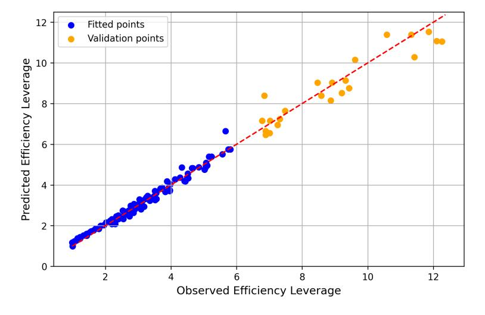

# **4.2.2 Joint Scaling Law for Efficiency Leverage**

Based on the preceding observations, we arrive at the following key insights:

- The activation ratio (or sparsity) is the core determinant of MoE efficiency, establishing its foundational power-law scaling.
- Building upon this power law, expert granularity adds a non-linear adjustment that operates independently of the compute budget.
- Furthermore, the efficiency advantage of MoE over dense models is amplified by the compute budget *C* through the power-law term.

To unify these interconnected effects, we derive a joint scaling law for EL, formulated as follows:

$$EL(A, G, C) = \hat{A}^{\alpha + \gamma(\log G)^2 + \beta \log G}, \tag{13}$$

where *α* = *a* + *d* log *C* is the compute-dependent exponent that captures the primary power-law relationship between EL and activation ratio. The term *a* represents the base scaling exponent at a reference compute budget, while *d* is a positive constant that quantifies how the EL is amplified by a larger compute budget *C*. The parameters *β* and *γ* model the non-linear impact of granularity *G*. This quadratic form in log *G* directly reflects the log-polynomial pattern observed in our initial analysis, capturing the existence of an optimal granularity.

To validate the proposed scaling law for EL, we fit Eq. [\(13\)](#page-14-0) using Huber loss and the BFGS optimization algorithm [\(Hoffmann et al.,](#page-23-5) [2022\)](#page-23-5). We use data points with an EL factor below 6 for training, while those are reserved as a validation set. We depict the results in Figure [9.](#page-14-1) The values are presented in Table [2.](#page-15-0) The alignment between the scaling law and both the training data and validation set provides strong empirical support for the proposed relationship. More importantly, the scaling law exhibits remarkable extrapolation capabilities, as it accurately models performance trends for high-leverage validation points outside the training range. These results confirm that Eq. [\(13\)](#page-14-0) effectively captures the underlying interaction between MoE architecture and EL.

Furthermore, we select 1e22 FLOPs compute budget, and apply our fitted scaling laws to predict efficiency leverage across various MoE configurations. As shown in Figure [1,](#page-0-0) our analysis predicts that an efficiency leverage (EL) exceeding 7x can be achieved at a budget of 1e22 FLOPs with an activation ratio of 3.1% and a granularity of 12. The subsequent section provides experimental validation for this specific claim.

Figure 9 **Validation of the Scaling Laws for MoE Efficiency Leverage.** We fit Eq. [\(13\)](#page-14-0) to the data points with an efficiency leverage of less than 6, using the remaining points as the validation set.

Table 2 **Values of the Fitted Coefficients.**

| a    | d        | γ       | β        | Astart  | Amax     |
|------|----------|---------|----------|---------|----------|
| 1.23 | -7.61e-2 | 1.67e-2 | -1.17e-1 | 1.63e-2 | 5.28e+16 |

