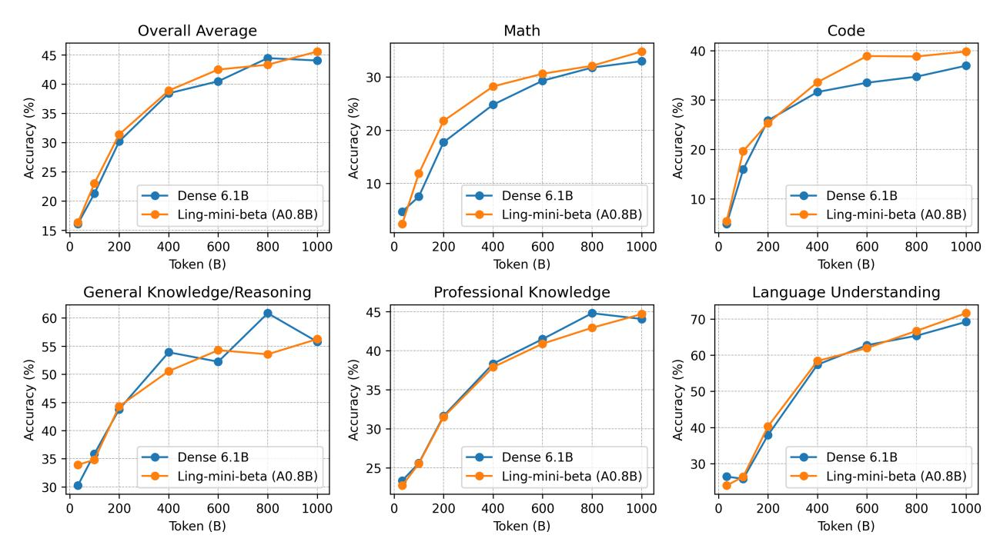

# **5 Ling-mini-beta: More Efficient MoE Language Model**

Based on the findings in Section [4,](#page-7-2) we identify the efficient architectural configuration within the current MoE framework. To validate the effectiveness of this configuration, we design an MoE model with 0.855 billion active parameters out of a total of 17.5 billion (referred to as "Ling-mini-beta," a pilot model for Ling-2.0 series) and test it using 1 trillion tokens of training data. Ling-mini-beta is configured with a granularity *G* of 12 and an activation ratio *A* of just 3.4%. Referring to Figure [1,](#page-0-0) at the 1*e*22 FLOPs compute budget, we hypothesize that Ling-mini-beta achieves *more than 7× in compute-efficiency leverage* over a comparable dense model. Concurrently, we train a traditional dense model with 6.1 billion parameters (named "Dense-6.1B") for comparison. This section presents a detailed analysis of the performance differences between Ling-mini-beta and the conventional dense model Dense-6.1B, highlighting that the active parameter count, training costs, and downstream inference costs of Dense-6.1B are more than seven times those of Ling-mini-beta.

#### **5.1 Model and Training Details**

The architectures of Ling-mini-beta and Dense-6.1B are given in Table [3.](#page-15-1) Other settings include:

- **Model Setting.** Ling-mini-beta adopts the same GQA [\(Ainslie et al.,](#page-22-2) [2023\)](#page-22-2) attention architecture as Dense-6.1B, with the only difference being the extension of the original FFN layers to MoE layers. Additionally, both Ling-mini-beta and Dense-6.1B employ Rotary Position Embedding (RoPE) [\(Su et al.,](#page-25-3) [2024\)](#page-25-3) and supports a sequence length of 8K.
- **Training Data.** The training data is sourced from a large-scale multilingual corpus created by the Ling Team, primarily covering English and Chinese, while also including various other languages. This corpus encompasses web text, mathematical materials, programming scripts, published literature, and diverse textual content. To validate model performance, we extracted a 1T-token subset from this corpus for training.
- **Training Setting.** Both Ling-mini-beta and Dense-6.1B were trained using the AdamW optimizer [\(Loshchilov and Hutter,](#page-24-4) [2017\)](#page-24-4) with hyperparameters set as follows: *β*1 = 0.9, *β*2 = 0.95, and weight decay of 0.1. Gradient clipping norm is set to 1.0. The learning rate schedule employs a WSD (warmup-stable-decay) strategy [\(Hu et al.,](#page-23-4) [2024\)](#page-23-4). According to the hyperparameter scaling laws for dense and MoE models, the maximum learning rates were set to 3.78*e*−4 for Ling-mini-beta and 2.93*e*−4 for Dense-6.1B. The batch sizes were configured as 1792 and 2048, respectively.

More details about model training setting can be found in the Appendix [B.](#page-26-1)

Table 3 **Detailed Architectures of Ling-mini-beta and Dense Model for Comparison.** We determined the architecture of the Ling-mini-beta based on the findings of Section [4.](#page-7-2)

| Model                  | nlayers | dmodel | df f n | dexpert | nheads | nkv_head | E   | Ea | Es | N     | Na    |
|------------------------|---------|--------|--------|---------|--------|----------|-----|----|----|-------|-------|
| Dense 6.1B             | 28      | 4096   | 14336  | -       | 32     | 8        | -   | -  | -  | 6.11B | 6.11B |
| Ling-mini-beta (A0.8B) | 20      | 2048   | 5120   | 384     | 16     | 4        | 384 | 12 | 1  | 17.5B | 0.85B |

## **5.2 Training Dynamics**

*The Dynamic of Training Loss* The training loss curves for Ling-mini-beta and Dense-6.1B, shown in Figure [10,](#page-16-0) illustrate a clear difference in their convergence behavior. The dense model exhibits faster convergence during the early training phases, indicating an aptitude for rapid initial learning. In contrast, Ling-mini-beta's loss decreases more gradually at the start. However, over the full course of training, Ling-mini-beta steadily improves and ultimately achieves a performance level comparable to that of the dense model, highlighting its ability to reach high performance with sufficient training. Focusing on the final 100 billion tokens of training provides further insight. In this concluding stage, the performance gap between Ling-mini-beta and Dense-6.1B narrows to a negligible difference of about 0.01 in loss value. This confirms that Ling-mini-beta can nearly match the dense model's effectiveness while operating with significantly fewer computational resources. Crucially, this near-equal performance underscores Ling-mini-beta's ability to deliver over 7x gains in training efficiency, making it a highly cost-effective and powerful alternative for large-scale pre-training.

*The Dynamic of Benchmarks* The training process for both Ling-mini-beta and Dense-6.1B was monitored by comparing their performance on standard benchmarks. The data reveals a clear and consistent trend: the two models improved almost synchronously. At no point during training did one model show a decisive or lasting advantage over the other. This lockstep progression continued until the end of the training cycle, where they posted nearly identical final scores on the evaluation leaderboard. This synchronous dynamic and convergent outcome suggest a fundamental parity in their learning efficiency and final performance ceiling under our experimental conditions.

Figure 10 **Dynamic of Training Loss.** (a) Comparing the training processes of Ling-mini-beta and the dense model shows that the dense model converges faster in the early stages. However, while Ling-mini-beta starts slower, its training loss becomes nearly equivalent to the dense model's after sufficient training. (b) Zooming in on the training loss for the final 100B tokens, the training loss difference between Ling-mini-beta and Dense-6.1B is less than 0.01, demonstrating over 7x efficiency gains for Ling-mini-beta with comparable performance to the dense model.

#### **5.3 Evaluation**

*Evaluation Benchmarks* To evaluate performance, we consider a diverse suite of downstream tasks designed to provide a holistic assessment of model capabilities. These tasks are grouped

Figure 11 **Dynamic of Benchmarks.** The comparison of the benchmarks changes between Ling-mini-beta and the Dense-6.1B during training shows that their performances improved almost synchronously throughout the process, ultimately achieving similar final leaderboard results.

into several categories, such as: (a) General Knowledge/Reasoning (*e.g.,* ARC [\(Bhakthavatsalam](#page-22-3) [et al.,](#page-22-3) [2021\)](#page-22-3), AGIEval [\(Zhong et al.,](#page-26-2) [2024\)](#page-26-2), OpenBookQA [\(Mihaylov et al.,](#page-25-4) [2018\)](#page-25-4), BBH [\(Suzgun](#page-25-5) [et al.,](#page-25-5) [2023\)](#page-25-5), ProntoQA [\(Saparov and He,](#page-25-6) [2023\)](#page-25-6), PIQA [\(Bisk et al.,](#page-22-4) [2020\)](#page-22-4), HellaSwag [\(Zellers et al.,](#page-26-3) [2019\)](#page-26-3), Multi-LogiEval [\(Patel et al.,](#page-25-7) [2024\)](#page-25-7)) (b) Language Understanding (*e.g.,* RACE [\(Lai et al.,](#page-24-5) [2017\)](#page-24-5)) (c) Professional Knowledge (*e.g.,* MMLU [\(Hendrycks et al.,](#page-23-7) [2021a\)](#page-23-7), CMMLU [\(Li et al.,](#page-24-6) [2024\)](#page-24-6), MMLU-Pro [\(Wang et al.,](#page-26-4) [2024b\)](#page-26-4), GPQA [\(Rein et al.,](#page-25-8) [2023\)](#page-25-8), C-Eval [\(Huang et al.,](#page-23-8) [2023\)](#page-23-8), CommonsenseQA [\(Talmor et al.,](#page-25-9) [2018\)](#page-25-9)) (d) Math (*e.g.,* GSM8K [\(Cobbe et al.,](#page-23-9) [2021\)](#page-23-9), MATH [\(Hendrycks](#page-23-10) [et al.,](#page-23-10) [2021b\)](#page-23-10), GAOKAO [\(Zhang et al.,](#page-26-5) [2023\)](#page-26-5), Gaokao2023-Math-En, MGSM [\(Shi et al.,](#page-25-10) [2023\)](#page-25-10), CMATH [\(Wei et al.,](#page-26-6) [2023\)](#page-26-6), MathBench [\(Liu et al.,](#page-24-7) [2024\)](#page-24-7), Minerva-Math [\(Lewkowycz et al.,](#page-24-8) [2022\)](#page-24-8), CN-Middle School 24) (e) Code (*e.g.,* Humaneval [\(Chen et al.,](#page-22-5) [2021\)](#page-22-5), HumanEval-cn [\(Peng et al.,](#page-25-11) [2024\)](#page-25-11), HumanEval-plus [\(Liu et al.,](#page-24-9) [2023\)](#page-24-9), HumanEval-FIM [\(Bavarian et al.,](#page-22-6) [2022\)](#page-22-6), LiveCodeBench [\(Jain](#page-24-10) [et al.,](#page-24-10) [2025\)](#page-24-10), MBPP [\(Tao et al.,](#page-25-12) [2024\)](#page-25-12), MBPP-Plus [\(Liu et al.,](#page-24-9) [2023\)](#page-24-9), CruxEval [\(Gu et al.,](#page-23-11) [2024\)](#page-23-11)).

*Evaluation Results* The comparative evaluation in Table [4](#page-18-0) reveals that Ling-mini-beta achieves an average score of 45.5, surpassing Dense-6.1B's 44.0. This result compellingly demonstrates that Ling-mini-beta accomplishes a "small yet powerful" feat with significantly lower inference costs, its activated parameters amount to only about *13%* of its competitor's, striking an exceptional balance between performance and efficiency.

Upon closer examination of performance across specific dimensions, Ling-mini-beta's advantages are both comprehensive and focused. In general knowledge and reasoning tasks, it exhibits notable advantages in open-ended question answering tasks such as OpenBookQA and complex logical reasoning benchmarks like Multi-LogiEval. This trend continues in specialized knowledge domains, where Ling-mini-beta delivers better results on comprehensive academic benchmarks like MMLU and MMLU-Pro. Its superiority is particularly evident in language understanding

Table 4 **Detailed performance comparison of Ling-mini-beta (17B-A0.8B) and Dense-6.1B.**

|                           | Metric              | Dense-6.1B | Ling-mini-beta (A0.8B) |  |  |
|---------------------------|---------------------|------------|------------------------|--|--|
|                           | ARC-challenge       | 59.7       | 57.0                   |  |  |
|                           | ARC-easy            | 78.0       | 78.7                   |  |  |
|                           | AGIEval             | 33.4       | 34.9                   |  |  |
|                           | OpenBookQA          | 68.6       | 75.2                   |  |  |
| General Knowledge         | BBH                 | 48.0       | 35.7                   |  |  |
| /Reasoning                | ProntoQA            | 16.5       | 19.5                   |  |  |
|                           | Multi-LogiEval      | 55.6       | 61.3                   |  |  |
|                           | HellaSwag           | 65.6       | 66.6                   |  |  |
|                           | PIQA                | 76.6       | 77.2                   |  |  |
|                           | Average             | 55.8       | 56.2                   |  |  |
|                           | MMLU                | 51.1       | 53.1                   |  |  |
|                           | MMLU-Pro            | 21.7       | 24.0                   |  |  |
|                           | CMMLU               | 50.7       | 51.9                   |  |  |
| Professional              | C-Eval              | 52.5       | 51.1                   |  |  |
| Knowledge                 | CommonsenseQA       | 63.6       | 60.6                   |  |  |
|                           | GPQA                | 24.8       | 27.3                   |  |  |
|                           | Average             | 44.0       | 44.7                   |  |  |
|                           | RACE-middle         | 73.4       | 75.6                   |  |  |
| Language Understanding | RACE-high           | 65.0       | 67.6                   |  |  |
|                           | Average             | 69.2       | 71.6                   |  |  |
|                           | HumanEval           | 31.7       | 35.4                   |  |  |
|                           | HumanEval-cn        | 34.2       | 32.3                   |  |  |
|                           | HumanEval-Plus      | 35.4       | 51.8                   |  |  |
|                           | HumanEval-FIM       | 62.8       | 61.3                   |  |  |
| Code                      | MBPP                | 41.0       | 44.6                   |  |  |
|                           | MBPP-Plus           | 50.0       | 51.6                   |  |  |
|                           | LiveCodeBench       | 7.5        | 7.4                    |  |  |
|                           | CruxEval            | 32.9       | 34.1                   |  |  |
|                           | Average             | 36.9       | 39.8                   |  |  |
|                           | GSM8K               | 59.2       | 58.0                   |  |  |
|                           | MATH                | 23.7       | 29.8                   |  |  |
|                           | CMATH               | 60.5       | 62.9                   |  |  |
|                           | MGSM-zh             | 35.6       | 36.8                   |  |  |
|                           | CN-Middle School 24 | 41.6       | 42.6                   |  |  |
| Math                      | Minerva-Math        | 3.3        | 2.9                    |  |  |
|                           | MathBench           | 27.5       | 28.6                   |  |  |
|                           | Gaokao2023-Math-En  | 33.1       | 33.5                   |  |  |
|                           | GAOKAO-Math24       | 12.1       | 17.6                   |  |  |
|                           | Average             | 32.9       | 34.7                   |  |  |
|                           | Overall Average     | 44.0       | 45.5                   |  |  |

tasks, as it consistently outperforms its competitor in the RACE series of reading comprehension tests, showcasing stronger contextual understanding capabilities. In tasks requiring high coding proficiency, Ling-mini-beta stands out significantly, especially in the HumanEval-Plus benchmark, which measures code robustness, achieving an impressive lead of over *16 points*. Similarly, in mathematical reasoning, while slightly lagging in basic arithmetic tasks like GSM8K, it excels in challenging benchmarks such as MATH and GAOKAO-Math24, demonstrating strong potential in solving complex problems. Collectively, Ling-mini-beta achieves a 1.5-point overall advantage, validating its parameter-efficient MoE design. It not only drastically reduces inference costs through sparse activation but, more critically, its "expert networks" seem to enable higher performance ceilings in key areas such as language understanding, code generation, and advanced reasoning.

## **Conclusion on Ling-mini-beta (17B-A0.8B)**

Based on the scaling laws for efficiency leverage in Section [4,](#page-7-2) we design the Ling-mini-beta, a pilot model for the Ling-2.0 series, which has 17.5 B total parameters but only active 0.8 B parameters. Experimental results demonstrate that Ling-mini-beta achieves over a 7× efficiency leverage while maintaining comparable performance to dense models with 6.1B, more than 7× the number of active parameters.

