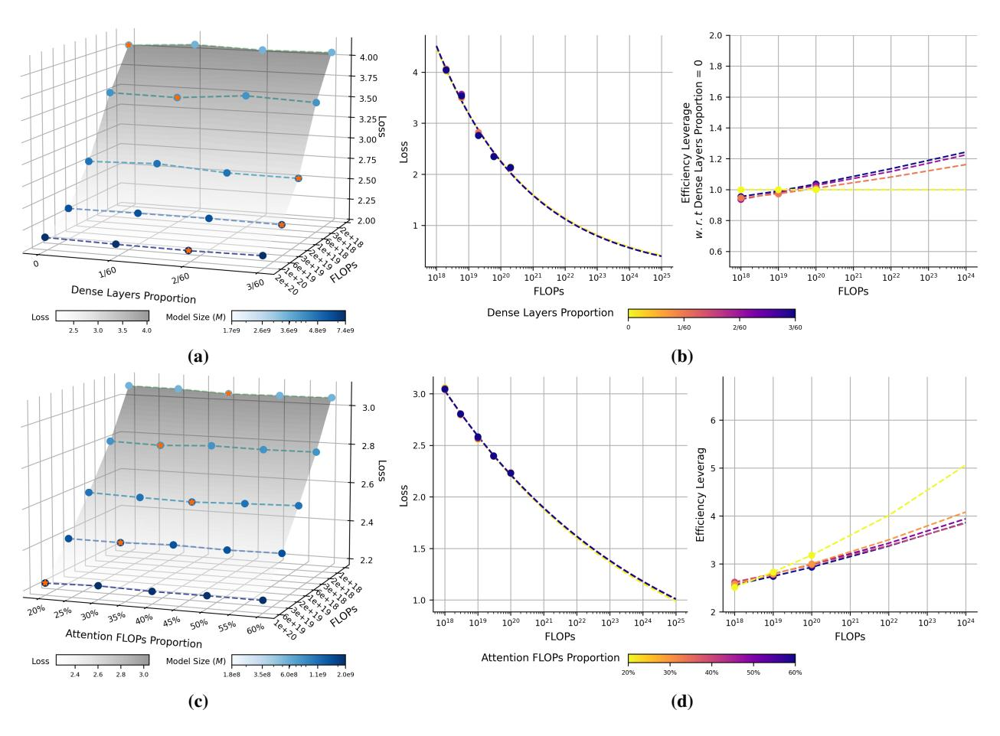

# **D Additional Experiments**

*The Impact of Routing Balance on the Optimal Expert Granularity.* To investigate how routing quality influences the optimal expert granularity, we induce a state of routing imbalance. This is achieved by setting the coefficient of load balancing loss to 0.001, a setup known to cause load imbalance. In this setting, we train MoE models with a varying expert granularity while maintaining a constant total parameter count. As shown in Figure [12,](#page-28-1) our results reveal that a coarser expert granularity becomes optimal under such imbalanced routing. Specifically, compared with the results in Section [4.1.2,](#page-9-1) the IsoFLOPs curves (Figure [12a\)](#page-28-1) demonstrate that models with coarser granularity (*G* = 6, 8) achieve lower loss for a given computational budget. This trend is consistently observed in the loss scaling curves (Figure [12b\)](#page-28-1). This phenomenon indicates that when the routing mechanism becomes a performance bottleneck, a fine-grained architecture with numerous specialized experts is counterproductive. The weakened router cannot distribute tokens effectively, nullifying the benefits of specialization. Consequently, the model benefits more from a coarser-grained design with fewer, more generalized experts, as this simplifies the routing task and mitigates the detrimental effects of the load imbalance.

Figure 12 **Impact of Expert Granularity on Loss Under Weakened Routing Balance.**

*Arrangement of MoE and Dense Layers* To ensure balanced routing in the early layers, mainstream MoE models typically replace all FFNs except for the first few layers with MoE layers.

Figure 13 **Impact of Dense Layers Proportion and Compute Budget Allocation between Attention and FFN.** (a,b) Replacing the first few layers with dense layers shows minor impact on model performance. As computational budgets increase, the optimal proportion of dense layers also gradually rises. (c,d) Modifying the attention FLOPs ratio within a broad range (20%-50%) has a negligible influence on model performance, demonstrating the robustness of this configuration.

We investigate the impact of this design decision on the efficiency of MoE models. To ensure a meaningful exploration space, we extend all models in our experiments to 60 layers and set the first 1, 2, or 3 layers as dense layers sequentially. The dimension of these dense layers is set to match the total dimension of the activated experts in the corresponding MoE layers, ensuring the overall computational cost (FLOPs/token) remains constant. This design allows us to isolate and study the effect of the proportion of dense layers on MoE efficiency. The experimental results, presented in Figure [13a](#page-29-0) and [13b,](#page-29-0) reveal the following key findings: 1) From a model performance perspective, replacing the first few layers with dense layers has a minor impact. Using a dense proportion of zero as the baseline, we estimated the efficiency leverage for each configuration. Within a FLOPs budget of up to 1 × 1024 FLOPs, the efficiency leverage remains close to 1. This indicates that configuring the initial layers as dense offers negligible efficiency improvement. However, this adjustment effectively reduces the total number of parameters in the model and mitigates routing imbalances in the early layers. Thus, despite its limited efficiency gains, this remains a valuable design optimization. 2) Further investigation into the optimal proportion of dense layers under varying computational budgets reveals a trend: as FLOPs budgets increase, the optimal dense proportion also grows. For example, in our experiments, when the compute budget is 1 × 1018 FLOPs, the optimal dense proportion is zero. As the compute budget increases to 3 × 1020 FLOPs, the optimal dense layer proportion shifts to approximately 2/60 or 3/60.

*Compute Resource Allocation between Attention and FFN* As two core components of the Transformer model, the attention mechanism (Attention) and FFN account for the majority of the model's computational load. To this end, we explore the impact of computational allocation between the attention mechanism and the FFN on the efficiency of the MoE model. Specifically, we construct a series of models with fixed model scale *M* but varying compute budgets by increasing the hidden layer size of the attention module while reducing the hidden layer size of each expert in the MoE. We then observe the performance changes of these models under different computational allocations and evaluate their scaling trends. The experimental results are illustrated in Figure [13c](#page-29-0) and [13d,](#page-29-0) revealing the following key findings: 1) When the attention FLOPs ratio is between 30% and 40%, it represents a relatively stable and reliable configuration. Models tend to achieve optimal or near-optimal performance within this range. This configuration is consistent with the default settings of mainstream open-source MoE models. 2) Adjusting the attention FLOPs ratio within a broader range (20%-50%) has minor impact on model performance. As shown in Figure [13d,](#page-29-0) the loss scaling curves and efficiency leverage of these models are nearly identical. Since the attention mechanism generally has a higher computational density (*i.e.,* FLOPs-per-parameter) compared to the FFN, increasing the attention FLOPs ratio while keeping the overall model size constant reduces the total number of model parameters, resulting in higher knowledge density. However, this also implies potentially higher downstream inference costs.

