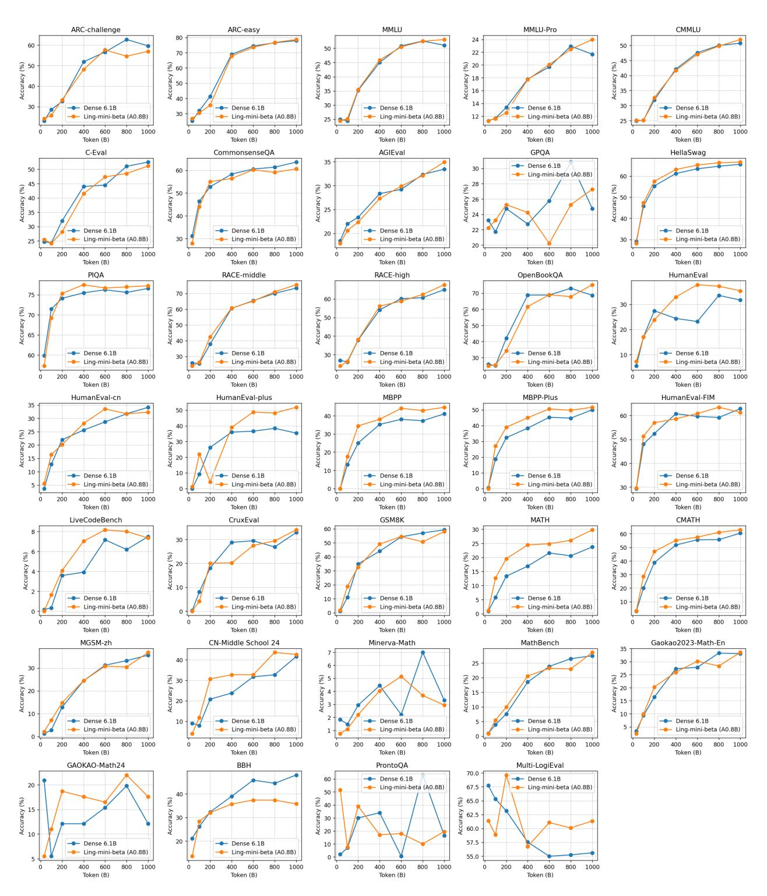

# **E Additional Evaluation Results of Ling-mini-beta**

We present a detailed evaluation of Ling-mini-beta's training process. Figure [14](#page-31-0) provides a comprehensive comparison across datasets and categories, as outlined in the main experiments in Section [5.3.](#page-16-1) The results show that Ling-mini-beta achieves comparable performance to Dense-6.1B on the majority of datasets.

Figure 14 Overall and category-wise performance comparison between Ling-mini-beta (17B-A0.8B) and Dense-6.1B.

