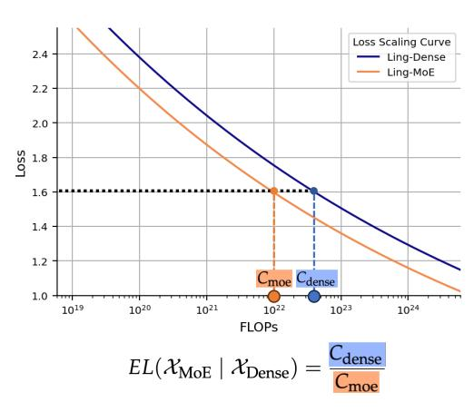

# Towards Greater Leverage: Scaling Laws for Efficient Mixture-of-Experts Language Models

Changxin Tian, Kunlong Chen, Jia Liu, Ziqi Liu, Zhiqiang Zhang∗ , Jun Zhou

Ling Team, Ant Group

Mixture-of-Experts (MoE) has become a dominant architecture for scaling Large Language Models (LLMs) efficiently by decoupling total parameters from computational cost. However, this decoupling creates a critical challenge: predicting the model capacity of a given MoE configurations (*e.g.,* expert activation ratio and granularity) remains an unresolved problem. To address this gap, we introduce *Efficiency Leverage (EL)*, a metric quantifying the computational advantage of an MoE model over a dense equivalent. We conduct a large-scale empirical study, training over 300 models up to 28B parameters, to systematically investigate the relationship between MoE architectural configurations and EL. Our findings reveal that EL is primarily driven by the expert activation ratio and the total compute budget, both following predictable power laws, while expert granularity acts as a non-linear modulator with a clear optimal range. We integrate these discoveries into a unified scaling law that accurately predicts the EL of an MoE architecture based on its configuration. To validate our derived scaling laws, we designed and trained Ling-mini-beta, a pilot model for Ling-2.0 series with only 0.85B active parameters, alongside a 6.1B dense model for comparison. When trained on an identical 1T high-quality token dataset, Ling-mini-beta matched the performance of the 6.1B dense model while consuming over 7x fewer computational resources, thereby confirming the accuracy of our scaling laws. This work provides a principled and empirically-grounded foundation for the scaling of efficient MoE models.

Date: July 20, 2025

Correspondence: [tianchangxin.tcx@antgroup.com](mailto:tianchangxin.tcx@antgroup.com), [lingyao.zzq@antgroup.com](mailto:lingyao.zzq@antgroup.com)

(a) Definition of Efficiency Leverage (EL) (b) Estimated EL at 1*e*22 FLOPs

Figure 1 **Illustration of definition of Efficiency Leverage (EL) and its estimated values using Eq.** [\(13\)](#page-14-0) **for** 1*e*22 **FLOPs.**

∗Corresponding author

