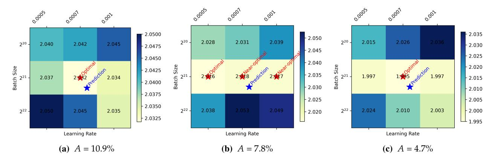
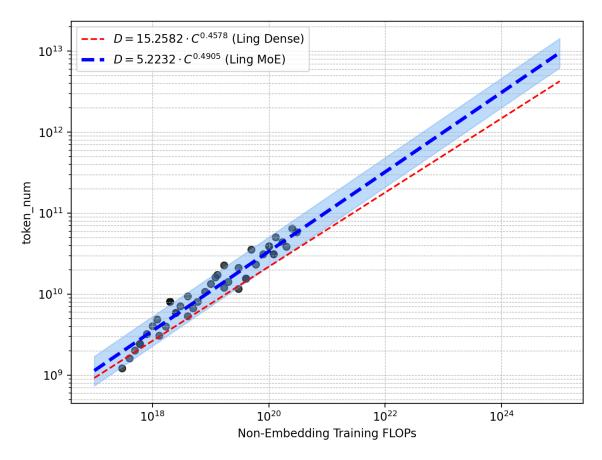

# **2 Preliminary**

#### **2.1 Mixture-of-Expert Transformers.**

MoE architecture modifies the standard Transformer by replacing each Feed-Forward Network (FFN) block with an MoE layer. This layer consists of multiple expert networks (or simply "experts") and a gating mechanism. For each input token, the gating mechanism dynamically routes it to a small subset of these experts. This selective activation of experts for each token significantly reduces the computational cost per forward pass compared to a dense model of equivalent parameter count. *Total and Active Parameters.* In MoE models, we distinguish between two parameter counts. The *total parameters* (*N*) encompass all weights in the model, including those of every expert. In contrast, the *active parameters* (*Na*) for a given input consist only of the non-expert components and the specific experts selected by the top-*k* gating mechanism.

*Routable and Shared Experts.* An MoE layer typically contains two types of experts. First, there are *E routable experts*, from which the gating network selects a subset of *Ea* (the number of activated experts) for each token. Additionally, many modern MoE architectures incorporate *Es shared experts*, which are activated for every token to process and consolidate knowledge common to all inputs.

*Activation Ratio and Sharing Ratio.* We introduce two metrics to characterize the expert configuration. *Activation ratio*, *A*, is the ratio of activated experts to the total number of experts. *Sharing ratio*, *S*, is the ratio of shared experts to activated experts. Assuming all experts have identical dimensions, these rates are defined as *A* = (*Ea* + *Es*)/(*E* + *Es*) and *S* = *Es*/(*Ea* + *Es*). These metrics quantify the sparsity within the MoE layer, offering an intuitive measure of expert utilization.

*Granularity of Experts.* In conventional MoE architectures, the intermediate dimension of each expert, *d*expert, is typically equals the feed-forward network (FFN) dimension, which is conventionally set to 4*d*model. However, recent works [\(DeepSeek-AI,](#page-23-0) [2024\)](#page-23-0) have diverged from this practice by decoupling the expert dimension from the model's hidden size and the FFN's intermediate dimension. To systematically analyze this design choice, we define *expert granularity* as *G* = 2*d*model/*d*expert. A higher value of *G* corresponds to having a larger number of smaller experts for a fixed total parameter count within the MoE layers. It is important to note that, to align with recent leading MoE models [\(DeepSeek-AI,](#page-23-0) [2024;](#page-23-0) [Moonshot-AI,](#page-25-1) [2025\)](#page-25-1), we adopted a different definition of "granularity" from that of [Ludziejewski et al.](#page-24-1) [\(2024\)](#page-24-1). They define granularity as 4*d*model/*d*expert, whereas our definition results in each expert being half the size for the same granularity value, which consequently leads to different observed phenomena.

*Defining Model Scale via Computation.* We quantify the computational cost using Floating Point Operations (FLOPs). Consistent with prior work [\(Bi et al.,](#page-22-1) [2024\)](#page-22-1), we define a model's scale in terms of computation, denoted as *M*, representing the number of non-embedding FLOPs per token in a single forward pass. For MoE models, this is particularly important as *M* accounts only for the sparsely activated components (*i.e.,* the selected experts). We exclude the embedding layer from this calculation because its contribution to both overall computation and model capacity is minimal. To ensure our analysis is grounded in accurate figures, we employ an exact calculation for *M*, avoiding error accumulation found in common approximations (details in Appendix [C\)](#page-27-0). The total training compute *C* is thus a function of *M* and the number of training tokens *D*:

$$C = M \cdot D \tag{2}$$

This formulation provides a consistent basis for comparing dense and MoE architectures.

#### **2.2 Scaling Laws for MoE Optimal Hyper-parameters**

The performance of a MoE model is sensitive to its hyperparameters. To ensure that our subsequent architectural comparisons are reliable, it is crucial to evaluate each configuration under its optimal hyperparameter settings. Therefore, we first conduct a preliminary study to establish the scaling laws for optimal MoE hyperparameters. Previous research [\(Bi et al.,](#page-22-1) [2024\)](#page-22-1) has established that the optimal hyperparameters are primarily a function of the total computational budget. Accordingly, we performed a hyperparameter search across a compute range of 3*e*17 to 3*e*20 FLOPs, using a Warmup-Stable-Decay (WSD) learning rate schedule [\(Hu et al.,](#page-23-4) [2024\)](#page-23-4). We trained multiple models, varying both learning rate and batch size, which were sampled from a log-base-2 grid. Specifically, the exponents for the learning rate ranged from -11 to -9.0, and for the batch size, from 18 to 21. To make this analysis tractable, we initially fixed the MoE configuration to one with 64 experts, of which 4 are activated per token, plus an additional shared expert (resulting in an activation ratio *A* = 7.8% and a granularity *G* = 2). Detailed settings of the experimental models are available in the Appendix [B.](#page-26-1) We then verified that the conclusions from this configuration generalize across different activation ratios.

Figure [2](#page-4-0) illustrates the fitting process. To ensure robustness, we identify "near-optimal" configurations as those achieving a loss within 0.25% of the minimum for a given compute budget. After removing outliers, we fitted the optimal batch size, *B* opt, and learning rate, *η* opt, against the compute budget *C*. The resulting scaling laws reveal clear trends: *B* opt increases and *η* opt decreases with larger *C*. The final formulas obtained from the fitting process are as follows:

$$\eta^{\text{opt}} = 1.1576 \cdot C^{-0.1529}$$

$$B^{\text{opt}} = 0.0694 \cdot C^{0.3644}$$
(3)

A key finding emerges when comparing these laws to those of dense models. As shown in Figure [2,](#page-4-0) MoE models favor a significantly larger batch size and a slightly lower learning rate at large compute scales. This phenomenon is attributable to MoE's sparsity: during backpropagation, each expert's parameters are updated using only a subset of the tokens in a batch, whereas dense parameters receive gradients from the entire batch [\(Sun et al.,](#page-25-2) [2024\)](#page-25-2).

Figure 2 **Scaling laws for optimal hyperparameters.** Blue and red lines represent the fitted laws for MoE and dense models, respectively, derived on the same training dataset. Gray circles are the experimental data points used for fitting.

To validate the generalizability of these laws, we conduct experiments on MoE models with varying activation ratios. We used the derived laws to predict optimal hyperparameters at a compute budget of 3*e*20 FLOPs, after fitting them on data up to 1*e*20 FLOPs. As shown in Figure [3,](#page-5-0) the predicted optimal regions effectively capture the best-performing hyperparameters for activation ratios from 4.7% to 10.9%, demonstrating that the laws can be applied to MoE models within this

Figure 3 **Validation of MoE hyperparameters scaling laws across different activation ratios (***A***).** "*Near-optimal*" refers to hyperparameters achieving a loss within 0.25% of the optimal ones.

range of activation rates. This confirms that our hyperparameter scaling laws provide a reliable foundation for exploring diverse MoE architectures under fair and near-optimal training conditions.

#### **2.3 Scaling laws for MoE Optimal Model-Data Allocation**

To determine optimal allocation between model size and data size, we analyze loss trajectories across FLOPs budgets from hyperparameter scaling experiments. By identifying the (*M*, *D*) combination that yields the minimum loss for a fixed FLOP budget, we derive optimal allocation strategies for specific MoE configurations activating 4 of 64 experts and an additional shared expert (*A* = 7.8%, *G* = 2). Crucially, MoE capacity exhibits strong dependence on activation ratio. Thus, this analysis aims to deepen our understanding of MoE architectures and to provide general guidance for model selection in subsequent experiments. The problem can be formally defined as:

$$(M^{\text{opt}}, D^{\text{opt}}) = \arg\min_{M,D} \mathcal{L}(M, D; C, A, G, S) \quad \text{s.t.} \quad C = M \cdot D$$
(4)

The resulting scaling laws for the optimal model size (*M*opt) and data size (*D*opt) are presented in Figure [4](#page-6-0) and summarized in Table [1.](#page-6-1) For comparison, we derive the same laws for dense models. Our analysis yields two key insights:

- 1. The optimal allocation coefficients for different architectures are similar and close to 0.5. This aligns with findings from previous studies [\(Bi et al.,](#page-22-1) [2024;](#page-22-1) [Hoffmann et al.,](#page-23-5) [2022\)](#page-23-5), indicating that for compute-optimal training, the budget should be split roughly equally between increasing model size and data volume.
- 2. Crucially, at any given compute budget, the optimal MoE model is computationally smaller (lower *M*opt) but trained on more data (larger *D*opt) than its optimal dense counterpart. This suggests that MoEs possess greater capacity, enabling them to support larger training datasets with smaller model sizes. In real-world scenarios where data is abundant but computational resources are limited, this is significant for improving efficiency.

While practical training strategies may deviate from this compute-optimal allocation, these scaling laws provide a crucial reference. They offer a principled basis for determining the necessary amount of training data for a given model to approach convergence, designing informative ablation studies, and ultimately, developing more efficient MoE architectures.

Table 1 Scaling law parameters for compute-optimal allocation of model scale (*M*opt) and data size (*D*opt) for MoE and dense models on identical datasets.

|              | Optimal Model Scale (Mopt)                                       | Optimal Data Size (Dopt)                                          |
|--------------|------------------------------------------------------------------|-------------------------------------------------------------------|
| Dense MoE | Mopt = 0.5422 0.0655 · C Mopt = 0.5095 0.1915 · C | Dopt = 0.4578 15.2582 · C Dopt = 0.4905 5.2232 · C |

- (a) Optimal Model Scale (*M*opt) Scaling (b) Optimal Data Size (*D*opt) Scaling

Figure 4 **Scaling laws for optimal model scale (***M***opt) and data size (***D***opt) on identical datasets.** For a given budget, MoE models (blue) optimally allocate more resources to data and fewer to model size compared to dense models (red).

