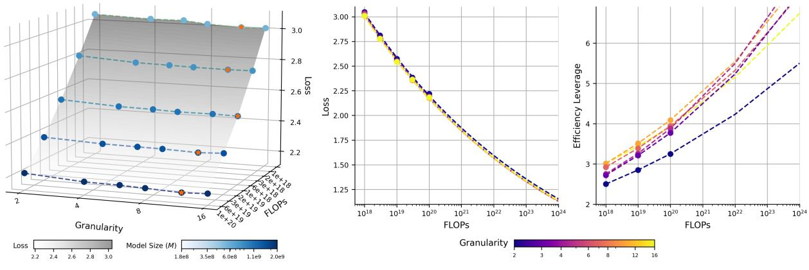
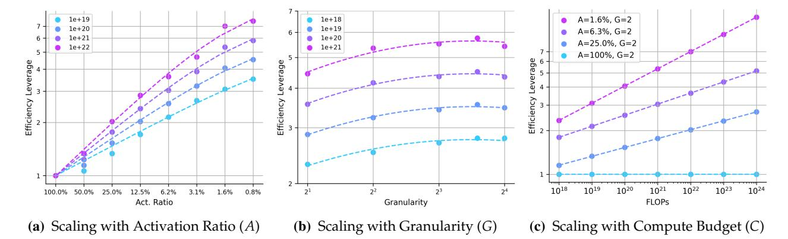

# **4.1.2 Optimal Granularity of Experts**

The granularity of experts is a critical factor in the efficiency of MoE. While prior works [\(Ludziejew](#page-24-1)[ski et al.,](#page-24-1) [2024;](#page-24-1) [Deepseek-AI et al.,](#page-23-2) [2024\)](#page-23-2) suggests that finer-grained experts improve performance, the optimal balance remains an open question. To investigate the influence of expert granularity on MoE efficiency, for a fixed model size *M* and activation ratio *A*, we vary the expert granularity from 2 to 16 by increasing the total number of experts from 64 to 512 while proportionally decreasing the size of each expert to keep computational cost (FLOPs) per token constant. This creates a spectrum of models from coarse-grained (fewer, larger experts) to fine-grained (more, smaller experts). By training these models and comparing their final training losses, we can identify the granularity that yields the best performance for a given FLOPs budget. This problem is formalized as:

$$G^{\text{opt}} = \arg\min_{G} \mathcal{L}(G; C, M, A, S)$$
(8)

where *G* opt is the optimal granularity that minimizes the training loss L under a fixed FLOPs budget *C*, model size *M*, activation ratio *A*, and shared expert ratio *S*. As shown in Figure [6a,](#page-10-0) our experiments across a range of FLOPs budgets (1018 to 1020) reveal a distinct trend. For any given budget, as we increase expert granularity, the training loss first decreases and then, after reaching a minimum, begins to increase. This demonstrates the existence of an optimal expert granularity that maximizes computational efficiency of MoE. To further analyze this relationship, we fit loss scaling curves for different granularities (Figure [6b\)](#page-10-0), quantifying their impact on EL.

Our study yields two primary insights: First, for a fixed FLOPSs budget, the training loss follows a U-shaped (polynomial) relationship with respect to expert granularity, which confirms an optimal point for maximizing model performance per FLOP. This finding contrasts with the conclusions of [Ludziejewski et al.](#page-24-1) [\(2024\)](#page-24-1), and we detail the reasons for this discrepancy in Section [6.1.](#page-19-0) Second, across different FLOPSs budget, the optimal granularity remains within a stable range (around 12 in our experiments), offering a reliable heuristic for model design. Furthermore, we find that routing balance significantly impacts the choice of optimal granularity. Poor routing balance shifts the optimal point towards coarser granularities and degrades overall model performance (see Appendix [D](#page-28-0) for details). This suggests that improving routing mechanisms could unlock the potential of even more fine-grained MoEs, marking a promising direction for future work.

- (a) IsoFLOPs curves over varying *G*. (b) Loss and efficiency leverage scaling curve over varying *G*.

Figure 6 **Impact of the Experts Granularity** *G* **on Loss and Efficiency.** (a) IsoFLOPs curves reveal a U-shaped (polynomial) relationship between expert granularity and training loss. Orange stars mark the optimal granularity for each FLOPs budget. (b) Loss and EL scaling curves show that MoE efficiency improves as FLOPs increase and expert granularity approaches the optimal range.

#### **Key Takeaway 2**

- **Existence of Optimal Expert Granularity.** For a fixed FLOPs budget and model scale, training loss exhibits a U-shaped (polynomial) relationship with expert granularity, indicating an optimum that maximizes efficiency.
- **Stable Range of Optimal Expert Granularity.** The optimal granularity (*e.g.,* around 12 in our experiments) is stable across a wide range of FLOPs budgets. However, poor routing balance shifts this optimum toward coarser granularity.

#### **4.1.3 Optimal Shared Expert Ratio**

Shared experts are always active to capture common knowledge [\(Deepseek-AI et al.,](#page-23-2) [2024\)](#page-23-2). To determine the optimal proportion of shared experts, we designed a series of experiment to isolate the impact of the shared expert ratio *S*. We fix the total model size *M*, the activation ratio *A*, and the total number of active experts (*Es* + *Ea*). We then systematically vary *S* by substituting routed experts (*Ea*) with shared experts (*Es*), exploring configurations from fully specialized (*S* = 0%) to highly shared (*S* = 83.3%). This allows us to identify the optimal ratio that minimizes training loss for a given computational budget. The problem is formalized as:

$$S^{\text{opt}} = \arg\min_{S} \mathcal{L}(S; C, M, A, G)$$
(9)

where *S* opt is the optimal shared expert that minimizes the training loss L under a fixed FLOPs budget *C*, model size *M*, activation ratio *A*, and granularity *G*. Our experiments, as depicted in Figure [7a,](#page-11-0) reveal a U-shaped relationship between the shared expert ratio and training loss. The minimum loss is generally achieved at a relatively low shared expert ratio, while having no shared experts (*S* = 0%) usually results in suboptimal performance. Furthermore, we observe a subtle trend where the optimal sharing ratio appears to scale with the compute budget. This is supported by our empirical scaling law (EL) analysis in Figure [7b,](#page-11-0) which shows that lower FLOPs budgets (≤ 1020) benefit from a slightly higher sharing ratio (*S* = 16.7%), whereas larger budgets (> 1020) achieve greater efficiency with a lower ratio (*S* = 8.3%).

Since large-scale pre-training runs typically exceed 1020 FLOPs, this suggests a practical heuristic: the optimal design choice is to use the lowest possible non-zero sharing ratio. Assuming the dimensions of shared and regular experts are equal, this can be heuristically implemented by setting the number of shared experts to one.

Figure 7 **Impact of the Shared Ratio** *S* **on Loss and Efficiency.** (a) Loss curves demonstrate that a low, non-zero sharing ratio minimizes training loss, outperforming both no shared experts (*S* = 0%) and highly shared configurations.. (b) EL analysis reveal that the optimal sharing ratio is higher (*S* = 16.7%) for smaller FLOPs (< 1020) and decreases to *S* = 8.3% for larger FLOPs (> 1020).

## **Key Takeaway 3**

- **Optimal Sharing Ratio Exhibits a Subtle Scaling Trend.** We identify a subtle scaling trend between the optimal shared expert ratio and the compute budget: the ideal ratio decreases as the compute budget increases.
- **"One Shared Expert" Rule for Large-Scale Training.** For large-scale pre-training with uniformly sized experts, the optimal design heuristic is to employ a single shared expert. This configuration establishes the minimal non-zero sharing ratio.

#### **4.1.4 Other Configurations of MoE Architecture**

To further optimize the efficiency of MoEs , we also explore two design dimensions: arrangement of MoE and dense layers and compute resource allocation between attention and FFN. The detailed experimental results can be found in Appendix [D.](#page-28-0)

First, we analyze replacing the initial MoE layers with dense layers while keeping total FLOPs constant (e.g., 60-layer models with the first 1–3 layers set dense). The experimental results show that replacing the first few layers with dense layers has a minor impact on performance, with efficiency leverage close to 1 within a FLOPs budget of up to 3*e*20 FLOPs. This adjustment reduces the total number of parameters and mitigates routing imbalances, making it a valuable design optimization. As FLOPs budgets increase, the optimal dense proportion also grows; for example, at 1*e*18 FLOPs, the optimal dense proportion is zero. As the compute budget increases to 3*e*20 FLOPs, the optimal dense layer proportion shifts to approximately 2/60 or 3/60.

Second, we explore the impact of computational allocation between the attention mechanism and FFN on MoE efficiency. By constructing models with varying attention-FFN compute allocation and observing performance changes, we find that: 1) An attention FLOPs ratio of 30%–40% ensures stable performance, corresponding to default settings in MoE models. 2) Broad ratio adjustments (20%–50%) minimally impact performance due to attention's computational density, which increases knowledge density but may raise downstream inference costs

#### **Key Takeaway 4**

- **Introducing Dense Layers is a Valuable Design Optimization.** Incorporating dense layers in the early stages of MoE has minor impact on efficiency but helps mitigate routing imbalances and reduces overall parameters. The optimal proportion of dense layers increases with higher FLOPs budgets, though it offers limited efficiency gains.
- **Robustness of Compute Budget Allocation between Attention and FFN** Allocating 30%-40% of FLOPs to the attention mechanism achieves optimal or near-optimal performance, with minor impact outside this range. Increasing attention FLOPs proportion enhances knowledge density but reduces downstream inference efficiency.

#### **4.2 Scaling Laws for MoE Efficiency Leverage**

From the observations, both the dense layer and attention ratio have minimal impact on MoE's efficiency leverage. While sharing experts is broadly beneficial, employing a single shared expert typically emerges as the optimal choice in practice. Thus, we aim to derive a parametric scaling law for predicting the efficiency leverage based on activation ratio *A*, granularity *G*, and FLOPs *C*.

## **4.2.1 Separable Scaling Laws for Efficiency Leverage**

Based on a large amount of previous empirical study in Section [4.1,](#page-7-1) we collect the MoE efficiency leverages under different settings and summarized them to be presented in Figure [8.](#page-13-0)

*Interaction of Efficiency Leverage and Activation Ratio.* Based on the preceding observations, activation ratio is identified as the primary factor influencing the computational efficiency of MoEs. As illustrated in Figure [8a,](#page-13-0) reducing the activation ratio (*i.e.,* increasing sparsity) consistently yields substantial efficiency gains, following a similar power-law relationship across different FLOPs budgets. Consequently, we propose the following hypothesis: for a given FLOPs budget and granularity, there exists a power-law dependence between efficiency leverage and activation ratio.

$$\log EL_{C,G}(\hat{A}) = a_A \log \hat{A}, \quad \text{i.e. } EL_{C,G}(\hat{A}) = \hat{A}^{a_A},$$
where  $\frac{1}{\hat{A}} = \frac{1}{A + (1/A_{start} - 1/A_{max})^{-1}} + \frac{1}{A_{max}},$ 
(10)

where *A*ˆ is a saturating transformation of *A*, as defined in [Clark et al.](#page-23-1) [\(2022\)](#page-23-1), and we set the lower bound of meaningful activation ratio as 0. Clearly, when *A* = 1, we have *EL* = 1, indicating that the EL of the dense model is 1, which satisfies the dense equivalence. We fit Eq. [\(10\)](#page-12-0) to each FLOPs budget and plot the predictions for varying activation ratios as dotted lines in the Figure [8a.](#page-13-0) The predictions align well with the observed data. Notably, we observe that *aA* increases as *A* decreases and *C* increases. This trend corresponds to a diminishing benefit from increased sparsity, consistent with findings from prior research [\(Clark et al.,](#page-23-1) [2022\)](#page-23-1). Additionally, *aA* also increases with *C*, suggesting a greater benefit from the bigger compute budget [\(Ludziejewski et al.,](#page-24-1) [2024\)](#page-24-1). We will analyze the relationship between FLOPs and EL in the following paragraph.

Figure 8 **Scaling Behavior of Efficiency Leverage (EL).** (a) With fixed granularity (*G* = 2), EL follows a power law with respect to *A* across all tested compute budgets (*C*). (b) With a fixed activation ratio (*A* = 3.1%), EL's scaling with *G* conforms to a log-polynomial law across all compute budgets. (c) With both activation ratio (*A*) and granularity (*G*) held constant, EL scales with compute according to a standard power law.

*Interaction of Efficiency Leverage and Granularity.* As previously mentioned, the relationship between expert granularity and EL does not exhibit an ideal power-law pattern. Instead, there exists an optimal granularity that maximizes the EL. Based on this observation, we hypothesize that under fixed FLOPs budget *C* and activation ratio *A*, the relationship between EL and granularity *G* follows a log-polynomial pattern:

$$\log EL_{C,A}(G) = a_G + b_G \left(\log G \left(\log G + c_G\right)\right),\tag{11}$$

where *aG* is the granularity-independent base EL. It indicates the theoretical EL value of the model when the expert granularity is 1. *bG* controls the strength of the curvature in the relationship between EL and granularity, reflecting the sensitivity of the model architecture to changes in expert granularity. *cG* directly determines the location of the optimal granularity that maximizes EL. We fit Eq. [\(11\)](#page-13-1) to each FLOPs budget and plot the predictions for varying granularity as dotted lines in the Figure [8b.](#page-13-0) As shown in the figure, the curves under different FLOPs are identical (i.e., with similar values of *bG* and *cG*), indicating that the impact of expert granularity on MoE efficiency remains consistent across various computational budgets.

*Interaction of Efficiency Leverage and Compute Budget.* Based on the analysis presented in Section [4.1,](#page-7-1) we observe that the efficiency advantage of MoE increases as the computational budget grows. To formalize the relationship between the FLOPs budget and Efficiency Leverage, we assume a standard power-law pattern as follows:

$$\log EL_{A,G}(C) = a_C \log C + c_C, \quad \text{i.e. } EL_{A,G}(C) = \exp(c_C) \cdot C^{a_C}, \tag{12}$$

where *aC* reflects the scaling capability of MoE efficiency with respect to the computational budget under given configurations *A* and *G*. We collect the values of the EL corresponding to different model architectures under the granularity setting of 2, and fit Eq. [\(11\)](#page-13-1) to each architectures. The predictions for varying granularity are plotted as dotted lines in the Figure [8c.](#page-13-0) The results indicate that all tested MoE architectures show a trend of higher EL as the FLOPs budget increases, demonstrating the potential of MoE in large-scale pre-training.

