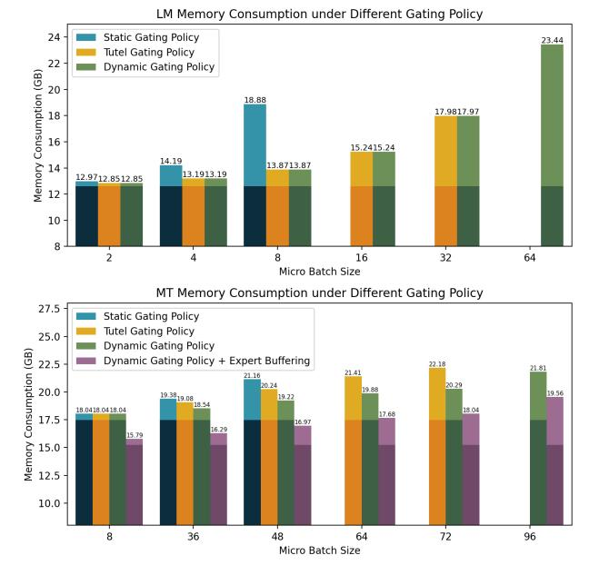
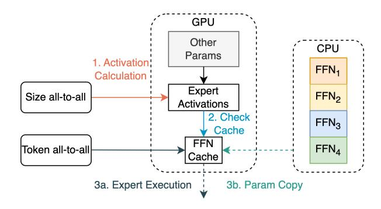

# *B. Cache Management*

During inference, under dynamic gating, once the gating decision is made by the gating function, each GPU receives the number of tokens assigned to its experts. If an expert receives a positive token count, it is considered active for the current batch. The process then checks if the active expert is already cached in GPU memory. If not, then the process will launch a Memcopy to transfer the required expert parameters into the cache. Copying expert parameters from CPU memory to GPU DRAM will be launched in parallel with all-to-all communication, to allow for overlap of data transfers and latency hiding.

In cases where the cache is already full but more experts are needed, eviction will be triggered to make space for the new experts. The eviction policy is designed as follows. First, we will first evict experts that are not active in this batch since they are also less likely to be used in the future due to temporal locality. Next, we will evict expert parameters under a Last In, First Out (LIFO) policy.

The reason for adopting a LIFO policy is rooted in the implementation of recent MoE Transformers. If multiple experts are allocated to a single GPU, MoE Transformer will execute the experts serially in the increasing order of their ids. Consider a small example of E = 4 experts and cache size of 2 experts, and assume expert (1, 2, 3) are needed. After stage 1, expert 1 and 2 will be pushed into the cache, and we need to evict one of them to load expert 3. By evicting expert 2 instead of 1, we ensure the expert with the shortest reuse distance is kept in the cache.

Fig. 10. Comparison of memory consumption between MoE models under static and dynamic gating policy. Light shade represents dynamic memory allocation (activation memory). Dark shade represents static memory allocation (model parameters). Missing bars in each plot capture the infeasible cases under the corresponding policy. Compared to Static and Tutel [\[16\]](#page-11-8), Dynamic Gating reduces the memory usage, thus enabling larger batch sizes. Expert Buffering further reduces the memory consumption of model parameters.

Fig. 11. Illustration of the Expert Buffering mechanism. We move the expert parameters to CPU memory to reduce burden on GPU memory. On GPU memory, we allocate space only for a few expert entries to buffer active or hot experts. (1) During inference, the all-to-all size message sent in stage 1 as shown in Figure [8\(](#page-5-0)b) signals which experts located in the current device are active. (2) Then the expert cache will check whether the active experts currently reside in the buffer. (3a) If found (cache hit), parameters in the expert buffer will be used to process the tokens. (3b) If not found (cache miss), then the expert parameters will be requested from the CPU memory. The number of cache entries on GPU memory is a tunable parameter to adjust for desirable GPU memory usage and latency (See Section [VI\)](#page-6-0).

