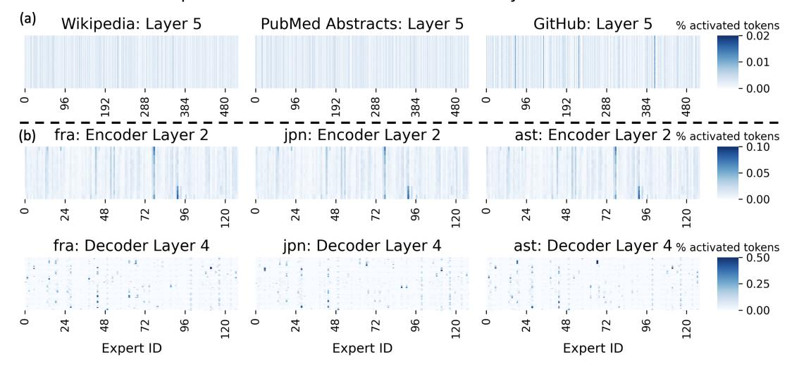
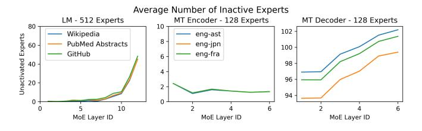

# *B. Machine Translation Case*

For Machine Translation (MT), we use the original validation dataset NLLB-200 [\[22\]](#page-11-2). We use English as the source language, and select three different target languages (French, Japanese and Asturian). Expert activation on MT for randomly selected layers is visualized in Figure [6\(](#page-5-1)b).

Machine Translation models also exhibit load imbalance and a small fraction of experts that are more hot than others, and the load imbalance is even more pronounced. Certain experts on both encoder and decoder has received a large share of all tokens that is almost half of the full batch, whereas many experts maintain a low degree of activation.

We further inspect whether expert sparsity exists on the encoder and the decoder of the model. Figure [7](#page-5-2) demonstrates the expert sparsity level on the encoder and decoder on all three tasks. We find that the encoder activation is mostly dense, that most of the experts are activated at all times. The decoder activation is extremely sparse (about 75%).

We visualize the selected activation pattern of the encoder and decoder in Figure [6\(](#page-5-1)b). The activation is normalized within a batch, and the color intensity is a measure of load intensity, representing the percentage of tokens assigned to each expert within a batch. The detailed activation shows that the expert activation pattern in machine translation is similar across different languages. The encoder architecture captures the source language properties which is the same across all three tasks (English). To our surprise, we found

Fig. 6. Visualization of the expert activation pattern on selected layer of (a) language modeling and (b) machine translation. Activation is normalized. The expert activation pattern exhibits strong imbalance on all the tasks, and the imbalance is consistent. Specifically, on machine translation decoder the sparseness is enormous, and the expert also demonstrates strong temporal correlation.

Fig. 7. Average number of inactive experts on Language Modeling and Machine Translation. Most, if not all experts are activated throughout the LM and MT encoder. However, activation on MT decoder is extremely sparse, even if we utilize a batch size of 96 under dynamic gating policy.

that expert activation is more or less similar across different target languages as well as decoder architectures.

A closer inspection on the expert activation on the decoder shows that the expert sparsity has a strong temporal locality. The intense color representing high load of expert usually appears as lines, suggesting that an expert is active across consecutive batches. This implies temporal locality for hot experts. This observation is a key motivation for expert caching discussed in Section [VI.](#page-6-0)

