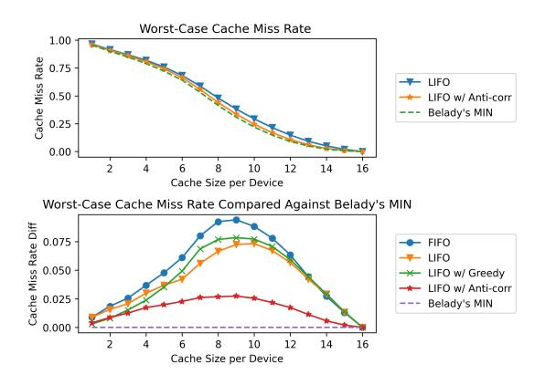
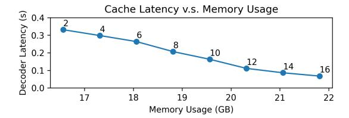
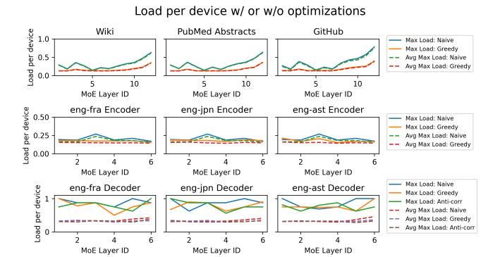

# *C. Cache Miss Rates*

To estimate the technical feasibility of Expert Buffering, we calculate cache miss rate for machine translation use case on layers that exhibit enormous expert sparsity. We note that the cache is deployed per device, and each device caches experts that have been assigned to it. As a result, we may vary cache

Fig. 12. Worst-Case Cache Miss Rate obtained from traces of expert activations from MT decoders. We tune the cache size per GPU from 1 to 16, and examine the impact of cache size on the worst case Cache Miss Rate on different layers of MT decoders over different tasks. (a) caching performance with/without any reassignment. (b) caching performance against the theoretical optimal Belady's MIN. The miss rate is further reduced by load balancing, and is very close to Belady's MIN (See Sec. [VII\)](#page-9-0).

size from 1 to 16 experts, generating a saving of 0-32.2% on total static memory allocation. We calculate the global cache miss rate under each circumstance. The worst-case cache miss rates are shown in Figure [12.](#page-8-2) We notice the Cache Miss Rate starts to decrease faster when the cache size is larger than 5 per GPU, which is a cache size of 40 in total. This result is consistent with our previous observation that there will be more than 90 experts being empty inside the decoder. We further compare our caching policy with Belady's MIN, the theoretical optimal policy that requires information from the future. Fig. [12\(](#page-8-2)b) shows that the LIFO policy is better than FIFO, and with the load balancing introduced in Sec. [VII,](#page-9-0) our policy can obtain a cache miss rate very close to Belady's MIN.

To evaluate the impact of the proposed mechanism, we perform experiments on Expert Buffering on the MT Decoder. The cache size is selected to be around 80 experts in total, which fits 10 experts per GPU under single node case. This is the point where the cache miss rate starts showing saturation behavior in Figure [12\(](#page-8-2)a).

Figure [9](#page-7-0) and Figure [10](#page-8-0) show the impact of expert buffering on throughput and the static memory allocations for MT. Expert buffering has successfully reduced the static memory consumption by 2.25GB. This memory reduction is particularly useful for users with limited number of GPUs. Although the throughput becomes smaller compared to memory-intensive dynamic gating, the throughput obtained by expert caching is comparable to baselines under single-node, and 2.21×/4.30× under 2/4 nodes.

Furthermore, we study the latency-memory tradeoff incurred by the expert caching mechanism, and estimate the pareto frontier. Figure [13](#page-9-2) shows the latency and memory consumption under a series of cache configurations. We vary the cache per GPU and measure the decoder latency and peak memory consumption. The result shows that the pareto frontier is similar

Fig. 13. Tradeoff between memory and latency under different cache configuration on MT Decoder. Corresponding cache size per GPU is marked on the plot.

to the outliers on the cache miss rate plot in Figure 12(a).

Our findings also indicate that the primary contributor to increased latency is the constrained CPU-GPU bandwidth, which we observed to saturate at 12GB/s during our experiments. The findings indicate that layers with a high cache miss rate may impede performance. Adopting technologies that enhance CPU-GPU bandwidth, such as the NVIDIA Grace Hopper superchip and PCIe v5 can mitigate the latency issues in situations where memory is constrained.

We note that no prior work exploits the unique characteristics of MoE Transformers to optimize memory usage. As a caching strategy that is specifically tailored for MoE models, expert buffering is orthogonal to prior memory saving mechanisms such as offloading [25], [30] and can be seamlessly integrated for greater memory savings.

#### VII. LOAD BALANCING

As we saw in Section IV, token assignments to experts are highly imbalanced, hence the load assigned to each device is also highly imbalanced. Those devices hosting hot experts can become bottlenecks and become more vulnerable to out of memory error. Moreover, devices hosting cold experts may sit idle while waiting for devices that are hosting hot experts to finish their load. As a result, load balancing is critical for having a robust and stable model.

We propose a simple load balancing scheme during the model deployment. We optimize the allocation of experts by leveraging historical load data. Specifically, we encode historical expert allocation into a matrix, and balance the load on each device accordingly. We combine higher-loaded experts with lower-loaded experts, so that the load can be distributed to different devices. We denote the expert placement with  $P_{mn}$ , where m is the expert id  $(m=1\ldots E)$ , n is the device id  $(n=1\ldots D)$  and  $P_{mn}=1$  indicates that the m-th expert is allocated on the n-th device. We also denote the expert activation with  $A_{mb}$ , where m is the expert id and b is the batch id  $(b=1\ldots B)$ , and  $A_{mb}$  represents the fraction of tokens assigned to expert e at batch id b. The problem can be thus formalized as follows:

$$\min \max_{m,b} |\sum_n P_{mn} A_{mb} - \frac{1}{D}| \text{ subject to } \sum_m P_{mn} = \frac{E}{D} \ \forall n$$

This problem can be reduced to the multi-way number partitioning problem [10], which is NP-hard. To balance the

Fig. 14. The effect of our proposed load balancing mechanism: Based on historical activation data, our algorithm is able to significantly reduce the load imbalance problem on LM tasks and improve the robustness by limiting the maximum workload on a single device.

memory usage and simplify the communication process, each GPU should be assigned the same number of experts.

#### A. Greedy Balancing for Independent Activation

We utilize a greedy algorithm to generate approximations to the optimal assignment. We sort the experts by their average work load in historical data  $\tilde{A}_m$ , and assign the experts to GPUs on a descending order. At each step, an expert is assigned to the GPU with the smallest load, calculated by  $\sum_m P_{mn}\tilde{A}_m$ . Once a GPU reaches the designated capacity, it will be removed from the list of candidates.

Figure 14 summarizes the balance of the load under the original order and the new order. The balance of load is estimated using existing activation data introduced in Section III-B. To perform the experiment, we separate the data into two halves. We use the first half of the activation data to generate a device assignment for each expert, then estimate the work load under generated assignment using the second half of the activation data. Results are normalized by the total batch size, which means the numbers represent the share of the total number of tokens each device will handle in a certain batch.

We record the Max Load, which is the maximum share of the load that has ever appeared in all batches on the test set, and the Avg Max Load, which is the maximum share of the load averaged over all batches. The Max Load estimates the worst case scenario that relates to out-of-memory error, and the Avg Max Load estimates the average case where imbalance on work load can lead to bottlenecks and harm inference speed.

Results show that Greedy is able to balance the load for LM use case by improving both metrics (Max Load and Avg Max load per device) significantly, reducing from more than 0.6 to less than 0.4. Similarly for Machine Translation use case, Greedy can balance the expert load assignment for the MT encoder. Figure 9 shows the benefit of the Greedy Rebalancing on the LM and MT Encoder: Rebalancing increases the throughput by a maximum of 10.1% and 19.5% compared against pure dynamic gating. Furthermore, rebalancing allows the LM to achieve a batchsize of 64 and 128 when it is deployed on four nodes, making the model more robust.

#### B. Anti-correlation Balancing for Correlated Activation

Greedy is less effective for the Machine Translation Decoder. We found that expert activation level becomes a less effective indicator in this case due to correlation between experts. To handle this problem, we propose Anti-correlation Balancing, which takes correlation into consideration. Denoting the Pearson correlation between the current expert a to expert b in the historical data as  $S_{ab}$ , the current work load can be modified from  $\sum_{m} P_{mn} \tilde{A}_{m}$  to  $\sum_{m} P_{mn} (\tilde{A}_{m} + 0.5 * S_{am})$ . This algorithm successfully reduces the Avg Max Load and the Max Load on most cases. We notice that a more balanced work load also has a positive impact on the cache miss rate. As shown in Figure 12 and 9, the worst-case cache miss rate decreases for all cache sizes over MT Decoders, which leads to a maximum increase of 1.9% on their throughputs.

#### VIII. RELATED WORK

While the MoE Transformer substantially reduces the training cost and FLOPS for large models, the outrageous size of MoE Transformers and the complex expert parallelism [21] poses obstacles for its deployment, including the high GPU memory requirement and the excessive communication overhead of expert assignment. Various approaches have been invented to relieve these obstacles. Switch Transformer [7] and ELSLM [2] use knowledge distillation to distill a large MoE Transformer into a dense model. While distillation reduces the number of parameters, only a small portion (about 30%) of the accuracy gain can be retained. The MoS strategy proposed in DeepSpeed-MoE [24] distills the knowledge to a smaller MoE Transformer with less layers and shared experts. SE-MoE [30] uses pruning to reduce the number of experts in the model. WideNet [?] and MPoE [9] reduce the number of parameters by enforcing parameter sharing. Beyond reducing the parameters, other methods directly reduce computation and communication. The BASE Layer and Switch Transformer also reduce the number of experts each token is assigned to reduce the communication volume and computation. V-MoE [26] further reduces the number by dropping out a large portion of tokens. Hash Layer [27] replaces the gating layer with a precomputed hash function, which reduces the computation cost, but doesn't alleviate the communication overhead. As the MoE Transformer is a type of Transformer, techniques and optimized architectures that enhance Transformer inference speed may apply. Relevant examples include Reformer [19], Longformer [3], and Terraformer [17]. However, there is scant discussion of their application to MoE Transformers.

Offloading and swapping strategies such as [15] swaps unused tensors form the GPU memory to the main memory to reduce the resource requirement. However, existing strategies can only be applied on dense models. Applying these strategies efficiently on conditional neural networks such as MoE is non-trivial, since the data flow graph cannot be constructed in advance due to the conditional computation. FastMoE [13], [14] designed customized communication primitives and gating kernels for token assignment to reduce the communication overhead, but it has not been tested on outrageously

large neural networks. Tutel [16] and DeepSpeed-MoE [24] improve MoE model performance on datacenter-scale systems by combining system and architecture methods with tailored kernels for both Transformer and MoE layers, and specialized communication primitives. The approach combines expert parallelism, model parallelism, and tensor parallelism to significantly boost throughput and reduce latency. However, DeepSpeed-MoE is not designed to conserve GPU resources and therefore may be impractical for many academic users. SE-MoE [30] utilizes Ring Memory offloading to reduce GPU usage, achieving better throughput than DeepSpeed-MoE in low-resource scenarios. However, this approach does not leverage expert parallelism from MoE Transformers.

### IX. CONCLUSION

While at training time, mixtures of expert (MoE) models show superior performance to their flop-equivalent dense counterpart models, they are notoriously large, need a large number of GPUs to deploy and hard to democratize. Researchers outside large industry labs do not have access to hundreds or thousands of GPUs to afford exploring such large models. Moreover, they are much slower than their dense counterparts at inference. To overcome these challenges, we propose three optimization techniques (Dynamic Gating, Expert Buffering, and Expert Load Balancing) to improve memory and latency profile of such models for deployment.

#### REFERENCES

- "FasterTransformer," https://github.com/NVIDIA/FasterTransformer, accessed: 2023-03.
- [2] M. Artetxe, S. Bhosale, N. Goyal, T. Mihaylov, M. Ott, S. Shleifer, X. V. Lin, J. Du, S. Iyer, R. Pasunuru et al., "Efficient large scale language modeling with mixtures of experts," arXiv preprint arXiv:2112.10684, 2021.
- [3] I. Beltagy, M. E. Peters, and A. Cohan, "Longformer: The long-document transformer," arXiv preprint arXiv:2004.05150, 2020.
- [4] A. Dosovitskiy, L. Beyer, A. Kolesnikov, D. Weissenborn, X. Zhai, T. Unterthiner, M. Dehghani, M. Minderer, G. Heigold, S. Gelly et al., "An image is worth 16x16 words: Transformers for image recognition at scale," arXiv preprint arXiv:2010.11929, 2020.
- [5] N. Du, Y. Huang, A. M. Dai, S. Tong, D. Lepikhin, Y. Xu, M. Krikun, Y. Zhou, A. W. Yu, O. Firat et al., "Glam: Efficient scaling of language models with mixture-of-experts," arXiv preprint arXiv:2112.06905, 2021.
- [6] W. Fedus, J. Dean, and B. Zoph, "A review of sparse expert models in deep learning," arXiv preprint arXiv:2209.01667, 2022.
- [7] W. Fedus, B. Zoph, and N. Shazeer, "Switch transformers: Scaling to trillion parameter models with simple and efficient sparsity," *Journal* of Machine Learning Research, vol. 23, no. 120, pp. 1–39, 2022. [Online]. Available: http://jmlr.org/papers/v23/21-0998.html
- [8] L. Gao, S. Biderman, S. Black, L. Golding, T. Hoppe, C. Foster, J. Phang, H. He, A. Thite, N. Nabeshima *et al.*, "The pile: An 800gb dataset of diverse text for language modeling," *arXiv preprint* arXiv:2101.00027, 2020.
- [9] Z.-F. Gao, P. Liu, W. X. Zhao, Z.-Y. Lu, and J.-R. Wen, "Parameter-efficient mixture-of-experts architecture for pre-trained language models," arXiv preprint arXiv:2203.01104, 2022.
- [10] R. L. Graham, "Bounds on multiprocessing timing anomalies," SIAM journal on Applied Mathematics, vol. 17, no. 2, pp. 416–429, 1969.
- [11] S. Gupta, S. Mukherjee, K. Subudhi, E. Gonzalez, D. Jose, A. H. Awadallah, and J. Gao, "Sparsely activated mixture-of-experts are robust multi-task learners," arXiv preprint arXiv:2204.07689, 2022.

- [12] H. Hazimeh, Z. Zhao, A. Chowdhery, M. Sathiamoorthy, Y. Chen, R. Mazumder, L. Hong, and E. Chi, "Dselect-k: Differentiable selection in the mixture of experts with applications to multi-task learning," *Advances in Neural Information Processing Systems*, vol. 34, pp. 29 335– 29 347, 2021.
- [13] J. He, J. Qiu, A. Zeng, Z. Yang, J. Zhai, and J. Tang, "Fastmoe: A fast mixture-of-expert training system," *arXiv preprint [arXiv:2103.13262](http://arxiv.org/abs/2103.13262)*, 2021.
- [14] J. He, J. Zhai, T. Antunes, H. Wang, F. Luo, S. Shi, and Q. Li, "Fastermoe: Modeling and optimizing training of largescale dynamic pre-trained models," in *Proceedings of the 27th ACM SIGPLAN Symposium on Principles and Practice of Parallel Programming*, ser. PPoPP '22. New York, NY, USA: Association for Computing Machinery, 2022, p. 120–134. [Online]. Available: <https://doi.org/10.1145/3503221.3508418>
- [15] C.-C. Huang, G. Jin, and J. Li, "Swapadvisor: Pushing deep learning beyond the gpu memory limit via smart swapping," in *Proceedings of the Twenty-Fifth International Conference on Architectural Support for Programming Languages and Operating Systems*, 2020, pp. 1341–1355.
- [16] C. Hwang, W. Cui, Y. Xiong, Z. Yang, Z. Liu, H. Hu, Z. Wang, R. Salas, J. Jose, P. Ram, J. Chau, P. Cheng, F. Yang, M. Yang, and Y. Xiong, "Tutel: Adaptive mixture-of-experts at scale," *CoRR*, vol. abs/2206.03382, Jun. 2022. [Online]. Available: [https://arxiv.org/pdf/](https://arxiv.org/pdf/2206.03382.pdf) [2206.03382.pdf](https://arxiv.org/pdf/2206.03382.pdf)
- [17] S. Jaszczur, A. Chowdhery, A. Mohiuddin, L. Kaiser, W. Gajewski, H. Michalewski, and J. Kanerva, "Sparse is enough in scaling transformers," *Advances in Neural Information Processing Systems*, vol. 34, pp. 9895–9907, 2021.
- [18] Y. J. Kim, A. A. Awan, A. Muzio, A. F. C. Salinas, L. Lu, A. Hendy, S. Rajbhandari, Y. He, and H. H. Awadalla, "Scalable and efficient moe training for multitask multilingual models," *arXiv preprint [arXiv:2109.10465](http://arxiv.org/abs/2109.10465)*, 2021.
- [19] N. Kitaev, Ł. Kaiser, and A. Levskaya, "Reformer: The efficient transformer," *arXiv preprint [arXiv:2001.04451](http://arxiv.org/abs/2001.04451)*, 2020.
- [20] S. Kudugunta, Y. Huang, A. Bapna, M. Krikun, D. Lepikhin, M.-T. Luong, and O. Firat, "Beyond distillation: Task-level mixture-of-experts for efficient inference," *arXiv preprint [arXiv:2110.03742](http://arxiv.org/abs/2110.03742)*, 2021.
- [21] D. Lepikhin, H. Lee, Y. Xu, D. Chen, O. Firat, Y. Huang, M. Krikun, N. Shazeer, and Z. Chen, "Gshard: Scaling giant models with conditional computation and automatic sharding," *arXiv preprint [arXiv:2006.16668](http://arxiv.org/abs/2006.16668)*, 2020.
- [22] NLLB Team, M. R. Costa-jussa, J. Cross, O. C¸ elebi, M. Elbayad, ` K. Heafield, K. Heffernan, E. Kalbassi, J. Lam, D. Licht, J. Maillard, A. Sun, S. Wang, G. Wenzek, A. Youngblood, B. Akula, L. Barrault, G. Mejia-Gonzalez, P. Hansanti, J. Hoffman, S. Jarrett, K. R. Sadagopan, D. Rowe, S. Spruit, C. Tran, P. Andrews, N. F. Ayan, S. Bhosale, S. Edunov, A. Fan, C. Gao, V. Goswami, F. Guzman, P. Koehn, ´ A. Mourachko, C. Ropers, S. Saleem, H. Schwenk, and J. Wang, "No language left behind: Scaling human-centered machine translation," 2022.
- [23] M. Ott, S. Edunov, A. Baevski, A. Fan, S. Gross, N. Ng, D. Grangier, and M. Auli, "fairseq: A fast, extensible toolkit for sequence modeling," in *Proceedings of NAACL-HLT 2019: Demonstrations*, 2019.
- [24] S. Rajbhandari, C. Li, Z. Yao, M. Zhang, R. Y. Aminabadi, A. A. Awan, J. Rasley, and Y. He, "Deepspeed-moe: Advancing mixture-of-experts inference and training to power next-generation ai scale," *arXiv preprint [arXiv:2201.05596](http://arxiv.org/abs/2201.05596)*, 2022.
- [25] J. Ren, S. Rajbhandari, R. Y. Aminabadi, O. Ruwase, S. Yang, M. Zhang, D. Li, and Y. He, "{ZeRO-Offload}: Democratizing {Billion-Scale} model training," in *2021 USENIX Annual Technical Conference (USENIX ATC 21)*, 2021, pp. 551–564.
- [26] C. Riquelme, J. Puigcerver, B. Mustafa, M. Neumann, R. Jenatton, A. Susano Pinto, D. Keysers, and N. Houlsby, "Scaling vision with sparse mixture of experts," *Advances in Neural Information Processing Systems*, vol. 34, 2021.
- [27] S. Roller, S. Sukhbaatar, J. Weston *et al.*, "Hash layers for large sparse models," *Advances in Neural Information Processing Systems*, vol. 34, 2021.
- [28] J. Sevilla, L. Heim, A. Ho, T. Besiroglu, M. Hobbhahn, and P. Villalobos, "Compute trends across three eras of machine learning," *arXiv preprint [arXiv:2202.05924](http://arxiv.org/abs/2202.05924)*, 2022.
- [29] N. Shazeer, A. Mirhoseini, K. Maziarz, A. Davis, Q. Le, G. Hinton, and J. Dean, "Outrageously large neural networks: The sparsely-gated mixture-of-experts layer," *arXiv preprint [arXiv:1701.06538](http://arxiv.org/abs/1701.06538)*, 2017.

- [30] L. Shen, Z. Wu, W. Gong, H. Hao, Y. Bai, H. Wu, X. Wu, H. Xiong, D. Yu, and Y. Ma, "Se-moe: A scalable and efficient mixture-ofexperts distributed training and inference system," *arXiv preprint [arXiv:2205.10034](http://arxiv.org/abs/2205.10034)*, 2022.
- [31] Y. Tay, M. Dehghani, D. Bahri, and D. Metzler, "Efficient transformers: A survey," *arXiv preprint [arXiv:2009.06732](http://arxiv.org/abs/2009.06732)*, 2020.
- [32] A. Vaswani, N. Shazeer, N. Parmar, J. Uszkoreit, L. Jones, A. N. Gomez, Ł. Kaiser, and I. Polosukhin, "Attention is all you need," *Advances in neural information processing systems*, vol. 30, 2017.
- [33] F. Xue, Z. Shi, F. Wei, Y. Lou, Y. Liu, and Y. You, "Go wider instead of deeper," in *Proceedings of the AAAI Conference on Artificial Intelligence*, vol. 36, no. 8, 2022, pp. 8779–8787.
- [34] A. Yang, J. Lin, R. Men, C. Zhou, L. Jiang, X. Jia, A. Wang, J. Zhang, J. Wang, Y. Li *et al.*, "Exploring sparse expert models and beyond," *arXiv preprint [arXiv:2105.15082](http://arxiv.org/abs/2105.15082)*, 2021.
- [35] Z. You, S. Feng, D. Su, and D. Yu, "Speechmoe: Scaling to large acoustic models with dynamic routing mixture of experts," *arXiv preprint [arXiv:2105.03036](http://arxiv.org/abs/2105.03036)*, 2021.