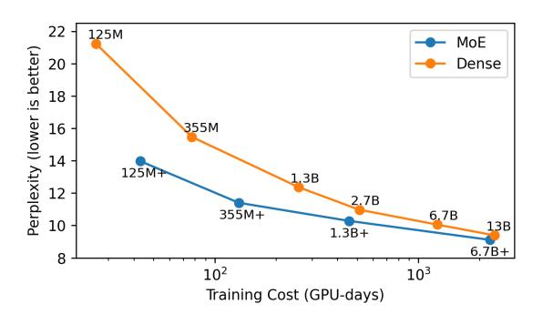

# I. INTRODUCTION

The prediction capability of a machine learning model is strongly correlated with the model capacity, (i.e., the number of parameters in the network). In pursuit of accuracy, capacity has grown at an exponential pace of 10 times per year [\[28\]](#page-11-0), accompanied by higher demand for computational resources and extortionate training costs. Sparsely activated neural networks, such as Mixture of Experts (MoE), are attractive model architectures that decouple the requirement for many parameters from the computational costs. In a sparsely activated model, parts of the network are conditionally activated, which reduces training costs. Results from previous works [\[2\]](#page-10-0), [\[7\]](#page-10-1), [\[21\]](#page-11-1), [\[22\]](#page-11-2), [\[30\]](#page-11-3), [\[34\]](#page-11-4) show that MoE models reduce training cost yet improve model prediction performance in tasks such as language modeling [\[2\]](#page-10-0), [\[5\]](#page-10-2), [\[7\]](#page-10-1), [\[27\]](#page-11-5), machine translation [\[22\]](#page-11-2) and image recognition [\[26\]](#page-11-6), [\[33\]](#page-11-7). While training has been relatively well studied, MoE deployment and inference has received much less attention.

Characterizing and optimizing inference is increasingly important as large language models, like ChatGPT, are deployed for production services. Figures [1](#page-0-0) and [2](#page-0-1) highlight model

Fig. 1. Comparison of MoE and Dense Language Models on training cost and perplexity (the lower perplexity the better in model quality). MoE models can achieve better performance than their dense counterparts at lower training cost (Source: Artetxe et. al. [\[2\]](#page-10-0)).

Fig. 2. Comparison of MoE and Dense models on single node inference latency. While theoretically MoE models should be able to infer on a similar latency as their flop-equivalent dense counterparts, we find that in practice they are 15× slower for Language Modeling (LM), 22× slower for Machine Translation (MT) encoder and 3× slower for Machine Translation decoder.

prediction capabilities as well as associated training and inference costs between the state-of-the-art MoE and dense model architectures. In Figure [1,](#page-0-0) MoE models achieve the same level of performance and quality (*i.e.*, perplexity) with half of the training cost (GPU-days) compared to their dense counterparts. However, when deployed for inference, MoE models are 15× slower for language models (LM) and more than 3× slower for machine translation (MT) compared to their FLOP-equivalent dense counterpart, as shown in Figure [2.](#page-0-1)

A few strategies have been proposed to reduce MoE inference latency. We might distill MoE models into much smaller dense models with a similar number of FLOPs [\[2\]](#page-10-0), [\[7\]](#page-10-1). Although distillation reduces model size and inference latency, it also reduces model quality. Lepikhin *et. al.* show

† ‡ Work done while interning at Meta

that a 14.7 billion parameter Switch Transformer model retains only 29% of its perplexity gain on language modeling after distillation [\[21\]](#page-11-1). DeepSpeed-MoE and Tutel [\[16\]](#page-11-8), [\[24\]](#page-11-9) focus on increasing parallelism and optimizing pipelines to increase hardware utilization when deploying MoE models on hundreds of GPUs. These optimizations are scoped narrowly and mitigate inefficiencies in specific kernels for communication collectives and GPU computation. However, these studies lack a comprehensive analysis of inference latency and neglect inefficiencies in the MoE algorithms themselves.

*In this paper, we provide optimization strategies for efficient MoE deployment, reducing inference costs with minimal impact on model quality.* First, we characterize MoE Transformer deployment on three important axes: inference latency, memory usage, and expert activation. Our detailed characterization establishes significant correlations between expert activation patterns and deployment efficiency. Latency and memory usage is high because expert activations are highly sparse and query load is highly imbalanced across experts,

Second, we analyze unique expert activation patterns to propose a new, optimized gating policy—called Dynamic Gating—and implement it on an open-source, state-of-theart MoE-based Transformer [\[23\]](#page-11-10). For Language Modeling (LM) and Machine Translation (MT) across various datasets and subtasks [\[8\]](#page-10-3), [\[22\]](#page-11-2), our system prototype for dynamic gating improves inference throughput by 6.21-11.23× for LM, 5.75-10.98× for MT Encoder and 2.58-5.71× for MT Decoder by enabling larger batch sizes and smaller latencies. Our optimization strategies complement previously proposed optimizations on distillation, communication collectives, and GPU kernels. When integrated with other optimizations, our gating policy could achieve even greater benefits.

Finally, we take a closer look into expert activation patterns, discovering significant imbalance in load distribution across experts but high temporal locality. Based on these two key observations, we propose Expert Buffering, which improves memory efficiency by allocating a fixed, but limited, amount of GPU memory for hot and active experts and relies on CPU memory to buffer all other experts. The less frequently accessed experts are brought into GPU memory as needed, reducing demand for GPU memory significantly. Expert buffering is orthogonal to existing memory management techniques, such as offloading. Our experiments show that expert buffering reduces static memory usage by up to 1.47× on tasks that demonstrate significant expert sparsity. To balance load, we further propose a priori load balancing based on historical expert activation data, and analyze its benefits for throughput.

To summarize, our contributions in this paper are as follows:

- We provide a thorough characterization of MoE deployment, identifying sources of inefficiencies by breaking down inference latency and memory usage across different components of the model architecture.
- We identify the gating function as a major contributing factor to the high latency and large memory footprint of MoE models. We propose a novel gating policy which

- significantly reduces latency and memory consumption while also enabling inference with larger batch sizes and a smaller number of GPUs.
- We analyze expert activation patterns during inference and discover a significant imbalance in load distribution across experts but high temporal locality.
- We propose Expert Buffering, a new caching mechanism that keeps only hot or active experts in GPU memory and buffers the rest in CPU memory. The less frequently accessed experts are brought into GPU memory as needed. This optimization can reduce static memory allocation in GPU by 1.47×.
- We propose techniques to balance load across experts to further improve memory usage and system robustness.

