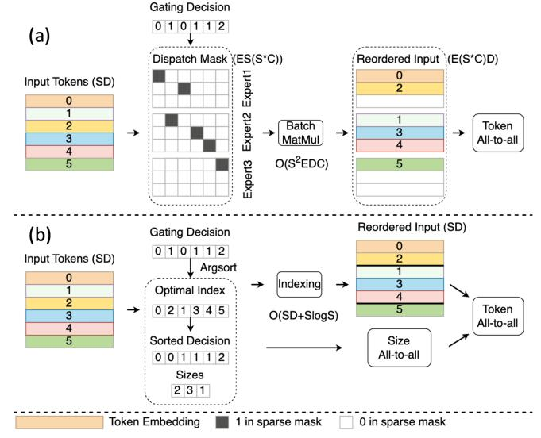

# V. DYNAMIC GATING OPTIMIZATION

The observed activation patterns demonstrate a distinct gap between assumptions in system design and inference performance. Naively increasing expert capacity may still not prevent token overflow for some experts, but will create extra redundancy and waste for other experts. While previous studies also notice the imbalanced activation across experts [\[16\]](#page-11-8), [\[24\]](#page-11-9), existing solutions retain a static gating policy, which increases CF when severe imbalance appears [\[16\]](#page-11-8). Our conclusion is that static gating increases resource waste and fixed expert capacity is not the optimal solution for the distribution of

Fig. 8. Comparison between the static gating in [\[2\]](#page-10-0), [\[21\]](#page-11-1) and our implementation of dynamic gating. For simplicity, we assume E=3, S=6, C=0.5 and top-1 gating in this example. Shapes of tensors are recorded in parentheses. (a) Static Gating. Under a static gating policy, each expert always processes a predefined amount of tokens, which may lead to token overflow or empty tokens. See Section [III-B](#page-3-2) for details. (b) Dynamic Gating. Under a dynamic gating policy, each expert only processes the tokens that are assigned to it. The token distribution mechanism is simplified with less complexity, and the communication and computation are reduced.

tokens to experts. The constraints imposed by static capacity should be removed and the gating function should be dynamic.

Nevertheless, changing the gating policy to allow dynamic sizes for experts is non-trivial. Major, existing implementations [\[2\]](#page-10-0), [\[16\]](#page-11-8), [\[26\]](#page-11-6) do not support dynamic. They rely on static capacity to guarantee that message sizes of all-to-all collectives are the same, which simplifies the communication.

