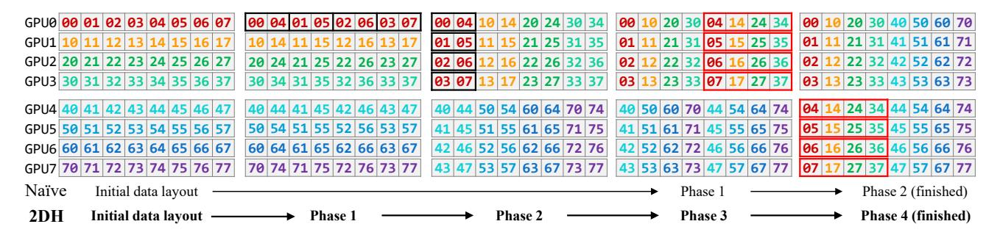

# <span id="page-13-0"></span>A TWO-DIMENSIONAL HIERARCHICAL (2DH) ALL-TO-ALL

This section describes 2DH All-to-All, a novel All-to-All algorithm proposed by TUTEL.

#### A.1 Motivation: Small Size of Message Transfer

Most of popular DL frameworks (Microsoft, 2023; Ott et al., 2019; Sergeev & Del Balso, 2018; Paszke et al., 2019) leverage point-to-point (P2P) APIs of NCCL (NVIDIA, 2023b),  $^4$  the state-of-the-art GPU collective communication library, to implement *Linear* All-to-All algorithm (see Algorithm 1). It operates on n GPUs, where each GPU splits its total S bytes of data into n chunks (S/n bytes each) and performs P2P communication with all other GPUs. The P2P chunk size S/n transferred between any two GPUs will become smaller when we scale out (larger n), which is hard to saturate the high-speed links such as NVLink and HDR InfiniBand at a large scale (see Figure 16). S is fixed and only decided by the model itself.

#### A.2 Approach and Challenges

To achieve a high link bandwidth, our approach is aggregating multiple data chunks that are sent from multiple local GPUs to the same remote GPU. This avoids sending multiple small messages over networking by merging small chunks into a single large chunk, which significantly improves the link bandwidth utilization.

Unfortunately, an efficient implementation of this approach on a large scale is challenging due to the overhead of aggregating small messages. Specifically, to aggregate chunks inside a node with m local GPUs, all m GPUs in the node need to exchange  $\frac{S}{n} \times \frac{n}{m} = \frac{S}{m}$  chunks with each other. This is equivalent to performing  $\frac{S}{n}$  size intra-node All-to-All  $\frac{n}{m}$ times, as illustrated in Figure 17, phase 1 of the naïve local aggregation All-to-All. The latency of this intra-node Allto-All process is expected to be constant as chunk size  $\frac{S}{m}$ does not rely on n, but unexpectedly, it actually increases as n scales out due to  $\frac{n}{m}$  times non-contiguous memory access on GPUs. For example, in phase 1 of the naïve local aggregation, intra-node GPUs exchange non-contiguous chunks twice with each other (01 and 05, 02 and 06, etc.) that incurs  $\mathcal{O}(\frac{n}{m})$  non-contiguous memory access on each GPU. Specifically, when  $S=128\,\mathrm{MiB}$  and m=8, we observe that intra-node All-to-All process takes  $\sim 600 \mu s$  for n=8and increases up to  $\sim 5ms$  for n=2048.

#### Algorithm 1 Linear All-to-All using Point-to-Point APIs

```
1: procedure ALL2ALL_LINEAR(output, input)
     n \leftarrow ngpus, S \leftarrow size of input
2:
3:
     chunksize \leftarrow S / n
4:
     for r = 0; r < n; r++ do
5:
       loc \leftarrow r \times chunksize, peer \leftarrow r
       ncclSend(input[loc], chunksize,
6:
7:
       ncclRecv(output[loc], chunksize,
       peer)
     end for
8:
9: end procedure
```


(a) GPUDirect RDMA ib\_write\_bw (TX depth = 8) over HDR InfiniBand on two Azure NDv4 VMs (Azure, 2023).

(b) All-to-All bus bandwidth in nccl-tests scaling from 64-GPU to 2048-GPU.

Figure 16. Under-utilized bandwidth for small messages.

#### A.3 Algorithm

To avoid the slowdown due to non-contiguous memory access, 2DH All-to-All consists of additional phases that conduct efficient stride memory copies to align non-contiguous chunks into a contiguous address space. To be specific, Figure 17 illustrates all phases of 2DH All-to-All in order. Instead of performing intra-node All-to-All from the beginning like the naïve local aggregation, we first align chunks that share the same local destination GPU via stride memory copies (phase 1) and then conduct intra-node All-to-All (phase 2). In the following phase, again, we align chunks that share the same remote destination GPU (phase 3) and then finally conduct inter-node All-to-All (phase 4). By leveraging stride memory copies, 2DH All-to-All achieves a high memory bandwidth utilization, keeping a constant and low latency regardless of n in the first three phases. The benefit of 2DH All-to-All over existing algorithms increases as S/n gets smaller (a smaller data size S or a larger number of GPUs n). Note that this is beneficial for railoptimized InfiniBand networking as well since it avoids cross-rail communication.

 $<sup>^4</sup>$ Message Passing Interface (MPI) (Snir et al., 1998) also has developed various All-to-All algorithms (Pjesivac-Grbovic, 2007; Thakur & Choudhary, 1994; Bruck et al., 1997), but we only discuss NCCL in this work as it outperforms MPI in most DL scenarios. Note MPI mainly focuses on traditional HPC workloads where S is typically much smaller than DL workloads.

<span id="page-14-0"></span>

Figure 17. Example of data layouts in each phase of the naïve local aggregation All-to-All and two-dimensional hierarchical (2DH) All-to-All. In this example, there are two nodes that consist of GPU  $0\sim3$  and GPU  $4\sim7$ , respectively.


Figure 18. Comparison between linear and 2DH All-to-All algorithms with various sizes in NCCL.

#### A.4 Optimization with MSCCL

Implementation using NCCL APIs. We implement 2DH All-to-All algorithm using NCCL's ncclSend and ncclRecv APIs (see details in Algorithm 2). It consists of two steps. The first step corresponds to phase  $1 \sim 3$  in Figure 17 and contains intra-node All-to-All communication and two stride memory copies, of which latencies only rely on S. The second step corresponds to phase 4 in Figure 17, which is inter-node All-to-All and its latency relies on n/m instead of n as local chunks are already merged.

**Optimization via MSCCL.** Implementation using NCCL APIs requires extra synchronization barriers between different phases in 2DH All-to-All and may cause throughput degradation. In order to achieve better performance, we leverage MSCCL by describing the 2DH algorithm in a domain specific language (DSL) and optimizing with the compiler (Cowan et al., 2023). The custom compiler also leverages LL128 protocol (NVIDIA, 2020a) for All-to-All, which could achieve better efficiency than default NCCL-based implementation in low latency scenarios like small sizes All-to-All.

**Extension.** On existing GPU clusters, local GPU number m is usually 8 or 16, which makes  $\frac{n}{m}$  still large when scaling out All-to-All to hundreds of thousands (100 K) of GPUs at exascale. The next generation

NVSwitch (NVIDIA, 2023d) enables up to 256 GPUs connected via high speed NVLink and makes it possible for 2DH All-to-All scaling out with m=256. For large-scale network topologies like dragonfly (Kim et al., 2008), 2DH All-to-All could be further adapted to 3D by splitting internode to intra-group and inter-group All-to-All according to the network hierarchy.

#### A.5 Evaluation

We benchmark alltoall\_perf in nccl-tests (NVIDIA, 2023c) to measure the performance and correctness of Allto-All operations. Experiment setup is as described in Section 5. The sizes of All-to-All start from 1 KiB and end at 16 GiB, with multiplication factor 2. The tests are launched via OpenMPI with proper NUMA binding. All of the Allto-All operations are out-of-place and correctness is also checked by nccl-tests. We compare the latency of specific sizes we are interested in between different algorithms and different implementations.

To illustrate scalability of the proposed 2DH All-to-All algorithm, we compare it with the state-of-the-art NCCL All-to-All in the same cluster. alltoall\_perf in nccltests (NVIDIA, 2023c) uses the linear All-to-All algorithm by default while we also implement the 2DH All-to-All algorithm in nccl-tests to replace the original one. We scale the experiments from 64-GPU to 4096-GPU. As shown

#### <span id="page-15-0"></span>Algorithm 2 Two-Dimensional Hierarchical (2DH) All-to-All

```
1: procedure STRIDEMEMCPY(output, input, chunksize, row, col)
2: for i = 0; i < row × col; i++ do
3: j ← i % row × col + i / col
4: output[j × chunksize : (j+1) × chunksize] ← input[i × chunksize : (i+1)
      × chunksize]
5: end for
6: end procedure
7: procedure ALL2ALL 2DH(output, input)
8: // step 1: intra-node All-to-All
9: strideMemcpy(buffer, input, chunksize, ngpus per node, nnodes)
10: for g = 0; g < ngpus per node; g++ do
11: loc ← g × nnodes × chunksize, peer ← g + node rank × ngpus per node
12: ncclSend(buffer[loc], nnodes × chunksize, datatype, peer, comm)
13: ncclRecv(output[loc], nnodes × chunksize, datatype, peer, comm)
14: end for
15: strideMemcpy(buffer, output, chunksize, nnodes, ngpus per node)
16: // step 2: inter-node All-to-All
17: for n = 0; n < nnodes; n++ do
18: loc ← n × ngpus per node × chunksize, peer ← local rank + n ×
      ngpus per node
19: ncclSend(buffer[loc], ngpus per node × chunksize, datatype, peer, comm)
20: ncclRecv(output[loc], ngpus per node × chunksize, datatype, peer, comm)
21: end for
22: end procedure
```


Figure 19. Comparison between NCCL and optimized implementation [\(Cowan et al.,](#page-10-0) [2023\)](#page-10-0) running 2DH All-to-All algorithm.

in [Figure 18,](#page-14-0) the proposed 2DH algorithm could scale better with lower gradient than original linear algorithm. For small sizes (1 MiB), 2DH algorithm can achieve lower latency starting from small scales. For larger sizes (32 MiB and 256 MiB), 2DH algorithm has higher latency caused by extra data copies. While as the GPU number scales out, 2DH algorithm could perform better. Therefore, dynamic adaption between linear and 2DH algorithms is required. Besides, the 2DH algorithm can scale to 4096-GPU in our experiments while we didn't run NCCL's linear algorithm successfully in such large scale.

We also study the performance gain using the custom compiler [\(Cowan et al.,](#page-10-0) [2023\)](#page-10-0). As illustrated in Figure 19, the optimized implementation achieves better results than implementation using NCCL's APIs. For example, 256 MiB size on 64-GPU, 2DH algorithm in NCCL implementation has higher latency, but with the optimized implementation it could still outperform linear algorithm in NCCL. Besides, LL128 protocol has lower latency for small sizes (1 MiB and 32 MiB) while default protocol performs better for large sizes (256 MiB). Therefore, dynamic adaption between different protocols is necessary with this optimization.

#### B SIMT-EFFICIENT FAST ENCODE AND DECODE

TUTEL implements sophisticated optimizations for the *encode* (generating All-to-All inputs out of MoE layer inputs during MoE dispatch) and *decode* (generating MoE layer

```
# Tensor shapes: logits(T,E)
   gate_probs = softmax(logits)
   # Tensor shapes: gate_probs(T,E), idxs(T,), scores(T,)
   idxs, scores = top_k(gate_probs)
   # Tensor shapes: locations(T,)
   locations = compute_location(idxs)
   # Tensor shapes: locations(T,), locations1(T,Cg)
   locations1 = one_hot(locations, num_classes=Cg)
   # Tensor shapes: gate_probs(T,E), combine(T,E,Cg)
   combine = einsum("TE,TC->TEC", gate_probs, locations1)
   # Tensor shapes: dispatch_input(E,Cg,M),moe_input(T,M)
   dispatch_input = einsum(
       "TEC,TM->ECM", bool(combine), moe_input)
 1
 2
 3
 4
 5
 6
 7
 8
 9
10
11
12
13
                  (a) Dense implementation.
   # Tensor shapes: logits(T,E)
   gate_probs = softmax(logits)
   # Tensor shapes: gate_probs(T,E), idxs(T,), scores(T,)
   idxs, scores = top_k(gate_probs)
   # Tensor shapes: locations(T,)
   locations = compute_location(idxs)
   # Tensor shapes:
   # dispatch_input(E,Cg,M), moe_input(T,M)
   dispatch_input = zeros((E,Cg,M))
   for t in [0, 1, ..., T-1]:
       # Broadcast multiplication
       dispatch_input[idxs[t]][locations[t]] = \
           bool(scores[t]) * moe_input[t]
 1
 2
 3
 4
 5
 6
 7
 8
 9
10
11
12
13
                 (b) Sparse implementation.
```

Figure 20. Comparison between dense and sparse implementations of generating All-to-All dispatch input (dispatch input) out of an MoE layer input (moe input) and a gate function output (logits).

outputs out of All-to-All outputs during MoE combine) stages of an MoE layer. Existing implementations of encode and decode need einsum operations with a large time complexity, as described by GShard [\(Lepikhin et al.,](#page-11-0) [2021\)](#page-11-0) and implemented in Fairseq [\(Ott et al.,](#page-11-0) [2019\)](#page-11-0). For instance, Figure 20a shows the most heavy-weighted part of the encode implementation (decode is similar as encode since it is a reverse operation of encode). We observe that this implementation is unnecessarily dense as it contains a lot of zero multiplications and additions. TUTEL addresses this by a sparse implementation as shown in Figure 20b. Given that T is the number of input tokens per expert, while the time complexity of the dense version is O(T · E · C<sup>g</sup> · D), the one of the sparse version is only O(T · k · D), where T · k = E · C<sup>g</sup> in most cases. This indicates that the sparse version has only 1/T of time complexity than the dense version.

Unfortunately, it is challenging to implement efficient GPU kernels for the sparse implementation. While the dense computation can be dramatically accelerated by matrix multiplication accelerators (e.g., Tensor Cores), the sparse computation cannot leverage those accelerators efficiently.<sup>5</sup>


Figure 21. Forward- and backward-pass computations of fast encode and fast decode operators. Parentheses refer to tensor shapes. The tensor shapes of X, Y, and Z are (T, D), (T,), and (E, Cg, D), respectively. idxs and locations have no backward-pass computation as they are not trainable inputs.

| tokens/step | Fairseq MoE (GiB) | TUTEL MoE (GiB) |
|-------------|-------------------|-----------------|
| 4,096       | 3.7               | 2.9<br>(-21.6%) |
| 8,192       | 6.2               | 3.2<br>(-48.4%) |
| 16,384      | 16.3              | 4.0<br>(-75.5%) |
| 32,768      | 57.9              | 5.7<br>(-90.2%) |

Table 9. GPU memory cost for single MoE layer. (Static Settings: D = H = 4096, top-k = 2, E<sup>g</sup> = 2)

To tackle this issue, we implement differentiable fast encode and decode operators based on three specially designed GPU kernels: K0, K1, and K2, as illustrated in Figure 21. TUTEL accelerates these kernels by always assigning different indices of dimension T to different thread arrays (or *warps*), which ensures computation for a single token along dimension M is SIMT-efficient. By this approach, our sparse computation can actually leverage various optimizations that are applicable only for dense computation, such as warp shuffling, Blelloch scan algorithm, and element vectorization for low-precision computation (e.g., leveraging half2 types for half-precision computation). Aggregating all the kernel optimizations, TUTEL extremely minimizes the latency of encode and decode as shown in [Figure 15.](#page-9-0) It greatly saves GPU memory as well. As shown in Table 9, in most cases, it achieves 20% ∼ 90% memory saving. TUTEL exposes two interfaces for these optimized computations: moe.fast encode used by MoE dispatch and moe.fast decode used by MoE combine.

ports fine-grained sparsity, while our sparse computation belongs to coarse-grained sparsity [\(NVIDIA,](#page-11-0) [2020b\)](#page-11-0).

<sup>5</sup>Even the sparsity support by the latest hardware (e.g., 3rdgeneration Tensor Cores) cannot work efficiently as it only sup-

| Method       | E  | k | f    | MoE   | $AP^{box}$  | $AP^{mask}$ |
|--------------|----|---|------|-------|-------------|-------------|
| SwinV2-B     | -  | - | -    | -     | 53.0        | 45.8        |
| SwinV2-MoE-B | 32 | 1 | 1.25 | tuned | 51.3 (-1.7) | 44.4 (-1.4) |
| SwinV2-MoE-B | 32 | 1 | 1.25 | fixed | 53.4 (+0.4) | 46.2 (+0.4) |

*Table 10.* The results on COCO object detection. "fixed" MoE indicates that the MoE layers are fixed in fine-tuning.

#### C More Results on SwinV2-MoE

### C.1 How to do fine-tuning on COCO object detection?

Previous MoE models on computer vision only perform experiments using image classification tasks (Riquelme et al., 2021). It is unclear whether the sparse MoE models perform well on down-stream computer vision tasks as well such as COCO object detection.

As shown in Table 10, direct fine-tuning will result in poor performance, with -1.7/-1.4 box/mask AP drops compared to the dense counterparts. We find that fixing all MoE layers in fine-tuning can alleviate the degradation problem, and we obtain +0.4/+0.4 box/mask AP improvements by this strategy.

Also note it is the first time that a sparse MoE model is applicable and superior on the important computer vision tasks of COCO object detection. We hope TUTEL to empower more down-stream AI tasks.

#### C.2 Ablation Study

**Ablation on Number of Experts.** Table 11 ablates the effect of expert number, using different model sizes (SwinV2-S and SwinV2-B) and a variety of vision tasks. It can be seen that 32 and 64 perform the best, which is consistent with that in previous works (Riquelme et al., 2021; Du et al., 2022).

