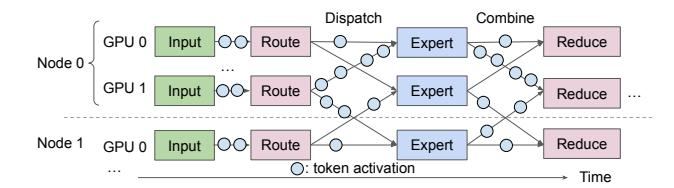

# 1 Introduction

State-of-the-art large language models (LLMs), such as DeepSeek-V3 [13, 32], OpenAI gpt-oss [48], Google Gemini-3 Pro [18], and Meta LLaMA 4 [2], are increasingly based on the Mixture-of-Experts (MoE) architecture. In a MoE layer, a gating network running on GPUs selects a small subset of experts for each token activation, dispatches the token activation to those experts, and then aggregates their output activations. Modern MoE models typically instantiate hundreds of experts that specialize in different input patterns, so that only a few experts are active for each token. This sparsity allows MoE models to achieve accuracy comparable to large dense models

(a) IBGDA-style.

(b) UCCL-EP

**Figure 1:** Assuming m GPU vendors and n NIC vendors, UCCL-EP enables O(m) effort, instead of IBGDA's  $O(m \times n)$ , to support GPU-initiated token-level communication for expert parallelism.

while using only a fraction of the per-token inference cost, making them the standard choice for many frontier LLMs.

Training and serving large MoE models require expert parallelism (EP), which places different experts on different GPUs and communicates token activations among GPUs in an all-to-all manner. By sparsely sharding experts on different GPUs, EP leaves enough GPU memory for matrix multiplication on extremely large batch sizes (e.g., 4096 in DeepSeek-V3 [32]), thus enabling high GPU resource efficiency. Expert-parallel communication plays a pivotal role in the EP efficiency [32,64], because token activations are small (e.g., 7KB), dispatch and combine operations are frequent (e.g., selecting 8 experts per token), and routing destinations are only determined at runtime in GPUs (§2.1).

GPU-initiated token-level (fine-grained) communication (§2.2) is an emerging and key communication pattern for efficient token dispatch and combine at runtime, where DeepEP [65] by DeepSeek is the most popular communication system implementing it. Different from CPU-initiated bulk-transfer (coarse-grained) communication in NCCL/R-CCL [4,44], DeepEP leverages the advanced NVIDIA IBGDA (InfiniBand GPUDirect Async) [46] technique that enables GPUs to directly operate RDMA NICs (network interface controllers) to write out small activations. Leveraging GPUinitiated token-level communication, DeepEP implements efficient GPU-side token deduplication during dispatch (avoid sending duplicate tokens to experts on the same node) and hierarchical reduce during combine to achieve superior performance. DeepEP has been widely adopted by various training and serving frameworks such as Megatron-LM [7], vLLM [61], and SGLang [60]

Although GPU-initiated token-level communication leads to high performance, its design unfortunately results in poor portability. There are two key reasons: GPUs directly issuing

♣This work does not relate to the position at Amazon.

RDMA operations to NICs prevent interoperability across different GPUs and NICs, as it requires the GPU to write to the NIC's driver-defined MMIO doorbell/register interface [\[27,](#page-14-3) [47,](#page-14-4) [53\]](#page-15-5); GPU kernels also impose strict ordering and delivery semantics assumptions on the underlying network, which often mismatch the capabilities and semantics of heterogeneous NICs. As shown in Figure [1a,](#page-0-0) ML infrastructure developers need to vertically integrate the GPU and NIC software ecosystems. This involves complex and subtle code migration and maintenance that are both NIC vendorspecific and GPU vendor-specific. Assume there are *m* types of GPU accelerators and *n* types of NICs. Developers need to pay *O*(*m*×*n*) effort to enable such communication on heterogeneous hardware. Because of this portability issue, the official DeepEP [\[65\]](#page-15-2) only supports NVIDIA GPUs and NICs, creating severe vendor lock-in and high portability effort for alternative GPU and NIC devices. For example, at the time of writing, it remains impossible to run DeepEP on any AWS GPU instances with AWS EFA RDMA NICs; it is also challenging to run DeepEP on any GPUs with Broadcom NICs, one of the major NIC vendors. At a high level, such vertical integration is somewhat reminiscent of mainframe servers, which get replaced by less-coupled and more portable commodity servers from heterogeneous vendors in modern cloud computing.

This paper introduces a new portable expert-parallel communication architecture for GPU-initiated token-level communication with high performance. We envision that with our architecture, developers only need to pay *m* times effort (instead of *m*×*n*) to enable systems like DeepEP on heterogeneous GPU and NIC hardware, as shown in Figure [1b.](#page-0-0)

Our key insight is to leverage the host CPU to help break the tight coupling between GPUs and NICs, where the CPU is essentially portable to any GPUs and NICs via the libibverbs library [\[51\]](#page-15-6) maintained by the Linux community and NIC vendors. In particular, GPUs and CPUs are connected through high-throughput, low-latency interconnects such as PCIe and even faster NVLink-C2C [\[45\]](#page-14-5), which allows efficient transferring of small control data from GPUs to CPUs. By embedding the token dispatching information, such as source and destination address, into the control data, CPUs directly issue GPUDirect RDMA to write out the activations on behalf of GPUs. We note that modern GPU servers usually have hundreds of CPU cores, which are often heavily underutilized, e.g., 20%-45% CPU utilization reported by several industry companies in their GPU clusters [\[21,](#page-13-3) [25\]](#page-13-4); From discussion with a model training team inside a major GPU vendor, their model training using Megatron-LM [\[43\]](#page-14-6) yields on average 14.5% CPU utilization.

Moreover, flexible host CPUs can help bridge the semantic gap between the guarantees required by specialized EP communication systems and the primitives actually provided by heterogeneous NICs. For example, DeepEP requires a specific write-then-atomic ordering requirement to inform remote

GPUs of data arrival, but such a requirement is typically not enforced by all RDMA NICs, such as AWS EFA NICs, which do not guarantee ordering.

To realize these insights, we need to address two challenges: i) how to efficiently transfer control data from GPUs to CPUs so that the CPU does not become the bottleneck. This is challenging, especially given the frequent token dispatch/combine operations as high as 7Mop/s/GPU under 7KB activations [\[32\]](#page-14-0) and a 400G network. ii) How to use CPUs to express and enforce various delivery semantics (e.g., writethen-atomic) in CPU to accommodate heterogeneous NICs that do not support them on their own.

We present UCCL-EP, a portable expert-parallel communication system with GPU-initiated token-level communication. UCCL-EP decouples communication initiation from communication execution: it keeps GPUs initiating communication for fine-grained token control, and delegates the communication tasks to the host CPU. UCCL-EP addresses the first challenge with an efficient multithreaded, lock-free FIFO communication channel between GPUs and CPUs. This channel minimizes the PCIe traversing overhead and allows multiple CPU proxy threads to forward and execute the GPU-generated token routing decisions. It leverages GPU-side caching and space-efficient message packing that minimizes PCIe operations to achieve millions of messages per second from GPUs to CPUs. To address the second challenge, UCCL-EP leverages the immediate data feature that is widely available in RDMA NICs (this immediate data field has been standardized into the RoCEv2 packet header [\[1\]](#page-12-2)). UCCL-EP embeds sequence information into this immediate data and lets the receiver hold atomic updates until all previous corresponding writes have finished. We show how host CPUs can flexibly bridge the delivery guarantees that GPUs require and the ones actually provided by the networking layer.

We have implemented UCCL-EP and enabled it on various heterogeneous platforms, including NVIDIA GPUs + AWS EFA NICs, and AMD GPUs + Broadcom NICs. On the NVIDIA+EFA platform, compared to the second-best EP solution PPLX [\[31\]](#page-14-7), UCCL-EP achieved up to 2.1× higher throughput. On the AMD+Broadcom platform, UCCL-EP achieves comparable performance to the original DeepEP on the NVIDIA-only platform. UCCL-EP supports dropin replacement for any DeepEP applications without any line of code change. It speeds up serving throughput in SGLang [\[66\]](#page-15-7) by up to 40% on the NVIDIA+EFA platform, and improves DeepSeek-V3[1](#page-0-1) training throughput in the AMD Primus/Megatron-LM framework by up to 45% on a 16 node AMD+Broadcom platform. To the best of our knowledge, UCCL-EP is the first work that enables running GPUinitiated token-level communication on platforms with non-NVIDIA NICs. UCCL-EP is open-sourced.[2](#page-0-1)

1We downscale DeepSeek-V3 to 32 layers and 379B parameters to fit onto the 16-node, 128 MI300X GPUs ([§5.3.2\)](#page-10-0).

2https://github.com/uccl-project/uccl/tree/main/ep

**Figure 2:** The MoE communication pattern consists of the dispatch phase and the combine phase. In the dispatch phase, the router sends each token's input activations to one or more selected experts. In the combine phase, expert activations are collected and aggregated back to the sender. The dispatch and combine phases feature *irregular*, *fine-grained* communication.

