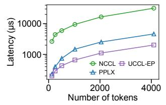

# 2.2 Expert-parallel communication requires GPUinitiated token-level communication

Given the central role of MoE communication, recent specialized systems—most notably DeepEP [65]—have introduced GPU-initiated token-level communication, as illustrated in Figure 3. This design involves GPU threads directly submitting transfer commands to the NIC, using NVIDIA IBGDA (InfiniBand GPUDirect Async) [46]. GPU-initiated communication enables fine-grained and pipelined overlap on a token basis, where transfer for a single token or a chunk of tokens can overlap with other phases of communication, such as data copying between application tensor buffers and RDMA transport buffers, token forwarding from the RDMA domain to the NVLink domain, and necessary computation steps such as the reduce during the combine phase. By breaking communication into these smaller GPU-triggered units (e.g., per-token to 32 tokens), the system can better utilize both network and compute resources and significantly reduce end-to-end communication latency.

GPU-initiated token-level communication also enables

&lt;sup>3For simplicity, we use token and token activation interchangeably.

**Figure 4:** GPU-initiated token-level communication outperforms coarse-grained bulk transfer (e.g., packing tokens into a contiguous buffer on GPU then CPU initiating a single contiguous transfer) on NV\_EFA3 (testbed details listed in Table 2). The y-axis is in log scale.

many optimization opportunities, such as message deduplication: if the token activation is routed to experts residing on multiple GPUs on the same node, the communication library can only send the token activation once with RDMA, and rely on intra-node forwarding to multiple experts for maximal speed. A second optimization enabled by GPU-initiated token-level communication is hierarchical reduce: an intra-node reduce (weighted sum) is performed on each node for a chunk of tokens, the result is sent back to the sender rank for another inter-node reduce: all of which overlaps with background network transfer. Such optimization techniques were previously not feasible, and have enabled a significant reduction in the amount of traffic needed to send over the network, and improvement in end-to-end performance.

To compare, some inference and training frameworks adopt coarse-grained transfer, such as with NCCL [44] or RCCL [4], or other general-purpose collective libraries. They require either the application packing tokens into a contiguous perdestination-rank transfer buffer or transferring small tokens one by one. The former incurs a high overhead of packing the token; the latter suffers from limited transfer throughput with small messages. For example, PPLX [31] adopts on-GPU token packing without fine-grained token deduplication and hierarchical reduce, and it does not scale as the number of tokens increases (Figure 4).

We summarize existing systems in Table 1. Collective communication libraries such as NCCL and RCCL are designed for regular collective patterns and do not target fine-grained token-level EP. Systems such as DeepEP [65] and ROCm-DeepEP [52] support GPU-initiated token-level communication but assume specific GPU-NIC pairings, limiting their portability across heterogeneous platforms.

