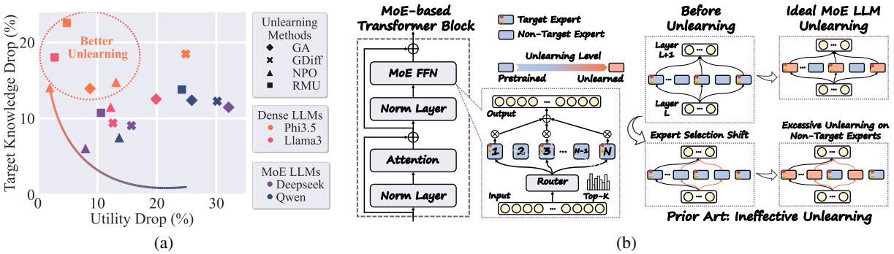

# 2 Related Works

Machine Unlearning for LLMs. A growing body of research has investigated the problem of unlearning in LLMs [\(Yao et al.,](#page-11-0) [2024;](#page-11-0) [Lu et al.,](#page-10-8) [2022;](#page-10-8) [Jang et al.,](#page-9-5) [2022;](#page-9-5) [Kumar et al.,](#page-9-6) [2022;](#page-9-6) [Zhang et al.,](#page-11-1) [2023a;](#page-11-1) [Pawelczyk et al.,](#page-10-9) [2023;](#page-10-9) [Eldan and Russi](#page-8-3)[novich,](#page-8-3) [2023;](#page-8-3) [Ishibashi and Shimodaira,](#page-9-7) [2023;](#page-9-7) [Yao](#page-11-2) [et al.,](#page-11-2) [2023;](#page-11-2) [Maini et al.,](#page-10-10) [2024;](#page-10-10) [Zhang et al.,](#page-11-3) [2024;](#page-11-3) [Li et al.,](#page-9-0) [2024;](#page-9-0) [Wang et al.,](#page-10-11) [2024a;](#page-10-11) [Jia et al.,](#page-9-2) [2024b;](#page-9-2) [Liu et al.,](#page-10-4) [2024c](#page-10-4)[,b;](#page-10-12) [Thaker et al.,](#page-10-13) [2024\)](#page-10-13). These studies have practical applications, such as removing sensitive information [\(Jang et al.,](#page-9-5) [2022;](#page-9-5) [Eldan](#page-8-3) [and Russinovich,](#page-8-3) [2023;](#page-8-3) [Wu et al.,](#page-10-14) [2023\)](#page-10-14), preventing the generation of harmful or biased content [\(Jang et al.,](#page-9-5) [2022;](#page-9-5) [Eldan and Russinovich,](#page-8-3) [2023;](#page-8-3) [Wu et al.,](#page-10-14) [2023;](#page-10-14) [Lu et al.,](#page-10-8) [2022;](#page-10-8) [Yu et al.,](#page-11-4) [2023;](#page-11-4) [Yao et al.,](#page-11-2) [2023;](#page-11-2) [Liu et al.,](#page-10-15) [2024d\)](#page-10-15), memorized sequences [\(Jang et al.,](#page-9-5) [2022;](#page-9-5) [Barbulescu and Tri](#page-8-4)[antafillou,](#page-8-4) [2024\)](#page-8-4), and copyrighted material [\(Eldan](#page-8-3) [and Russinovich,](#page-8-3) [2023;](#page-8-3) [Jang et al.,](#page-9-5) [2022\)](#page-9-5). To facilitate unlearning, recent methods aim to bypass the need for retraining models from scratch by excluding the forget set containing the targeted data to be removed [\(Ilharco et al.,](#page-9-8) [2022;](#page-9-8) [Liu et al.,](#page-9-9) [2022;](#page-9-9) [Yao et al.,](#page-11-2) [2023;](#page-11-2) [Eldan and Russinovich,](#page-8-3) [2023;](#page-8-3) [Jia](#page-9-2) [et al.,](#page-9-2) [2024b;](#page-9-2) [Zhang et al.,](#page-11-3) [2024;](#page-11-3) [Li et al.,](#page-9-0) [2024;](#page-9-0) [Thaker et al.,](#page-10-13) [2024;](#page-10-13) [Liu et al.,](#page-10-12) [2024b\)](#page-10-12). Techniques like task arithmetic also enable efficient model editing through parameter merging [\(Hu et al.,](#page-9-10) [2024;](#page-9-10) [Ilharco et al.,](#page-9-8) [2022\)](#page-9-8). Although these methods do not provide exact unlearning akin to full retraining, they remain efficient and effective under empirical unlearning evaluation metrics. Approaches often include model fine-tuning and optimization [\(Liu](#page-9-9) [et al.,](#page-9-9) [2022;](#page-9-9) [Yao et al.,](#page-11-2) [2023;](#page-11-2) [Eldan and Russi](#page-8-3)[novich,](#page-8-3) [2023;](#page-8-3) [Jia et al.,](#page-9-2) [2024b;](#page-9-2) [Zhang et al.,](#page-11-3) [2024;](#page-11-3) [Li et al.,](#page-9-0) [2024\)](#page-9-0), or input prompting and in-context learning [\(Thaker et al.,](#page-10-13) [2024;](#page-10-13) [Pawelczyk et al.,](#page-10-9) [2023;](#page-10-9) [Liu et al.,](#page-10-12) [2024b\)](#page-10-12). Other approaches, such as localization-informed unlearning, identify and locally edit model units (e.g., layers or neurons) closely related to the data or tasks being unlearned [\(Meng et al.,](#page-10-16) [2022;](#page-10-16) [Wu et al.,](#page-10-14) [2023;](#page-10-14) [Wei et al.,](#page-10-17) [2024\)](#page-10-17). Most existing research has focused on dense LLMs, leaving unlearning in MoE LLMs unexplored. For example, the unlearning of Mixtral-8 × 7B discussed in [Li et al.](#page-9-0) [\(2024\)](#page-9-0) only examined a single method with ad-hoc adjustments. This work aims to fill this gap by conducting a com-

Figure 1: Overview of the key findings in this paper. (a) Illustration of the ineffectiveness of existing unlearning methods on MoE LLMs. Four unlearning algorithms—GA (Eldan and Russinovich, 2023), GDIFF (Maini et al., 2024), NPO (Zhang et al., 2024), and RMU (Li et al., 2024)—were applied to two MoE LLMs (DeepSeek-v2-Lite (Liu et al., 2024a) and Qwen1.5-MoE (Team, 2024)) and two dense LLMs (Phi3.5 (Abdin et al., 2024) and LLaMA3-8B (Dubey et al., 2024)) using the WMDP benchmark (Li et al., 2024). The drop in target knowledge (accuracy drop on the forget test set, higher is better) and the drop in model utility (accuracy drop on MMLU (Hendrycks et al., 2023), lower is better) are plotted. Better-unlearned models should appear in the top left corner, but unlearning on MoE LLMs was less effective compared to non-MoE modles. (b) Illustration of ideal versus ineffective MoE LLM unlearning. Target experts—those most frequently activated given the forget set—are identified for unlearning. However, existing unlearning algorithms tend to cause substantial expert selection shifts, leading to excessive and unnecessary unlearning of non-target experts, which significantly impairs model utility.

prehensive study of various unlearning methods, benchmarks, and MoE models, addressing the specific challenges posed by the MoE architecture.

MoE-based LLMs. Sparse MoE models are designed to activate only a subset of expert networks for each input during inference, enabling substantial model scaling with minimal computational overhead (Shazeer et al., 2017). Current MoE model development can be categorized into two types: training from scratch (Fedus et al., 2022; Zoph et al., 2022a; Shen et al., 2023) and building from dense checkpoints (Zhang et al., 2021; Komatsuzaki et al., 2022; Zhu et al., 2024). Over recent years, MoE models have seen key advancements, including improvements in scalability (Riquelme et al., 2021; Kim et al., 2021; Zhou et al., 2022; Zoph et al., 2022a), efficiency optimization (Fedus et al., 2022; Lepikhin et al., 2020; Chowdhery et al., 2023), and expert balancing techniques (Cong et al., 2024; Zoph et al., 2022b; Dai et al., 2022). The implementation of transformer-based MoE models has been integrated into LLMs, significantly enhancing inference efficiency (Jiang et al., 2024; Dai et al., 2024; xAI, 2024; Hong et al., 2024; Abdin et al., 2024; Lieber et al., 2024; Yang et al., 2024; Zhu et al., 2024; Databricks, 2024). For example, DeepSeekMoE (Dai et al., 2024) improves expert specialization by segmenting experts into smaller subsets for flexible activation, while isolating shared experts to reduce redundancy and capture common knowledge. Similarly, Qwen1.5-MoE (Team, 2024) partitions a standard FFN layer into smaller segments to create multiple experts, introducing a fine-grained routing mechanism that enables Qwen1.5-MoE to match the performance

of 7B models with only one-third of parameters activated. Despite the efficiency gains provided by MoE's dynamic routing system, existing research highlights additional challenges compared to traditional dense models, including unstable training (Zoph et al., 2022a; Dai et al., 2022), robustness issues (Zhang et al., 2023b; Puigcerver et al., 2022), and complications in parallel deployment (Hwang et al., 2023; Gale et al., 2023). In this work, we show that the root cause of the ineffectiveness of existing unlearning methods for MoE LLMs also stems from the dynamic routing system.

#### 3 Preliminaries

In this section, we present our pilot study to reveal that unlearning methods designed for conventional LLMs are *ineffective* in unlearning MoE LLMs.

Preliminaries on MoE LLM unlearning. Based on the generic formulation outlined in Liu et al. (2024c), the task of LLM unlearning is to eliminate the influence of a specific 'unlearning target'-whether it is related to data, knowledge, or model capabilities—from a pretrained LLM (denoted by  $\theta_0$ ). The unlearning target is typically defined by a forget set  $\mathcal{D}_f$ , which contains the information or knowledge to be removed. To ensure the model retains its generation ability (i.e., utility) after unlearning, a retain set  $\mathcal{D}_r$  is introduced, consisting of data unrelated to the unlearning target. With this setup, the LLM unlearning problem is usually formed as a regularized optimization problem, finetuned from  $\theta_o$  using both the forget set  $\mathcal{D}_f$ and the retain set  $\mathcal{D}_r$ :

$$\min_{\boldsymbol{\theta}} \ell_f(\boldsymbol{\theta}; \mathcal{D}_f) + \lambda \ell_r(\boldsymbol{\theta}; \mathcal{D}_r). \tag{1}$$

Table 1: Unlearning performance of GA when controlling tunable parameters in MoE LLMs.

| Tunable Module |                  | Forget Efficacy ↓ | Utility ↑ |
|----------------|------------------|-------------------|-----------|
|                | Original         | 0.4192            | 0.5979    |
| 0              | Experts & Router | 0.2953            | 0.3393    |
| Qwen           | Routers Only     | 0.2526            | 0.2977    |
|                | Experts Only     | 0.2536            | 0.3242    |
|                | Original         | 0.3804            | 0.5500    |
| Dangarl        | Routers & Expert | 0.2457            | 0.3145    |
| DeepSeek       | Routers Only     | 0.2375            | 0.3315    |
|                | Experts Only     | 0.2601            | 0.3435    |

Here,  $\theta$  represents the model parameters to be updated during unlearning,  $\ell_f$  and  $\ell_r$  denote the forget loss and retain loss, respectively, with  $\lambda \geq 0$  serving as a regularization parameter to balance between unlearning and preserving utility.

Next, we provide a brief introduction to how the routing system operates in the MoE LLM architecture. In MoE LLMs, e.g., DeepSeek-v2-Lite (Liu et al., 2024a), the feed-forward networks (FFNs) of Transformers are split into multiple experts and activated by the output of the router in front of the expert layers, see Fig. 1(b) for illustration. In the l-th layer, given the input  $\mathbf{u}_t^{(l)}$  corresponding to the t-th token, router layers calculate the score of each token and assign them to the top-K experts:

$$\begin{split} s_{i,t}^{(l)} &= \operatorname{Softmax}(\operatorname{Router}(\mathbf{u}_t^{(l)})) \\ g_{i,t}^{(l)} &= \begin{cases} s_{i,t}^{(l)} & \text{if } s_{i,t}^{(l)} \in \operatorname{Top}K(\{s_{k,t}^{(l)} \mid 1 \leq k \leq N\}) \\ 0 & \text{otherwise} \end{cases} \end{split}$$

Here, Router(·) denotes the router layer,  $s_{i,t}$  is the token-to-expert affinity,  $\operatorname{Top} K(\cdot)$  selects the highest K value in the set, N is the number of experts, and  $g_{i,t}^{(l)}$  is the score assigned by router for the i-th expert. Then, the hidden state  $\mathbf{h}_t'^{(l)}$  of FFNs can be calculated as:  $\mathbf{h}_t'^{(l)} = \mathbf{u}_t^{(l)} + \sum_{i=1}^N g_{i,t}^{(l)} \operatorname{FFN}_i^{(l)}(\mathbf{u}_t)$ , where  $\operatorname{FFN}_i^{(l)}(\cdot)$  denotes the i-th expert. Then,  $\mathbf{h}_t'^{(l)}$  is sent to the next layer of Transformer blocks for further processing.

Unlearning for MoE LLM is not trivial: a pilot study. The goal of unlearning is twofold: (1) to ensure the model forgets the targeted information and knowledge stored in  $\mathcal{D}_f$ , and (2) to preserve the model utility without significant degradation. Our pilot study reveals that the special routing system in MoE LLMs introduces additional challenges to unlearning, rendering existing methods ineffective. We applied four widely used LLM unlearning methods: GA (Gradient Ascent) (Eldan and Russinovich, 2023), GDIFF (Gradient Difference) (Maini et al., 2024), NPO (Negative Preference Optimization) (Zhang et al., 2024), and RMU (Rep-

resentation Misdirection for Unlearning) (Li et al., 2024) with the WMDP benchmark (Li et al., 2024) on two MoE LLMs, Qwen1.5-MoE (Team, 2024) and DeepSeek-V2-Lite (Liu et al., 2024a), as well as two dense LLMs for reference, LLaMA3-8B (Dubey et al., 2024) and Phi-3.5-mini-instruct (Abdin et al., 2024), where the task aims to unlearn hazardous knowledge in LLMs. In Fig. 1(a), to ease the comparison, we report the forget quality (performance drop on the forget test set, where higher is better) against retain quality (performance drop on the MMLU (Hendrycks et al., 2020) utility benchmark, where lower is better). Each data point represents the best result of a model-method combination with hyper-parameter tuning, with ideal performance located near the top left corner, signifying high unlearning effectiveness with minimal impact on model utility. As we can see, most MoE LLM data points cluster in the lower right, indicating severe utility drops and poor unlearning performance compared to dense models. In Fig. 1(a), all model parameters (including routers and experts) are involved in unlearning. To ensure that these poor results are not due to improper parameter settings, **Tab. 1** presents additional experiments using two other parameter configurations (routers-only and experts-only) for GA, yet no significant improvements are observed in either forget or retain quality (more than 20% utility drop). The results above imply the problem of MoE LLM unlearning is more challenging and far from trivial, even if LLM unlearning is well-studied.

#### 4 Our Proposal: SEUF

In this section, we delve into the failure cases highlighted in Sec. 3 by analyzing the behavior of routers and their expert selection patterns. We then identify two primary root causes underlying the poor unlearning performance in MoE LLMs. Based on these insights, we introduce SEUF, a new unlearning paradigm designed to achieve controllable and effective unlearning for MoE LLMs.

Uncovering the root cause: 'short-cut' in MoE LLM unlearning and expert selection shift. In order to fully understand the failure cases of MoE LLM unlearning, we begin by inspecting and monitoring the expert selection pattern of the unlearned model. In Fig. 2, we show the proportion of tokens assigned to each selected expert on the data samples from WMDP forget dataset (Li et al., 2024). For the input of a specific topic, a small portion of experts (around 6 to 9 out of 64 experts)

Figure 2: Proportion of tokens assigned to each expert of the pre-trained DeepSeek-v2-Lite (K=6 in Topk) with samples from WMDP forget benchmark (Li et al., 2024), in different model layers. The dashed horizontal line marks 6/64, *i.e.*, the proportion expected with uniform expert selection. The expert selection distribution clearly follows a long-tailed pattern when the input is sampled from a topic within a narrow scope.

Figure 3: (left) Overlap ratio of selected experts between the original pretrained model and the unlearned model with different unlearning iterations using GA on WMDP benchmark. (right) Forget loss vs. the number of unlearning iterations, when controlling parameters to unlearn in MoE LLM.

were assigned with the majority of the tokens in each layer, which was also confirmed in Wang et al. (2024b). Thus, we have the following insight:

**Insight** 1: For the inference related to a certain topic within a narrow scope (e.g., the forget set of an unlearning task), expert selection by MoE routers follows a long-tailed distribution, with only a few experts being activated significantly more frequently than others.

Based on the insight above, we define the frequently activated experts as **topic-target** experts, and the others as **non-target**. Thus, by eliminating the knowledge stored in these target experts, MoE LLM unlearning can be achieved more effectively.

Next, we examine how the expert selection pattern evolves during unlearning. Specifically, we track the average expert selection overlap ratio across all layers between the unlearned model at different stages and the original pretrained model, when processing the forget set. The results, shown in Fig. 3 (a), reveal a steady decline in the overlap ratio as unlearning progresses, indicating that previously selected target experts are gradually replaced by non-target ones that do not contain the target knowledge. This shift persists even when routers are fixed, as unlearning can still indirectly influence router selection: a router's decision at one layer depends on the output of the previous layer, which may have been affected by an updated expert of this previous layer in unlearning. Meantime, we observe a consistent reduction in forget loss, as shown in Fig. 3 (b). Thus, we can derive the following insight:

**Insight 2:** Existing unlearning methods tend to prompt routers to shift selection from target to non-target experts unintentionally. This creates unlearning 'shortcuts' in expert selection to trick for low forget loss and lead to fake unlearning.

As unlearning proceeds, non-target experts are more frequently activated to handle samples related to the unlearning target, thereby being forced to participate in the unlearning task, even though they did not contain the intended target knowledge. Meanwhile, the true objective of unlearning, *i.e.*, the target experts, remain hidden out of the reach of the forward propagation. Existing literature (Liu et al., 2024c) has already demonstrated that forcing unlearning models that do not contain knowledge related to the unlearning target can cause a significant drop in model utility. This accounts for the sharp decline in model utility observed in Sec. 3, which leads to the following insight:

**Insight 3**: The sharp degradation in model utility during MoE LLM unlearning is primarily due to excessive unlearning applied to non-target experts caused by expert selection shift.

