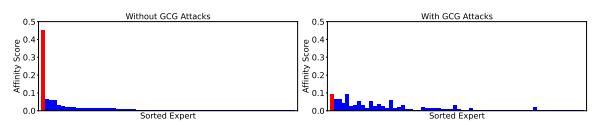

# 5 Evaluation Experiments

To demonstrate the effectiveness of our proposed method, we evaluate and compare it against different baselines on two widely accepted LLM unlearning benchmarks: WMDP [\(Li et al.,](#page-9-0) [2024\)](#page-9-0) and RWKU [\(Jin et al.,](#page-9-19) [2024\)](#page-9-19). The detailed experimental setup, such as unlearning tasks, datasets selection, targeted MoE models, unlearning baselines and hyper-parameter setting, is provided in Appendix Sec. [A,](#page-12-0) due to space limitation. We next present results of several key experiments.

- ✦ Effectiveness of SEUF across benchmarks and unlearning methods. In Tab. [3](#page-7-0), we present the FE (forget efficacy) and UT (utility) of our proposed SEUF when integrating different unlearning methods GA, GDIFF, NPO, and RMU. In this evaluation, SEUF selects only the top-1 expert for unlearning. There are two notable findings. First, SEUF effectively enhances unlearning, either by further reducing FE or maintaining a similar level compared to baselines without SEUF. Second, SEUF consistently improves model utility (UT) across all tested methods. Notably, for methods where UT drops by more than 10% (compared to the pretrained model), highlighted in red, SEUF mitigates the decline. For example, the utility of GA on Qwen for the WMDP task drops from 0.5979 to 0.3393, but with SEUF, the utility improves to 0.5012, This demonstrates SEUF's effectiveness in balancing unlearning performance and model retention. Notably, methods such as GDIFF and RMU, which experience notable utility loss when used alone, benefit greatly from the application of SEUF, achieving near-pretrained utility levels while still maintaining effective unlearning.
- ✦ SEUF outperforms parameter-efficient fine-tuning (PEFT) methods when used for unlearning. Tab. [3](#page-7-0) also includes a set of baselines that apply PEFT on GA. It is used to evaluate whether our method unlearns more effectively a subset of parameters (top-1 expert) compared to PEFT. Tab. [4](#page-7-1) shows a comparison of the parameter efficiency involved in tuning. The key conclusion from these results is: SEUF achieves far

better parameter efficiency, with only 0.06% of tunable parameters, compared to LoRA (0.92%) and ESFT (2.86%), while still maintaining a comparable level of forget efficacy and outperforming them in utility preservation. For instance, in RWKU, GA+SEUF achieves utility scores of 0.5709 on Qwen and 0.5485 on DeepSeek, significantly higher than LoRA (0.2689 and 0.2302) and ESFT (0.4433 and 0.5001).

- ✦ Top-1 expert selection outperforms random selection in unlearning. In the last row of Tab. [3,](#page-7-0) we compare the performance of the affinity score-based expert selection in SEUF with a random expert selection approach. The results show that while random selection can sometimes preserve utility at a comparable level, it falls short in achieving effective unlearning. For instance, on Qwen (WMDP), random selection yields a higher utility score (0.5947 vs. 0.5351 for SEUF), but its forget efficacy (FE) remains significantly higher (0.3505 vs. 0.2536 for SEUF), indicating incomplete unlearning. This suggests that selecting the top-1 expert based on affinity scores is crucial for reducing FE while maintaining utility, making it a superior approach to random selection.
- ✦ Experts with higher affinity scores play a more significant role in unlearning. To further examine the impact of selecting experts based on their affinity scores, we analyze the layer-wise Top-1 expert in DeepSeek on RWKU dataset. In Tab. [5,](#page-7-2) we present their affinity scores along with the utility (UT) when the expert is involved in unlearning. Due to space constraints, we highlight the top-ranked layer-wise experts (1st to 3rd) and also include several lower-ranked ones (13th to 26th) for comparison. From the results, we observe that the first-ranked expert (with the highest affinity score 0.211) yields the highest UT (0.5485). Overall, UT remains stable at 0.5445 or higher when selecting experts with affinity scores above 0.1. However, when affinity scores drop further (e.g., the 23rd and 26th ranked experts), utility declines more sharply to 0.4262 and 0.2355. These findings emphasize the importance of selecting experts with sufficiently high affinity scores to maintain utility while achieving effective unlearning.
- ✦ Unlearning resilient to jailbreak attacks. The unlearned model is expected to refuse harmful queries. The forgotten knowledge should not be recovered even through adversarial means. We thus examine the behavior of MoE LLMs unlearned by SEUF under adversarial prompting. Specifically,

Table 3: Performance comparison of existing unlearning methods equipped w/ and w/o SEUF on WMDP (Li et al., 2024) and RWKU (Jin et al., 2024) benchmarks on two MoE LLMs, namely Qwen1.5-MoE-A2.7B-Chat (Qwen) (Team, 2024) and DeepSeek-V2-Lite (DeepSeek) (Dai et al., 2024). Additionally, a group of baselines applying PEFT (LoRA and ESFT) on GA is included to evaluate our method's effectiveness in selecting a suitable subset of parameters for unlearning, along with a baseline using random expert selection with RMU. The occurrence of significant utility increase (over 5% increase in UT compared to without SEUF) are marked in green.

| Method         | Qwen   | (WMDP) | DeepSe | ek (WMDP) | Qwen   | (RWKU) | DeepSee | ek (RWKU) |
|----------------|--------|--------|--------|-----------|--------|--------|---------|-----------|
| Method         | FE↓    | UT↑    | FE↓    | UT↑       | FE↓    | UT↑    | FE↓     | UT↑       |
| Pretrained     | 0.4192 | 0.5979 | 0.3804 | 0.5548    | 0.4243 | 0.5979 | 0.5376  | 0.5548    |
| GA             | 0.2953 | 0.3393 | 0.2457 | 0.3145    | 0.0078 | 0.4849 | 0.0839  | 0.5195    |
| GA+SEUF        | 0.2987 | 0.5012 | 0.2700 | 0.5100    | 0.0060 | 0.5709 | 0.0000  | 0.5485    |
| GDIFF          | 0.2964 | 0.2965 | 0.2898 | 0.3929    | 0.0700 | 0.5296 | 0.1901  | 0.3495    |
| GDIFF+SEUF     | 0.2445 | 0.5295 | 0.2677 | 0.4895    | 0.0010 | 0.5987 | 0.0000  | 0.5253    |
| NPO            | 0.3447 | 0.4612 | 0.3200 | 0.4700    | 0.0000 | 0.3718 | 0.0970  | 0.5388    |
| NPO+SEUF       | 0.3200 | 0.5468 | 0.2898 | 0.4790    | 0.0020 | 0.5428 | 0.0000  | 0.5479    |
| $\mathbf{RMU}$ | 0.2612 | 0.3560 | 0.2530 | 0.4540    | 0.0200 | 0.2420 | 0.0010  | 0.5109    |
| RMU+SEUF       | 0.2536 | 0.5351 | 0.2859 | 0.5424    | 0.0723 | 0.5975 | 0.0130  | 0.5388    |
| GA+LoRA        | 0.2459 | 0.2689 | 0.2657 | 0.2295    | 0.0000 | 0.2689 | 0.0000  | 0.2302    |
| GA+ESFT        | 0.3145 | 0.4514 | 0.2737 | 0.5108    | 0.001  | 0.4433 | 0.0200  | 0.5001    |
| RMU+Random     | 0.3505 | 0.5947 | 0.2722 | 0.5183    | 0.2110 | 0.5924 | 0.1176  | 0.5182    |

Table 4: Tunable parameter ratio, PEFT vs SEUF.

| Madhad      | Tunable Parameter Ratio |          |         |  |  |  |
|-------------|-------------------------|----------|---------|--|--|--|
| Method      | Qwen                    | DeepSeek | Mixtral |  |  |  |
| LoRA        | 0.87%                   | 0.92%    | 0.26%   |  |  |  |
| <b>ESFT</b> | 3.13%                   | 2.86%    | 14%     |  |  |  |
| SEUF        | 0.06%                   | 0.06%    | 0.41%   |  |  |  |

Table 5: Model utility (UT) comparison across unlearned experts with different affinity scores  $(s_i)$  in SEUF+RMU on the RWKU benchmark. UT is compared at a consistent level of forget efficacy (FE  $\approx 0.25$ ).

|        | #1     |        |        |        |        | #23    |        |
|--------|--------|--------|--------|--------|--------|--------|--------|
|        | 0.2110 |        |        |        |        |        |        |
| UT (↑) | 0.5485 | 0.5475 | 0.5453 | 0.5445 | 0.5441 | 0.4262 | 0.2355 |

we test whether SEUF effectively mitigates unauthorized responses by employing the Greedy Coordinate Gradient (GCG) attack (Zou et al., 2023) in a white-box setting. This attack optimizes attack prompts to elicit responses that begin with "Sure, here is the answer:". To increase attack strength, we extend the number of optimization steps to 5,000, while keeping other hyperparameters at their default settings. Given the computational cost ( $\sim 1$  GPU hour on an A100 per soft prompt), we optimize 400 prompts across 400 samples in RWKU for attacking DeepSeek unlearned by SEUF+GA. Since not all responses explicitly begin with "Sure, here is the answer:", we filter for outputs containing the word "answer" and evaluate forget efficacy (FE) both with and without GCG-generated prompts. Our results show that

Figure 4: Comparison of affinity scores for all experts in the target layer of DeepSeek unlearned by SEUF + GA on the RWKU dataset, with and without the GCG attack. The target expert is marked as red.

despite being one of the strongest prompt-level attacks, GCG fails to recover forgotten knowledge, as **FE remains at 0.01 before and after the attack**. To further understand how the GCG attack affects expert selection, we visualize the affinity score of experts in DeepSeek, and compare it with GCG-attacked DeepSeek. Fig. 4 shows that while the GCG attack reduces the affinity score of the target expert, the expert remains ranked as the top-1 in affinity score. This suggests that SEUF maintains stable expert selection even under adversarial influence, ensuring robustness in the unlearning process.

Additionally, we also perform a sensitivity analysis on hyperparameter  $\alpha$  in Sec. B in Appendix. The results in Tab. 6 in Appendix indicate that  $\alpha=1$  achieves the best performance.

#### 6 Conclusion

In this paper, we for the first time examine the challenges of applying existing MU techniques to MoE LLMs and carefully investigate the synergy between the dynamic routing system of MoE LLM and the unlearning effects. To address these issues, we proposed SEUF, a novel framework

that unlearns most related experts while stabilizing expert selection through a router anchor loss. This approach mitigates expert selection shifts and achieves efficient unlearning with minimal parameter updates. Extensive experiments show that SEUF significantly outperforms traditional unlearning methods and other parameter-efficient finetuning techniques, providing a robust solution for MoE LLM unlearning tasks.

