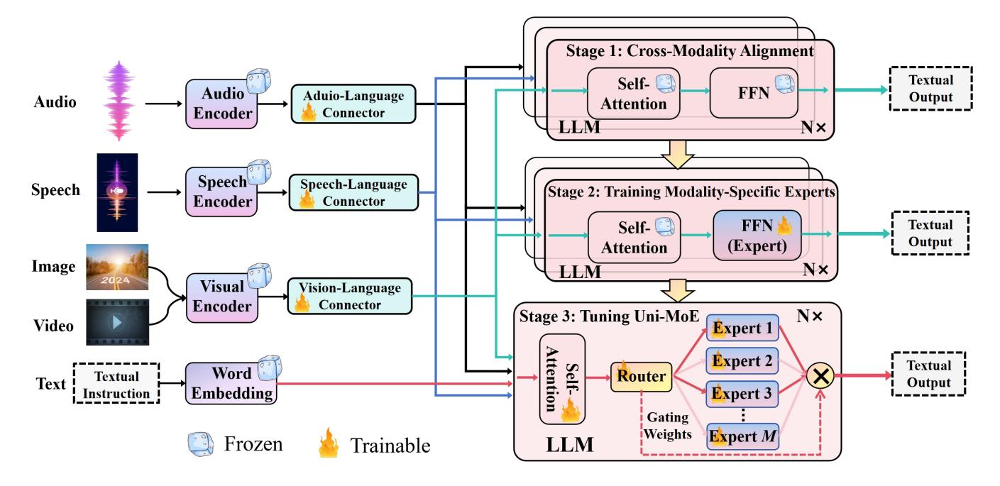

# **2.1 Unified Multimodal Models**

The advent of the Transformer model, introduced by Vaswani *et al.* [\[23\]](#page-14-22), marked a significant milestone in the field of deep learning, enabling the scalable integration of multiple modalities—including image, language, speech, audio, and video—into a unified representational space. This crossmodal interactive parallelism facilitates a range of generative and interpretive capabilities across different data types after training on extensive multimodal datasets. Recent advancements in generative multimodal large models have further expanded these capabilities [\[24\]](#page-14-23), [\[25\]](#page-15-0), allowing for the perception and generation of diverse modalities [\[6\]](#page-14-5), [\[26\]](#page-15-1), [\[27\]](#page-15-2), [\[28\]](#page-15-3). A notable example of this progress is ImageBind by Girdhar *et al.* [\[29\]](#page-15-4), which pioneers in learning a joint embedding across six distinct modalities, thus opening the door to emergent applications such as cross-modal retrieval,

1. We have released the two distributed parallel training approaches.

Fig. 2. **Overview of Uni-MoE Training Methodology**. The progressive training stages contain: 1) Utilize pairs from different modalities and languages to train connectors that map these elements to a unified language space, establishing a foundation for multimodal understanding; 2) Develop modality-specific experts using cross-modal data to ensure deep understanding, preparing for a cohesive multi-expert model; 3) Incorporate multiple trained experts into LLMs and refine the unified multimodal model using the LoRA technique on mixed multimodal data.

modality composition through arithmetic operations, crossmodal detection, and generation, directly "out-of-the-box." Similarly, Kirillov *et al.* [\[30\]](#page-15-5) introduce SAM, a foundational model for image segmentation capable of integrating insights from textual descriptions, visual cues, and semantic mappings, thereby demonstrating the versatility and robustness of multi-modal approaches in handling complex tasks. In a parallel vein, Zhang *et al.* [\[27\]](#page-15-2) put forward the Meta-Transformer model, characterized by a unified data Tokenizer, a shared encoder across modalities, and specialized heads for task-specific applications. This model stands out for its ability to conduct unified learning across an impressive array of 12 modalities using unpaired data, showcasing the potential for broad applicability across various domains and tasks [\[31\]](#page-15-6), [\[32\]](#page-15-7). Building on these foundational works, our study aims to construct an efficient unified MLLM leveraging the strengths of large language models and dedicated modality connectors.

