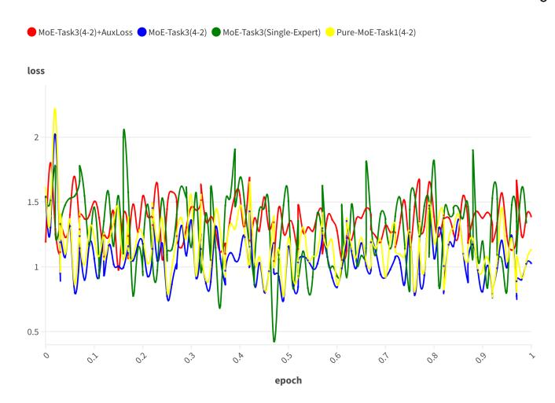

# **2.2 Multimodal Instruction Tuning for LLMs**

The recent surge in Natural Language Processing (NLP) research owes much to the evolution of Large Language Models (LLMs) such as Flan-T5 [\[33\]](#page-15-8), GPT-4 [\[10\]](#page-14-9) and LLAMA [\[14\]](#page-14-13). These developments have not only enhanced our understanding and capabilities within the realm of language processing but have also paved the way for the advent of MLLMs. The progression towards these advanced models has been facilitated by two key factors: the broadening of training datasets [\[3\]](#page-14-2) and significant improvements in model architecture and design, as highlighted by recent works [\[8\]](#page-14-7), [\[13\]](#page-14-12). A prominent area of research focuses on leveraging pre-trained LLMs to improve visual instruction tuning, a process that involves refining the models to better understand and execute visually grounded instructions. <span id="page-2-0"></span>This field has seen the emergence of notable models like LLaVA [\[34\]](#page-15-9), MiniGPT-4 [\[35\]](#page-15-10), InstructBLIP [\[2\]](#page-14-1), Qwen-VL [\[36\]](#page-15-11), and LMEye [\[15\]](#page-14-14). A common framework among these models involves integrating a pre-trained visual backbone [\[37\]](#page-15-12) for image and video interpretation, an LLM [\[38\]](#page-15-13) for comprehending textual instructions and generating appropriate responses, and a vision-language cross-modal connector. This connector plays a critical role in harmonizing the capabilities of the vision encoder with the language model, ensuring seamless interaction between the two modalities. Efficient training paradigms [\[39\]](#page-15-14) with data management [\[40\]](#page-15-15) also play an important role in constructing large models. It not only enhances the model's ability to process and understand multimodal inputs but also significantly improves its applicability across a wide range of tasks that require nuanced understanding and generation of responses based on both textual and visual cues.

#### **2.3 Large Models with Mixture of Experts**

Due to the huge overhead caused by training and deploying large models, researchers have been committed to exploring utilizing mixture of experts (MoE) [\[41\]](#page-15-16) architecture to improve the efficiency of large models. This is particularly evident in large models where MoE enables selective activation of different network components, optimizing computational resources and enhancing performance. Pioneering work in this space can be seen with models such as GShard [\[42\]](#page-15-17), which introduced the use of MoE for massively multilingual language models, demonstrating considerable improvements in translation tasks. Switch Transformers [\[22\]](#page-14-21) further refined this concept by scaling up the MoE approach, achieving unprecedented model sizes and training efficiency on visual understanding. Additionally, BASE Layers [\[43\]](#page-15-18) explored the

integration of MoE into bidirectional encoder representations from transformers, further highlighting the potential for MoE to enhance language understanding tasks. The application of MoE in generative models has also been explored, with notable examples such as GLaM [44], showcasing the capability of MoE to handle diverse and complex generative tasks. In this paper, we mainly explore constructing a unifying large multimodal model using the MoE architecture. This body of work collectively underscores the versatility and efficiency gains MoE brings to the realm of large-scale model architectures, pointing towards a future where model size and performance can be enhanced without proportional increases in computational demands.

### 3 Uni-MoE

#### 3.1 Overview

Motivated by the high training and inference costs brought by scaling multimodal large models towards GPT-4V and Gemini and the efficiency of the MoE structure, here, we explore the realization of an efficient and powerful unified MLLM, utilizing the MoE architecture. Figure 2 presents a schematic representation of the designed Uni-MoE, showcasing its comprehensive design that includes encoders for audio, speech, and visuals, along with respective modality connectors. These connectors serve to translate various modality inputs into a unified language space. We then integrate the MoE architecture within the core LLM blocks, which is crucial for boosting the efficiency of both training and inference processes owing to only activating partial parameters. This is achieved through the implementation of a sparse routing mechanism, which is shown in the bottom part of Figure 2. The whole training process of Uni-MoE is divided into three distinct phases: cross-modality alignment, training modality-specific experts, and tuning Uni-MoE using a diverse set of multimodal instruction datasets. In the ensuing subsections, we will delve into the intricate architecture and the progressive training methodology of Uni-MoE in detail.

#### <span id="page-3-0"></span>3.2 Architecture

Connectors. To facilitate the efficient transformation of diverse modal inputs into a linguistic format, our Uni-MoE model is built upon the pretrained visual-language framework LLaVA [45]. This base model integrates the CLIP [46] as the visual encoder, alongside a linear projection layer that converts image features into corresponding soft image tokens within the language domain of Vicuna-LLaMA [47]. For processing video content, we select eight representative frames from each video and transform them into video tokens by employing average pooling to aggregate their frame-based (image) representations. In the audio domain, we enhance feature extraction through the deployment of two distinct encoders: the Whisper encoder, derived from the Whisper-small speech recognition model [48], and the BEATs encoder [49], a sophisticated audio processing tool that generates bidirectional encoder representations from audio transformers. Following a strategy akin to the Qformer approach [50], we then distil fixed-length speech and audio feature vectors respectively and subsequently

map them into soft audio and speech tokens via a linear projection layer. The specific workflow is given in:

$$X_{Input} = [I, V, A, S, T], \tag{1}$$

$$I = MLP(CLIP-V(I)), (2)$$

$$V = \text{Mean}(\text{CLIP-V}([I_1, ..., I_8])),$$
 (3)

$$A = \operatorname{Audio-Qformer}(\operatorname{BEATs}(A)), \tag{4}$$

$$S = \text{Speech-Qformer}(\text{Whisper}(S)), \tag{5}$$

$$T = \text{Word-Embedding}(T),$$
 (6)

where [I,V,A,S,T] represents the image, video, audio, speech, and Text, respectively. "MLP" is the learnable visual-language projection layer. Audio/Speech-Qformer is a four-layer transformer block, where we feed learnable fixed-length query vectors into them and the corresponding audio/speech hidden states as the key and value in the cross-attention layer. By doing such a four-layer calculation, the final outputs can be regarded as the representations of audio and speech inputs. Take the Audio-QFormer as an example, the detailed calculation progress is presented as the following equation:

$$X_Q^A = (h_Q^1, ..., h_Q^{AM}),$$
 (7)

$$h_B^A = \text{BEATs}(A), \tag{8}$$

$$h_S^A = MSA(LN(X_O^A)) + X_O^A, \tag{9}$$

$$h_C^A = \text{MCA}(\text{LN}(h_S^A), h_B^A) + h_S^A, \tag{10}$$

$$h_1^A = \text{MLP}(h_C^A), \tag{11}$$

where  $h_B^A$  is the top output of pretrained audio encoder BEATs and  $h_S^A$  is the multi-head self-attention calculation for the fixed-length query vectors  $X_Q^A$ , where AM refers to the total number of initial vectors.  $h_C^A$  represents the output of the cross-attention module, which is used to distil the main content of input audio. After four layers of the same operation, we apply a learnable linear layer for projecting the last output into the representation space of LLM.

**Uni-MoE**. By the above connectors, we could obtain the encoding tokens of any modality. For any modality inputs, we concatenate the corresponding tokens into one sequence and feed it into the language model. We denote the image, video, text, audio, and speech embedding representations to  $I=(I_1,...,I_N)$ ,  $V=(V_1,...,V_N)$ ,  $T=(T_1,...,T_z)$ ,  $A=(A_1,...,A_k)$ , and  $S=(S_1,...,S_L)$ , respectively, where N, z, k, and L refer to the encoding sequence length of different modalities: visuals, text, audio, and speech. Take understanding a video as an example, the calculation process of the l block configured with MoE is as follows:

$$x_0 = [V_1, ..., V_N; T_1, ..., T_z; A_1, ..., A_k],$$
(12)

$$X_{l}^{s} = MSA(LN(X_{l-1})) + X_{l-1},$$
 (13)

$$X_l^M = \text{MoE}(\text{LN}(X_l^s)) + X_l^s, \tag{14}$$

$$x_l = LN(X_l^M), (15)$$

where "MSA" and "LN" refer to the multi-head self-attention and layer normalization.  $X_{l-1}$  shows the output of l-1 th block. For the MoE layer, we adopt the sparse router to select the corresponding Top-k experts at the token level. When we introduce a set of experts  $E = (e_1, e_2, ..., e_M)$ , the router is a linear function to predict the probability of each token being assigned to each expert. The outputs of selected experts will

### Algorithm 1 Uni-MoE Optimization Framework

```
Require: Set of modalities M_I, pretraining datasets \mathcal{PD}_M, instruction
    tuning datasets \mathcal{D}_M with a set of templates \Pi = \{I_{M_t} : M \in
     M_I, t \in \mathcal{T} for each task t \in \mathcal{T}
 1: Initialize text tokenizer h and corresponding embedding layer E
 2: Stage 1: Cross-Modality Alignment
 3: for each modality M in M_I do
       Initialize modality-specific pre-trained encoder Enc_M
        Initialize Q-Former module QF_A and QF_S for audio and speech
        inputs and modality-specific linear projection layer LP_M for each
 6:
        for each step in a number of iterations do
 7:
           Sample (x, y) from \mathcal{PD}_M
 8:
           x_M \leftarrow Connector(x) {Modality Projection}
 9:
           Prediction \leftarrow LLM(x_M) {Get LLM's prediction}
10:
           Loss \leftarrow \mathcal{L}_{CE}(\text{Prediction}, h(y)) \{\text{Calculate cross-entropy loss}\}
           \theta \leftarrow \theta - \alpha \nabla_{\theta} \text{Loss} {Update Linear and audio/speech Q-Former
           parameters}
12:
        end for
13: end for
    Stage 2: Training Modality-Specific Experts
15: for each modality M in M_I do
        Copy corresponding weights from Stage 1.
16:
17:
        for each step in a number of iterations do
           Sample (x, y) from \mathcal{D}_M
18:
19:
           x_M \leftarrow Connector(x) {Modality Projection}
20:
           Prediction \leftarrow LLM(x_M, E(h(i_M))) {Get LLM's prediction}
21:
           Loss \leftarrow \mathcal{L}_{CE}(\text{Prediction}, h(y)) \{\text{Calculate cross-entropy loss}\}
           \theta \leftarrow \theta - \alpha \nabla_{\theta} \text{Loss} \{ \text{Update Linear and MLP (in LLM) parameters} \}
23:
        end for
24: end for
25: Stage 3: Tuning Uni-MoE
26: for each step in a number of iterations do
        Sample (x, y) from \bigcup \mathcal{D}_M
        X_M' \leftarrow Connector(x)  {Modality Projection}
28:
29:
                          E(h(Context_M))||X_M'||E(h(i_M))||E(h(x)))
        x_{LLM}
        {Inputs Concatenation}
30:
        Prediction \leftarrow LLM(x_{LLM}) {Get LLM's prediction}
        Loss \leftarrow \mathcal{L}_{CE}(\text{Prediction}, h(y)) {Calculate cross-entropy loss}
        \theta \leftarrow \theta - \alpha \nabla_{\theta} \text{Loss} \{ Update \ Linear \ and \ LoRA \ parameters \}
32:
```

be added according to the gating weights. We formulate the whole calculation process as follows:

$$\mathcal{P}(X_l^s)_i = \frac{e^{f(X_l^s)_i}}{\sum_{j}^{M} e^{f(X_l^s)_j}},$$
(16)

$$MoE(X_l^s) = \sum_{i=1}^k \mathcal{P}(X_l^s)_i \cdot e(X_l^s)_i,$$
 (17)

where  $f(x) = \mathbf{W} \cdot x$  is the linear router to produce expert assignment probabilities and  $\mathbf{W} \in \mathbf{R}^{d \times z}$ . d is the last dimension of hidden states and M is the total number of experts.

To speed up the training process, we freeze all parameters of LLMs including added experts, applying Low-Rank Adaption [21] (LoRA) to activate each expert. We denote the tokens of the input for one sequence inputted to the first expert in the MoE layer by  $\mathbf{X}_{E_1}$ . The computed process for this expert could be given in

$$\mathbf{h}_{e_1} = e_1(\mathbf{X}_{E_1}),\tag{18}$$

$$\mathbf{h}_{e_1}^{LoRA} = \text{LoRA-}e_1(\mathbf{X}_{E_1}), \tag{19}$$

$$LoRA(W_0) := W_0X + \Delta WX = W_0x + BAX,$$
 (20)

$$\mathbf{h}_{e_1} = \mathbf{h}_{e_1} + \mathbf{h}_{e_1}^{LoRA} \tag{21}$$

(22)



<span id="page-4-2"></span>Fig. 3. Comparisons of loss curves under various MoE settings. For MoE-TaskX (Z-Y), "X", "Z", and "Y" represent the specific training tasks presented in Table 2, and this model contains "Z" experts in the MoE layer and selects "Y" experts for each token. "AuxLoss" indicates the widely-used auxiliary balancing loss [42], which is designed to encourage giving all experts the same importance. Uni-MoE variant with MoE-Task3(4-2) (blue line) achieves more stable coverage compared to model variants with fewer experts or identical expert settings.

where B, A are learnable parameters added for each pretrained linear weight  $W_0$  of experts and the final output of this expert is  $\mathbf{h}_{e_1}$ . By adopting this method for each expert, the training process becomes efficient, as it does not require updating the overall parameters of experts.

#### <span id="page-4-0"></span>3.3 Training Strategy

To harness the distinct capabilities of various experts, enhance the efficacy of multi-expert collaboration, and bolster the overall framework's generalization, we introduce a progressive training strategy for the incremental development of Uni-MoE. Algorithm 1 outlines the comprehensive three-stage training protocol designed to actualize the integrated MoE-based MLLM architecture. In the subsequent statements, we will delineate the objectives and elaborate on the specifics of each training stage.

Stage 1: Cross-Modality Alignment. In the initial stage, we aim to establish connectivity between different modalities and linguistics. We achieve this by constructing connectors that translate various modal data into soft tokens within the language space. The primary objective here is minimizing generative entropy loss. As illustrated in the upper section of Figure 2, the LLM is optimized to generate descriptions for inputs across modalities and only the connectors are subject to training. This approach ensures seamless integration of all modalities within a unified language framework, facilitating mutual comprehension by the LLM.

**Stage 2: Training Modality-Specific Experts.** This stage concentrates on developing single-modality experts through dedicated training on specific cross-modal data. The goal is to refine each expert's proficiency within its respective domain, thereby enhancing the overall performance of the MoE system on diverse multimodal data. While maintaining generative entropy loss as the focal training metric, we tailor the FFN to align more closely with the characteristics of the targeted modality.

TABLE 1

<span id="page-5-0"></span>Detailed Architecture of Uni-MoE and Comparison with Visual-Language MoE-LLaVA. Portions of this table are reported by the MoE-LLaVA model [20]. "Width" represents the dimension of the hidden states. "FFN" denotes the dimension of the feed-forward network's intermediate layer. "FFN Factor" represents the quantity of linear layers in the FFN. "Activated" or "Total Param" refers to the activated or total number of parameters. "7B×4-Top2" denotes a dense foundation model with 7B parameters, which is designed to incorporate a total of four experts, with two of them being activated. "†" indicates all layers are equipped with the MoE layer.

| Name Experts Top-k     |   | MoE<br>Layers | Embedding | Width | Layers | FFN | FFN<br>Factor | Heads | Activated<br>Param | Total<br>Param |       |
|------------------------|---|---------------|-----------|-------|--------|-----|---------------|-------|--------------------|----------------|-------|
| Phi2-2.7B [51]         | - | -             | -         | 51200 | 2560   | 32  | 10240         | 2     | 32                 | 2.7B           | 2.7B  |
| MoE-LLaVA-2.7B×4-Top2  | 4 | 2             | 16        | 51200 | 2560   | 32  | 10240         | 2     | 32                 | 3.6B           | 5.3B  |
| MoE-LLaVA-2.7B×4-Top2† | 4 | 2             | 32        | 51200 | 2560   | 32  | 10240         | 2     | 32                 | 4.5B           | 7.8B  |
| OpenChat-7B [52]       | - | -             | -         | 32000 | 4096   | 32  | 14336         | 3     | 32                 | 6.7B           | 6.7B  |
| MoE-LLaVA-7B×4-Top2    | 4 | 2             | 16        | 32000 | 4096   | 32  | 14336         | 3     | 32                 | 9.6B           | 15.2B |
| MoE-LLaVA-7B×4-Top2†   | 4 | 2             | 32        | 32000 | 4096   | 32  | 14336         | 3     | 32                 | 12.4B          | 23.7B |
| Vicuna-7B [47]         | - | -             | -         | 32000 | 4096   | 32  | 11008         | 3     | 32                 | 6.7B           | 6.7B  |
| Uni-MoE-7B×4-Top2      | 4 | 2             | 16        | 32000 | 4096   | 32  | 11008         | 3     | 32                 | 8.9B           | 13.2B |
| Uni-MoE-7B×4-Top2†     | 4 | 2             | 32        | 32000 | 4096   | 32  | 11008         | 3     | 32                 | 11.1B          | 19.7B |
| Uni-MoE-7B×8-Top2      | 8 | 2             | 16        | 32000 | 4096   | 32  | 11008         | 3     | 32                 | 8.9B           | 21.9B |
| Uni-MoE-7B×8-Top2†     | 8 | 2             | 32        | 32000 | 4096   | 32  | 11008         | 3     | 32                 | 11.1B          | 37.0B |

Stage 3: Tuning Uni-MoE. The concluding stage involves integrating the expertly tuned weights from Stage 2 into the MoE layers. We then proceed to jointly fine-tune the MLLMs utilizing mixed multimodal instructional data. The progression of the training process, as reflected by the loss curves, is depicted in Figure 3. Comparative analysis between MoE configurations reveals that experts refined during Stage 2 achieve quicker convergence and display enhanced stability on mixed-modality datasets. Furthermore, in scenarios involving complex mixed-modal data, encompassing video, audio, images, and text, the model employing four experts demonstrates reduced loss variability and more consistent training performance than its two-expert counterpart. Uni-MoE shows better convergence compared to using auxiliary balancing loss, which caused the overall training loss to fluctuate and did not show obvious convergence.

### 4 EXPERIMENTS

### 4.1 Uni-MoE Settings

The Uni-MoE's architectural specifications are presented in Table 1, exhibited along with the recently proposed MoE-LLaVA. Our exploration is anchored on scaling the Uni-MoE model, which is based on the LLaMA-7B architecture. The design and optimization of Uni-MoE are guided by specialized training tasks listed in Table 2. These tasks are instrumental in refining the capabilities of the MLP layers, thereby leveraging their specialized knowledge for enhanced model performance. We undertake eight single-modality expert tasks to elucidate the differential impacts of various training methodologies. Our comprehensive training approach uses the MoE framework to execute six diverse tasks spanning multiple modalities, including video, audio, speech, image, and text. This multi-faceted training task evaluates the Uni-MoE's performance under varied MoE configurations, thus ensuring a robust and versatile modelling approach adaptable to diverse data types and applications.

#### 4.2 Datasets

**Training Datasets**. To endow our model with speech recognition capabilities, we incorporate the **Common Voice** dataset [53] at the cross-modality alignment stage of training.

This dataset comprises short speech clips, each less than 30 seconds in duration, with a cumulative total exceeding 1.7 million instances. Subsequently, we develop a tri-modal dataset derived from LLaVA-Instruct-150K [45], converting user queries into auditory format utilizing sophisticated Text-to-Speech (TTS) technologies from Microsoft Azure [54]. Additionally, the original LLaVA-Instruct-150K dataset is employed in various training tasks to facilitate comparative analyses. To enhance the model's proficiency in understanding extended speech sequences, we integrate and concatenate audio files from the LibriSpeech dataset [55] with short speeches of 30 seconds into longer sound files, each extending up to two minutes in duration. Additionally, we convert the **RACE** dataset [56], a comprehensive reading comprehension collection derived from English examinations in China, from its original textual format into long audio files. These transformed audio files are subsequently presented to the model, enabling it to interpret lengthy speech inputs and accurately determine appropriate responses to questions. For the task of audio captioning, the model is subjected to both crossmodality aligning and single-modality expert training processes utilizing an identical dataset collection. The WavCaps dataset [57], which constitutes a ChatGPT-assisted, weaklylabelled audio captioning collection segmented into four subsets (AudioSet SL subset, SoundBible, FreeSound, and BBC Sound Effects), is employed partially within our optimization framework. Additionally, the AudioCaps dataset [58], a comprehensive corpus comprising approximately 46,000 pairs of audio clips and their corresponding human-generated textual descriptions, is also selectively utilized during the training regimen. The Clotho and ClothoAQA datasets [59], [60] are utilized to bolster the model's proficiency in audiorelated question-answering tasks. Additionally, MELD [61], a dataset designated for audio emotion detection, is employed to augment the diversity of audio-relevant tasks within our framework. In the realm of video-related tasks, which serve as a pivotal component in enhancing models' visual comprehension, the Video-Instruct-Dataset from Video-ChatGPT [62], encompassing 100,000 video-text instructional pairs, is leveraged as the training corpus to advance our models' performance in scenarios involving video content.

Evaluation Datasets. Our models are assessed across various

TABLE 2

<span id="page-6-0"></span>All training tasks. "\*" refers to that the dataset we use is only a subset. "MC" represents the multi-choice setting. "I-A" means image-audio pairs, where the question is converted into the corresponding speech. "T-I" shows the original text-image pairs. "T-A" indicates the contextual paragraph of the RACE dataset is transferred into the long speech. "Pretraining task" represents the tasks included in the previous training stage. "Pure-Task" indicates the MoE-based model contains identical experts and is trained with specific training data.

| Training Tasks               | Data Types                                                                                            | Data Size | Epochs | Trainable Modules                                        | Pretraining tasks                                          |
|------------------------------|-------------------------------------------------------------------------------------------------------|-----------|--------|----------------------------------------------------------|------------------------------------------------------------|
| Audio-Language Pretraining   | WavCaps*,Audiocap*,<br>MELD, ClothoV1                                                                 | 194K      | 2      | Audio Q-former,<br>Audio projection layer                | -                                                          |
| Speech-Language Pretraining  | Common Voice<br>(Short Speech)                                                                        | 1.7M      | 2      | Speech Q-former,<br>Speech projection layer              | -                                                          |
| Single-Modality-Expert-Task1 | LLaVA-Instruct-150K(I-A)                                                                              | 150K      | 1      | LoRA,<br>speech & image projection layer                 | Speech-pretrain-task                                       |
| Single-Modality-Expert-Task2 | LLaVA-Instruct-150K(T-I)                                                                              | 150K      | 1      | LoRA,<br>image projection layer                          | Speech-pretrain-task                                       |
| Single-Modality-Expert-Task3 | LLaVA-Instruct-150K(I-A)                                                                              | 150K      | 1      | LoRA, Audio Q-former,<br>speech & image projection layer | Speech-pretrain-task                                       |
| Single-Modality-Expert-Task4 | LLaVA-Instruct-150K(I-A),<br>RACE(T-A), LibriSpeech                                                   | 271K      | 1      | LoRA,<br>speech & image projection layer                 | Speech-pretrain-task                                       |
| Single-Modality-Expert-Task5 | LLaVA-Instruct-150K(T-I),<br>RACE(T-A), LibriSpeech                                                   | 271K      | 1      | LoRA,<br>speech & image projection layer                 | Speech-pretrain-task                                       |
| Single-Modality-Expert-Task6 | LLaVA-Instruct-150K(I-A),<br>LLaVA-Instruct-150K(T-I),<br>RACE(T-A), LibriSpeech                      | 421K      | 1      | LoRA,<br>speech & image projection layer                 | Speech-pretrain-task                                       |
| Single-Modality-Expert-Task7 | RACE(T-A), LibriSpeech ,<br>RACE(T-A)-MC                                                              | 209K      | 1      | LoRA,<br>speech projection layer                         | Speech-pretrain-task                                       |
| Single-Modality-Expert-Task8 | WavCaps*,Audiocap*,MELD<br>ClothoAQA,ClothoV1                                                         | 203K      | 1      | LoRA,<br>audio projection layer                          | Audio-pretrain-task                                        |
| MoE-Task1                    | LLaVA-Instruct-150K(I-A),<br>LLaVA-Instruct-150K(T-I),<br>RACE(T-A), LibriSpeech<br>RACE(T-A)-MC      | 509K      | 3      | LoRA, Router,<br>speech & image projection layer         | LLaVA-v1.5-LoRA,<br>Single-Modality-Expert-Tasks 2 / 3 / 7 |
| MoE-Task1-short-speech       | LLaVA-Instruct-150K(I-A),<br>LLaVA-Instruct-150K(T-I)                                                 | 300K      | 3      | LoRA, Router,<br>speech & image projection layer         | LLaVA-v1.5-LoRA,<br>Single-Modality-Expert-Tasks 2 / 3 / 7 |
| MoE-Task2                    | Video-Instruct-Dataset,<br>LLaVA-Instruct-150K(T-I),<br>RACE(T-A), LibriSpeech<br>RACE(T-A)-MC        | 459K      | 2      | LoRA, Router,<br>speech & image projection layer         | llava-v1.5-LoRA,<br>Single-Modality-Expert-Tasks 2 / 3 / 7 |
| MoE-Task3                    | Video-Instruct-Dataset,<br>LLaVA-Instruct-150K(T-I),<br>WavCaps*,Audiocap*,MELD<br>ClothoAQA,ClothoV1 | 453K      | 2      | LoRA, Router,<br>audio & image projection layer          | LLaVA-v1.5-LoRA,<br>Single-Modality-Expert-Tasks 2 / 3 / 8 |
| MoE-Task4                    | Video-Instruct-Dataset,<br>LLaVA-v1.5-665K(T-I) [3],<br>RACE(T-A), LibriSpeech<br>RACE(T-A)-MC        | 874K      | 2      | LoRA, Router,<br>speech & image projection layer         | LLaVA-v1.5-LoRA,<br>Single-Modality-Expert-Tasks 2 / 3 / 7 |
| Pure-MoE-Task1               | Video-Instruct-Dataset,<br>LLaVA-Instruct-150K(T-I),<br>WavCaps*,Audiocap*,MELD<br>ClothoAQA,ClothoV1 | 453K      | 2      | LoRA, Router,<br>audio & image projection layer          | LLaVA-v1.5-LoRA                                            |
| Pure-MoE-Task2               | Video-Instruct-Dataset,<br>LLaVA-Instruct-150K(T-I),<br>WavCaps*,Audiocap*,MELD<br>ClothoAQA,ClothoV1 | 453K      | 2      | LoRA, Router,<br>audio & image projection layer          | -                                                          |

benchmarks, reflecting the diversity of specialized tasks they are designed to perform. To evaluate our models' proficiency in short speech recognition and image understanding, we employ modified versions of the A-OKVQA [63], OKVQA [64], and VQAv2 [65] benchmarks, utilizing speech synthesis technologies TTS to convert questions into human speeches. To design tasks with long speech, we leverage the image-text reasoning dataset MMBench [5] and utilize TTS to transform contextual hints into long audios, called MMBench-Audio, along with the speech version of the RACE evaluation set, named RACE-Audio, to assess our models rigorously. More precisely, the proficiency of our models is also evaluated by their performances on the English listening part of the Chinese College Entrance Examination, to check their practical real-world speech recognition capabilities. This compact dataset comprises 150 questions related to long audio segments with an average length of 109 seconds, and 50 questions about short audio segments with an average length of 14 seconds. The format of these materials aligns with that of the RACE-Audio evaluation dataset. Additionally, the environmental

audio understanding ability is evaluated by utilizing the test sets of Clotho V1/2 and ClothoAQA. In the context of videorelated tasks, the performance of Uni-MoE is gauged using benchmarks from ActivityNet-QA [66] and MSVD-QA [67], which are instrumental in assessing video comprehension and interaction capabilities.

#### 4.3 Evaluation Metrics

For the visual question-answering benchmarks including A-OKVQA, OK-VQA, and VQA2, we adopt the Exact Match (EM) metric to evaluate if the model's predicted answers align perfectly with the ground truths. For multi-choice formats such as MMBench, RACE, and the English Listening Test, we apply strict accuracy metrics to assess the correctness of chosen responses. In the audio quality assessment for ClothoAQA, the EM accuracy metric is utilized to gauge the precision of responses. For assessing the relevance and quality of generated captions in Clotho, we employ the CIDEr metric. Additionally, for video-related benchmarks like ActivityNet and MSVD-QA, we implement a comprehensive

#### TABLE 3

<span id="page-7-0"></span>**Experimental results on zero-shot speech-image and long speech understanding benchmarks**. The questions of A-OKVQA, OK-VQA, and VQAv2 are converted into speech by the Text-to-Speech technical. MMBench-Audio (Input Type: Text-Speech-Image) and RACE-Audio are used for held-out testing of long speech understanding and reasoning, where "middle" and "high" refer to the Chinese English examinations designed for middle school and high school students. "EHSL" indicates our collected English High School Listening Test (Long Speech) in real world. Empty experimental results indicate that these model variants are not adequate for long-speech reasoning. *"Uni-MoE" in Tables 3-6 refers to Uni-MoE-7B×4-Top2† (speech) and Uni-MoE-7B×4-Top2 (audio)*.

|                                           |         |        |        |               |        | RACE-Audio |        | EHSL   |
|-------------------------------------------|---------|--------|--------|---------------|--------|------------|--------|--------|
| Method                                    | A-OKVQA | OK-VQA | VQAv2  | MMBench-Audio | middle | high       | Long   | Short  |
| Macaw-LLM [7]                             | 1.08%   | 1.06%  | 2.33%  | 1.86%         | 4.04%  | 3.00%      | 0.67%  | 2.00%  |
| X-InstructBLIP [6]                        | 0.91%   | 0.00%  | 26.47% | 11.23%        | 16.33% | 18.88%     | 0.67%  | 2.00%  |
| Single-Modality-Expert-Task1              | 18.38%  | 26.58% | 32.60% | -             | -      | -          | -      | -      |
| Single-Modality-Expert-Task3              | 19.26%  | 27.68% | 32.95% | -             | -      | -          | -      | -      |
| Single-Modality-Expert-Task4              | 9.14%   | 12.26% | 24.30% | 45.96%        | 29.46% | 26.67%     | 12.67% | 6.00%  |
| Single-Modality-Expert-Task5              | 4.56%   | 3.42%  | 5.90%  | 41.30%        | 30.78% | 24.90%     | 9.33%  | 12.00% |
| Single-Modality-Expert-Task6              | 11.40%  | 14.40% | 25.11% | 47.52%        | 32.59% | 29.02%     | 18.67% | 8.00%  |
| Single-Modality-Expert-Task7              | -       | -      | -      | 47.83%        | 46.80% | 48.74%     | 34.67% | 46.00% |
| Uni-MoE w/ MoE-Task1 2 epoch              | 14.80%  | 19.98% | 26.01% | 44.41%        | 47.08% | 47.08%     | 41.33% | 36.00% |
| Uni-MoE w/ MoE-Task1 3 epoch              | 13.58%  | 17.68% | 20.14% | 47.20%        | 50.77% | 48.94%     | 32.67% | 38.00% |
| Uni-MoE w/ MoE-Task1-short-speech 2 epoch | 19.31%  | 26.46% | 31.28% | 37.58%        | -      | -          | -      | -      |
| Uni-MoE w/ MoE-Task1-short-speech 3 epoch | 20.01%  | 29.04% | 30.86% | 34.78%        | -      | -          | -      | -      |
| Uni-MoE w/ MoE-Task2 2 epoch              | 7.76%   | 8.08%  | 12.68% | 49.38%        | 49.65% | 49.37%     | 42.00% | 48.00% |

accuracy verification procedure inspired by the methodology used in Video-ChatGPT [\[62\]](#page-15-37).

#### **4.4 Implementation Details**

We employ the AdamW [\[68\]](#page-15-43) optimizer in conjunction with a cosine learning rate scheduler to train our models in all stages. In the cross-modality alignment phase, we utilize 2 A100 GPUs to separately process 1.7 million short-speech data and 194K short audio captioning data with a global batch size of 32 and a base learning rate of 2e-5. Notably, during this stage, only the Qudio/Speech Q-former and projection layer are trained. Subsequently, we train our model to handle specific tasks using various combinations of data on the same devices, employing a global batch size of 16 and a base learning rate of 4e-5. During fine-tuning audio connectors with audio captioning data, we apply 4e-4 as the LoRA learning rate and 3e-5 as the learning rate of the audio projection layer. In our implementation, we set the LoRA rank to 64 and alpha to 16, and only apply it to tune the MLP in LLMs. Transitioning to the MoE training stage, we utilize a single, eight, or sixteen (two nodes) A800 GPU to train our models. We set the rank to 8 and alpha to 16 in this phase, maintaining a learning rate of 4e-5 for both LoRA parameters and projection layer parameters. Notably, we implement data parallelism and expert parallelism for mixed multi-modal data, as well as multi-nodes and multi-GPUs parallel training for larger models (with more than 8 experts).

