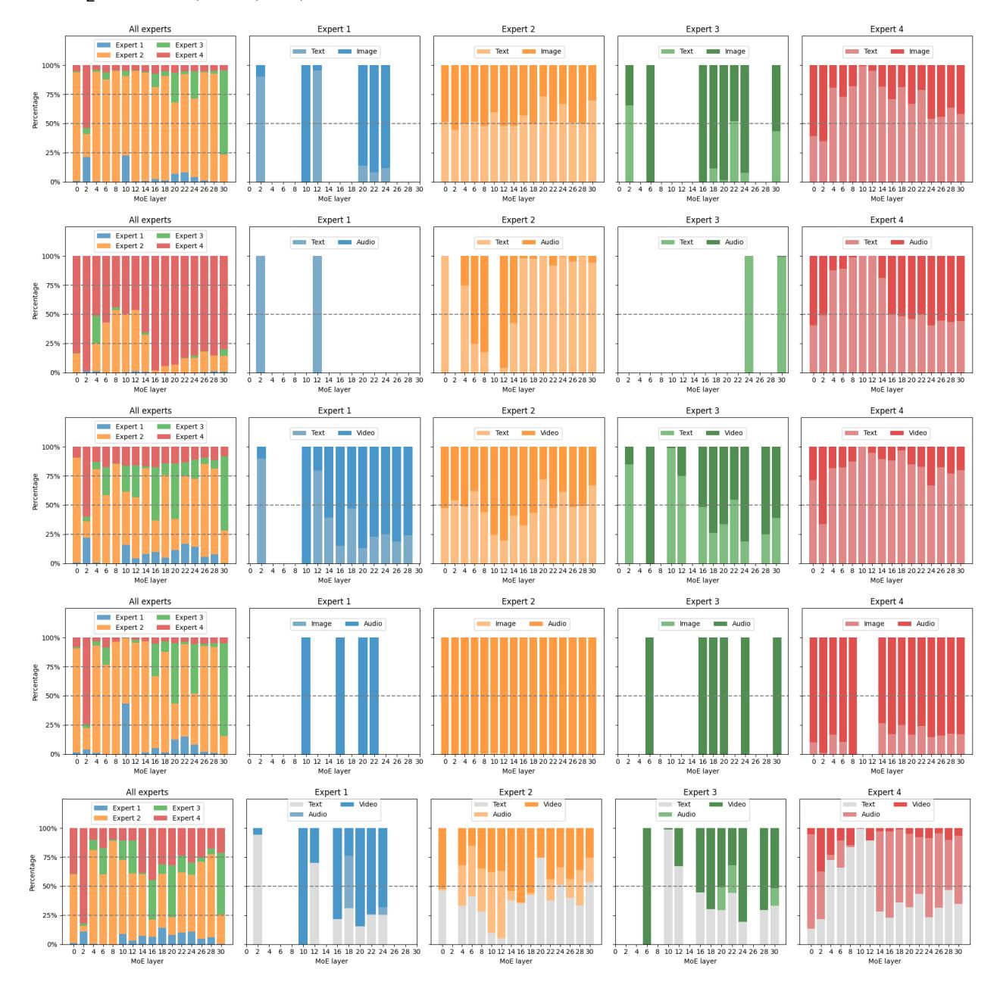
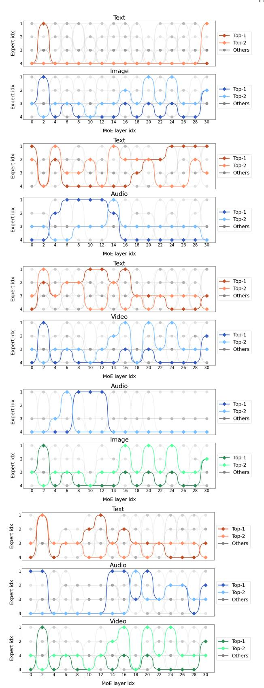
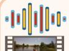

# **5 EXPERIMENTAL ANALYSIS**

### **5.1 Visualization Analysis**

We adopt the method of visualizing the routing distributions and token pathways from MoE-LLaVA to check the specific functions of different experts. For each cross-modality or tri-modality pair, we randomly select 200 samples from the corresponding datasets to draw Figures [4,](#page-9-0) [5,](#page-10-0) and [6.](#page-10-1) More visualization and analysis can be found in the Appendix.

**Routing Distributions:** In Figure [4,](#page-9-0) we present the expert loads (leftmost plot) and the modalities preferences of different experts (four subplots on the right) through MoE-Task3 when encountering all combinations of different modality data. When we fed Uni-MoE with audio-text pairs, experts 2 and 4 almost dominated the workload of almost all tokens, while experts 1 and 3 had barely any loads. A similar trend happens in the case of image-text pairs loading to the MoE layers, expert 2 plays a fairly important role and participates deeply in the processing of image information. It is not until the last layer that expert 3 works more predominantly than other experts, which is not an important case for the analysis. However, when we deliver the video data, the workload of all layers becomes seemingly balanced compared with other circumstances. We also observe distinct behaviours: 1) Expert 1 appears less engaged in token distribution compared to the others, indicating a potential inefficiency. 2) Conversely, Expert 2 demonstrates considerable control over token allocation in the initial layers, which shifts as the model deepens. 3) Expert 4 then begins to increasingly manage the tokens, reflecting a gradual assumption of responsibilities. 4) Expert 3 also contributes to token handling as the model progresses, illustrating collaborative task division among the experts. *These behaviours suggest that the experts in Uni-MoE have developed a specific pattern for dividing tasks, particularly notable between Experts 2 and 4. They align with the respective pre-trained specializations in image and audio processing. The provided figures*

Fig. 4. **Distribution of expert loading with various cross-modality inputs.** The discontinuous lines represent the distribution of tokens among different experts or modalities. The first figure on the left illustrates the workload among experts, while the remaining four figures depict the preferences of experts towards different modalities. Five layers of figures from the top to down refer to text-image, text-audio, text-video, image-audio, and video-audio-text pair data respectively when being fed to the MoE layers of Uni-MoE trained with MoE-Task3. Each expert focuses on different modal information, which could be compared with Pure-MoE-Task1 in Figure [8.](#page-18-0)

*show that Uni-MoE efficiently utilizes expert gates, allocating tokens to the most suitable expert based on their specialized knowledge from fine-tuning tasks. This strategic distribution ensures optimal processing and underscores the model's effective learning and application of task division among experts.*

Moreover, in Figure [5,](#page-10-0) we illustrate how different modalities are distributed among the experts in the Uni-MoE model, revealing distinct preferences. Specifically, text tokens are primarily managed by Expert 4 in scenarios involving audio contexts, but shift towards Expert 2 when image contexts are present. In cases where both video and audio data are input, text tokens are more evenly distributed across experts in the latter layers, indicating their role in cross-modality reasoning. For audio and visual tokens, there's a notable pattern of distribution: Expert 4 predominantly handles audio tokens in the initial and final layers, whereas Expert 2 takes over in the middle layers. This alternation highlights their specialized functions in processing different data types. Furthermore, the distribution shifts between text-image and text-audio-video scenarios reveal how image and video tokens are managed. Image tokens are mainly processed by Expert 2, reflecting its image-centric specialization, while video tokens are dispersed across multiple experts, underscoring the complex nature of video data that requires integrated processing from various modalities. In conclusion, *this differentiation in token handling among experts underscores the Uni-MoE model's capacity*

Fig. 5. **Distribution of modalities across different experts**. The discontinuous lines represent the distribution of tokens. Five layers of sub-figures from the top to down refer to text-image, text-audio, text-video, image-audio, and video-audio-text pair data respectively when being fed to the MoE layers of Uni-MoE trained with MoE-Task3. Expert 1 refers to the original MLP layer from LLaVA-v1.5. Expert 2 indicates the MLP is optimized through LLaVA-Instruct-150k(T-I) data, i.e., Single-Modality-Expert-Task2. Expert 3 represents the MLP trained with the audioimage LLaVA-Instruct-150k(I-A) dataset, i.e., Single-Modality-Expert-Task3. Expert 4 focuses on audio understanding, i.e., Single-Modality-Expert-Task8. *Training modality-specific experts is useful for expert assignment learning, facilitating the specialization of experts.*

Fig. 6. **Visualization of activated pathways**. We highlight the top 10 activated pathways. Among them, the non-gray paths represent the top 2 paths, while the gray paths represent the remaining 8 paths. All crossmodality data and the Uni-MoE version are identical to Figures [4](#page-9-0) and [5.](#page-10-0) Notably, *the expert numbers are not identical to previous experts because we mainly consider the token-level activated path of experts from the first layer to the last one, adopting the PCA to reduce and sort the tokendimension features.*

#### TABLE 7

Ablation study about Uni-MoE architectures. For subtables (a), (b), and (d), we employ the MoE-Task2 to train different Uni-MoE variants with varying expert configurations. In subtable (a), two models include four experts and we set different top-k values; In subtable (b), the top-k value is set to 2 for all model variants, which results in the model with two experts operating as a dense model with the same activated parameter size as that with four experts. The model with one expert is also dense. The identical expert in subtable (c) stems from LLaVA-v1.5-7b and it compares the performance impacts of increasing the number of identical pure experts from four to six. Subtable (d) presents the comparative results of Uni-MoE with various injected ways of MoE layers.

(a) The value of top-k (Uni-MoE).

| Top-k | A-OKVOA  | OK-VQA | ActivityN | et-QA | RACE-Audio |        |  |
|-------|----------|--------|-----------|-------|------------|--------|--|
| тор-к | A-OK VQA | OK-VQA | Accuracy  | score | middle     | high   |  |
| 1     | 66.46%   | 62.76% | 42.1%     | 2.5   | 45.13%     | 42.42% |  |
| 2     | 66.20%   | 63.02% | 42.8%     | 2.5   | 46.31%     | 43.71% |  |

(b) The number of experts (Uni-MoE).

| Experts | A-OKVOA | OK-VOA | ActivityN | et-QA | RACE-Audio |        |  |
|---------|---------|--------|-----------|-------|------------|--------|--|
| LAPCITO | A-ORVQA | OR-VQA | Accuracy  | score | middle     | high   |  |
| 1       | 65.68%  | 56.12% | 41.6%     | 2.8   | 42.59%     | 39.02% |  |
| 2       | 65.75%  | 62.04% | 42.9%     | 2.5   | 44.64%     | 43.63% |  |
| 4       | 66.20%  | 63.02% | 42.8%     | 2.5   | 46.31%     | 43.71% |  |

(c) The number of identical experts (Pure MoE).

| Experts | A-OKVOA | OK-VOA | ActivityN      | ClothoV2  |       |
|---------|---------|--------|----------------|-----------|-------|
| Laperts | A-ORVQA | OK-VQA | Accuracy score | Ciotilova |       |
| 1       | 65.24%  | 62.05% | 42.5%          | 2.5       | 23.3% |
| 4       | 64.98%  | 61.67% | 42.3%          | 2.8       | 21.5% |
| 6       | 66.81%  | 61.18% | 43.2%          | 2.6       | 21.8% |

(d) The internal architectures of Uni-MoE.

| Architecture | A-OKVQA | OK-VOA | ActivityN | et-QA | RACE-Audio |        |  |
|--------------|---------|--------|-----------|-------|------------|--------|--|
| Aicintecture | A-ORVQA | OR-VQA | Accuracy  | score | middle     | high   |  |
| First-Half   | 65.68%  | 60.96% | 41.9%     | 2.4   | 38.16%     | 41.14% |  |
| Second-Half  | 63.97%  | 61.33% | 43.2%     | 2.6   | 51.39%     | 52.69% |  |
| Interval     | 64.54%  | 61.77% | 43.3%     | 2.5   | 46.17%     | 46.60% |  |
| All          | 66.20%  | 63.02% | 42.8%     | 2.5   | 46.31%     | 43.71% |  |

for strong multimodal interaction and learning, validating its effectiveness in integrating diverse data types including video, speech, text and image.

**Token Pathways:** As shown in Figure 6, We examine the behaviour of experts at the token level. For all activated pathways, we employ PCA [74] to obtain the top-10 pathways. Notably, the expert indexes in this figure of token pathways have no strict corresponding relationship with the expert tags in the previous figures of routing distributions. Similar to the result from the routing analysis, the pathway of tokens shows the preference of different modalities in various experts of different MoE layers, which again contributes to a better understanding of the advancement in multi-modal related experts and the behaviour of Uni-MoE in multi-modal learning and inferring. Overall, Figures 4, 5, and 6 present the workflow of our Uni-MoE model at the expert-level, modality-level, and token-level perspectives. The above analysis indicates that *Uni-MoE* has learned a certain pattern that allows them to divide multiple-modality tasks in a specific manner.

#### 5.2 Ablation Study

Comparative Analysis of Uni-MoE and Dense Models. In previous Tables 3-6, we compare the performances of dense models (Single-Expert-Tasks) and Uni-MoE (w/ MoE-Tasks). The experimental results show that 1) The performance of Uni-MoE is consistently better than dense models on almost all evaluation benchmarks. By comparing the performances of

Single-Expert-Modality-Task6 and Uni-MoE w/ MoE-Task1 on speech-image, long speech, and image-text performances, where they use the same type of training datasets, we can see that Uni-MoE achieves better performances on all evaluation benchmarks, especially on the long speech understanding tasks. 2) After training on unbalanced mixed-modality data, Uni-*MoE exhibits less performance bias.* For instance, compared to the larger performance drop of Single-Modality-Expert-Task6, Uni-MoE trained with MoE-Task1 shows less performance degradation on short speech-image (in Table 3) and textimage understanding (in Table 5) tasks. It also improves the performances on the long speech understanding benchmarks including RACE-Audio and English High School Listening Test, wherein long speech training data accounts for a small proportion of the training data. 3) *Uni-MoE* shows better generalization than dense models for out-domain inputs when they are trained on the same types of mixed crossmodality data. Compared to Single-Expert-Modality-Task7, Task6 introduces the mixed data of text-image instruction and short speech-image during training. Introducing more types of multimodal data for dense models lowers the performance on long speech and does not enhance the performance on outdomain evaluation benchmark MMBench-Audio. However, when more data types are introduced, Uni-MoE not only maintains the performance in long speech understanding but also improves its performance in extrapolated three-modal input scenarios. Hence, these finding suggests the better ability of Uni-MoE to combine generalization on complex multimodal data

Impact of the Value of Top-k: Our ablation study, detailed in Table 7 (a), investigates the effect of varying the number of activated experts (Top-k) while we set the total number of experts to be identical. We observed that increasing the number of activated experts from one to two enhances model performance, indicating that activating more experts can significantly improve the efficiency of Uni-MoE. The increasing performance also suggests the collaboration ability of modality-specific experts in our model. It is identical to the visualization analysis of Uni-MoE in the bottom part of Figure 4, where it uses more experts at each layer to handle video content. Consequently, we have set the optimal number of activated experts at two to maximize performance across various cross-modality benchmarks in Tables 3- 6.

Scaling up the Number of Experts: We investigate variations in expert numbers while maintaining a constant count of activated experts, detailed in Table 7 (b) and (c). The results illustrate that Uni-MoE utilizing a greater number of sparse experts surpass the performance of the dense expert configurations, particularly excelling in long speech-text scenarios. This enhancement is attributed to the employment of two specialized experts, specifically trained on Single-Modality-Tasks 2 and 3, showcasing significant advancements in visual and speech tasks as demonstrated in Tables 3 and 5. Analysis of routing distributions further confirms the critical role of these single-modality trained experts in their respective fields. For Uni-MoE, we find that scaling number of experts to four can achieve better comprehensive performance on different modality. Conversely, as indicated in Table 7 (c), employing more standard experts from previous configurations without increasing the number of active experts

TABLE 8

Ablation study about different training strategies and auxiliary balancing loss [42]. All models are trained for one epoch with the same mixed multimodal data from MoE-Task3 or Pure-MoE-Tasks. "mixture(4)" and "pure(4 or 6)" refer to Uni-MoE with four pre-tuned experts from the second training stage and pure MoE with four or six identical MLPs, respectively. The top-k value is set to 2. The "Source" represents which specific model the experts (MLP) are from. "Aux Loss" refers to the classical balancing loss proposed in GShard [42], aiming to encourage giving all experts equal importance. This loss ensures that all experts receive a roughly equal number of training examples.

|      | MoE      | experts    | Source           | Data           | Aux Loss | A-OKVOA | OK-VQA | ActivityNet-QA |       | - ClothoV2 | Avg.  |
|------|----------|------------|------------------|----------------|----------|---------|--------|----------------|-------|------------|-------|
|      | MICE     | experts    | Source           | Data           | Aux Loss | A-OKVQA | OK-VQA | Accuracy       | score | Citilova   | Avg.  |
| (a)  | <b>√</b> | mixture(4) | Training Stage 2 | MoE-Task3      | Х        | 66.20%  | 63.20% | 42.7%          | 2.5   | 24.7%      | 49.2% |
| (a') | 1        | mixture(4) | Training Stage 2 | MoE-Task3      | ✓        | 65.23%  | 61.92% | 42.9%          | 2.5   | 24.3%      | 48.5% |
| (b)  | 1        | pure(4)    | LLaVA-v1.5       | Pure-MoE-Task1 | ×        | 64.98%  | 61.67% | 42.1%          | 2.8   | 21.5%      | 47.5% |
| (b') | 1        | pure(4)    | LLaVA-v1.5       | Pure-MoE-Task1 | ✓        | 65.76%  | 61.99% | 41.9%          | 2.4   | 24.2%      | 48.4% |
| (c)  | 1        | pure(6)    | LLaVA-v1.5       | Pure-MoE-Task1 | ×        | 66.81%  | 61.18% | 43.2%          | 2.6   | 21.8%      | 48.2% |
| (c') | 1        | pure(6)    | LLaVA-v1.5       | Pure-MoE-Task1 | /        | 65.24%  | 61.61% | 42.1%          | 2.7   | 24.5%      | 48.3% |
| (d)  | X        | single     | LLaVA-v1.5       | Pure-MoE-Task1 | ×        | 65.24%  | 62.05% | 42.5%          | 2.5   | 23.3%      | 48.2% |
| (e)  | 1        | pure(4)    | LLaMA            | Pure-MoE-Task2 | Х        | 66.55%  | 57.25% | 41.6%          | 2.8   | 23.8%      | 47.3% |
| (f)  | X        | single     | LLaMA            | Pure-MoE-Task2 | ×        | 65.58%  | 56.12% | 41.3%          | 2.6   | 23.3%      | 46.5% |

TABLE 9

Ablation study of Uni-MoE performances with adding more image-text training data and modality-specific experts. We only expand the image-text instruction data from LLaVA-150k (MoE-Task 1/2/3) to LLaVA-v1.5-665k (MoE-Task4). For models with XB, X refers to the size of the language model. For Uni-MoE with YE, Y refers to the number of experts. Names are abbreviated due to space limits. I: Image; T: Text; A: Audio; S: Speech; V: Video. AOK: A-OKVQA [63]; OK: OK-VQA [64]; MMB: MMBench [5]; POPE [75]; SEED:SEED-Bench [4]; MMVet [76]; RAudio: RACE-Audio; AN-QA: ActivityNet-QA [66]. "EHSL" refers to the English High School Listening Test we collected, containing long/short speech types. 

† indicates that this model employs enormous or unknown data during training.

| Method                               | AOK    | OK     | VQAv2  | MMB    | POPE   | SEED   | MMVet | RAudio         | EHSL                  | AN-QA |
|--------------------------------------|--------|--------|--------|--------|--------|--------|-------|----------------|-----------------------|-------|
| Any-Modality Understanding           |        |        |        |        |        |        |       |                |                       |       |
| Macaw-LLM [7]                        | 1.90%  | 5.70%  | 20.73% | 3.84%  | -      | -      | -     | 4.04%/3.00%    | 0.67%/2.00%           | -     |
| X-InstructBLIP [6]                   | 21.52% | 30.61% | 37.77% | 8.96%  | -      | -      | -     | 16.33%/18.88%  | 0.67%/2.00%           | -     |
| Dense Model                          |        |        |        |        |        |        |       |                |                       |       |
| AnyMAL-70B (I,T,A,V) [8]             | -      | 42.6%  | 64.2%  | -      | -      | -      | -     | -              | -                     | -     |
| IDEFICS-80B (I,T) [13]               | -      | -      | 60.0%  | 54.5%  | -      | -      | -     | -              | -                     | -     |
| LLaVA-1.5-7B (I,T) [3]               | 70.92% | 55.09% | 75.9%  | 72.2%  | 85.9%  | -      | 30.5% | -              | -                     | -     |
| LLaVA-1.5-13B (I,T) [3]              | 73.54% | 61.93% | 78.9%  | 73.0%  | 85.9%  | -      | 35.4% | -              | -                     | -     |
| BLIP-2(FlanT5-xxl)-11B (I,T) [50]    | 39.06% | 53.7%  | 65.0%  | -      | 85.3%  | -      | -     | -              | -                     | -     |
| InstructBLIP(Vicuna)-13B (I,T) [2]   | 58.30% | 41.02% | -      | -      | 50.7%  | 25.6%  | -     | -              | -                     | -     |
| Shikra-13B (I,T) [77]                | -      | -      | 77.4%  | 58.8%  | -      | -      | -     | -              | -                     | -     |
| LLaMA-VID-13B (I,T,V) [9]            | -      | -      | 80.0%  | 66.6%  | 86.0%  | 62.3%  | -     | -              | -                     | 47.5% |
| MiniGPT-4-7B (I,T) [35]              | 36.06% | 29.31% | -      | 23.0%  | -      | 42.84% | 22.1% | -              | -                     | -     |
| LLaMA-Adapter-v2-7B (I,T) [38]       | -      | -      | -      | 39.5%  | -      | -      | 31.4% | -              | -                     | -     |
| Qwen-VL-7B ‡ (I,T) [78]   | -      | 58.6%  | 78.8%  | 68.2%  | -      | 56.3%  | -     | -              | -                     | -     |
| MobileVLM-3B (I,T) [79]              | -      | -      | -      | 59.6%  | 84.9%  | -      | -     | -              | -                     | -     |
| LLaVA-Phi-3B (I,T) [80]              | -      | -      | 71.4%  | 59.8%  | 85.0%  | -      | 28.9% | -              | -                     | -     |
| Single-Modality-Expert-Task2 (I,T)   | 67.07% | 62.91% | 75.18% | 71.26% | 84.7%  | 60.63% | 27.8% | -              | -                     | -     |
| Single-Modality-Expert-Task5 (I,T,S) | 58.86% | 56.01% | 67.35% | 65.80% | 62.48% | 53.50% | 26.9% | 30.78%/24.90%  | 9.33%/12.00%          | -     |
| Single-Modality-Expert-Task6 (I,T,S) | 58.69% | 57.77% | 68.74% | 67.53% | 65.84% | 55.21% | 25.6% | 32.59%/29.02%  | 18.67%/8.00%          | -     |
| Sparse Model                         |        |        |        |        |        |        |       |                |                       |       |
| MoE-LLaVA-1.6B×4-Top2 [20]           | 63.8%  | 59.9%  | 74.1%  | 69.1%  | 85.7%  | 61.8%  | 28.0% | -              | -                     | -     |
| MoE-LLaVA-2.7B×4-Top2 [20]           | 68.34% | 62.10% | 75.4%  | 70.0%  | 85.5%  | 62.3%  | 31.2% | -              | -                     | -     |
| Uni-MoE w/ MoE-Task1 (4E) (I,T,S)    | 61.22% | 57.63% | 68.42% | 68.15% | 76.67% | 56.58% | 30.1% | 47.08%/47.08%  | 41.33%/36.00%         | -     |
| Uni-MoE w/ MoE-Task2 (4E) (I,T,S,V)  | 65.07% | 62.10% | 73.87% | 70.50% | 85.43% | 60.54% | 28.2% | 49.65% /49.37% | 42.00%/48.00%         | 42.2% |
| Uni-MoE w/ MoE-Task3 (4E) (I,T,A,V)  | 64.28% | 61.96% | 73.87% | 69.82% | 86.10% | 59.16% | 31.7% | -              | -                     | 42.8% |
| Uni-MoE w/ MoE-Task4 (4E) (I,T,S,V)  | 70.22% | 66.02% | 76.4%  | 73.2%  | 86.0%  | 63.4%  | 32.6% | 64.21%/64.72%  | 48.00%/58.67%         | 45.6% |
| + Aux_loss                           | 69.61% | 66.13% | 76.0%  | 72.6%  | 85.0%  | 63.3%  | 31.7% | 63.86%/64.24%  | <b>50.00%</b> /54.00% | 45.2% |
| Uni-MoE w/ MoE-Task4 (8E) (I,T,S,V)  | 70.0%  | 66.2%  | 76.6%  | 73.0%  | 86.2%  | 63.3%  | 32.5% | 63.75%/61.56%  | 48.67%/46.0%          | 46.0% |
| + Aux_loss                           | 70.7%  | 66.4%  | 76.7%  | 73.2%  | 86.3%  | 63.4%  | 32.8% | 62.33%/64.18%  | 42.00%/50.00%         | 46.4% |

leads to marginal improvements in overall performance. This observation underscores the necessity of strategic expert selection and the effectiveness of sparse expert configurations.

Analyzing the Architectures of Uni-MoE: In Table 7 (d), we evaluate four configurations of MoE architecture within the Uni-MoE framework. The "First-Half" configuration applies MoE layers exclusively to the initial segment of the model, maintaining a conventional dense structure in the latter half. Conversely, the "Second-Half" setup incorporates MoE layers in the latter segment while preserving a dense architecture in the initial segment. The "Interval" configuration intersperses MoE and dense layers throughout the model. Lastly, the "All" configuration converts all layers

to sparse MoE layers. We observe that fully converting to MoE ("All") does not exactly lead to superior performance and additionally incurs extended training durations when compared with other configurations. Notably, the "Interval" layout demonstrates the highest average efficacy across all tasks, establishing itself as the most effective architecture among those tested. Furthermore, positioning MoE layers in the latter half of the model significantly enhances the model's capacity for understanding lengthy speech segments, outperforming the second-best configuration by 5% and 6% than middle and high complexity categories, respectively. The above analysis presents that we still need to explore more robust and efficient MoE architectures in building larger MLLMs.

Fig. 7. **An illustration of various cases generated by Uni-MoE**. Interestingly, Uni-MoE trained with MoE-Task3 could understand the audio content from the video, while the instruction tuning data almost does not contain related data. It also could understand long speech from real English listening tests of high school students.

**Effectiveness of Training Strategy:** We examine the impact of different training strategies on model performance by presenting three distinct model variants in Table [8.](#page-12-0) The comparative analysis between model variant (a) and variants (b), (c) and (d) first reveals that the tri-phase training approach employed in the model (a) facilitates noticeable enhancements across a range of multimodal benchmarks. This underscores the benefit of incorporating specialized training phases for cross-modality data, affirming the strategic advantage of engaging training experts in the process. Further analysis shows that training MoE with identical configurations (see pure models in Table [8\)](#page-12-0) could result in a negligible performance increase compared to a singleexpert approach, as evidenced by models (b), (c), (d), (e), and (f). Interestingly, the performance of models can vary when the number of expert sources is increased, according to the unstable performances of adding identical experts from LLaMA or LLaVA. Experts trained on multimodal data perform better when experts work together. However, integrating an auxiliary balancing loss is a potential solution to mitigate these inconsistencies and stabilize performance. Moreover, visual illustration in Figures [8](#page-18-0) and [10](#page-20-0) (presented in the Appendix) highlight the homogeneity among the experts in model (b), suggesting a need to improve task allocation diversity and expert differentiation. *Overall, initiating singlemodality training proves advantageous for transitioning models from dense to sparse structures, as demonstrated by our approach. This strategy enhances initial model efficiency, facilitating a more effective and rapid adaptation in subsequent training phases, thereby validating our training strategy's effectiveness*.

**Analysis of Balancing auxiliary Loss:** The classical

balancing loss introduced in Gshard [\[42\]](#page-15-17) encourages giving all experts equal importance. This loss ensures that all experts receive a roughly equal number of training examples. In this paper, we also explore the effect of auxiliary balancing loss on model performance. As the experimental results are shown in Tables [8](#page-12-0) and [9,](#page-12-1) our findings indicate that: *1) Employing an auxiliary loss consistently enhances both the synergy among experts and the overall performance of the model across various modalities, when applied to the model with identical (pure) expert; 2) In our Uni-MoE model, as the number of experts expands to eight, the auxiliary loss shows its effectiveness to facilitate expert collaboration. This improvement is primarily attributed to the expanded routing search space resulting from the increased number of experts. The introduction of auxiliary loss at this stage plays a role in optimizing the selection of expert combinations, thereby fully activating the capabilities of the experts*.

**Comparisons of Uni-MoE and Dense Large Visual-Language Models (LVLMs)**. The results presented in Table [9](#page-12-1) indicate that the larger LVLMs, LLaVA-v1.5-13B and LLaMA-VID-13B, outperform Uni-MoE on image-text benchmarks. This superior performance can be attributed to two primary factors. First, these models focus exclusively on visual and language data during training, and they activate more parameters (13B) during inference compared to Uni-MoE's 11B, enhancing their effectiveness in image-text tasks. Second, LLaMA-VID benefits from the inclusion of 703K video data points used in pre-training video-to-language connections, a dataset not utilized by Uni-MoE, giving it an edge in evaluations like ActivityNet-QA. Additionally, for LLaMA-VID, the number of sampling frames is larger than Uni-MoE. Despite these differences, Uni-MoE still excels in imagetext comprehension over similar-sized MLLMs when the same image-text instruction data is incorporated. Moreover, it surpasses well-known unified multimodal models such as X-InstructBLIP and Macaw-LLM in other modal capabilities. *Interestingly, for Uni-MoE, adding image-text data enhances its performance in video understanding, which inspires us to further enhance the performance of video-LLMs by introducing additional image-text data*.

#### **5.3 Case Study**

In our analysis depicted in Figure [7,](#page-13-0) we present the performance of Uni-MoE trained with MoE-Task3 on different modalities. We can see that Uni-MoE could understand any cross-modality inputs and recognize the real long speech produced by humans and speech content in the video outside the training data, as the bottom examples are shown in Figure [7.](#page-13-0) Combining previous quantitative evaluation results and generated cases, we conclude that Uni-MoE shows its power to handle various modalities, trained with small yet diverse mixed multimodal data. Interestingly, Uni-MoE trained with MoE-Task3 could understand the audio content from the video, while the instruction tuning data almost does not contain related data. It indicates the robustness and generalization of utilizing MoE to handle various modalities compared to previous dense baselines such as X-InstructBLIP, which was trained on multiple modalities of data yet achieves inferior performance on speech-image or video understanding tasks.

