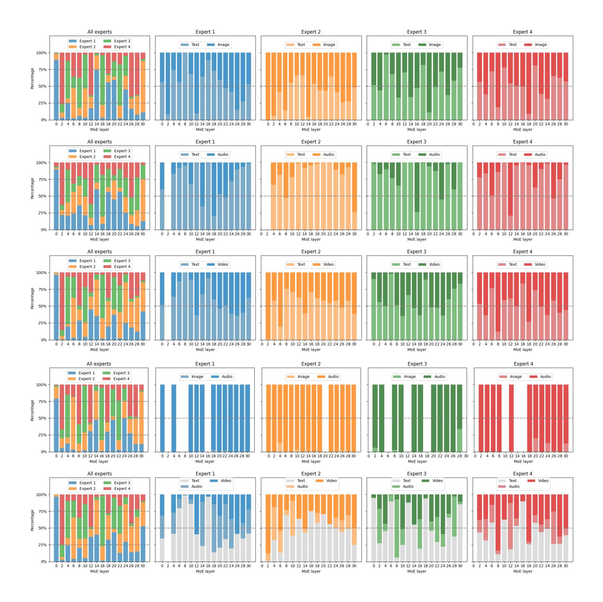
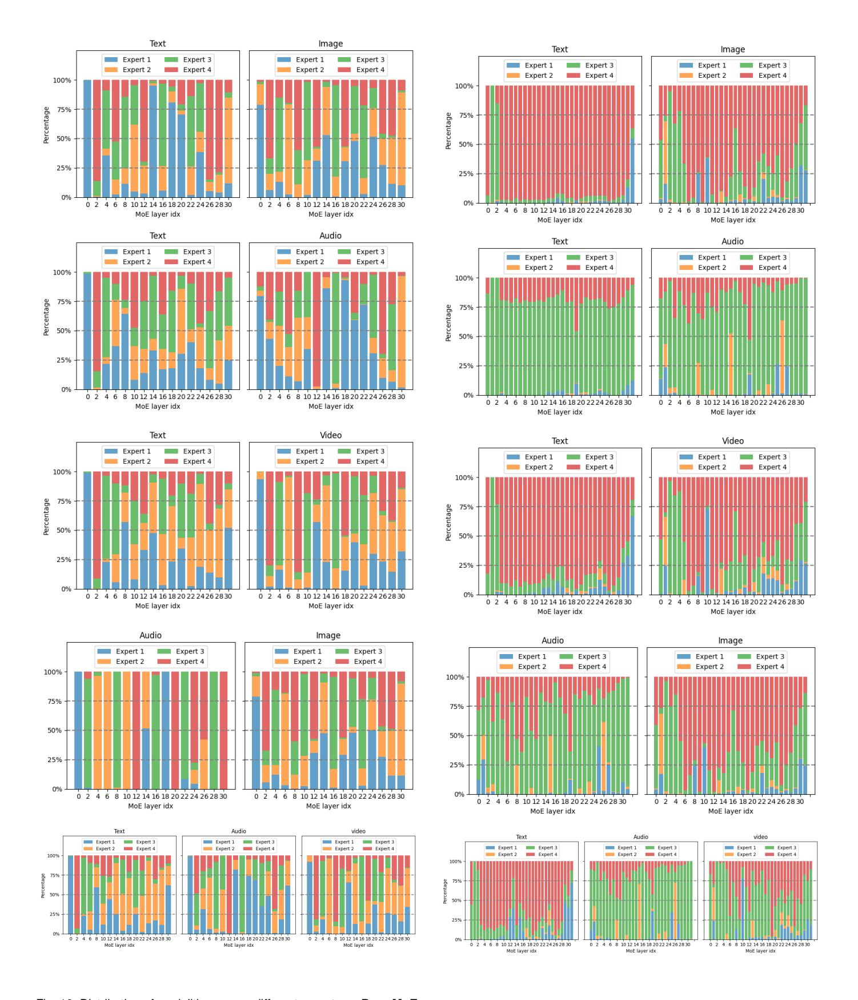

# **Comparative Visualization Analysis of Uni-MoE (4 experts) trained with MoE-Task2 and Pure-Task1**

In this section, we present the routing distributions and token pathways of MoE-Task2 and Pure-MoE-Task1 on five selected combinations of multi-modal data(Image-Text, Audio-Text, Video-Text, Image-Audio, Video-Audio-Text), each figure is shown utilizing 200 of data pair samples. These routing distributions are based on the training up to one epoch.

**Routing Distributions**. In our study, we conducted an ablation analysis by training a model called Pure-MoE-Task1. This model's performance did not meet the levels exhibited by other Uni-MoEs. The routing distribution for Pure-MoE-Task1, as illustrated in Figure [8,](#page-18-0) shows notable differences compared to MoE-Task3 presented in Figure [4.](#page-9-0) Specifically, Pure-MoE-Task1 demonstrated a relatively balanced distribution in terms of both expert loads and their preferences for different modalities. Conversely, MoE-Task3 and other Uni-MoE models, such as MoE-Task2 (illustrated in Figure [9\)](#page-19-0), exhibited distinct preferences among the experts that were fine-tuned during the single-modality optimization phase. For example, MoE-Task2 includes four experts, each fine-tuned for a different purpose: Expert 1 was trained using an audio-relevant dataset derived from an image dataset, Expert 2 was adapted from the fine-tuned LLaVA model's MLP layers, Expert 3 was developed for long speech training tasks, and Expert 4 was optimized for image-related tasks with textual information. The data suggest a strong relationship between the preference of an expert and the single-expert training stage. Specifically, during scenarios involving audio features, the workload of Expert 3, which was fine-tuned for long speech tasks, significantly increases. Similarly, with image inputs, Expert 4's workload exceeds that of all other experts. When handling video files containing both visual and audio content, the workload is almost evenly distributed between Experts 3 and 4, highlighting their significant roles in MoE training for task-specific contexts.

Overall, our findings suggest that the strategy of finetuning individual experts effectively transfers the capabilities of single modalities to enhance the performance of sparse Large Language Models (LLMs) across various tasks. While utilizing identical experts across all modules does not distinctly separate their functions, it inadvertently reveals unique patterns for each expert, which in some cases, proves to be effective. This characteristic pattern underscores the innovative approach of using Mixture of Experts in the Multimodal Large Language Model (MLLM) field. Future research should aim to further leverage the potential of MoE within MLLM to enhance its application and effectiveness.

**Token Pathways**. In Figure [12](#page-21-0) and Figure [13,](#page-21-1) we track the paths of each token for Pure-MoE-Task1 and MoE-Task2, respectively. In general, the overall trends of the token paths align with the analysis in the above routing distributions. The paths of Pure-MoE-Task1 appear more disorderly and diverse, which is attributed to a more balanced expert assignment. On the other hand, MoE-Task2 shows its unique preference for experts.

Fig. 8. Distribution of expert loadings and expert preferences on **Pure-MoE-Task1.** For different cross-modality data pairs, different experts from different layers have a high degree of consistency. we fail to observe the modalities for which different experts are primarily responsible. This may be attributed to the fact that experts are initially identical.

Fig. 9. Distribution of expert loadings and expert preferences on **MoE-Task2.**

Fig. 10. Distribution of modalities across different experts on **Pure-MoE-Task1**.

Fig. 11. Distribution of modalities across different experts on **MoE-Task2**.

Fig. 12. Visualization of activated pathways on **Pure-MoE-Task1**. Fig. 13. Visualization of activated pathways on **MoE-Task2**.

