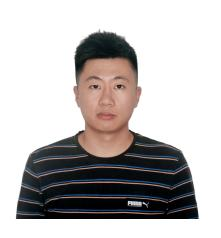
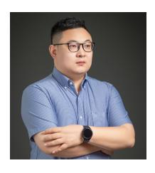

# **REFERENCES**

- [1] P. Xu, X. Zhu, and D. A. Clifton, "Multimodal learning with transformers: A survey," *IEEE Transactions on Pattern Analysis and Machine Intelligence (TPAMI)*, vol. 45, no. 10, pp. 12 113–12 132, 2023.
- [2] W. Dai, J. Li, D. Li, A. M. H. Tiong, J. Zhao, W. Wang, B. Li, P. N. Fung, and S. Hoi, "Instructblip: Towards general-purpose visionlanguage models with instruction tuning," *NeurIPS*, 2024.
- [3] H. Liu, C. Li, Y. Li, and Y. J. Lee, "Improved baselines with visual instruction tuning," *arXiv*, 2023.
- [4] B. Li, R. Wang, G. Wang, Y. Ge, Y. Ge, and Y. Shan, "Seed-bench: Benchmarking multimodal llms with generative comprehension," *arXiv preprint arXiv:2307.16125*, 2023.
- [5] Y. Liu, H. Duan, Y. Zhang, B. Li, S. Zhang, W. Zhao, Y. Yuan, J. Wang, C. He, Z. Liu *et al.*, "Mmbench: Is your multi-modal model an all-around player?" *arXiv preprint arXiv:2307.06281*, 2023.
- [6] A. Panagopoulou, L. Xue, N. Yu, J. Li, D. Li, S. Joty, R. Xu, S. Savarese, C. Xiong, and J. C. Niebles, "X-instructblip: A framework for aligning x-modal instruction-aware representations to llms and emergent cross-modal reasoning," *arXiv preprint arXiv:2311.18799*, 2023.
- [7] C. Lyu, M. Wu, L. Wang, X. Huang, B. Liu, Z. Du, S. Shi, and Z. Tu, "Macaw-llm: Multi-modal language modeling with image, audio, video, and text integration," *arXiv preprint arXiv:2306.09093*, 2023.
- [8] S. Moon, A. Madotto, Z. Lin, T. Nagarajan, M. Smith, S. Jain, C.-F. Yeh, P. Murugesan, P. Heidari, Y. Liu *et al.*, "Anymal: An efficient and scalable any-modality augmented language model," *arXiv preprint arXiv:2309.16058*, 2023.
- [9] Y. Li, C. Wang, and J. Jia, "Llama-vid: An image is worth 2 tokens in large language models," *arXiv preprint arXiv:2311.17043*, 2023.
- [10] OpenAI, "Gpt-4 technical report," *https://arxiv.org/abs/2303.08774*, 2023.
- [11] G. Team, R. Anil, S. Borgeaud, Y. Wu, J.-B. Alayrac, J. Yu, R. Soricut, J. Schalkwyk, A. M. Dai, A. Hauth *et al.*, "Gemini: a family of highly capable multimodal models," *Technical Report*, 2023.
- [12] Z. Chen, J. Wu, W. Wang, W. Su, G. Chen, S. Xing, Z. Muyan, Q. Zhang, X. Zhu, L. Lu *et al.*, "Internvl: Scaling up vision foundation models and aligning for generic visual-linguistic tasks," *CVPR*, 2024.
- [13] H. Laurenc¸on, L. Saulnier, L. Tronchon, S. Bekman, A. Singh, A. Lozhkov, T. Wang, S. Karamcheti, A. Rush, D. Kiela *et al.*, "Obelics: An open web-scale filtered dataset of interleaved imagetext documents," *Advances in Neural Information Processing Systems*, vol. 36, 2024.
- [14] H. Touvron, L. Martin, K. Stone, P. Albert, A. Almahairi, Y. Babaei, N. Bashlykov, S. Batra, P. Bhargava, S. Bhosale *et al.*, "Llama 2: Open foundation and fine-tuned chat models," *Techinal Report*, 2023.
- [15] Y. Li, B. Hu, X. Chen, L. Ma, and M. Zhang, "Lmeye: An interactive perception network for large language models," *arXiv preprint arXiv:2305.03701*, 2023.
- [16] Y. Li, L. Wang, B. Hu, X. Chen, W. Zhong, C. Lyu, and M. Zhang, "A comprehensive evaluation of gpt-4v on knowledge-intensive visual question answering," *arXiv preprint arXiv:2311.07536*, 2023.
- [17] N. Shazeer, A. Mirhoseini, K. Maziarz, A. Davis, Q. Le, G. Hinton, and J. Dean, "Outrageously large neural networks: The sparselygated mixture-of-experts layer," *ICLR*, 2017.
- [18] S. E. Yuksel, J. N. Wilson, and P. D. Gader, "Twenty years of mixture of experts," *IEEE Transactions on Neural Networks and Learning Systems*, vol. 23, no. 8, pp. 1177–1193, 2012.
- [19] A. Q. Jiang, A. Sablayrolles, A. Roux, A. Mensch, B. Savary, C. Bamford, D. S. Chaplot, D. d. l. Casas, E. B. Hanna, F. Bressand *et al.*, "Mixtral of experts," *Techinal Report*, 2024.
- [20] B. Lin, Z. Tang, Y. Ye, J. Cui, B. Zhu, P. Jin, J. Zhang, M. Ning, and L. Yuan, "Moe-llava: Mixture of experts for large vision-language models," *CoRR*, vol. abs/2401.15947, 2024.
- [21] E. J. Hu, Y. Shen, P. Wallis, Z. Allen-Zhu, Y. Li, S. Wang, L. Wang, and W. Chen, "Lora: Low-rank adaptation of large language models," *ICLR*, 2022.
- [22] W. Fedus, B. Zoph, and N. Shazeer, "Switch transformers: Scaling to trillion parameter models with simple and efficient sparsity," *The Journal of Machine Learning Research*, vol. 23, no. 1, pp. 5232–5270, 2022.
- [23] A. Vaswani, N. Shazeer, N. Parmar, J. Uszkoreit, L. Jones, A. N. Gomez, Ł. Kaiser, and I. Polosukhin, "Attention is all you need," *Advances in neural information processing systems*, vol. 30, 2017.
- [24] K. Han, Y. Wang, H. Chen, X. Chen, J. Guo, Z. Liu, Y. Tang, A. Xiao, C. Xu, Y. Xu, Z. Yang, Y. Zhang, and D. Tao, "A survey on vision

- transformer," *IEEE Transactions on Pattern Analysis and Machine Intelligence (TPAMI)*, vol. 45, no. 1, pp. 87–110, 2023.
- [25] J. Wu, X. Li, S. Xu, H. Yuan, H. Ding, Y. Yang, X. Li, J. Zhang, Y. Tong, X. Jiang, B. Ghanem, and D. Tao, "Towards open vocabulary learning: A survey," *IEEE Transactions on Pattern Analysis and Machine Intelligence (TPAMI)*, pp. 1–20, 2024.
- [26] S. Wu, H. Fei, L. Qu, W. Ji, and T.-S. Chua, "Next-gpt: Any-to-any multimodal llm," *arXiv preprint arXiv:2309.05519*, 2023.
- [27] Y. Zhang, K. Gong, K. Zhang, H. Li, Y. Qiao, W. Ouyang, and X. Yue, "Meta-transformer: A unified framework for multimodal learning," *arXiv preprint arXiv:2307.10802*, 2023.
- [28] J. Zhan, J. Dai, J. Ye, Y. Zhou, D. Zhang, Z. Liu, X. Zhang, R. Yuan, G. Zhang, L. Li *et al.*, "Anygpt: Unified multimodal llm with discrete sequence modeling," *arXiv preprint arXiv:2402.12226*, 2024.
- [29] R. Girdhar, A. El-Nouby, Z. Liu, M. Singh, K. V. Alwala, A. Joulin, and I. Misra, "Imagebind: One embedding space to bind them all," in *Proceedings of the IEEE/CVF Conference on Computer Vision and Pattern Recognition*, 2023, pp. 15 180–15 190.
- [30] A. Kirillov, E. Mintun, N. Ravi, H. Mao, C. Rolland, L. Gustafson, T. Xiao, S. Whitehead, A. C. Berg, W.-Y. Lo *et al.*, "Segment anything," *ICCV*, 2023.
- [31] X. Li, H. Zhang, R. Wang, and F. Nie, "Multiview clustering: A scalable and parameter-free bipartite graph fusion method," *IEEE Transactions on Pattern Analysis and Machine Intelligence (TPAMI)*, vol. 44, no. 1, pp. 330–344, 2022.
- [32] J. Zhang, J. Huang, S. Jin, and S. Lu, "Vision-language models for vision tasks: A survey," *IEEE Transactions on Pattern Analysis and Machine Intelligence (TPAMI)*, pp. 1–20, 2024.
- [33] H. W. Chung, L. Hou, S. Longpre, B. Zoph, Y. Tay, W. Fedus, Y. Li, X. Wang, M. Dehghani, S. Brahma *et al.*, "Scaling instructionfinetuned language models," *arXiv preprint arXiv:2210.11416*, 2022.
- [34] Y. Zhang, R. Zhang, J. Gu, Y. Zhou, N. Lipka, D. Yang, and T. Sun, "Llavar: Enhanced visual instruction tuning for text-rich image understanding," *NeurIPS*, 2023.
- [35] D. Zhu, J. Chen, X. Shen, X. Li, and M. Elhoseiny, "Minigpt-4: Enhancing vision-language understanding with advanced large language models," *ICLR*, 2024.
- [36] J. Bai, S. Bai, S. Yang, S. Wang, S. Tan, P. Wang, J. Lin, C. Zhou, and J. Zhou, "Qwen-vl: A frontier large vision-language model with versatile abilities," *Technical Report*, 2023.
- [37] C. Wu, S. Yin, W. Qi, X. Wang, Z. Tang, and N. Duan, "Visual chatgpt: Talking, drawing and editing with visual foundation models," *arXiv preprint arXiv:2303.04671*, 2023.
- [38] P. Gao, J. Han, R. Zhang, Z. Lin, S. Geng, A. Zhou, W. Zhang, P. Lu, C. He, X. Yue *et al.*, "Llama-adapter v2: Parameter-efficient visual instruction model," *ICLR*, 2024.
- [39] S. Bao, Q. Xu, Z. Yang, X. Cao, and Q. Huang, "Rethinking collaborative metric learning: Toward an efficient alternative without negative sampling," *IEEE Transactions on Pattern Analysis and Machine Intelligence (TPAMI)*, vol. 45, no. 1, pp. 1017–1035, 2023.
- [40] J. Li, P. Chen, S. Yu, S. Liu, and J. Jia, "Bal: Balancing diversity and novelty for active learning," *IEEE Transactions on Pattern Analysis and Machine Intelligence (TPAMI)*, vol. 46, no. 5, pp. 3653–3664, 2024.
- [41] D. Eigen, M. Ranzato, and I. Sutskever, "Learning factored representations in a deep mixture of experts," *ICLR Workshop*, 2014.
- [42] D. Lepikhin, H. Lee, Y. Xu, D. Chen, O. Firat, Y. Huang, M. Krikun, N. Shazeer, and Z. Chen, "Gshard: Scaling giant models with conditional computation and automatic sharding," *ICLR*, 2021.
- [43] M. Lewis, S. Bhosale, T. Dettmers, N. Goyal, and L. Zettlemoyer, "Base layers: Simplifying training of large, sparse models," in *International Conference on Machine Learning*. PMLR, 2021, pp. 6265–6274.
- [44] N. Du, Y. Huang, A. M. Dai, S. Tong, D. Lepikhin, Y. Xu, M. Krikun, Y. Zhou, A. W. Yu, O. Firat *et al.*, "Glam: Efficient scaling of language models with mixture-of-experts," in *International Conference on Machine Learning*. PMLR, 2022, pp. 5547–5569.
- [45] H. Liu, C. Li, Q. Wu, and Y. J. Lee, "Visual instruction tuning," in *NeurIPS*, 2023.
- [46] A. Radford, J. W. Kim, C. Hallacy, A. Ramesh, G. Goh, S. Agarwal, G. Sastry, A. Askell, P. Mishkin, J. Clark *et al.*, "Learning transferable visual models from natural language supervision," in *International conference on machine learning*. PMLR, 2021, pp. 8748–8763.
- [47] W.-L. Chiang, Z. Li, Z. Lin, Y. Sheng, Z. Wu, H. Zhang, L. Zheng, S. Zhuang, Y. Zhuang, J. E. Gonzalez, I. Stoica, and E. P. Xing, "Vicuna: An open-source chatbot impressing gpt-4 with 90%\* chatgpt quality," March 2023.

- [48] A. Radford, J. W. Kim, T. Xu, G. Brockman, C. McLeavey, and I. Sutskever, "Robust speech recognition via large-scale weak supervision," in *International Conference on Machine Learning, ICML 2023, 23-29 July 2023, Honolulu, Hawaii, USA*, ser. Proceedings of Machine Learning Research, A. Krause, E. Brunskill, K. Cho, B. Engelhardt, S. Sabato, and J. Scarlett, Eds., vol. 202. PMLR, 2023, pp. 28 492–28 518.
- [49] S. Chen, Y. Wu, C. Wang, S. Liu, D. Tompkins, Z. Chen, and F. Wei, "Beats: Audio pre-training with acoustic tokenizers," *PMLR*, 2023.
- [50] J. Li, D. Li, S. Savarese, and S. Hoi, "Blip-2: Bootstrapping languageimage pre-training with frozen image encoders and large language models," *ICML*, 2023.
- [51] microsoft, "Phi-2: The surprising power of small language models," 2023.
- [52] G. Wang, S. Cheng, X. Zhan, X. Li, S. Song, and Y. Liu, "Openchat: Advancing open-source language models with mixed-quality data," *ICLR*, 2024.
- [53] R. Ardila, M. Branson, K. Davis, M. Henretty, M. Kohler, J. Meyer, R. Morais, L. Saunders, F. M. Tyers, and G. Weber, "Common voice: A massively-multilingual speech corpus," in *Proceedings of the 12th Conference on Language Resources and Evaluation (LREC 2020)*, 2020, pp. 4211–4215.
- [54] Microsoft, "Text to speech an ai speech feature that converts text to lifelike speech."
- [55] V. Panayotov, G. Chen, D. Povey, and S. Khudanpur, "Librispeech: an asr corpus based on public domain audio books," in *ICASSP*. IEEE, 2015, pp. 5206–5210.
- [56] G. Lai, Q. Xie, H. Liu, Y. Yang, and E. Hovy, "Race: Large-scale reading comprehension dataset from examinations," *EMNLP*, 2017.
- [57] X. Mei, C. Meng, H. Liu, Q. Kong, T. Ko, C. Zhao, M. D. Plumbley, Y. Zou, and W. Wang, "Wavcaps: A chatgpt-assisted weaklylabelled audio captioning dataset for audio-language multimodal research," *arXiv preprint arXiv:2303.17395*, 2023.
- [58] C. D. Kim, B. Kim, H. Lee, and G. Kim, "Audiocaps: Generating captions for audios in the wild," in *ACL*, 2019, pp. 119–132.
- [59] K. Drossos, S. Lipping, and T. Virtanen, "Clotho: An audio captioning dataset," in *ICASSP*. IEEE, 2020, pp. 736–740.
- [60] S. Lipping, P. Sudarsanam, K. Drossos, and T. Virtanen, "Clothoaqa: A crowdsourced dataset for audio question answering," in *2022 30th European Signal Processing Conference (EUSIPCO)*. IEEE, 2022, pp. 1140–1144.
- [61] S. Poria, D. Hazarika, N. Majumder, G. Naik, E. Cambria, and R. Mihalcea, "Meld: A multimodal multi-party dataset for emotion recognition in conversations," *ACL*, 2019.
- [62] M. Maaz, H. Rasheed, S. Khan, and F. S. Khan, "Video-chatgpt: Towards detailed video understanding via large vision and language models," *arXiv preprint arXiv:2306.05424*, 2023.
- [63] D. Schwenk, A. Khandelwal, C. Clark, K. Marino, and R. Mottaghi, "A-okvqa: A benchmark for visual question answering using world knowledge," *ECCV*, 2023.
- [64] K. Marino, M. Rastegari, A. Farhadi, and R. Mottaghi, "Okvqa: A visual question answering benchmark requiring external knowledge," in *Proceedings of the IEEE/cvf conference on computer vision and pattern recognition*, 2019, pp. 3195–3204.
- [65] Y. Goyal, T. Khot, D. Summers-Stay, D. Batra, and D. Parikh, "Making the v in vqa matter: Elevating the role of image understanding in visual question answering," in *Proceedings of the IEEE conference on computer vision and pattern recognition*, 2017, pp. 6904–6913.
- [66] B. G. Fabian Caba Heilbron, Victor Escorcia and J. C. Niebles, "Activitynet: A large-scale video benchmark for human activity understanding," in *Proceedings of the IEEE Conference on Computer Vision and Pattern Recognition*, 2015, pp. 961–970.
- [67] D. Chen and W. B. Dolan, "Collecting highly parallel data for paraphrase evaluation," in *Proceedings of the 49th annual meeting of the association for computational linguistics: human language technologies*, 2011, pp. 190–200.
- [68] D. P. Kingma and J. Ba, "Adam: A method for stochastic optimization," *ICLR*, 2015.
- [69] G. Li, Y. Xu, and D. Hu, "Multi-scale attention for audio question answering," *InterSpeech*, 2023.
- [70] M. Kim, K. Sung-Bin, and T.-H. Oh, "Prefix tuning for automated audio captioning," in *ICASSP 2023-2023 IEEE International Conference on Acoustics, Speech and Signal Processing (ICASSP)*. IEEE, 2023, pp. 1–5.
- [71] A. Yang, A. Miech, J. Sivic, I. Laptev, and C. Schmid, "Zeroshot video question answering via frozen bidirectional language

- models," *Advances in Neural Information Processing Systems*, vol. 35, pp. 124–141, 2022.
- [72] K. Li, Y. He, Y. Wang, Y. Li, W. Wang, P. Luo, Y. Wang, L. Wang, and Y. Qiao, "Videochat: Chat-centric video understanding," *arXiv preprint arXiv:2305.06355*, 2023.
- [73] H. Zhang, X. Li, and L. Bing, "Video-llama: An instruction-tuned audio-visual language model for video understanding," *arXiv preprint arXiv:2306.02858*, 2023.
- [74] P. Pearson and K. Karl, "Liii. on lines and planes of closest fit to systems of points in space," *Philosophical Magazine Series 1,Philosophical Magazine Series 1*.
- [75] Y. Li, Y. Du, K. Zhou, J. Wang, X. Zhao, and J.-R. Wen, "Evaluating object hallucination in large vision-language models," in *Proceedings of the 2023 Conference on Empirical Methods in Natural Language Processing*, H. Bouamor, J. Pino, and K. Bali, Eds., 2023, pp. 292–305.
- [76] W. Yu, Z. Yang, L. Li, J. Wang, K. Lin, Z. Liu, X. Wang, and L. Wang, "Mm-vet: Evaluating large multimodal models for integrated capabilities," *arXiv preprint arXiv:2308.02490*, 2023.
- [77] K. Chen, Z. Zhang, W. Zeng, R. Zhang, F. Zhu, and R. Zhao, "Shikra: Unleashing multimodal llm's referential dialogue magic," *arXiv preprint arXiv:2306.15195*, 2023.
- [78] J. Bai, S. Bai, Y. Chu, Z. Cui, K. Dang, X. Deng, Y. Fan, W. Ge, Y. Han, F. Huang *et al.*, "Qwen technical report," *arXiv preprint arXiv:2309.16609*, 2023.
- [79] X. Chu, L. Qiao, X. Lin, S. Xu, Y. Yang, Y. Hu, F. Wei, X. Zhang, B. Zhang, X. Wei *et al.*, "Mobilevlm: A fast, reproducible and strong vision language assistant for mobile devices," *Technical Report*, 2023.
- [80] Y. Zhu, M. Zhu, N. Liu, Z. Ou, X. Mou, and J. Tang, "Llava-phi: Efficient multi-modal assistant with small language model," *arXiv preprint arXiv:2401.02330*, 2024.

**Yunxin Li** received the M.S. and B.S. degrees from the Harbin Institute of Technology, in 2019 and 2022. He is currently pursuing the Ph.D. degree with the School of Computer Science, Harbin Institute of Technology, Shenzhen. His research interests include large multimodal models, cross-modal reasoning, and natural language generation.

**Shenyuan Jiang** earned a Bachelor of Science degree in Computer Science from Harbin Institute of Technology, Shenzhen campus, in 2022. He is now pursuing a Master's degree at the School of Computer Science in Harbin Institute of Technology, Shenzhen. Jiang's research interests are centered around the development and enhancement of multimodal large language models.

**Baotian Hu** received the M.S. and Ph.D. degrees in computer science from the Shenzhen Graduate School of Harbin Institute of Technology, Shenzhen, China, in 2012 and 2016, respectively. He is currently an Associate Professor with the School of Computer Science and Technology, Harbin Institute of Technology, Shenzhen. His current research interests include deep learning and its application in natural language processing and vision-language information processing.

**Longyue Wang** is a Senior Researcher with the Tencent AI Lab, Shenzhen, China. He received his Ph.D. degree from Dublin City University in 2018. Longyue has studied and practiced in a broad field of Artificial Intelligence especially on Large Language Model, Multimodal, Language Agent, Natural Language Processing, Machine Translation, Deep Learning and AI for Science. He has published 60 papers in leading NLP journals and conferences.

**Wanqi Zhong** is an undergraduate student majoring in Computer Science and Technology at Harbin Institute of Technology, China. His current research interests include computer vision and deep learning, particularly focusing on visioncentral general perception.

**Wenhan Luo** (Senior Member, IEEE) is currently an Associate Professor at the Hong Kong University of Science and Technology. Prior to that, he worked as an Associate Professor at Sun Yat-sen University and as a research scientist for Tencent and Amazon. He has published over 80 papers in top conferences and leading journals. He also has served as a reviewer, senior PC member, and Guest Editor for several prestigious journals and conferences. He received Ph.D. degree from Imperial College London in 2016, M.E. degree

from the Institute of Automation, Chinese Academy of Sciences in 2012, and B.E. degree from Huazhong University of Science and Technology in 2009.

**Lin Ma** received the B. E., and M. E. degrees from Harbin Institute of Technology, Harbin, China, in 2006 and 2008, respectively, both in computer science. He received his Ph.D. degree in the Department of Electronic Engineering at the Chinese University of Hong Kong (CUHK) in 2013. He is now a Researcher with Meituan, Beijing, China. His current research interests lie in the areas of deep learning and multi-modal learning, specifically for image and language.

**Min Zhang** received the Ph.D., M.S., and B.S. degrees in Computer Science and Technology at the Harbin Institute of Technology, in 1991, 1994, and 1997, respectively. He is currently a Professor at the School of Computer Science and Technology, Harbin Institute of Technology, Shenzhen. His research interests include multimodal reasoning, large models, and natural language generation.

