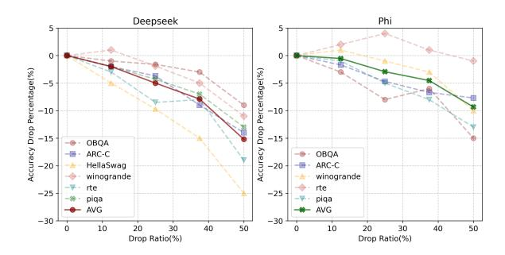
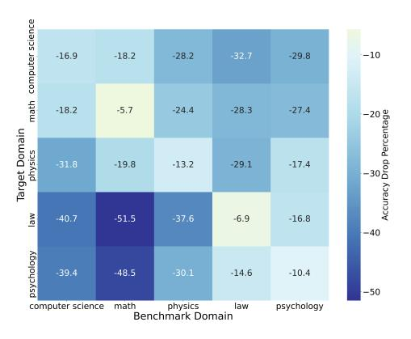

# 5.2 Experiments on General and Domain-Specific Tasks

We conduct a series of experiments to evaluate the effectiveness of our proposed pruning method, CAEP. We perform experiments on both general tasks and domain-specific tasks. The goal is to assess how well the pruned model retains its capabilities across a variety of tasks, while optimizing performance retention in specific domains. The dataset and specific configurations used in this part of the experiment can be found in Appendix B.

#### 5.2.1 Experiments on General Tasks

The goal of this experiment is to evaluate how well the pruned model retains its performance across

#### <span id="page-6-0"></span>**Algorithm 1** Expert Pruning Strategy

```
Require: Dictionary matrix \mathbf{D} \in \mathbb{R}^{N_e \times N_p}
  1: Sparse representation matrix \mathbf{R} \in \mathbb{R}^{N_p \times N_s}
  2: Threshold ratio k_1 \in (0,1)
 3: Target pruning ratio k_2 \in (0,1)
Ensure: Pruned expert mask \mathbf{m} \in \{0, 1\}^{N_e}
 4: \mathbf{R}_{\text{sum}} \leftarrow \sum_{j=1}^{N_s} \mathbf{R}_{:,j}

  5: \mathbf{D}_{sum} \leftarrow \mathbf{D} \cdot \mathbf{R}_{sum}^{\top}

 6: \mathbf{e} \leftarrow \sum_{i=1}^{N_p} \mathbf{D}_{\text{sum},i}

  7: Sort e in descending order: e_{\text{sorted}}
  8: f \leftarrow \mathbf{e}_{\text{sorted}}[\lceil k_1 \cdot N_e \rceil]
                                                        \triangleright Threshold at k_1-quantile
  9: \mathbf{m} \leftarrow \mathbf{1}_{\mathbf{e} \geq j}
                                                                 ▶ Initial binary mask
10: while \|\vec{\mathbf{m}}\|_0 > (1 - k_2) \cdot N_e do
11:
             i^* \leftarrow \arg\min_i \mathbf{R}_{\text{sum}}(i)
                                                          ▶ Find least used pattern
             Remove column i^* from D and row i^* from R
12:
             Recompute \mathbf{R}_{sum}, \mathbf{D}_{sum}, \mathbf{e}
13:
             Update \mathbf{m} \leftarrow \mathbf{1}_{\mathbf{e} > f}
14:

⊳ Adapt mask

15. end while
               return m
```

a broad set of general tasks. We compare CAEP with baseline pruning methods to analyze the tradeoff between reducing the number of experts and maintaining task performance.

Comparison with Other Expert Pruning Baselines. We compare CAEP to two baseline pruning strategies: (1) Routing Score-Based Pruning (Muzio et al., 2024): Retains experts with higher averaged routing scores. (2) Behavior-based Pruning (Zhang et al., 2024): Remove experts with minimal impact on the output.

Results and Discussion. Figure 8 and Table 1 show that CAEP-pruned models maintain competitive performance, outperforming random and baseline methods with an average score of 0.612. Notably, CAEP retains higher performance after pruning 25% of the experts, especially on tasks like OBQA and RTE. This is further supported by Figure 8, where CAEP shows a lower accuracy drop across multiple tasks, including HellaSwag and PIQA, even with a high pruning ratio.

Through the analysis of the experimental results, we found that CAEP effectively retains performance across a broad set of general tasks while significantly reducing the number of experts. This demonstrates that CAEP successfully balances pruning and performance retention, optimizing computational efficiency while minimizing performance loss.

#### 5.2.2 Experiments on Domain-Specific Tasks

In this experiment, we focus on investigating how expert collaboration patterns differ across various domains and how these differences reflect the domain-specific interactions within MoE

Table 1: Performance evaluation of different expert pruning methods with 25% experts dropped.

<span id="page-7-1"></span>

| Model    | Method      | AVG↑   | OBQA↑ | ARC-C↑ | HellaSwag↑ | WinoGrande↑ | RTE↑  | PIQA↑ |
|----------|-------------|--------|-------|--------|------------|-------------|-------|-------|
| DeepSeek | Random      | 0.500  | 0.363 | 0.564  | 0.485      | 0.568       | 0.641 | 0.381 |
|          | SEER-MoE    | 0.5872 | 0.420 | 0.672  | 0.665      | 0.617       | 0.755 | 0.394 |
|          | GEM         | 0.5870 | 0.422 | 0.67   | 0.658      | 0.649       | 0.739 | 0.384 |
|          | CAEP (Ours) | 0.612  | 0.473 | 0.693  | 0.691      | 0.635       | 0.757 | 0.424 |

<span id="page-7-0"></span>

Figure 8: Performance of CAEP on benchmark tasks with varying expert pruning drop ratios.

LLMs. Our objective is to analyze the activation frequencies of experts for inputs from five fields—mathematics, computer science, physics, law, and psychology—in order to identify domaindependent patterns in expert selection.For each domain, we prune 50% of the experts using CAEP on Phi. This setup enables us to assess whether the pruned model retains superior performance in a specific domain at the expense of others.

Performance Evaluation Metric. To assess the impact of pruning, we focus primarily on the relative changes in performance. The metric is computed as:

$$\frac{Acc_{\text{pruned}} - Acc_{\text{no-pruned}}}{Acc_{\text{no-pruned}}}.$$
 (9)

A higher value indicates better retention of domainspecific capabilities, with the ideal result being maximized diagonal elements, showing that each pruned model retains domain-specific expertise.

Results and Discussion. Figure [9](#page-7-2) shows the accuracy degradation after pruning for different domains, presented as a heatmap. The color scale indicates the percentage of accuracy drop, where darker blue shades represent larger losses. From the figure, we observe that pruning for domains like law and psychology leads to the most significant accuracy drops, particularly when the target domain is law. In contrast, pruning for the "physics" or "psychology" domains results in relatively smaller accuracy drops, suggesting a less severe impact on performance.

We find that this variation in pruning impact,

<span id="page-7-2"></span>

Figure 9: Performance degradation accuracy after pruning for specific domain

depending on both the target and benchmark domains, reveals an uneven distribution of domainspecific knowledge across the model. Some domains rely more heavily on specialized expertise, while others are more flexible in terms of expert collaboration. These findings suggest that pruning strategies should account for the varying importance of domain-specific knowledge, allowing for more efficient expert retention and minimizing unnecessary performance degradation in MoE LLMs.

#### 6 Conclusion

This paper addresses a key gap in MoE LLMs, where existing research has largely overlooked the collaboration patterns among experts, both within the same layer and across layers. By applying hierarchical sparse dictionary learning, we uncover dominant expert collaboration patterns and develop a pruning strategy to enhance MoE LLMs' efficiency. Our experiments demonstrate that this approach not only improves accuracy but also significantly boosts model compression and inference efficiency compared to existing methods. This work provides valuable insights into expert interactions and offers a novel way to optimize MoE LLMs for both performance and scalability.

### References

- <span id="page-8-18"></span>Yonatan Bisk, Rowan Zellers, Jianfeng Gao, Yejin Choi, et al. 2020. Piqa: Reasoning about physical commonsense in natural language. In *Proceedings of the AAAI conference on artificial intelligence*, volume 34, pages 7432–7439.
- <span id="page-8-2"></span>Weilin Cai, Juyong Jiang, Fan Wang, Jing Tang, Sunghun Kim, and Jiayi Huang. 2024. [A Survey](http://arxiv.org/abs/2407.06204) [on Mixture of Experts.](http://arxiv.org/abs/2407.06204) *arXiv preprint*.
- <span id="page-8-9"></span>Chen Chen, Hao Su, Qixing Huang, Lin Zhang, and Leonidas Guibas. 2013. [Pathlet learning for com](https://doi.org/10.1145/2525314.2525443)[pressing and planning trajectories.](https://doi.org/10.1145/2525314.2525443) In *Proceedings of the 21st ACM SIGSPATIAL International Conference on Advances in Geographic Information Systems*, pages 392–395, Orlando Florida. ACM.
- <span id="page-8-16"></span>Christopher Clark, Kenton Lee, Ming-Wei Chang, Tom Kwiatkowski, Michael Collins, and Kristina Toutanova. 2019. [BoolQ: Exploring the surprising](https://doi.org/10.18653/v1/N19-1300) [difficulty of natural yes/no questions.](https://doi.org/10.18653/v1/N19-1300) In *Proceedings of the 2019 Conference of the North American Chapter of the Association for Computational Linguistics: Human Language Technologies, Volume 1 (Long and Short Papers)*, pages 2924–2936, Minneapolis, Minnesota. Association for Computational Linguistics.
- <span id="page-8-15"></span>Peter Clark, Isaac Cowhey, Oren Etzioni, Tushar Khot, Ashish Sabharwal, Carissa Schoenick, and Oyvind Tafjord. 2018. [Think you have solved question](https://arxiv.org/abs/1803.05457) [answering? try arc, the ai2 reasoning challenge.](https://arxiv.org/abs/1803.05457) *Preprint*, arXiv:1803.05457.
- <span id="page-8-4"></span>Damai Dai, Chengqi Deng, Chenggang Zhao, R. X. Xu, Huazuo Gao, Deli Chen, Jiashi Li, Wangding Zeng, Xingkai Yu, Y. Wu, Zhenda Xie, Y. K. Li, Panpan Huang, Fuli Luo, Chong Ruan, Zhifang Sui, and Wenfeng Liang. 2024. [DeepSeekMoE: Towards](https://doi.org/10.48550/arXiv.2401.06066) [Ultimate Expert Specialization in Mixture-of-Experts](https://doi.org/10.48550/arXiv.2401.06066) [Language Models.](https://doi.org/10.48550/arXiv.2401.06066) *arXiv preprint*.
- <span id="page-8-1"></span>William Fedus, Barret Zoph, and Noam Shazeer. 2022. Switch transformers: Scaling to trillion parameter models with simple and efficient sparsity. *Journal of Machine Learning Research*, 23(120):1–39.
- <span id="page-8-13"></span>Leo Gao, Gabriel Goh, and Ilya Sutskever. Scaling and evaluating sparse autoencoders.
- <span id="page-8-20"></span>Leo Gao, Jonathan Tow, Baber Abbasi, Stella Biderman, Sid Black, Anthony DiPofi, Charles Foster, Laurence Golding, Jeffrey Hsu, Alain Le Noac'h, Haonan Li, Kyle McDonell, Niklas Muennighoff, Chris Ociepa, Jason Phang, d Laria Reynolds, Hailey Schoelkopf, Aviya Skowron, Lintang Sutawika, Eric Tang, Anish Thite, Ben Wang, Kevin Wang, and Andy Zou. 2023. [A framework for few-shot language model](https://doi.org/10.5281/zenodo.10256836) [evaluation.](https://doi.org/10.5281/zenodo.10256836)
- <span id="page-8-6"></span>Shwai He, Daize Dong, Liang Ding, and Ang Li. 2024. [Demystifying the Compression of Mixture](https://doi.org/10.48550/arXiv.2406.02500)[of-Experts Through a Unified Framework.](https://doi.org/10.48550/arXiv.2406.02500) *arXiv preprint*.

- <span id="page-8-14"></span>Dan Hendrycks, Collin Burns, Steven Basart, Andy Zou, Mantas Mazeika, Dawn Song, and Jacob Steinhardt. 2021. [Measuring massive multitask language under](https://openreview.net/forum?id=d7KBjmI3GmQ)[standing.](https://openreview.net/forum?id=d7KBjmI3GmQ) In *International Conference on Learning Representations*.
- <span id="page-8-11"></span>Zhi Hou, Xiaojiang Peng, Yu Qiao, and Dacheng Tao. 2020. [Visual Compositional Learning for Human-](https://doi.org/10.1007/978-3-030-58555-6_35)[Object Interaction Detection.](https://doi.org/10.1007/978-3-030-58555-6_35) In *Computer Vision – ECCV 2020*, pages 584–600, Cham. Springer International Publishing.
- <span id="page-8-10"></span>Zhi Hou, Baosheng Yu, Yu Qiao, Xiaojiang Peng, and Dacheng Tao. 2021. [Detecting Human-Object Inter](https://openaccess.thecvf.com/content/CVPR2021/html/Hou_Detecting_Human-Object_Interaction_via_Fabricated_Compositional_Learning_CVPR_2021_paper.html)[action via Fabricated Compositional Learning.](https://openaccess.thecvf.com/content/CVPR2021/html/Hou_Detecting_Human-Object_Interaction_via_Fabricated_Compositional_Learning_CVPR_2021_paper.html) pages 14646–14655.
- <span id="page-8-0"></span>Albert Q. Jiang, Alexandre Sablayrolles, Antoine Roux, Arthur Mensch, Blanche Savary, Chris Bamford, Devendra Singh Chaplot, Diego de las Casas, Emma Bou Hanna, Florian Bressand, Gianna Lengyel, Guillaume Bour, Guillaume Lample, Lélio Renard Lavaud, Lucile Saulnier, Marie-Anne Lachaux, Pierre Stock, Sandeep Subramanian, Sophia Yang, Szymon Antoniak, Teven Le Scao, Théophile Gervet, Thibaut Lavril, Thomas Wang, Timothée Lacroix, and William El Sayed. 2024. [Mix](https://doi.org/10.48550/arXiv.2401.04088)[tral of Experts.](https://doi.org/10.48550/arXiv.2401.04088) *arXiv preprint*.
- <span id="page-8-8"></span>Pingzhi Li, Zhenyu Zhang, Prateek Yadav, Yi-Lin Sung, Yu Cheng, Mohit Bansal, and Tianlong Chen. 2023. Merge, then compress: Demystify efficient smoe with hints from its routing policy. *CoRR*.
- <span id="page-8-3"></span>Ka Man Lo, Zeyu Huang, Zihan Qiu, Zili Wang, and Jie Fu. 2024. [A Closer Look into Mixture-of-Experts in](https://doi.org/10.48550/arXiv.2406.18219) [Large Language Models.](https://doi.org/10.48550/arXiv.2406.18219) *arXiv preprint*.
- <span id="page-8-5"></span>Xudong Lu, Qi Liu, Yuhui Xu, Aojun Zhou, Siyuan Huang, Bo Zhang, Junchi Yan, and Hongsheng Li. 2024. [Not all experts are equal: Efficient expert](https://doi.org/10.48550/arXiv.2402.14800) [pruning and skipping for mixture-of-experts large](https://doi.org/10.48550/arXiv.2402.14800) [language models.](https://doi.org/10.48550/arXiv.2402.14800) *CoRR*, abs/2402.14800.
- <span id="page-8-17"></span>Todor Mihaylov, Peter Clark, Tushar Khot, and Ashish Sabharwal. 2018. Can a suit of armor conduct electricity? a new dataset for open book question answering. In *Proceedings of the 2018 Conference on Empirical Methods in Natural Language Processing*, pages 2381–2391.
- <span id="page-8-7"></span>Alexandre Muzio, Alex Sun, and Churan He. 2024. [SEER-MoE: Sparse Expert Efficiency through Regu](https://doi.org/10.48550/arXiv.2404.05089)[larization for Mixture-of-Experts.](https://doi.org/10.48550/arXiv.2404.05089) *arXiv preprint*.
- <span id="page-8-12"></span>Senthooran Rajamanoharan, Arthur Conmy, Lewis Smith, Tom Lieberum, Vikrant Varma, János Kramár, Rohin Shah, and Neel Nanda. 2024. [Improving Dic](https://doi.org/10.48550/arXiv.2404.16014)[tionary Learning with Gated Sparse Autoencoders.](https://doi.org/10.48550/arXiv.2404.16014) *arXiv preprint*.
- <span id="page-8-19"></span>Keisuke Sakaguchi, Ronan Le Bras, Chandra Bhagavatula, and Yejin Choi. 2021. Winogrande: An adversarial winograd schema challenge at scale. *Communications of the ACM*, 64(9):99–106.

<span id="page-9-4"></span>Yuanbo Tang, Zhiyuan Peng, and Yang Li. 2023. [Ex](https://doi.org/10.1145/3589132.3625607)[plainable Trajectory Representation through Dictio](https://doi.org/10.1145/3589132.3625607)[nary Learning.](https://doi.org/10.1145/3589132.3625607) In *Proceedings of the 31st ACM International Conference on Advances in Geographic Information Systems*, SIGSPATIAL '23, pages 1–4, New York, NY, USA. Association for Computing Machinery.

<span id="page-9-6"></span>Alex Wang, Amanpreet Singh, Julian Michael, Felix Hill, Omer Levy, and Samuel R. Bowman. 2019. GLUE: A multi-task benchmark and analysis platform for natural language understanding. In the Proceedings of ICLR.

<span id="page-9-3"></span>J. Wright, A. Y. Yang, A. Ganesh, S. S. Sastry, and Yi Ma. 2009. [Robust Face Recognition via Sparse](https://doi.org/10.1109/TPAMI.2008.79) [Representation.](https://doi.org/10.1109/TPAMI.2008.79) *IEEE Transactions on Pattern Analysis and Machine Intelligence*, 2(31):210–227.

<span id="page-9-0"></span>Fuzhao Xue, Zian Zheng, Yao Fu, Jinjie Ni, Zangwei Zheng, Wangchunshu Zhou, and Yang You. 2024. [Openmoe: An early effort on open mixture-of](https://openreview.net/forum?id=1YDeZU8Lt5)[experts language models.](https://openreview.net/forum?id=1YDeZU8Lt5) In *Forty-first International Conference on Machine Learning*.

<span id="page-9-2"></span>Jianchao Yang, John Wright, Thomas S. Huang, and Yi Ma. 2010. [Image super-resolution via sparse rep](https://doi.org/10.1109/TIP.2010.2050625)[resentation.](https://doi.org/10.1109/TIP.2010.2050625) *IEEE transactions on image processing: a publication of the IEEE Signal Processing Society*, 19(11):2861–2873.

<span id="page-9-5"></span>Rowan Zellers, Ari Holtzman, Yonatan Bisk, Ali Farhadi, and Yejin Choi. 2019. [HellaSwag: Can a ma](https://doi.org/10.18653/v1/P19-1472)[chine really finish your sentence?](https://doi.org/10.18653/v1/P19-1472) In *Proceedings of the 57th Annual Meeting of the Association for Computational Linguistics*, pages 4791–4800, Florence, Italy. Association for Computational Linguistics.

<span id="page-9-1"></span>Zeliang Zhang, Xiaodong Liu, Hao Cheng, Chenliang Xu, and Jianfeng Gao. 2024. [Diversifying the Ex](https://doi.org/10.48550/arXiv.2407.09590)[pert Knowledge for Task-Agnostic Pruning in Sparse](https://doi.org/10.48550/arXiv.2407.09590) [Mixture-of-Experts.](https://doi.org/10.48550/arXiv.2407.09590) *arXiv preprint*.

#### Appendix

## A Limitations and Future Work

The entire work operates under the assumption that the allocation result provided by the router is the most optimal. However, this may only reflect one aspect of the model's behavior. By considering both router information and weight data in a more comprehensive way, we could gain a deeper and more complete understanding. Additionally, there has been limited analysis from the perspective of combinatorial learning, which might offer useful insights into the task selection process. Moreover, the labeling of mined patterns has primarily been done manually up until now. In the future, we aim to explore automating this process, such as using large language models to identify and summarize common tokens associated with specific expert collaboration patterns.

#### B Pruning Effect Calculation

For the DeepSeek-MoE-16B model, considering the significant impact of shared experts on the model, we only prune the normal experts during the pruning operation. Through calculations, we estimate the parameter counts of various parts of DeepSeek-MoE-16B as follows: word embeddings 0.2B, attention mechanism 0.4B, gate and shared experts 0.9B, routing network of MoE 14.7B, and output layer 0.2B. Therefore, for this model, our conclusion is that the total parameters after pruning with a pruning ratio of k% can be calculated as:

New Total Parameters = 
$$(16.4 - 14.7 \times k\%)$$
 B (10)

#### C Pruning Experiment Setup

In section 5, following the setup in [\(He et al.,](#page-8-6) [2024\)](#page-8-6), we implement our pruning method on the MMLU [\(Hendrycks et al.,](#page-8-14) [2021\)](#page-8-14) dataset, using 128 samples with an input sequence length of 2,048 tokens. All pruning experiments are conducted on the DeepSeek-MoE-16B model, where only normal experts are pruned, preserving shared experts due to their importance. Model performance is evaluated using the LM-Harness benchmark, which includes a range of tasks: ARC-C [\(Clark et al.,](#page-8-15) [2018\)](#page-8-15), BoolQ [\(Clark et al.,](#page-8-16) [2019\)](#page-8-16), HellaSwag [\(Zellers](#page-9-5) [et al.,](#page-9-5) [2019\)](#page-9-5), MMLU , OBQA [\(Mihaylov et al.,](#page-8-17) [2018\)](#page-8-17), PIQA [\(Bisk et al.,](#page-8-18) [2020\)](#page-8-18), RTE [\(Wang et al.,](#page-9-6)

[2019\)](#page-9-6), and WinoGrande [\(Sakaguchi et al.,](#page-8-19) [2021\)](#page-8-19). The evaluation is carried out using the EleutherAI LM Harness framework [\(Gao et al.,](#page-8-20) [2023\)](#page-8-20), and we report normalized zero-shot accuracy for each task.