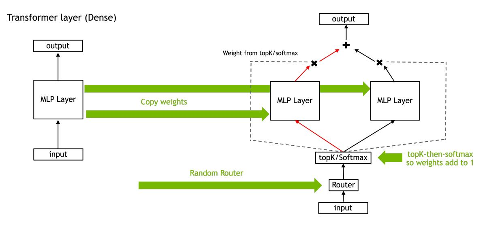
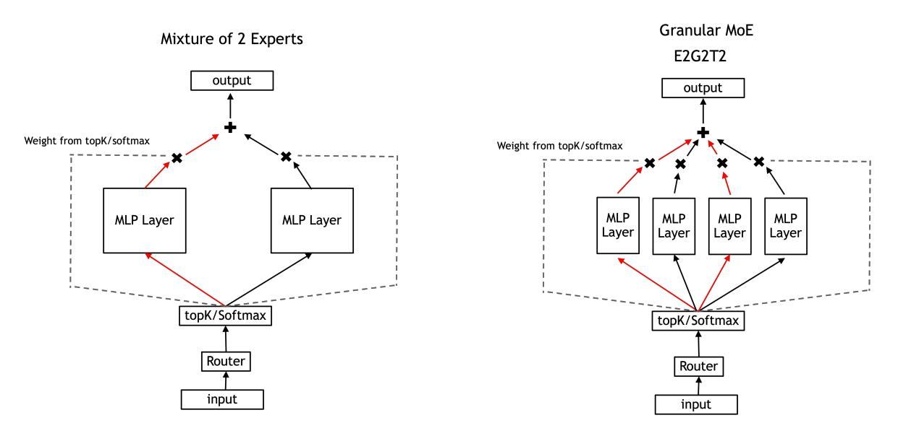
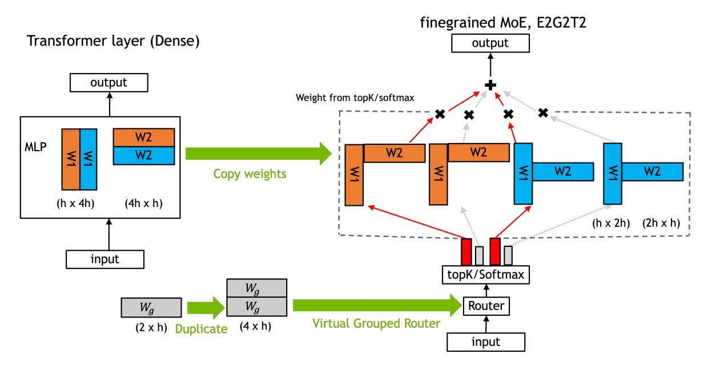

# 2 Methodology

## 2.1 Sparse Mixture of Experts

In this work, we only investigate MoEs on the MLP layer of the transformer. These layers comprise the majority of compute and treat each token individually, avoiding issues with kv-cache consistency. A routing layer routes the tokens to a subset of multiple possible MLP layers. This increases the parameter count and presumably the model capacity without necessarily increasing the amount of compute required (measured in total training FLOPs).

#### 2.1.1 Upcycling

Upcycling is the approach of converting a trained dense model into an MoE [\[15\]](#page-15-0). The most obvious way to convert a dense model into an MoE model without losing accuracy is to duplicate the MLP layer weights multiple times and use a randomized router, weighting the output of MLP layers by their probabilities

$$E_1(x) := E_2(x) \dots := E_N(x) := FFN(x)$$

$$MoE\_activation = \sum_{i=1}^{T} P_i \times E_i(x)$$
(1)

where Ei are MLP experts with router probability Pi such that Pi ∈ topK. x is the output from attention, N is the total number of experts in the MoE layer, and T is the number of experts every token is routed to (topK).

#### 2.1.2 Softmax - TopK Order

The standard MoE router formulation [\[1,](#page-14-0) [19\]](#page-15-4) performs a softmax on router logits followed by a topK (softmax-then-topK). The activations from the experts are then multiplied by the softmax probability. In this case, the weight of each expert is found using:

$$TopK(Softmax(x \cdot W_r))$$

where x is the input to the MoE block and Wr is the router.

This causes an issue with upcycling where the output of the upcycled model is not equivalent to the dense model right after upcycling when TopK < N. Even though the output of the upcycled model is

5https://github.com/NVIDIA/Megatron-LM

Figure 1: Converting pre-trained dense checkpoint into Mixture of Experts. MLP weights are duplicated to initialize the weights of the experts. The router is randomly initialized. Softmax is often applied after TopK to ensure the upcycled MoE is functionally the same as dense on the first iteration.

not equivalent to the dense model, training the model for a few steps might be able to adjust for this change.

Another way to fix this problem is to use the topK operator directly on the router logits and then only use logits of these topK experts for the softmax computation (topK-then-softmax). In this case, the weight of each expert is found using:

$$Softmax(TopK(x \cdot W_r))$$

The downside of taking this apporach is that the information contained in the absolute magnitude of the router output is lost. Also, this approach only works for topK > 1 as softmax of a single element is a constant 1 which has no gradient w.r.t the input. This technique is used in Mixtral [\[3\]](#page-14-2).

In this study, we compare upcycling with both topK-then-softmax and softmax-then-topK in topK> 1 regime to see which works better (section [3.4\)](#page-8-0).

#### 2.2 Granularity

Earlier work on MoE routed each token to a very small number of experts (topK = 1 or 2) [\[19,](#page-15-4) [5\]](#page-14-4). Routing to only one expert guarantees that the training FLOPs stay similar to the dense model, even though the MoE has more parameters. However, it has recently been suggested that increasing the number of experts to which a token is routed to, while shrinking the dimension of each expert might be a superior approach [\[20\]](#page-15-5). This approach is referred to as granular mixture of experts, shown in Figure [2.](#page-3-0)

Granularity introduces a new degree of freedom as every expert can be reduced in size. Since shrinking experts reduces FLOPs per expert, this approach allows us to increase topK by the same magnitude as the shrinking and still keep the overall FLOPs count the same. While FLOPs is only a proxy for the actual compute required to train or deploy a model, it is still useful and an easy metric to compare compute cost.

There are three hyperparameters that define a fine-grained MoE architecture. We use the nomenclature proposed in [\[20\]](#page-15-5) and add another term T to refer to topK. The three hyperparameters convey the following:

• E: Expansion rate. How many times larger is the total number of parameters in the MoE layer as compared to the dense MLP counter part. (NMoE/Ndense MLP)

- G: Granularity. How many times smaller is the expert hidden size compared with the original dense layer's FFN hidden size. (dffn/dexpert)
- T: TopK. How many experts is a token being routed to.

For example, in Figure [2,](#page-3-0) from left to right are coarse-grained MoE E2G1T1 and fine-grained MoE E2G2T2.

Figure 2: Finegrained Mixture of Experts reduces the size of each expert but activates more experts.

## 2.3 Granular Upcycling

Figure 3: An example of granular upcycling a dense layer into E2G2T2 finegrained MoE. E2G2T2 denotes 4 experts, top 2, with half intermediate size. (1) We shard MLP weights in the intermediate dimension (4h → 2h) then duplicate the shards. (2) We initialize half the router weights then duplicate them. This ensures Top2 always selects one of each MLP shard so MoE output is the same as the dense model at the start of training.

Unlike standard MoE upcycling [\[15\]](#page-15-0) where we can copy the dense MLP weights to MoE experts, granularity reduces the size of every MoE expert. This makes copying the dense MLP weights to MoE experts non-trivial. An intuitive way to upcycle a dense model into finegrained MoE would be to:

- 1. segment the dense layer into several shards (G) in the FFN dimension.
- 2. replicate each shard several times (E).
- 3. route to some experts (T) at training time.

For example, segmenting into 8 shards then replicating 8 times yields 64 experts. However, using this naive approach we found that the resulting model's loss was very high and the network did not converge to the original loss. There are two problems with this approach:

- 1. The expert output is scaled down by the router. For 8 expert top-2 model (E8G1T2), a straight forward way of upcycling is to use topK-then-softmax router which ensures that the topK probabilities sum up to 1. However, for fine-grained MoE, even when using topK-then-softmax strategy the outputs are still scaled down. For a 64 experts MoE top-8 model (E8G8T8), if using topKthen-softmax strategy, the output is scaled down by a factor of 8. If using softmax-then-topK strategy, the router probability is about 1/64 because of the random initialization. This implies that the expert outputs are scaled down by a factor of 64.
- 2. The MoE is no longer functionally similar to the dense model in the forward pass. For a coarse grained MoE, using the topK-then-softmax strategy, the upcycled model is functionally the same as dense model in the forward pass in the beginning of training. However, for fine-grained MoE, because the experts are segmented into smaller shards, the router needs to select exactly one replica from each segment in order to function the same as a dense MLP layer.

Motivated by these two observations, we propose weight scaling and virtual grouping for finegrained MoE upcycling. This approach is shown in Figure [3.](#page-3-1) We initialize the router using virtual group initialization. Virtual group initialization ensures that there is exactly one copy of every MLP shard within the router topK right after the dense model is converted into an MoE. Virtual group initialization initializes the experts and router weights such that:

- 1. each router group owns the duplicates of exactly one dense MLP shard.
- 2. all router groups have the same router weights.

A pseudo code snippet illustrating this can be found in appendix [A.](#page-16-0)

#### 2.3.1 Scaling the Weights

We found that with granular upcycling, the scaling of the network weights greatly influences the accuracy of the fine-tuned MoE model. While this scaling could be done entirely in the second linear projection of the MLP (W2 in Figure [3\)](#page-3-1), we found empirically that this works worse than scaling both the linear projection weights (W1 and W2). Equation [2](#page-5-0) calculates this scaling factor for the case of squared-relu activation which we use for our base 15B dense model.

$$MoE\_activation = \sum_{i=1}^{T} P_i \times E_i(x)$$

where Pi is the probability for the top i th expert, Ei is the corresponding expert layer, T is the topK, and x is the output from attention.

assuming approximately uniform distribution[6](#page-4-0) for iteration 0

$$P = P_1 = P_2 = ...P_T = \frac{1}{E \times G}$$

6while this is a simplifying assumption, it holds true for our most important virtual grouping case where the shrinking factor is the same as topK

$$MoE\_activation = P \times (\sum_{i=1}^{T} E_i(x))$$

So for virtual grouping,

$$MoE\_activation = \frac{1}{E \times G} (\frac{T}{G} \times dense\_activation) = \frac{T}{E \times G^2} \times dense\_activation$$

assuming squared relu activation, we normalize W1 and W2 for each expert's MLP in case of virtual grouping by:

$$\sqrt[3]{\frac{E \times G^2}{T}} \tag{2}$$

While for different activation functions a hyperparameter search for the optimal scaling of the input and output weights might be intuitively better, we find empirically that the equal weight distribution like above works just as well for our 2B models using swiglu activation. We also use this weight scaling for non-granular (a.k.a coarse-grained) MoE models and observe that it helps convergence.

