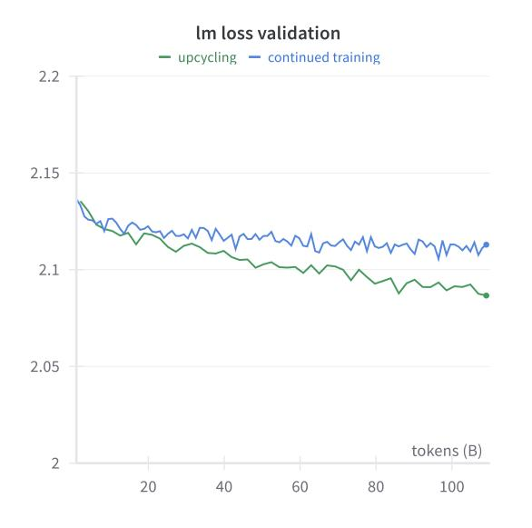
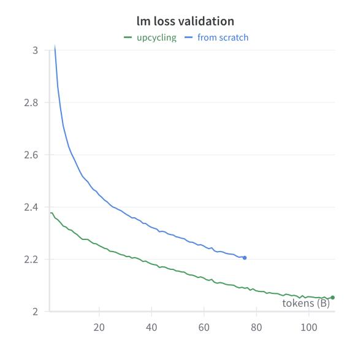
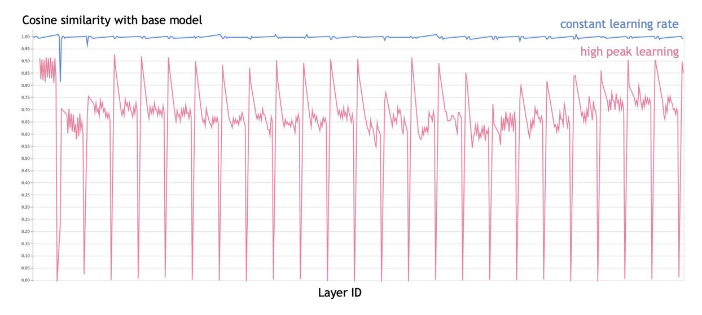
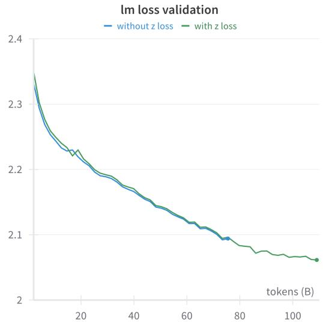
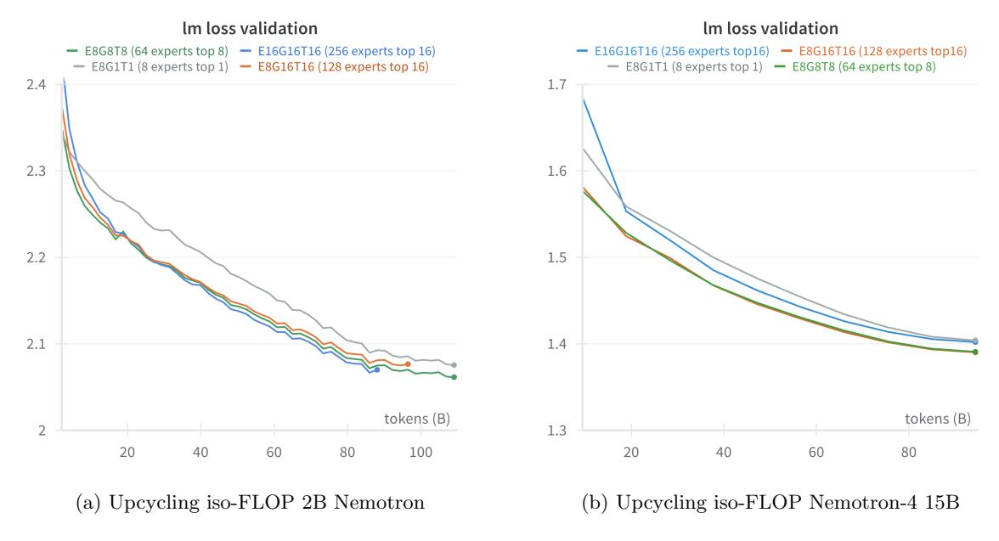
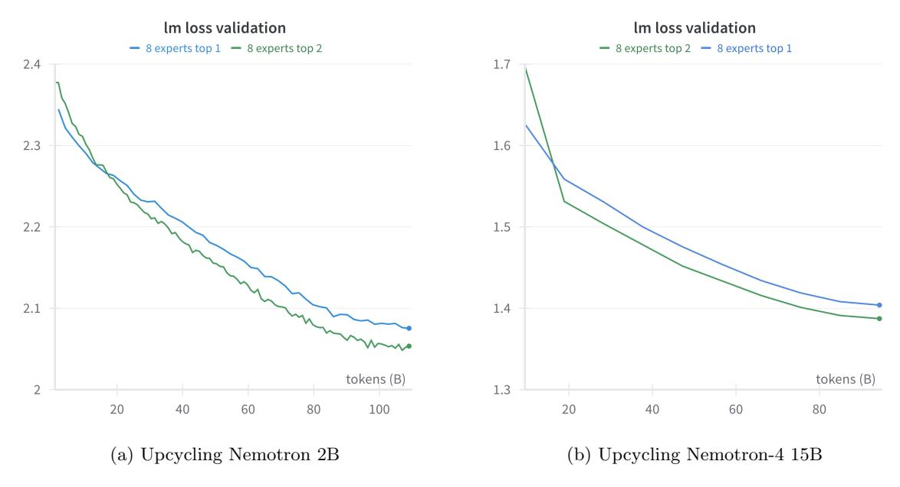
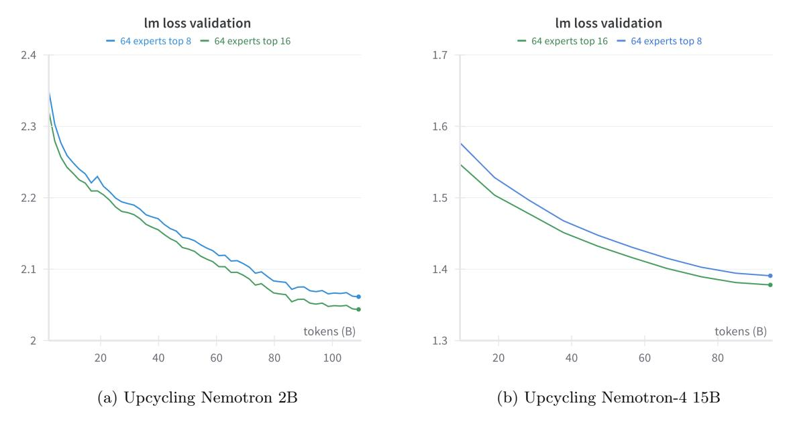
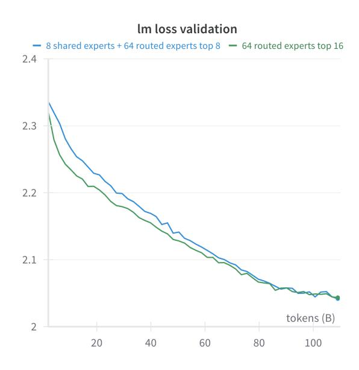

# 3 Results

Model: We do all our ablation studies on our Nemotron 2B[7](#page-5-1) and Nemotron-4 15B [\[13\]](#page-14-12) models followed by final results using a larger token count on Nemotron-4 15B. Nemotron 2B is a transformer-based decoder-only language model similar to GPT-2 and 3 [\[21\]](#page-15-6). This model was trained on 1.1T tokens using NeMo [\[22\]](#page-15-7) and Megatron-LM [\[18\]](#page-15-3). The model uses the SwiGLU activation function [\[23\]](#page-15-8), Rotary Positional Embeddings (RoPE) [\[24\]](#page-15-9), maximum sequence length of 4096, no dropout, no bias terms in all linear layers, and untied embedding and output layer. Nemotron-4 15B is a 15-billion-parameter large multilingual language model trained on 8 trillion text tokens. Both these models use a vocab size of 256K.

Data: Upcycling can be performed on either pretraining data that the pretrained dense model has seen, new unseen data, or a combination of both. In our Nemotron 2B experiments, we upcycle on pretraining data the model has seen for simplicity. For all of the ablation studies, we use 110B tokens (about 10% of the pretraining 1.1T tokens). For Nemotron-4 15B experiments, we upcycle on continued training data so that we can compare upcycling against our existing dense continued training result [\[13,](#page-14-12) [25\]](#page-15-10). While the continued training data has still been seen in pretraining, it follows a different data blending distribution. For 15B ablations, we train on 0.1T tokens (10%) of continued training data blend. For our 15B final results, we train on the full continued training data blend of 1T tokens. Validation loss is measured on 1% held-out data.

#### 3.1 Effectiveness of Upcycling

Upcycling vs. Dense Continued Training: Following previous works [\[15\]](#page-15-0), we compare upcycling vs continued training the dense Nemotron 2B model with the same amount of tokens (0.1T) under a similar learning schedule. As shown in Figure [4a,](#page-6-0) continuous training plateaus quickly while upcycling keeps improving. From continued training to upcycling, LM loss improved by 1.1%.

Upcycling vs. Training from Scratch: Figure [4b](#page-6-0) shows that upcycling achieves good improvement over training from scratch if one assumes a fixed compute budget. Upcycling is an efficient method to utilize pretrained dense model weights when the compute budget is much smaller than the pretraining compute budget. An interesting question that remains unanswered with our studies is whether it is still worth to upcycle a dense model instead of pretraining, assuming a larger compute budget. While some recent works like Skywork-MoE [\[26\]](#page-15-11) try to answer this question, we leave investigating this as a potentially interesting future direction.

#### 3.2 Learning Rate and Batch Size

#### 3.2.1 Learning Rate Schedule

We found that the learning rate schedule plays an important role in upcycling. When upcycling a dense model, the model has usually been trained for a large number of steps already and the learning

7https://huggingface.co/nvidia/GPT-2B-001

- (a) Upcycling Nemotron 2B outperforms continued training on loss
- (b) Upcycling Nemotron 2B outperforms training from scratch on loss under certain compute budget

Figure 4: Effectiveness of upcycling

rate is generally decayed during this training phase allowing the model to enter a local minimum. For example, our 2B model follows a warmup cosine decay learning rate schedule. The learning rate is warmed up to a 2e-4 peak and then decayed to 2e-5 at the end of 1.1T token training. During upcycling, it is unclear if increasing the learning rate above where pretraining ended (we call this resetting the learning rate) will improve or hurt model quality.

To find a good learning rate schedule for upcycling, we experimented with three different settings:

- Constant learning rate. We use the minimum pretraining learning rate of 2e-5 which is a typical learning rate schedule for finetuning.
- Peak learning rate 2e-4, cosine decay to 2e-5. This is the exact same learning rate schedule as pretraining, except that it decays to 2e-5 at the end of 0.1T tokens upcycling, as we only have 10% of pretraining tokens.
- Peak learning rate 1e-4, cosine decay to 2e-5. Since it's possible that using learning rate as high as pretraining can lead to catastrophic forgetting, using a lower peak learning rate might be a good option.

As shown in Figure [5,](#page-7-0) we found that while constant learning rate schedule starts off with much lower loss than the reset learning rate schedule, it eventually plateaus. The reset learning schedule gradually catches up and eventually outperforms the constant learning rate schedule. When resetting, peak learning rates of 1e-4 and 2e-4 seem to perform similarly. Interestingly, using a peak learning rate as high as pretraining (2e-4) does not lead to catastrophic forgetting.

Weights Similarity: Typically, finetuned model weights have very high cosine similarity with the base model weights. For example, Llama 2 chat model has cosine similarity close to 1 with Llama 2.

We compute cosine simimarity between an upcycled model and the original dense model layerby-layer and since MoE layer does not match with MLP, we compute cosine similarity between each expert and the orignal MLP and take the average. We finally average the cosine similarity across all layers to get a single number.

Shown in Figure [6,](#page-7-1) like in most finetuning tasks, upcycling with the minimum learning rate does not change the weights much. The cosine similarity between the MoE and base model is close to 1. By applying the reset learning schedule method, we observed the cosine similarity reduced to 0.6-0.7. This might imply that the higher learning rate helps the model escape from the dense model's local minimum, and find a superior minimum. Additionally, the high learning rate also helps the experts

Figure 5: Resetting LR to peak pre-training LR when upcycling Nemotron 2B improves accuracy.

Figure 6: Cosine similarity between upcycled MoE and base Nemotron 2B model weights. When higher learning rate is used, similarity is lower and upcycling validation loss improves.

diversify. On the other hand, small constant learning rate leads to experts being very similar to each other, which makes the model not too different from the base dense model.

#### 3.2.2 Batch Size

Aside from the learning rate, we observed that batch size also heavily affects MoE training and upcycling. We hypothesize that MoEs benefit from larger batch size than dense equivalents for two reasons:

- Since each expert receives only a portion of tokens, gradients are noisier than the dense model.
- The load balancing loss is noisier if there are fewer tokens to balance.

As shown in Figure [7,](#page-8-1) we compared batch size of 512, 1024, and 8192 (2M, 4M, and 32M tokens respectively) for upcycling the Nemotron 2B model. While the batch size of 32M tokens performs the worst, batch size of 4M tokens converges faster than 2M tokens. The training efficiency (per-GPU throughput) is also much better with larger batch sizes. Recently, Deepseek-V2 [\[8\]](#page-14-7) also used a large batch size of 9216 (more than 37M tokens) and learning rate of 2.4e-4 to pretrain MoE models.

Figure 7: Effect of batch size on validation loss when upcycling Nemotron 2B. Increasing batch size to 1024 (4M tokens) does not degrade accuracy while improving model FLOP utilization.

Figure 8: Upcycling Nemotron 2B with or without z loss does not have noticeable difference

## 3.3 Load Balancing and Regularization Loss

Load Balancing Auxiliary Loss: We used the same aux loss as described in ST-MoE [\[5\]](#page-14-4) and Switch Transformer [\[19\]](#page-15-4) and experimented with different aux loss coefficients. We found that while not using aux loss at all leads to dead experts and causes the training loss to plateau early, aux loss coefficients set too high leads to aux loss overwhelming the language modeling loss. We found aux loss coefficients between 1e-2 to 1e-3 to give the best language model loss.

Z Loss: We used the same z loss described in ST-MoE [\[5\]](#page-14-4). As shown in Figure [8,](#page-8-1) we compared upcycling with and without z loss (with a coefficient of 1e-3) and found that z loss has no impact on the final model quality.

Thus, we used an aux loss coefficient of 1e-2 and no z loss for all our experiments.

#### 3.4 Softmax TopK order

We consistently found that using softmax-then-topK works better than topK-then-softmax for upcycling. We hypothesize this is because the softmax-then-topK approach preserves the information contained in the absolute value of the router output. However, keeping the output of the original upcycled model similar to the output of the dense model is more difficult with this approach because the outputs no longer sum to one. We overcome this issue with our weight scaling method.

#### 3.5 Fixing Output Scale

We tried multiple approaches to compensate for the issue of expert outputs being scaled down. Apart from weight scaling described in Equation [2,](#page-5-0) we also experimented with the following:

Scaling the MoE output: instead of scaling the weights, we tried scaling the output of the MoE layer by a constant factor or a learnable scalar. We empirically found that neither of them work well. Post Expert Layernorm: Work on finegrained MoE scaling laws [\[20\]](#page-15-5) recommended adding a layernorm at the end of MoE layer. Typically, dense models do not have this layernorm. We tried adding the post expert layernorm during upcycling and found that while it can achieve the same effect and stop the loss from exploding, it takes a lot longer to adapt.

We compared different methods for upcycling Nemotron 2B into 64 experts top-8 fine-grained MoE (E8G8T8). The expert intermediate hidden size is 1/8 of the original FFN intermediate hidden size so that they are iso-FLOP. Our proposed weight scaling method performed the best and is also the easiest to implement, since it does not modify the model architecture.

Using equation [2,](#page-5-0) for the finegrained MoE with 64 experts top-8, the scaling factor should be 4. We tried multiple scaling factors (2x, 2.5x, 4x) and found that the scaling factor of 4 also performed the best empirically. So our weight scaling function, while not exact, helps convergence.

We also discovered that weight scaling helps upcycling standard coarse-grained MoEs as well. As shown in Figure [9,](#page-9-0) we upcycled Nemotron-4 15B into 8 experts top-1. With weight scaling, the training loss is 1.5% better than when not using weight scaling.

Figure 9: Using weight scaling helps achieve better loss when upcycling Nemotron-4 15B into 8 experts top-1 MoE

#### 3.6 Increasing Granularity

We found that increasing granularity improves loss when training with small token counts (0.1T tokens for our 15B example) since virtual grouped granular upcycling is able to achieve a better loss more quickly than the non-granular version. However, when training on much larger token regimes (≥1T tokens), we saw that granularity did not help proportionally and both granular and non-granular runs converged to similar loss values. Since these large token horizon runs required significant compute, we did not perform ablations on them.

We tried scaling up the number of experts from 8 to 256 without increasing FLOPs. On upcycling Nemotron 2B and Nemotron-4 15B, we compared 8, 64, 128, and 256 experts. We kept all these networks iso-FLOP by scaling down the expert hidden size proportionally with respect to the topK. Shown in Figure [10,](#page-10-0) on Nemotron 2B, 64 experts performed better than 8 experts. However, scaling up further to 128 or 256 brought in little benefit. Similarly, on Nemotron-4 15B, the improvement maxed out at 64 experts. Surprisingly, on upcycling Nemotron-4 15B, 256 experts performed slightly worse than 64 or 128 experts. Too many experts seemed to hurt accuracy when upcycling. We hypothesize that this is because the experts were all copies and the larger the number of experts get, it becomes difficult for the network to find new superior minima. While increasing granularity is promising, it is important to note that it comes with higher MoE permute/unpermute cost and smaller GEMM sizes. Owing to these system-level factors, we worked with both granular and non-granular recipes.

Figure 10: Increasing granularity provides diminishing benefits. We found granularity of 8 to be good for both Nemotron 2B and Nemotron-4 15B.

#### 3.7 Increasing TopK

Top-2 routing is often used with MoE models [\[3,](#page-14-2) [5\]](#page-14-4). While this increases the amount of compute required to run the model, it helps in achieving better accuracy. We compared increasing topK for both coarse-grained and fine-grained MoE upcycling. Figure [11](#page-10-1) shows that 8 experts top-2 (E8G1T2) performed better than top-1 (E8G1T1) on both upcycling Nemotron 2B and Nemotron-4 15B. On 15B, the top-2 achieved lower training loss than top-1 (1.35757 vs 1.38031). Previous works [\[5\]](#page-14-4) have shown that a tradeoff with wall clock time rather than compute is a better metric and in such cases topK greater than granularity might make more sense. This claim heavily depends on the actual implementation and we leave it as a future systems study.

Figure 11: Increasing topK from 1 to 2 improves accuracy but requires extra compute

Figure 12: E8G8T8 vs. E8G8T16 (64 experts top-8 vs top-16, 1/8 expert intermediate size). Increasing TopK also helps granular models.

## 3.8 Promoting Expert Diversity: Weight Permutation and Reinitialization

We experimented with the weight permutation and reinitialization methods proposed in Qwen 2 [\[17\]](#page-15-2). Weight permutation permutes the FFN weights before copying it into each expert. Weights reinitialization randomly reinitializes 50% of expert weights. In our experiments, we did not find any improvement with these two methods on upcycling Nemotron 2B. Due to limited compute, we did not experiment with these techniques on a larger network.

#### 3.9 Shared Experts

Figure 13: MoE with shared expert achieves similar accuracy as iso-FLOP fine-grained MoE in upcycling Nemotron 2B

We experimented with the shared experts approach proposed in Deepseek-MoE [\[16\]](#page-15-1). Shared experts are always 'on' i.e. every token is routed to the shared expert. They act like a dense layer in parallel with the MoE experts. As shown in Figure [13,](#page-11-0) we compared 8 shared experts + 64 experts top-8 which is iso-FLOP with 64 experts top-16 on Nemotron 2B. We found that shared expert performed on par with the iso-FLOP, no shared expert counterpart. We did not switch to using a shared expert since we did not see any accuracy improvement by using it.

