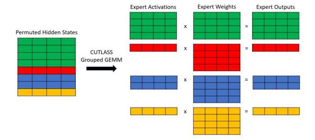

# Who Says Elephants Can't Run: Bringing Large Scale MoE Models into Cloud Scale Production

### Young Jin Kim

Microsoft youki@microsoft.com

## Rawn Henry NVIDIA

rhenry@nvidia.com

### Raffy Fahim

Microsoft raffybekheit@microsoft.com

## Hany Hassan Awadalla

Microsoft hanyh@microsoft.com

## Abstract

Mixture of Experts (MoE) models with conditional execution of sparsely activated layers have enabled training models with a much larger number of parameters. As a result, these models have achieved significantly better quality on various natural language processing tasks including machine translation. However, it remains challenging to deploy such models in real-life scenarios due to the large memory requirements and inefficient inference. In this work, we introduce a highly efficient inference framework with several optimization approaches to accelerate the computation of sparse models and cut down the memory consumption significantly. While we achieve up to 26x speed-up in terms of throughput, we also reduce the model size almost to one eighth of the original 32-bit float model by quantizing expert weights into 4-bit integers. As a result, we are able to deploy 136x larger models with 27% less cost and significantly better quality compared to the existing solutions. This enables a paradigm shift in deploying large scale multilingual MoE transformers models replacing the traditional practice of distilling teacher models into dozens of smaller models per language or task.

### 1 Introduction

Transformer models are getting larger and better on a continuous basis. The largest transformer models scale up to hundreds of billions of parameters, [\(Smith et al.,](#page-7-0) [2022\)](#page-7-0) resulting in high training and inference costs. This makes it difficult to deploy such models in any real-life scenario with reasonable latency and throughput. Mixture of Experts (MoE) models offer a more cost-effective method to scaling model sizes by using sparsely activated computations. More specifically, feed forward layers can be easily enlarged by replicating the original

weights E times where E is the number of experts. Each of these replicas is referred to as an expert, and tokens get routed to these experts depending on a gating function. Transformer models have a much larger number of parameters when utilizing these MoE layers. However, the number of flops remains comparable to their dense counterparts thanks to sub-linear scaling in computation costs [\(Shazeer](#page-7-1) [et al.,](#page-7-1) [2017\)](#page-7-1). Recently, the Mixture of Experts (MoE) architecture has been successfully utilized to scale massive large scale multilingual models [\(Lepikhin et al.,](#page-6-0) [2020\)](#page-6-0)), NLU tasks [\(Fedus et al.,](#page-6-1) [2021;](#page-6-1) [Zoph et al.,](#page-7-2) [2022\)](#page-7-2) and multilingual multitask models [\(Kim et al.,](#page-6-2) [2021\)](#page-6-2).

MoE offers the benefits of scaling the model to gain better accuracy without paying the huge compute cost of massive dense models. However, large scale MoE models bring their own set of unique challenges to get efficient training and inference methods. Most of the previous work focused on improving training efficiency and throughput [\(Fe](#page-6-1)[dus et al.,](#page-6-1) [2021;](#page-6-1) [Kim et al.,](#page-6-2) [2021\)](#page-6-2). In this work, we focus on optimizing MoE models inference and latency since it is crucial to harvest the benefits of such models in real-life scenarios.

*Production-scale Multilingual Machine Translation systems:* in this work, we explore deploying MoE models for large scale Multilingual Machine Translation systems to benefit from large language models, while maintaining reasonable serving cost. Multilingual large scale systems are already very attractive due to multiple aspects. First, they benefit modeling since they allow better accuracy, especially through transfer learning across languages. Additionally, they improve deployment and serving since we can replace dozens of models with a single model that is able to serve many languages at the same time. Nevertheless, we need the inference to be highly optimized to make inference costefficient. Despite these benefits, shipping such multilingual models brings a new challenge, because they usually require a much larger model capacity in terms of the number of parameters and the computation. The MoE model architecture could be a promising solution given its sub-linear or constant FLOPs increase in terms of the number of model parameters. But, the large memory consumption issue still remains.

In this work, we show how to enable deploying a single MoE model that can serve many languages replacing dozens of traditional models while improving accuracy and maintaining latency, throughput and cost efficiency. We set the goal for this work to match latency and throughput of a distilled small model deployed on CPU while achieving better serving cost.

It is worth noting that while the optimizations presented here are applied to MoE encoder-decoder architecture for multilingual machine translation task, they are applicable to other architectures and tasks without any loss of generality. Given the recent success of MoE models on wide set of NLU and NLG tasks [\(Fedus et al.,](#page-6-1) [2021;](#page-6-1) [Zoph et al.,](#page-7-2) [2022\)](#page-7-2), we believe the optimization presented in this work will be equally enabling to other tasks as it is for machine translation.

### 2 Challenges and Contributions

### 2.1 MoE Inference challenge

Even though the MoE architecture in theory requires much less computation with larger number of parameters, it adds several computations such as token routing and all-to-all communication which could be a significant hit to the training throughput as much as 12% for a single node as shown in [\(Liu](#page-7-3) [et al.,](#page-7-3) [2022\)](#page-7-3). In addition, it significantly increases the amount of memory traffic in the MoE layers. So far, previous studies focused more on the training efficiency of those MoE models and there has not been a solution to deploy this kind of models into the real-time applications. At inference time, we have observed the naive implementation of MoE models could be up to 30 times slower than its dense counterpart with the same embedding and hidden dimensions. To achieve a reasonable deployment cost, it is critical to lower the inference cost by increasing throughput and reducing the latency. Since MoE layers are not widely optimized for the inference scenarios, it is challenging to build

efficient runtime environment in terms of computation and memory consumption.

Recently, [\(Rajbhandari et al.,](#page-7-4) [2022\)](#page-7-4) introduced several approaches to improve inference of MoE models focusing on very large scale models larger than 100B parameters and decoding on multiple GPUs. When the model size increases beyond the memory limit of a single GPU, multiple GPUs can be used together for a single inference by splitting the model weights across different GPUs. While multi-gpu can reduce latency and is required to serve extremely large models, it introduces significant communication overhead and makes it more difficult to scale up and down the number of instances based on traffic. Therefore, even though multiple GPUs could bring much larger models into production, we focus on the single GPU inference scenario due to its cost efficiency with reasonably sized models. It is worth noting that the optimization we are presenting here for single GPU can be utilized for larger models on several GPUs as well. However, this is beyond the scope of this paper.

### 2.2 Inference Optimization Contributions

In this paper, we show how to reduce the memory requirements to deploy largest possible model on a single GPU, which avoids costly all-to-all collectives. In addition, we optimized routing efficiency for GPUs and implemented batch pruning. We describe how we extend NVIDIA's FasterTransformer[1](#page-1-0) inference framework to support the MoE model architecture in a real world deployment scenario:

- We present how we utilize the parallel primitives in the CUTLASS[2](#page-1-1) and CUB [3](#page-1-2) libraries to efficiently express token routing and the batched matrix multiply required for MoE.
- We propose a new GEMM (GEneral Matrix Multiply) which can consume 4-bit/8-bit quantized weights and perform float math. The new GEMM works as drop-in replacements of normal feedforward layers without having additional logic to handle quantization/dequantization of activations. We also show that 4/8 bit weight-only quantization preserves the accuracy without any additional algorithms.

<span id="page-1-0"></span><sup>1</sup> <https://github.com/NVIDIA/FasterTransformer>

<span id="page-1-1"></span><sup>2</sup> <https://github.com/NVIDIA/cutlass>

<span id="page-1-2"></span><sup>3</sup> <https://github.com/NVIDIA/cub>

• We implement an effective batch pruning algorithm for MoE layers to make the search algorithm on the decoder very efficient.

#### 2.3 FasterTransformer overview

We build our MoE optimization over NVIDIA's FasterTransfomer, a highly optimized open source inference engine for transformer models. Faster-Transformer implements a highly optimized transformer layers for both the encoder and decoder for inference which is built on top of CUDA, cuBLAS, cuBLASLt and C++. FasterTransformer supports seamless integration with Triton Inference server [4](#page-2-0) which enabled us to deploy our models in scalable large scale cloud environment.

We have extended FasterTransformer to support DeepSpeed MoE models[\(Kim et al.,](#page-6-2) [2021\)](#page-6-2) and added support for Transformer with Untied Positional Encoding (TUPE) [\(Ke et al.,](#page-6-3) [2020\)](#page-6-3) attention, gate routing and efficient computation of MoE layers, including batch pruning in those layers.

## 3 MoE Inference Optimizations

#### 3.1 Model architecture

MoE showed tremendous success with encoderdecoder model architecture in Multilingual Machine Translation [\(Lepikhin et al.,](#page-6-0) [2020;](#page-6-0) [Kim et al.,](#page-6-2) [2021\)](#page-6-2), and in Natural Language understanding [\(Fe](#page-6-1)[dus et al.,](#page-6-1) [2021;](#page-6-1) [Zoph et al.,](#page-7-2) [2022\)](#page-7-2). Therefore, in this work we focus on the encoder-decoder architecture without loss of generality since the optimization is directly applicable to encoder-only and decoder-only models as well.

We train an encoder-decoder model for machine translation with deep encoder and shallow decoder architecture as proposed in [\(Kim et al.,](#page-6-4) [2019;](#page-6-4) [Ka](#page-6-5)[sai et al.,](#page-6-5) [2020\)](#page-6-5). For a given batch of input sentences, the encoder is executed only once while the decoder is executed multiple times with a beam search algorithm per token. The auto-regressive execution of the decoder is usually the performance bottleneck. Therefore, utilizing a shallow decoder partially mitigates that effect. Empirically, we have found that using half number of decoder layers than the number of encoder layers gives a good tradeoff between quality and performance. For the most efficient MoE layer execution, we use top-1 gating algorithm proposed in Switch transformers [\(Fedus](#page-6-1) [et al.,](#page-6-1) [2021\)](#page-6-1). At every other layer, MoE layer is used instead of the plain feedforward layer.

We use embedding dimension of 1024, the positional and word correlations are computed separately and added together in the self attention module (TUPE) [\(Ke et al.,](#page-6-3) [2020\)](#page-6-3). The feed-forward hidden dimension is 4096 with 24 encoder layers and 12 decoder layers as proposed in [\(Kim et al.,](#page-6-2) [2021\)](#page-6-2). This model configuration satisfies the deep encoder and shallow decoder design and the model weights fit well into the GPU memory without tensor slicing model parallelism [\(Shazeer et al.,](#page-7-5) [2018\)](#page-7-5). The tensor slicing approach increases communication overheads and could potentially introduce training instability issues. In the production setting, we choose a model building pipeline which could minimize such instability. On the other hand, expert parallelism is preferred over tensor slicing model parallelism because an atomic layer operation such as a feedforward layer is executed inside one GPU. Therefore, we increase the number of model parameters by adding more experts. With the size of the layers and the number of layers, the total number of parameters is roughly 5 billion when 32 experts are used in the MoE layers. With half precision floating point (fp16), this is about 10 GB which can fit on a single 16 GB GPU.

### 3.2 Multilingual Machine Translation Model

The traditional Machine Translation deployment paradigm generally follows the teacher-student model. Where several teachers are being distilled into a very small student model that get deployed on CPU [\(Kim et al.,](#page-6-4) [2019\)](#page-6-4). For instance, deploying 100 languages translation system, would require training, distilling and deploying at least 200 of such models. Each model is trained individually for a particular language pair. This is not scalable since each individual model needs to go through various model compression steps to be deployed on CPUs with relatively low FLOPs numbers. This not only hinders scalable model building, but also knowledge sharing and transfer between different language pairs and tasks. Multilingual training approaches have been utilized to overcome this problem. However, shipping these multilingual models brings a new challenge since such models usually require much larger capacity in terms of the number of parameters and the computation.

In this work, we use a multilingual MT system trained on 10 language pairs and can be used in place of individual systems per language pair. The model is trained using production scale training

<span id="page-2-0"></span><sup>4</sup> https://github.com/triton-inference-server/server

<span id="page-3-1"></span>

Figure 1: Shows the computation performed by CUT-LASS Grouped GEMM. Each color is a sub-matrix for a particular expert, with the matrix multiplies for each expert happening in parallel. If the yellow sentence was finished, it would be omitted from the computation with batch-pruning enabled. This would completely remove the need to load the weight matrix for the yellow expert.

data of up to ∼ 4B training sentence pairs with a vocabulary of 128K using Sentence Piece [5](#page-3-0)

## <span id="page-3-3"></span>3.3 Optimized GPU kernel design

One key factor to get an optimal performance with massive CUDA cores is to have efficient parallel algorithms for various additional operations for MoE. In MoE layers, each row in the input activation must get routed to a specific expert weight matrix, depending on a top-k gating function. We implement this routing as a GPU friendly radix sort using NVIDIA's highly efficient CUB library.

In this case, each row in the activation matrix is a token to be translated. The top-k gating function outputs a list with k (expert\_scale, expert\_idx) tuples for each input token. Thus, for top-1 gating (as is done in our case), the function outputs a single tuple for every row of the activation matrix.

In order to perform the routing, we first append the index for each row to the end of the tuple giving a tuple of (expert\_scale, expert\_idx, row\_idx). Then, we sort the tuple using expert\_idx as the keys in order to group all rows that will be processed by the same expert\_idx together. The row\_idx entry from the sorted tuples are then used to permute the original activation matrix in global memory to a layout where all rows routed to the same expert are laid out contiguously in memory.

In order to finalize the routing, we view each group of rows assigned to a particular expert as its own sub-matrix and compute pointers to the start of these sub-matrices. We then pair each sub-matrix pointer with pointers to the weights and biases for

the expert they are routed to, and use CUTLASS Grouped GEMM to compute all of these matrix multiplies in parallel using a single kernel. Figure [1](#page-3-1) shows the computation performed by CUTLASS.

Finally, we un-permute the rows to their original ordering and apply the expert\_scale to each row before passing the output of the MoE module to the other parts of the network.

#### 3.4 Expert quantization with 4-bit and 8-bit

We quantize the MoE weights for two reasons:

- 1. MoE weights are extremely large which limits the size of the models that can fit on the common 16 GB inference cards such as T4.
- 2. MoE matrix multiplies require loading the weights for several different experts which results in them being memory bound.

We do not use Quantization Aware Training (QAT) [\(Wu et al.,](#page-7-6) [2020\)](#page-7-6), because our quantization approach does not degrade model performance. QAT is usually used when there exists a noticeable performance degradation from quantization. Also, we focus on quantizing expert weights only, because they are contributing to more than 90% of entire model weights thanks to the special property of MoE model size scaling. We get much larger model mostly from the expert parameters in MoE layers [\(Shazeer et al.,](#page-7-1) [2017\)](#page-7-1).

### Algorithm 1: Weight dequantize

```
Input :E - Number of Experts
  Input :W - quantized weights of shape (E, M, N)
  Input :S - FP16 scales of shape (E, 1, N)
  Output :FP16 dequantized weights
1 Wdq ← NewMatrix(E, M, N)
2 for e ← 0 to E − 1 do
3 for m ← 0 to M − 1 do
4 for n ← 0 to N − 1 do
5 f = IntToFloat(W[e, m, n])
6 Wdq[e, m, n] = f ∗ S[e, n]
7 end for
8 end for
9 end for
10 return Wdq
```

All activations and biases are kept as FP16 and only the expert weight matrices are quantized. As a result, we do not require any post-training calibration (because we don't need scales for the activations) which makes this recipe easy to apply to several language families. We perform symmetric, range-based per-channel quantization on each expert weight. This means that for expert weights of

<span id="page-3-0"></span><sup>5</sup> https://github.com/google/sentencepiece

shape (E, M, N) where E is the number of experts and M and N are arbitrary dimensions, we produce scales of shape (E, 1, N). The same quantization method is used for int4 and int8. During inference, we dequantize the weights to FP16 and perform our matrix multiplies using floating point computations. Algorithm [1](#page-3-2) shows the dequantization performed during inference.

One option for implementing the GEMM + Dequantize would be to write a separate kernel to dequantize the weights before the MoE GEMM. However, this would actually increase the amount of memory traffic as we would add a read of W and a write to Wdq as shown in Algorithm [1.](#page-3-2) As a result, we decided to take advantage of the flexibility of CUTLASS and fuse the dequantize step into the GEMM kernel. After profiling, we realized that the conversion from int to float (line 5 in Algorithm [1\)](#page-3-2) was slower than anticipated. In order to improve this, we replaced the native int to float conversion (I2F) with a series of high throughput ALU and FP16 instructions which improved the performance of our fused GEMM + Dequantize.

#### 3.4.1 Quantization Optimization

The conversion optimization mentioned above produces exact results to the native I2F conversions. It relies on two key observations.

- 1. For any FP16 number X where 1024 ≤ X < 2048, 1024 will be represented exactly in the exponent bits and int(X − 1024) will be directly stored in the mantissa. For example, FP16 representation of 1027 (represented as 0x6403) has the integer 3 stored directly in the mantissa bits of its representation.
- 2. For any integer 0 ≤ Y < 1024, we can construct the FP16 representation of Y + 1024 by setting the exponent to 1024 and storing Y in the FP16 mantissa. This is easily done by performing 0x6400 | Y , since 0x6400 is the hex representation of 1024 in FP16.

Our optimization exploits these observations to quickly convert int4s or int8s and FP16. After we quantize the weights, we add 128 to int8 weights and 8 to int4 weights to make them all unsigned. We refer to these weights as W+. This is not strictly necessary, but removes the need to perform sign extension logic.

### 3.4.2 Optimized 8-bit Dequantize

In order to best utilize the hardware, we convert int8s to FP16s two at a time, leveraging the fact that 2 FP16 elements can fit in a 32-bit register. This is done as follows:

- 1. We load 4 int8 values, [e0, e1, e2, e3] from W<sup>+</sup> into a single 32-bit register.
- 2. We then create a second 32-bit register, R1, that stores the FP16 representation of [e<sup>0</sup> + 1024, e<sup>1</sup> + 1024] leveraging observation (2).
- 3. Next, we use float math to subtract [1152, 1152] from R1. This subtraction is due to the fact that we must subtract 1024 from each number in R<sup>1</sup> convert e<sup>0</sup> and e<sup>1</sup> to FP16. Then, we must further subtract 128 from each number to obtain the float representation of the original, signed integer.
- 4. Lastly, we repeat steps 2 and 3 for e<sup>2</sup> and e3.

### 3.4.3 Optimized 4-bit Dequantize

We change the layout of the weights to reduce the number of logic instructions needed to construct the FP16s [e<sup>i</sup> + 1024, ei+1 + 1024] . Thus, for int4, we change the layout of W<sup>+</sup> to reorder groups of 8 elements as follows:

$$[e_0, e_1, e_2, e_3, e_4, e_5, e_6, e_7] \rightarrow [e_0, e_2, e_4, e_6, e_1, e_3, e_5, e_7]$$

With this new layout, the idea for int4 is similar to what was previously described for int8. Of course, we must now subtract [1032, 1032] to recover the original, signed integer as fp16. We must also iterate 4 times since 1 32-bit register holds 8 int4s and conversion happens 2 at a time.

#### 3.5 MoE Batch Pruning

Batch pruning refers to the act of removing sentences from a batch dynamically as soon as they are done translating. We observed that this speeds up MoE layers as it can prevent the loading of entire expert weights, reducing the amount of memory traffic required in these memory bound layers.

In order to implement batch pruning in the MoE layers, we make a simple modification to the gating function so that it assigns a large expert\_idx to all finished sentences. This causes all finished sentences to be moved to the end of the permuted activation matrix in the routing step. To complete

<span id="page-5-0"></span>Table 1: Throughput of quanitzed MoE GEMMs normalized against the throughput of the FP16 MoE Gemm. The number of active experts is the number of experts that receive tokens from routing. The matrix shapes for the GEMM C = A @ B are A=mx1024, B=1024x4096, where m is different for each expert. The total number of tokens is set to 40 since this is close to what the decoder computes in our inference environment.

| Active Experts | FP16 | Int8 native I2F | Int8 optimized I2F | Int4 optimized I2F |
|----------------|------|-----------------|--------------------|--------------------|
| 1              | 1    | 1.05            | 1.28               | 1.24               |
| 4              | 1    | 1.01            | 1.21               | 1.28               |
| 8              | 1    | 1.34            | 1.21               | 1.57               |
| 16             | 1    | 1.40            | 1.39               | 1.73               |
| 24             | 1    | 1.40            | 1.49               | 1.78               |
| 32             | 1    | 1.46            | 1.59               | 1.85               |
| GEOMEAN        | 1    | 1.26            | 1.35               | 1.56               |

the pruning, we simply keep track of the total number of active tokens and only process the first active\_tokens rows of the permuted activation matrix mentioned in section [3.3.](#page-3-3)

### 4 Results and discussion

All experiments in this section are run on a single NVIDIA PCIE V100 running inside a docker container running Ubuntu 20.04 and CUDA 11.6. All code is compiled with nvcc and gcc/g++ 9.3.

We run our experiments considering an encoderdecoder MoE model with 32 experts with TUPE [\(Ke et al.,](#page-6-3) [2020\)](#page-6-3), similar to the setup in [\(Kim et al.,](#page-6-2) [2021\)](#page-6-2) but with a vocabulary size of 128k. All throughput metrics measure the time to translate 1000 tokenized English sentences (∼ 40K tokens) to German (en-de) or vice-versa (de-en) and record the total number of input tokens translated per second. BLEU metrics are reported on the same data set.

#### 4.1 Speed-up and Cost-Effectiveness

We measure the improvement of our batch pruning optimization by comparing the throughput with and without that optimization. We found that we achieve up to 1.14× speed up relative to our optimized baseline without batch pruning.

INT8/INT4 GEMM Performance. First, Table [1](#page-5-0) shows a performance comparison for the FP16 GEMM compared to fused GEMM + Dequantize with native I2F and our optimized I2F sequence for INT8. Our INT4 implementation only supports the optimized I2F sequence. Depending on the number of experts, INT8 and INT4 could accelerate MoE computation up to 59% and 85%, respectively.

INT8/INT4 Quality Impact. We also consider the impact of INT8 and INT4 expert quantization on BLEU scores, we observe negligible translation quality degradation when quantizing model weights. Table [2](#page-5-1) shows the change in BLEU compared to FP16 after applying quantization.

End-to-end Performance Improvements. Table [3](#page-6-6) shows our machine translation experiments for EN-DE, with different batch sizes and different quantization schemes and reports both the throughput of our PyTorch and Faster Transformer implementations. Compared to the Torch-FP16 baselines, the optimizations applied achieve significant speed-up across different settings.

Cost Comparison. Table [4](#page-6-7) shows the deployment cost comparison between the MoE models and smaller models optimized for CPU deployment [\(Kim et al.,](#page-6-4) [2019\)](#page-6-4). The cost of deploying MoE models which are 136x larger on CPU is more than 100 times of the cost of deploying smaller models on CPU. However, the optimized large MoE models on GPU cost less than the current CPU model deployment with smaller models.

<span id="page-5-1"></span>Table 2: BLEU differences from INT8 and INT4 weight-only compared to the FP16 baseline.

|                                    | Beam 1 ∆ BLEU |        |  |
|------------------------------------|---------------|--------|--|
| Language Pair                      | INT8          | INT4   |  |
| EN-DE (Beam 1)                     | -0.028        | -0.052 |  |
| EN-DE (Beam 2)                     | 0.051         | -0.180 |  |
| DE-EN (Beam 1)                     | -0.084        | 0.044  |  |
| DE-EN (Beam 2)                     | -0.027        | -0.031 |  |
| Avg. of 10 language pairs (Beam 2) | -0.007        | -0.167 |  |

## 5 Conclusions and Future Work

This paper describes how to make large MoE models cost-efficient on a single GPU in a real-world inference environment. The final implementation achieves a speedup of up to 26X over PyTorch baseline. Our GPU MoE implementation allows serving much larger and higher-quality models compared to dense models on CPUs without increasing the cost of serving. We consider two main avenues for future work. We are currently working on improving our fused GEMM + Dequantize kernel to enable the use of fully vectorized 16 byte loads on the weight matrix. In addition, we plan to explore deploying even larger models with distributed inference in the future in a cost-efficient way.

<span id="page-6-6"></span>Table 3: Throughputs for beam=1 and beam=2 for varying batch sizes. Throughput is measured as input tokens processed per second. The precisions (FT-INT8 and FT-INT4) in the table refer to the quantization applied to the MoE weights. *Torch-FP16* columns show the throughput numbers when we run the model with PyTorch v1.10 using FP16 model weights.

| Batch Size | Beam=1 Input tokens processed/sec |         |         |         | Beam=2 Input tokens processed/sec |         |         |         |
|------------|-----------------------------------|---------|---------|---------|-----------------------------------|---------|---------|---------|
|            | Torch-FP16                        | FT-FP16 | FT-INT8 | FT-INT4 | Torch-FP16                        | FT-FP16 | FT-INT8 | FT-INT4 |
| 1          | 16                                | 388     | 401     | 400     | 14                                | 351     | 361     | 361     |
| 8          | 70                                | 1594    | 1639    | 1662    | 65                                | 1453    | 1507    | 1518    |
| 20         | 150                               | 3025    | 3178    | 3247    | 139                               | 2571    | 2719    | 2803    |
| 32         | 214                               | 4008    | 4264    | 4379    | 202                               | 2960    | 3137    | 3239    |
| 64         | 379                               | 5371    | 5706    | 5935    | 349                               | 4333    | 4578    | 4746    |
| 96         | 485                               | 6689    | 7101    | 7483    | 440                               | 5062    | 5384    | 5605    |

<span id="page-6-7"></span>Table 4: Deployment cost comparison. We show the most cost-effective throughputs under our 1s latency budget.

| Hardware     | Parameters | Batch size | Price (East US)           | Latency (ms) | Throughput (words/sec) | Monthly USD/token |
|--------------|------------|------------|---------------------------|--------------|------------------------|-------------------|
| CPU (AVX512) | 0.04 B     | 1          | \$587.65 (F16s)           | 75           | 351                    | 0.209             |
| CPU (AVX512) | 5.32 B     | 1          | \$587.65 (F16s)           | 1080         | 26                     | 22.602            |
| NVIDIA T4    | 5.32 B     | 20         | \$390.55<br>(NC4as T4 v3) | 421          | 1565                   | 0.250             |
| NVIDIA T4    | 5.32 B     | 64         | \$390.55<br>(NC4as T4 v3) | 824          | 2560                   | 0.153             |

### Ethics Statement

The authors have put the best effort to comply with the [ACL Ethics Policy.](https://www.aclweb.org/portal/content/acl-code-ethics) For the experiments, we have used WMT public domain datasets and respected the license policy for our usage.

### Acknowledgements

We thank the Microsoft Z-Code team and the Microsoft Translator team for the great effort to push the limit of the production quality in machine translation and to quickly adopt the state-of-the-art Mixture of Experts models into the cloud-scale production. We also thank the Microsoft DeepSpeed team for the collaboration on more efficient and scalable Mixture of Experts architecture and library development. Additionally, we are deeply grateful for the amazing work of the NVIDIA CUTLASS team which developed grouped GEMM kernels which were crucial to get good performance with Mixture of Experts. We also thank the CUTLASS team for answering all of our questions to help us implement efficient kernels that handle GEMMs with different input types. Lastly, we thank the NVIDIA Faster-Transformer team for their help with integrating our Mixture of Experts implementation into their efficient transformer inference framework.

### References

<span id="page-6-1"></span>William Fedus, Barret Zoph, and Noam Shazeer. 2021. Switch transformers: Scaling to trillion parameter models with simple and efficient sparsity.

<span id="page-6-5"></span>Jungo Kasai, Nikolaos Pappas, Hao Peng, James Cross, and Noah A Smith. 2020. Deep encoder, shallow decoder: Reevaluating non-autoregressive machine translation. *arXiv preprint arXiv:2006.10369*.

<span id="page-6-3"></span>Guolin Ke, Di He, and Tie-Yan Liu. 2020. [Rethinking](http://arxiv.org/abs/2006.15595) [positional encoding in language pre-training.](http://arxiv.org/abs/2006.15595) *CoRR*, abs/2006.15595.

<span id="page-6-2"></span>Young Jin Kim, Ammar Ahmad Awan, Alexandre Muzio, Andres Felipe Cruz Salinas, Liyang Lu, Amr Hendy, Samyam Rajbhandari, Yuxiong He, and Hany Hassan Awadalla. 2021. Scalable and efficient moe training for multitask multilingual models. *arXiv preprint arXiv:2109.10465*.

<span id="page-6-4"></span>Young Jin Kim, Marcin Junczys-Dowmunt, Hany Hassan, Alham Fikri Aji, Kenneth Heafield, Roman Grundkiewicz, and Nikolay Bogoychev. 2019. From research to production and back: Ludicrously fast neural machine translation. In *Proceedings of the 3rd Workshop on Neural Generation and Translation*, pages 280–288.

<span id="page-6-0"></span>Dmitry Lepikhin, HyoukJoong Lee, Yuanzhong Xu, Dehao Chen, Orhan Firat, Yanping Huang, Maxim Krikun, Noam Shazeer, and Zhifeng Chen. 2020.

- Gshard: Scaling giant models with conditional computation and automatic sharding. *arXiv preprint arXiv:2006.16668*.
- <span id="page-7-3"></span>Rui Liu, Young Jin Kim, Alexandre Muzio, and Hany Hassan. 2022. Gating dropout: Communicationefficient regularization for sparsely activated transformers. In *International Conference on Machine Learning*, pages 13782–13792. PMLR.
- <span id="page-7-4"></span>Samyam Rajbhandari, Conglong Li, Zhewei Yao, Minjia Zhang, Reza Yazdani Aminabadi, Ammar Ahmad Awan, Jeff Rasley, and Yuxiong He. 2022. [Deepspeed-moe: Advancing mixture-of-experts in](https://doi.org/10.48550/ARXIV.2201.05596)[ference and training to power next-generation ai](https://doi.org/10.48550/ARXIV.2201.05596) [scale.](https://doi.org/10.48550/ARXIV.2201.05596)
- <span id="page-7-5"></span>Noam Shazeer, Youlong Cheng, Niki Parmar, Dustin Tran, Ashish Vaswani, Penporn Koanantakool, Peter Hawkins, HyoukJoong Lee, Mingsheng Hong, Cliff Young, et al. 2018. Mesh-tensorflow: Deep learning for supercomputers. *Advances in neural information processing systems*, 31.
- <span id="page-7-1"></span>Noam Shazeer, Azalia Mirhoseini, Krzysztof Maziarz, Andy Davis, Quoc Le, Geoffrey Hinton, and Jeff Dean. 2017. Outrageously large neural networks: The sparsely-gated mixture-of-experts layer. *arXiv preprint arXiv:1701.06538*.
- <span id="page-7-0"></span>Shaden Smith, Mostofa Patwary, Brandon Norick, Patrick LeGresley, Samyam Rajbhandari, Jared Casper, Zhun Liu, Shrimai Prabhumoye, George Zerveas, Vijay Korthikanti, Elton Zhang, Rewon Child, Reza Yazdani Aminabadi, Julie Bernauer, Xia Song, Mohammad Shoeybi, Yuxiong He, Michael Houston, Saurabh Tiwary, and Bryan Catanzaro. 2022. [Using deepspeed and megatron to train](https://doi.org/10.48550/ARXIV.2201.11990) [megatron-turing nlg 530b, a large-scale generative](https://doi.org/10.48550/ARXIV.2201.11990) [language model.](https://doi.org/10.48550/ARXIV.2201.11990)
- <span id="page-7-6"></span>Hao Wu, Patrick Judd, Xiaojie Zhang, Mikhail Isaev, and Paulius Micikevicius. 2020. Integer quantization for deep learning inference: Principles and empirical evaluation. *arXiv preprint arXiv:2004.09602*.
- <span id="page-7-2"></span>Barret Zoph, Irwan Bello, Sameer Kumar, Nan Du, Yanping Huang, Jeff Dean, Noam Shazeer, and William Fedus. 2022. [St-moe: Designing stable and](https://doi.org/10.48550/ARXIV.2202.08906) [transferable sparse expert models.](https://doi.org/10.48550/ARXIV.2202.08906)