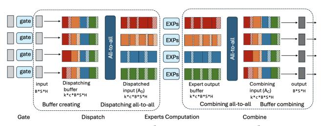
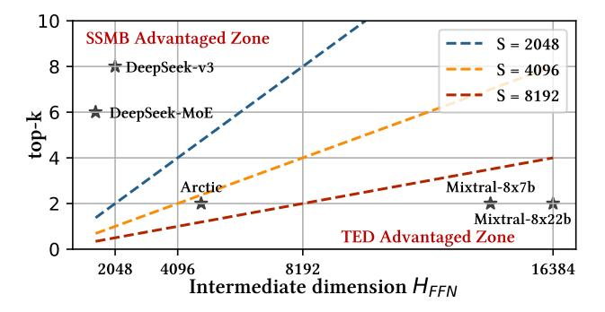
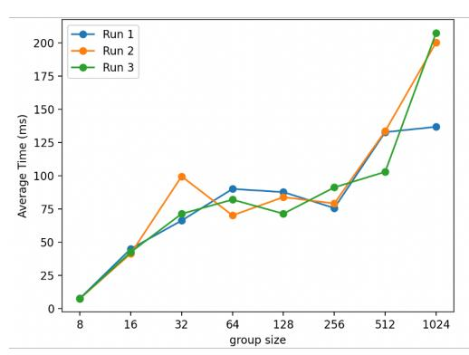
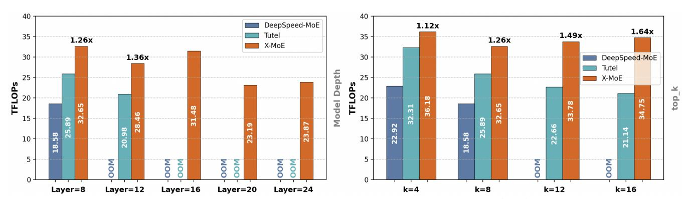

# B.1 Conventional MoE Pipelines with Zero-Padding

Conventional MoE training frameworks implement each stage of the MoE pipeline, as depicted in Fig. 16, via fast batched matrix multiplication (matmul) primitives. However, these primitives place a constraint: requiring the same number of tokens routed to each expert, which does not hold during training. To handle the dynamic assignment of tokens to experts, these frameworks introduce an *expert-capcity* factor, C. When token counts fall short of C, expert buffers are zero-padded, and when they exceed C, they are dropped, resulting in equal sized expert input-buffers.

Figure 16: DeepSpeed-MoE training pipeline.

Gating. During the gating stage, a dispatching mask, dispatch\_mask of size [S, E, C] is constructed. The entry dispatch\_mask[t, e, c] is either 1 or 0 indicating if the  $t^{th}$  token is routed to the  $c^{th}$  position in expert e's buffer. A token-dropping mask is applied over dispatch\_mask to additionally drop tokens.

Dispatch, MLP and Combine. Each of the dispatch, MLP and combine stages leverage matmuls on input token-buffers to process tokens. First, during the dispatch stage, each worker uses an einsum operation on the dispatching mask and input tokens to correctly place each token into its respective experts buffers. The expert buffers are [E, C, H]-sized. If less than C tokens are placed in an expert's buffer, the unused slots are zero-padded. Figure 2 illustrates the dispatch process and how zero-padding is introduced into an expert's input-buffer at this stage. Next, an even all-to-all communication exchanges token buffers across devices, correctly

routing each token to the devices its experts reside on. Each expert then operates on its input token-buffers in parallel. Finally, another all-to-all re-exchanges the tokens to their original device to generate the final output of the layer. Importantly, the zero-padding introduced in the dispatch stage is retained across each all-to-all and expert compute. This increases both the communication volume and activation memory of MoE training.

#### **B.2** PFT Construction

The PFT construction routine proceeds in two stages. In the first stage, we flatten and sort the incoming top\_experts array (lines 11-12), which contains the token to expert assignments generated by the gating function. In the second stage, we determine which tokens are dropped (lines 15-26); using this information, we construct the ERI-arrays by pruning out the dropped tokens from the unfiltered token\_ids and expert\_ids (lines 25-26). Our token dropping strategy is parameterized by a variable: max\_token\_count, indicating the maximum number of tokens a worker can route to an expert. This parameter is decided prior to training by the user. We use this to select the top max\_token\_count tokens per expert in gateout (the [S, H]-sized token-buffer output of the gating kernel), ranked by their respective combine\_weights. This retains at-most max\_token\_count \* E tokens. We achieve this by first flattening and sorting the top\_experts array according to their respective combine\_weights (Listing 1 lines 15-17). Then, we one-hot-encode the last dimension, forming one\_hot\_enc (line 19). one\_hot\_enc[i, j] is either 1 or 0, indicating whether token i is routed to expert j or not respectively. Next, we cumulatively sum across the inner dimension, producing rank\_in\_expert (line 20). Here, rank\_in\_expert[i, j] = b indicates that b tokens in 0...i have been routed to expert j. From this array we determine if token i is routed to expert j if and only if rank\_in\_expert[i, j] < max\_token\_count and one\_hot\_encoded[i, j] = 1, pro-</pre> ducing the retained\_token\_ids array (lines 21-24). Finally, using this information we filter out the dropped tokens in the token\_ids and expert\_ids arrays (lines 25-26).

We optimize our token-dropping strategy by observing that applying a cumsum on the inner dimension of a tensor is slow as memory requests are not coalesced. To fix this, we manually create the one\_hot\_enc tensor to be [E, S\*K] sized and instead apply the cumsum on the outer dimension. By transposing the data-layout, this optimization accelerates the combined sum of the gating and PFT construction process by 10x. After token dropping, we compute the length of each expert's segment in the dispatched buffer with a histogram producing the tokens\_per\_expert ERI-array (line 28). Finally, we return all the generated ERI-arrays (line 30), concluding the PFT construction process.

#### **B.3** Padding-free MoE-layer

In this section, we give an in-depth description of how the MoE layer is modified to incorporate the PFT structure and remove zero padding.

Padding-free Gating, Dispatch, MLP and Combine. Although zeropadding is not introduced during gating, introducing the PFT enables us to eliminate the large auxiliary data-structures produced in conventional MoE frameworks during this stage, saving memory. Our modified gating stage, similar to conventional MoE frameworks, first projects the input tokens of shape [S, H] to logits of shape [S, E] and selects the top-k experts per token, resulting in two outputs: top\_experts and combine\_weights, both of shape [S, K]. However, unlike conventional MoE frameworks, no dispatch\_mask is produced. Instead the top\_experts array is consumed by the PFT construction routine (line 11) to produce the necessary ERI-arrays required for the dispatch, MLP and combine stages.

Dispatch. Next, the token\_ids and expert\_ids arrays (output form the PFT construction routine) alongside a triton-gather kernel will create the dispatch matrix. This proceeds in two stages. First, we instantiate an empty dynamic-sized buffer, dispatchin (the dispatch matrix) which is of shape [B, H], where B is the length of the token\_ids array and H is the model hidden dimension. Next, dispatchin, alongside the expert\_ids and token\_ids arrays will be input into a custom triton-gather kernel (more details in § 4.1.2) which will copy the tokens from the output of the gating-kernel, gateout to the correct indexes in dispatchin, according to the indexing specified by the token\_ids array. Figure 6 shows how the PFT and its ERI-arrays create the dispatch\_in matrix. Following the creation of the dispatch matrix, we then exchange tokens between devices via an uneven alltoall with no zero-padding communicated, reducing total communication volume. Again, this proceeds in two stages. First, we exchange the tokens\_per\_expert ERI-array, allowing each device to compute the number of inbound tokens routed to it, which we denote as  $B_{exp}$ . We use this information to create a new buffer, dispatchout, of size [Bexp, H]. Next, we exchange the tokens using the alltoally backend, populating the dispatchout buffer. At the end of this stage the PFT's tokenbuffer, x, is assigned to dispatchout with its tokens\_per\_expert ERI-array updated according to the contents of dispatchout. The rest of the ERI-arrays are unmodified.

*MLP.* Next, the modified PFT produced by the dispatch stage, containing the necessary tokens that experts residing on a device will process, is consumed by the MLP layer. The MLP layer implements two padding-free GeMMs that consume the PFT token buffer, x (previously assigned to the output of the dispatch stage, dispatchout), as well as the tokens\_per\_expert metadata, launching a sequential GeMM to compute each MLP layer (described in § 4.1.2). The output of the second GeMM is of size [Bexp, H], denoted as  $mlp_{out}$ . At the end of this stage the PFT' token-buffer, x, is assigned to  $mlp_{out}$  with the rest of ERI-arrays unmodified.

Combine. Finally, the modified PFT produced by the MLP stage is input to the combine stage, which communicates the tokens in the PFT's token-buffer, x, back to their original respective device. In this stage, we first use an alltoall to exchange tokens to the correct device, re-forming a [B, H]-sized matrix, denoted as combinein. Then, a custom scatter-kernel (described in § 4.1.2) will consume the original token\_ids, expert\_ids and combine\_weights ERI-arrays and reorder the tokens in combinein according to the token\_ids array (undoing the effect of the gather-kernel) while multiplying each token by its respective value in combine\_weights. This creates a new [S, H]-sized buffer (S is the original token-count input to the MoE layer) as the final output, concluding the combine stage.

#### **B.4** Gather, Scatter & Sequential GeMM

Gather and Scatter Kernel. The gather kernel, written in triton, is used to copy and reorder tokens from the output of the gating kernel, gateout ([S, H]-sized), to the dispatch buffer, dispatchin ([B, H]-sized), according to the indexing specified within the token\_ids ([B]-sized) tensor. It performs the operation

 $dispatch_{in}[i, :] = gate_{out}[token_ids[i], :], implement$ ing a classical gather kernel. The kernel launches B thread-blocks, each containing 256 threads, with thread-block bi responsible for copying gateout[token\_ids[bi], :] to dispatchin[bi, :]. Each thread-block loops over the hidden dimension, H/256 times, with consecutive threads assigned to move consecutive values in gateout[token\_ids[bid]] to consecutive memory locations in x[token\_ids[bid]]. This ensures that memory requests are coalesced despite the irregular memory access patterns that arise due to nested tensor indexing in the expression gateout[token\_ids[i], : ]. The scatter kernel reverses this operation, sending tokens back to their original positions in the sequence and applying the corresponding routing weights: combinein[token\_ids[i], :] = mlpout[i, :] × combine\_weights, implementing a classical scatter kernel. Unlike the gather kernel, the scatter kernel's irregular memory access patterns arises due to writing to the output buffer, combinein. However, similar to the gather kernel, memory coalescing is ensured by scheduling threads to operate on consecutive memory locations across the hidden-dimension. Unlike prior work like Megablocks [14] that use scatter and gather kernels with zeropadded data, our gather and scatter kernels operate on padding-free data

Sequential GeMM based expert computation. The sequential GeMM implements the two-layers of the MLP without the need for any padding. It consumes the dispatch matrix, dispatchout and the tokens\_per\_expert ERI-array. It uses the tokens\_per\_expert ERI-array to correctly track which tokens in the dispatchout buffer should be multiplied by which expert. On each device, we launch a sequence of  $E_{\text{local}}$  GeMMs (equal to the number of experts assigned to the device), each compute one expert's tokens. The ith expert processes tokens: dispatchout[sum(tpi[:i+1]):sum(tpi[:i+2])], where tpi is the tokens\_per\_expert ERI-array.

#### **B.5** Complexity Analysis

We compare the memory and computational costs of our proposed PFT dispatching strategy against the standard GShard-style approach. Let b denote the batch size, s the sequence length, hthe hidden dimension, k the number of experts per token, and c the GShard capacity factor. By maintaining only a token-level buffer of size k per input, PFT requires O(kbsh) memory, since no zero padding to a fixed capacity is performed. In contrast, GShardstyle dispatching must pad each buffer to the worst-case capacity and allocate intermediate position-encoding matrices, yielding  $O(ckbsh) + O(ckb^2s^2)$  memory overhead. On the computation side, PFT achieves O(kbsh) by directly processing only the nonzero entries, whereas GShard's use of large, padded tensors incurs  $O(ckb^2s^2h)$  due to costly matrix multiplications with zeropadded buffers. These complexity bounds explain PFT's superior memory footprint and compute efficiency in large-scale MoE deployments.

## Analysis of Hybrid Parallelism Strategy on Frontier

## C.1 EP/DP Placement Strategy: EP-First vs. **DP-First?**

One key decision in training MoEs on large GPU clusters lies in how we combine EP and DP across devices. While both EP and DP are needed to scale model size and training throughput, they present conflicting locality goals when placed across the same set of GPUs. We refer to this tension as the Locality-aware EP vs. Replica-aware DP tradeoff: (1) Locality-aware EP places as many different experts closely (e.g., within a node) to eliminate expensive inter-node alltoall communication, which minimizes EP token routing cost. (2) Replica-aware DP replicates the same experts on GPUs within the same node to reduce inter-node communication for gradient synchronization.

These two goals are mutually exclusive: maximizing expert diversity per node for EP inherently increases the number of distinct parameters, and thus DP communication cost. In contrast, grouping the same expert replicas for DP forces token routing for EP to go across nodes. This leads to two configurations: EP-First placement (EP-then-DP) and *DP-First* placement (DP-then-EP). Intuitively, grouping experts closely and using DP to scale the MoE training as EP-then-DP may help reduce inter-node latency from expensive alltoall calls. Indeed, this is the strategy existing MoE training systems such as DeepSpeed-MoE use for scaling MoEs. However, the optimal placement depends on both the model and the hardware topology. For small MoEs, locality-aware EP may win, because EP alltoall dominates the communication cost. For relatively large MoEs, replica-aware DP actually becomes more appealing, because DP needs to synchronize data volume linear with respect to the number of parameters.

As a concrete example, consider training an MoE on 64 GPUs (8 nodes × 8 GPUs per node). Suppose the model has 8 experts, and we distribute them with EP=8. The EP-First strategy places all 8 experts within each node, and replicate this expert set across all 8 nodes. DP-First spreads the 8 experts across 8 nodes, placing one unique expert per node and replicating each expert across the 8 GPUs within the node. In EP-First, each node holds a full replica of the expert set. During DP gradient synchronization, each parameter appears once per node, which requires inter-node communication to average gradients across all replicas. For large MoEs, this results in high inter-node bandwidth pressure, which is expensive on HPC clusters such as Frontier, which only has 25GB/s inter-node bandwidth. In contrast, DP-First co-locates all replicas of the same expert within a node. Therefore, most DP communication happens within a node, where Frontier offers up to 200GB/s bandwidth. By reordering the placement, favoring DP-First, we shift DP communication from slow inter-node links to fast intra-node connects. This change leads to significant performance gains on HPC platforms with hierarchical bandwidth asymmetry.

#### Tradeoff Analysis Between SSMB and TED

We analyze the overhead and gain of using SSMB compared with tensor-expert-data (TED) parallelism. In the following analysis, we consider two cases:

- Applying SSMB with TP=G.
- Apply tensor-expert-data parallelism (TED) with TP=G.

For the two cases, we assume an identical EP size and DP size.

In SSMB, we distribute the all-to-all communication volume across the AS group, and the total communication volume in the EP group remains the same. To reconstruct the tensors, we need an all-gather at the end of the MoE layer. Also, in the backward pass, we need another all-gather to get the full gradient of the input tensor. Thus, the extra communication volume is O(BSH) on each device, which is at the same magnitude of TED.

For memory, the SSMB reduces the activation memory by G times. Assuming using half precision training, the saved activation memory per-device is

$$A_{\text{saving}} = 4ckSH \frac{G-1}{G} \tag{1}$$

bytes, where S is sequence length and c is the capacity factor. Compared with TED, it does not distribute the model parameter and increases the model memory. Assume that we apply ZeRO-1 DP to scale the model, and the optimizer states of each expert are distributed to devices in the same DP group. The model states memory increasing by applying SSMB instead of TED is

$$M_{\text{cost}} = \frac{E}{\text{EP size}} \cdot 8H_{FFN}H\frac{G-1}{G}$$

 $M_{\rm cost} = \frac{E}{\rm EP~size} \cdot 8 H_{FFN} H \frac{G-1}{G}$  bytes. Since we can choose EP size freely up to the number of experts *E*, the lowest cost bound is

$$M_{\text{mincost}} = 8H_{FFN}H\frac{G-1}{G}$$
(2)

For more intuitive understanding, we calculate the ratio r of the configurations from multiple popular MoE models, including Mixtral-8x7b, Mixtral-8x22b, DeepSeek-MoE, DeepSeek-v3, and Arctic, and plot in Fig. 17. The Mixtral series models are conventional MoE models, and the DeepSeek series models are typical emerging-style MoE models. The Arctic is mixed - it uses the finegrained experts without a large top-k. In this figure, the upper region is the advantage region of SSMB, and the lower region is the advantage region of TED. The region borderline depends on the sequence length S and capacity factor c choice. For simplicity, we choose capacity factor c = 1, and plot the advantage region borderline for three sequence lengths, S = 2048, 4096, 8192 as examples. The figures show that for all three S choices, DeepSeek series models save more memory from SSMB than TED. Also, for all three S choices, Mixtral series models save more memory from TED than SSMB. As for Arctic, the best strategy choice depends on the training sequence length. The longer the sequence length, the better to choose SSMB rather than TED.

Figure 17: The memory saving advantage regions of SSMB and TED.

## D Training Sensitivity at Scale

We observe that on large supercomputers, network performance becomes increasingly sensitive to system scale. As we increase the number of GPUs used for training, the system behavior begins to be influenced by dynamics beyond just memory usage and communication volume. To quantify this effect, we profile the all-to-all communication latency on Frontier while scaling from 8 to 1024 GPUs. The results reveal three distinct regions: (i) latency increases from 8 to GPUs, (ii) latency remains relatively stable from 32 to 256 GPUs, (3) it rises sharply beyond 256 GPUs. We hypothesize that this sharp latency increase is due to Frontier's hardware topology: a single rack contains up to 256 GPUs, while communication beyond this threshold generates cross-rack traffics, which is more prone to network congestion from other concurrently running jobs. Based on the profiling result, we limit the EP size of our training strategies up to 256.

We show the the all-to-all collective time of 1000 runs in Fig. 18 by plotting each runtime as a scatter point on the figure. It reveals the increasing frequency of outlier all-to-alls, which have a percollective time > 500 ms for 512 and 1024 GPUs.

Figure 18: The all-to-all collective time characterization across 1000 runs. Most of the runtime aggregates at the bottom, < 100 ms. Above them are the outliers, which occur frequently for 512 and 1024 GPUs.

Figure 19: The average all-to-all time of the MoE training workload across varying GPU scale.

#### **E** Additional Model Scaling Results

In this section, we present additional results that further demonstrate the scalability of X-MoE across various model configurations on 256 GPUs. These experiments include:

- Scaling total and activated parameter count by increasing the number of layers.
- Scaling activated parameter count by increasing the top-k value in MoE routing.

We use the *Large* model configuration as a base and vary:

- The number of layers in {8, 12, 16, 20, 24}.
- The top-k value in {4, 8, 12, 16} with the number of layers fixed.

In all configurations, we compare the training throughput of DeepSpeed-MoE, Tutel, and X-MoE. For X-MoE, we set EP=64 and vary TP between 1 and 2 depending on memory capacity.

Scaling by model depth and top-k. We show the performance comparison when scaling the model along the depth dimension in Fig. 20 (left). The results show that X-MoE can efficiently scale both the model depth and the top-k better than baselines. In the experiment on model depth, both DeepSpeed-MoE and Tutel run out of memory as the number of layers exceeds 16, while X-MoE consistently achieves over 23 TFLOPs training throughput from 8 to 24 layers. This indicates that the existing parallelism strategies do not perform well in scaling the emerging MoE models. In contrast, X-MoE effectively scales the number of layers with optimizations introduced in 8.4

X-MoE also scales better with increasing top-k values. For smaller k values (e.g., k=4), the throughput gains over Tutel are moderate (1.12×), but as k increases, X-MoE achieves up to 1.64× higher throughput when k=16. As discussed in § 3.3, the all-to-all communication volume is linear to k, which becomes significant as k increases In contrast, X-MoE mitigates this overhead by reducing inter-node communication through padding-free pipeline and RBD.

Figure 20: Scaling efficiency of X-MoE on 256 GPUs with varying model configurations. (Left) Training throughput when increasing the number of MoE layers. X-MoE consistently achieves >22TFLOPs throughput from 8 to 24 layers, while baselines run out of memory beyond 8 layers. (Right) Training throughput when increasing top- values in token routing. X-MoE scales better with increasing .